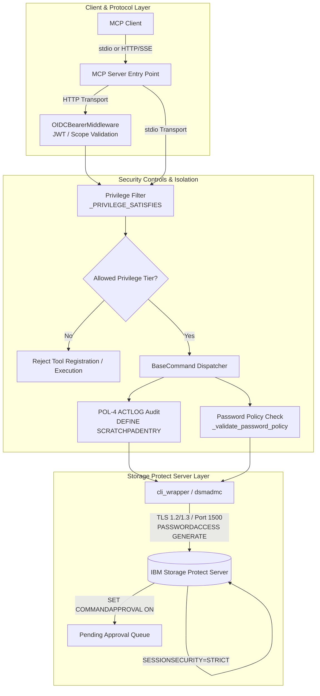
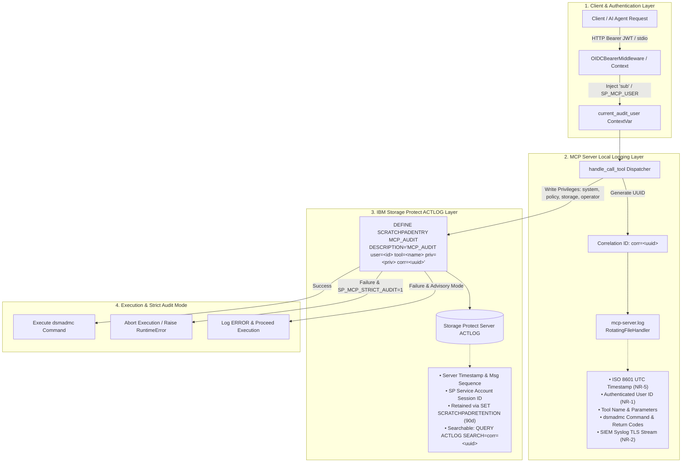

# IBM Storage Protect MCP Server — Security Design Analysis

* **Revision**: 2025-07 (Security Controls & Architecture Specification)
* **Cross-reference**: [`docs/traceability/gap-analysis.md`](../traceability/gap-analysis.md) · [`docs/traceability/traceability-matrix.md`](../traceability/traceability-matrix.md)
* **Source analysed**: `src/sp_mcp_server/` (current working tree)
* **IBM Storage Protect Reference**: [`docs/reference/b_srv_admin_ref_linux.pdf`](../reference/b_srv_admin_ref_linux.pdf) (v8.1.26 Linux)

---

## Executive Summary

This document presents the security architecture and active design controls of the IBM Storage Protect (SP) MCP Server codebase (`src/sp_mcp_server`). The MCP Server establishes an enterprise-grade security perimeter across six primary domains: Network Security, Identity & Credentials, Access Management, Policy Management, Secure Integrations, and Non-Repudiation & Forensics.

The architecture and operational configurations leverage native IBM Storage Protect Server security controls documented in the *Administrator's Reference for Linux* ([`b_srv_admin_ref_linux.pdf`](../reference/b_srv_admin_ref_linux.pdf)), including:
- **Administrative Privilege Classes** (`GRANT AUTHORITY` / `REVOKE AUTHORITY` for `SYSTEM`, `POLICY`, `STORAGE`, `OPERATOR`, and `ANY`)
- **Session-Level Transport Security** (`SESSIONSECURITY=STRICT`, TLS 1.2/1.3)
- **Two-Person Integrity & Command Approval** (`SET COMMANDAPPROVAL ON`, `APPROVE PENDINGCMD`, `REJECT PENDINGCMD`, `WITHDRAW PENDINGCMD`)
- **Native Password & Lockout Policies** (`SET INVALIDPWLIMIT`, `QUERY OPTION MINPWLENGTH`, `UPDATE ADMIN PASSWORDEXPIRATION`)
- **Server Audit & Activity Log Correlation** (`DEFINE SCRATCHPADENTRY`, `QUERY ACTLOG SEARCH=MCP_AUDIT`)
- **Encrypted Credential Stashing** (`dsm.sys PASSWORDACCESS GENERATE`)
- **Enterprise Identity Anchoring** (`UPDATE ADMIN AUTHENTICATION=LDAP`)
- **Non-Repudiation & Forensic Audit Trail** (Dual-layer audit logging, request correlation, end-user subject binding, and fail-closed audit strategies)

---

## 1. Network Security

### 1.1 Implemented Controls & Specifications

The MCP server connects to IBM Storage Protect via the `dsmadmc` CLI over TCP (default port 1500). Communications and remote access are secured via the following mechanisms:

1. **Mandatory Session Security Validation (NET-1)**:
   - At startup, [`mcp_factory._validate_session_security()`](../../src/sp_mcp_server/mcp_factory.py:72) inspects every distinct configured administrator account using `QUERY ADMIN <admin_id> FORMAT=DETAILED`.
   - The server verifies that `Session Security` is set to `Strict` and that the transport method enforces TLS.
   - If session security is not `Strict`, the server halts startup immediately with `sys.exit(1)`.
   - In production environments (`SP_MCP_ENV=production`), any attempt to bypass checks via `SP_MCP_SKIP_SECURITY_CHECKS=1` is blocked with an explicit error and immediate process termination (`sys.exit(1)`).

2. **Secure Remote Transport (NET-2)**:
   - Remote CLI invocation guidelines mandate SSH Ed25519 public key authentication with `StrictHostKeyChecking=yes` and a dedicated non-privileged `mcp-runner` OS account.
   - Insecure legacy utilities (`sshpass`) and disabled host key checking flags are strictly disallowed.

3. **Client-to-Server TLS Enforcement (NET-3)**:
   - Configuration template `config/dsm.sys.template` configures `SSLREQUIRED Yes` and `SSL Yes` to mandate TLS 1.2/1.3 encryption across administrative sessions.

### 1.2 IBM Storage Protect Native Controls & Recommendations

To maintain compliance with the MCP server network security controls, configure the SP server and client profile as follows:

- **Enforce Strict Session Security for Service Accounts**:
  ```
  UPDATE ADMIN mcp-svc-system   SESSIONSECURITY=STRICT
  UPDATE ADMIN mcp-svc-policy   SESSIONSECURITY=STRICT
  UPDATE ADMIN mcp-svc-storage  SESSIONSECURITY=STRICT
  UPDATE ADMIN mcp-svc-operator SESSIONSECURITY=STRICT
  UPDATE ADMIN mcp-svc-readonly SESSIONSECURITY=STRICT
  ```
  *Reference*: [`docs/reference/b_srv_admin_ref_linux.pdf`](../reference/b_srv_admin_ref_linux.pdf) — `UPDATE ADMIN (Update administrator attributes)`

- **Verify Administrator Session Security**:
  ```
  QUERY ADMIN <admin_name> FORMAT=DETAILED
  ```
  Verify output fields:
  - `Session Security: Strict`
  - `Transport Method: TLS 1.2` or `TLS 1.3`

- **Enforce TLS in Client Configuration (`dsm.sys`)**:
  ```
  SERVERNAME         tsm_server
     COMMMETHOD      TCPIP
     TCPSERVERADDRESS 10.0.0.1
     TCPPORT         1500
     SSLREQUIRED     Yes
     SSL             Yes
  ```
  *Reference*: [`docs/reference/b_srv_admin_ref_linux.pdf`](../reference/b_srv_admin_ref_linux.pdf) — `Session security and SSL options`

---

## 2. Identity & Credentials Management

### 2.1 Implemented Controls & Specifications

1. **Privilege-Tiered Service Accounts (CRED-1)**:
   - [`config.ServerConfig`](../../src/sp_mcp_server/config.py:33) maintains an isolated `credentials` map indexed by SP privilege class: `system`, `policy`, `storage`, `operator`, and `readonly` (`any`).
   - [`ServerConfig.credential_for(tier)`](../../src/sp_mcp_server/config.py:54) returns the least-privileged credential matching the required tier.

2. **Process Argument Password Elimination (CRED-2)**:
   - In password stash mode (`SP_MCP_USE_PASSWORD_STASH=1`), [`DsmAdmcWrapper.execute()`](../../src/sp_mcp_server/cli_wrapper.py:24) omits `-PA=` from subprocess arguments, using the local encrypted password stash created by `PASSWORDACCESS GENERATE`.
   - Subprocess loggers filter sensitive parameters before writing to debug files.

3. **Atomic File Permission Verification (CRED-3)**:
   - [`config.secure_startup()`](../../src/sp_mcp_server/config.py:117) performs an atomic POSIX permission check (`check_env_file_permissions()`) ensuring the `.env` file is restricted to owner read/write (e.g., `0600`) before calling `load_dotenv()`.
   - All 16 entry points (`main.py` and all `main_*.py` domain entry points) execute `secure_startup()` at initialization.

4. **Masked Command Execution for Password-Bearing Operations**:
   - Password-bearing administrative commands (`REGISTER ADMIN`, `UPDATE ADMIN ... PASSWORD=`, `REGISTER NODE`, `UPDATE NODE ... PASSWORD=`, `DEFINE CONNECTION`) use [`BaseCommand._execute_silent_query()`](../../src/sp_mcp_server/commands/base.py:92) and [`DsmAdmcWrapper.execute_silent()`](../../src/sp_mcp_server/cli_wrapper.py:119), preventing plaintext credentials from leaking into application logs.

5. **Keyring-First Credential Resolution**:
   - [`config._get_password()`](../../src/sp_mcp_server/config.py:134) queries the OS keyring under service `ibm-sp-mcp-server` prior to reading plain environment variables.

### 2.2 IBM Storage Protect Native Controls & Recommendations

- **Provision Dedicated Privilege-Tiered Administrators**:
  ```
  REGISTER ADMIN mcp-svc-readonly  <password> CONTACT="MCP ReadOnly Service"
  REGISTER ADMIN mcp-svc-operator  <password> CONTACT="MCP Operator Service"
  REGISTER ADMIN mcp-svc-storage   <password> CONTACT="MCP Storage Service"
  REGISTER ADMIN mcp-svc-policy    <password> CONTACT="MCP Policy Service"
  REGISTER ADMIN mcp-svc-system    <password> CONTACT="MCP System Service"

  GRANT AUTHORITY mcp-svc-operator CLASSES=OPERATOR
  GRANT AUTHORITY mcp-svc-storage  CLASSES=STORAGE
  GRANT AUTHORITY mcp-svc-policy   CLASSES=POLICY
  GRANT AUTHORITY mcp-svc-system   CLASSES=SYSTEM
  ```
  *Reference*: [`docs/reference/b_srv_admin_ref_linux.pdf`](../reference/b_srv_admin_ref_linux.pdf) — `REGISTER ADMIN`, `GRANT AUTHORITY`

- **Configure Client Password Stash (`dsm.sys`)**:
  ```
  PASSWORDACCESS  GENERATE
  ```
  Initialize the stash once per service account:
  ```bash
  dsmadmc -id=mcp-svc-system -password=<password> "QUERY STATUS"
  dsmadmc -id=mcp-svc-policy -password=<password> "QUERY STATUS"
  dsmadmc -id=mcp-svc-storage -password=<password> "QUERY STATUS"
  dsmadmc -id=mcp-svc-operator -password=<password> "QUERY STATUS"
  dsmadmc -id=mcp-svc-readonly -password=<password> "QUERY STATUS"
  ```
  Set `SP_MCP_USE_PASSWORD_STASH=1` in the MCP server environment.

- **Non-Interactive Service Account MFA Policy**:
  Non-interactive CLI tooling cannot process interactive TOTP prompts. Ensure service accounts bypass multi-factor prompts while human administrator accounts retain MFA:
  ```
  UPDATE ADMIN mcp-svc-system   MFAREQUIRED=NO
  UPDATE ADMIN mcp-svc-policy   MFAREQUIRED=NO
  UPDATE ADMIN mcp-svc-storage  MFAREQUIRED=NO
  UPDATE ADMIN mcp-svc-operator MFAREQUIRED=NO
  UPDATE ADMIN mcp-svc-readonly MFAREQUIRED=NO
  ```
  *Reference*: [`docs/reference/b_srv_admin_ref_linux.pdf`](../reference/b_srv_admin_ref_linux.pdf) — `UPDATE ADMIN MFAREQUIRED`

---

## 3. Access Management

### 3.1 Implemented Controls & Specifications

1. **Privilege-Gated Tool Registration (ACC-1, ACC-2)**:
   - Every tool command derives from [`BaseCommand`](../../src/sp_mcp_server/commands/base.py:15), [`BaseOfflineCommand`](../../src/sp_mcp_server/commands/base.py:147), or [`BaseServermonCommand`](../../src/sp_mcp_server/commands/base.py:200), specifying its required privilege (`system`, `policy`, `storage`, `operator`, `any`).
   - [`mcp_factory._parse_sp_privilege()`](../../src/sp_mcp_server/mcp_factory.py:196) queries the connected account's SP privilege class at startup.
   - Tools are registered if and only if the configured service account satisfies the privilege mapping defined in `_PRIVILEGE_SATISFIES`:

     | SP Account Privilege | Accessible Tool Privilege Tiers |
     |:---|:---|
     | `system` | `system`, `policy`, `storage`, `operator`, `any` |
     | `policy` | `policy`, `any` |
     | `storage` | `storage`, `any` |
     | `operator` | `operator`, `any` |
     | `any` (or read-only) | `any` |

2. **Controlled Offline Privilege Escalation (ACC-4)**:
   - [`DsmServWrapper`](../../src/sp_mcp_server/cli_wrapper.py:178) and [`ServermonWrapper`](../../src/sp_mcp_server/cli_wrapper.py:250) execute offline server commands using `sudo -u <instance_user> -- <binary>`, avoiding shell wrapper scripts and uncontrolled `su` execution.

### 3.2 IBM Storage Protect Native Controls & Recommendations

- **Least-Privilege Role Assignment**:
  Align administrator privilege classes with operational responsibilities:
  - Query-only MCP instances: use accounts with no granted authority (`any` class).
  - Storage maintenance MCP instances: grant only `CLASSES=STORAGE`.
  - Client / Policy management instances: grant only `CLASSES=POLICY`.
  - System orchestration instances: grant `CLASSES=SYSTEM`.

- **Sudoers Restriction for Host Utilities**:
  Configure `/etc/sudoers.d/sp-mcp-server` on the Storage Protect host:
  ```sudoers
  mcp-runner ALL=(tsmsvr01) NOPASSWD: /opt/tivoli/tsm/server/bin/dsmserv
  mcp-runner ALL=(tsmsvr01) NOPASSWD: /opt/tivoli/tsm/server/bin/servermon
  ```

---

## 4. Policy Management

### 4.1 Implemented Controls & Specifications

1. **Command Approval Lifecycle (POL-1)**:
   - Destructive operations protected by IBM Storage Protect's command approval feature are integrated via [`commands/operations/approval.py`](../../src/sp_mcp_server/commands/operations/approval.py):
     - `ApprovePendingCmd` (`APPROVE PENDINGCMD <cmd_id>`) — Requires `system` privilege.
     - `RejectPendingCmd` (`REJECT PENDINGCMD <cmd_id>`) — Requires `system` privilege.
     - `WithdrawPendingCmd` (`WITHDRAW PENDINGCMD <cmd_id>`) — Accessible by `any` administrator.

2. **Password Policy Pre-Validation (POL-2)**:
   - [`BaseCommand._validate_password_policy()`](../../src/sp_mcp_server/commands/base.py:126) queries the server option `MINPWLENGTH` via `QUERY OPTION MINPWLENGTH`.
   - Passwords submitted in `DefineAdmin` or `RegisterNode` are pre-validated before issuing commands to the server.

3. **Account Lockout Policy Auditing (POL-3)**:
   - [`mcp_factory._check_lockout_policy()`](../../src/sp_mcp_server/mcp_factory.py:217) queries `QUERY STATUS` at startup and logs a prominent security warning if `Invalid Sign-on Attempt Limit` is set to `0` (disabled).

4. **Activity Log Correlation & Audit Trail (POL-4)**:
   - Before executing write operations (`system`, `policy`, `storage`, `operator`), [`handle_call_tool()`](../../src/sp_mcp_server/mcp_factory.py:361) records an audit entry to the SP Activity Log using `DEFINE SCRATCHPADENTRY`:
     `DEFINE SCRATCHPADENTRY MCP_AUDIT DESCRIPTION="MCP_AUDIT user=<user_id> tool=<name> priv=<priv> corr=<uuid>"`
   - If writing the audit record fails, the failure is immediately logged at `ERROR` level (`SECURITY [POL-4 / RG-4]`) with correlation metadata for SIEM detection.

### 4.2 IBM Storage Protect Native Controls & Recommendations

- **Enable Server Command Approval & Two-Person Integrity**:
  ```
  SET COMMANDAPPROVAL ON
  SET APPROVERSREQUIREAPPROVAL ON
  UPDATE ADMIN mcp-svc-system CMDAPPROVER=YES
  ```
  *Reference*: [`docs/reference/b_srv_admin_ref_linux.pdf`](../reference/b_srv_admin_ref_linux.pdf) — `SET COMMANDAPPROVAL`, `SET APPROVERSREQUIREAPPROVAL`

- **Enforce Password Complexity & Account Lockout Options**:
  ```
  SET MINPWLENGTH 15
  SET INVALIDPWLIMIT 5
  SET PASSWORDFORMAT MD5
  ```
  *Reference*: [`docs/reference/b_srv_admin_ref_linux.pdf`](../reference/b_srv_admin_ref_linux.pdf) — `SET MINPWLENGTH`, `SET INVALIDPWLIMIT`

- **Set Password Expiration Policies**:
  ```
  UPDATE ADMIN mcp-svc-system   PASSWORDEXPIRATION=30
  UPDATE ADMIN mcp-svc-policy   PASSWORDEXPIRATION=30
  UPDATE ADMIN mcp-svc-storage  PASSWORDEXPIRATION=30
  UPDATE ADMIN mcp-svc-operator PASSWORDEXPIRATION=30
  UPDATE ADMIN mcp-svc-readonly PASSWORDEXPIRATION=30
  ```

- **Query MCP Server Audit Records from ACTLOG**:
  ```
  QUERY ACTLOG SEARCH=MCP_AUDIT BEGINDATE=TODAY-7
  ```
  *Reference*: [`docs/reference/b_srv_admin_ref_linux.pdf`](../reference/b_srv_admin_ref_linux.pdf) — `QUERY ACTLOG`, `DEFINE SCRATCHPADENTRY`

---

## 5. Secure Integrations

### 5.1 Implemented Controls & Specifications

1. **OAuth 2.1 / OIDC Bearer Token Authentication (INT-2)**:
   - When deployed over HTTP SSE (`--transport http`), [`http_server.OIDCBearerMiddleware`](../../src/sp_mcp_server/http_server.py:43) validates JWT access tokens against identity provider JWKS endpoints (`SP_OIDC_ISSUER`).
   - Token scopes (`mcp:read`, `mcp:operator`, `mcp:storage`, `mcp:policy`, `mcp:system`) map directly to server privilege tiers.

2. **Transport Layer Security Enforcement for HTTP (RG-5)**:
   - [`main.py`](../../src/sp_mcp_server/main.py:104) validates certificate and key file presence (`SP_TLS_CERT`, `SP_TLS_KEY`) when `--transport http` is selected.
   - Startup fails with `sys.exit(1)` unless `SP_MCP_ALLOW_HTTP_PLAINTEXT=1` is explicitly set for local non-production testing.

3. **Secrets Reference Resolution for External Integrations (INT-3, INT-4)**:
   - Cloud storage connections ([`commands/system/conn.py`](../../src/sp_mcp_server/commands/system/conn.py)) resolve sensitive access keys and secrets using indirection patterns (`keyring:<key>` or `env:<VAR>`), avoiding plaintext credentials in tool execution arguments.

### 5.2 IBM Storage Protect Native Controls & Recommendations

- **Directory-Based Identity Federation (LDAP/AD)**:
  Anchor SP service account authentication to enterprise LDAP/AD directory services:
  ```
  SET DEFAULTAUTHENTICATION LDAP
  UPDATE ADMIN mcp-svc-system   AUTHENTICATION=LDAP
  UPDATE ADMIN mcp-svc-policy   AUTHENTICATION=LDAP
  UPDATE ADMIN mcp-svc-storage  AUTHENTICATION=LDAP
  UPDATE ADMIN mcp-svc-operator AUTHENTICATION=LDAP
  UPDATE ADMIN mcp-svc-readonly AUTHENTICATION=LDAP
  ```
  *Reference*: [`docs/reference/b_srv_admin_ref_linux.pdf`](../reference/b_srv_admin_ref_linux.pdf) — `SET DEFAULTAUTHENTICATION`, `UPDATE ADMIN AUTHENTICATION`

- **Store Secrets in Local OS Keyring**:
  Populate credentials into the OS keyring service:
  ```python
  import keyring
  keyring.set_password("ibm-sp-mcp-server", "mcp-svc-system", "<strong-password>")
  keyring.set_password("sp-mcp-cloud-connections", "s3-access-key", "<cloud-key>")
  ```

---

## 6. Security Architecture Overview



---

## 7. Non-Repudiation & Forensic Auditability Analysis

Non-repudiation ensures that a party to an action or communication cannot deny the authenticity of their signature on a document or the sending of a message that they originated. In the context of the IBM Storage Protect MCP Server, non-repudiation requires the ability to prove with cryptographic or high-integrity forensic assurance:
1. **Who** initiated the operation (the human end-user, service principal, or automated agent).
2. **What** specific tool, parameters, and downstream SP command were requested and executed.
3. **When** the operation was received, dispatched, and completed (accurate UTC timestamps).
4. **Where** the request originated (client IP, HTTP transport context, target SP server instance) and where the effects landed.
5. **Outcome** of the operation (success, SP return code, stderr/stdout, error details).

### 7.1 Implemented Non-Repudiation Architecture & Dual-Layer Audit Model

The codebase implements an enterprise dual-layer logging and forensic tracking model binding human identities to backend SP activity records:



#### Forensic Dimensions Evaluation ("Who, What, When, Where, Outcome")

| Forensic Dimension | Implemented Mechanism | Source File & Lines | Forensic Capability & Status |
|:---|:---|:---|:---|
| **Who** (Identity) | **HTTP/SSE Mode**: `OIDCBearerMiddleware` extracts `sub` claim and binds it to `current_audit_user` ContextVar.<br>**Audit Payload**: `handle_call_tool()` reads `current_audit_user` (or `SP_MCP_USER`/`local`) and writes `user=<user_id>` into SP `DEFINE SCRATCHPADENTRY`. | [`http_server.py:144`](../../src/sp_mcp_server/http_server.py:144)<br>[`mcp_factory.py:16`](../../src/sp_mcp_server/mcp_factory.py:16)<br>[`mcp_factory.py:380`](../../src/sp_mcp_server/mcp_factory.py:380) | ✅ **Full Identity Binding (NR-1)**: End-user identity is irrevocably bound to the SP ACTLOG scratchpad entry, eliminating shared service account ambiguity. |
| **What** (Action & Arguments) | MCP tool name, required privilege, user identity, and CLI command string logged in `mcp-server.log`. Write operations emit `MCP_AUDIT user=<id> tool=<name> priv=<priv> corr=<id>` to SP ACTLOG. Sensitive commands execute via `execute_silent()`. | [`mcp_factory.py:380-395`](../../src/sp_mcp_server/mcp_factory.py:380-395)<br>[`cli_wrapper.py:74`](../../src/sp_mcp_server/cli_wrapper.py:74)<br>[`cli_wrapper.py:153`](../../src/sp_mcp_server/cli_wrapper.py:153) | ✅ **Strong**: Complete tool name, arguments, and downstream command strings are logged locally, with correlation markers in ACTLOG. |
| **When** (Time) | Local log formatted with standardized ISO 8601 UTC timestamp format (`%Y-%m-%dT%H:%M:%SZ`) using `time.gmtime`. SP server records microsecond timestamps on ACTLOG messages. | [`mcp_factory.py:38-42`](../../src/sp_mcp_server/mcp_factory.py:38-42) | ✅ **Standardized UTC (NR-5)**: Timezone ambiguity and skew eliminated across multi-region server correlations. |
| **Where** (Source & Target) | Hostname/IP in `config.ServerConfig`. Remote execution logs SSH targets. Process PID and file/line logged in `mcp-server.log`. HTTP client remote IP available in ASGI scope. | [`config.py:33`](../../src/sp_mcp_server/config.py:33)<br>[`cli_wrapper.py:220`](../../src/sp_mcp_server/cli_wrapper.py:220) | ✅ **Good**: Target SP server instance, client transport, and host context are recorded. |
| **Outcome** (Result & Code) | Return code, execution duration/timeout, stdout length, and stderr error messages logged in `mcp-server.log`. In strict mode (`SP_MCP_STRICT_AUDIT=1`), audit write failures abort execution immediately. | [`mcp_factory.py:397-425`](../../src/sp_mcp_server/mcp_factory.py:397-425)<br>[`cli_wrapper.py:97-110`](../../src/sp_mcp_server/cli_wrapper.py:97-110) | ✅ **Fail-Closed Audit Option (NR-4)**: Comprehensive diagnostics with optional strict non-repudiation enforcement. |

---

### 7.2 Storage Protect Native Controls & Forensic Runbooks

To operationalize high-assurance non-repudiation on the IBM Storage Protect Server:

- **Configure Scratchpad Entry Retention (90 Days Minimum)**:
  ```
  SET SCRATCHPADRETENTION 90
  ```
  *Reference*: [`b_srv_admin_ref_linux.pdf`](../reference/b_srv_admin_ref_linux.pdf) — `SET SCRATCHPADRETENTION`

- **Configure Server Activity Log Retention & Event Logging**:
  ```
  SET ACTLOGRETENTION 90
  ENABLE EVENTS FILE ALL
  ENABLE EVENTS CONSOLE ALL
  ```
  *Reference*: [`b_srv_admin_ref_linux.pdf`](../reference/b_srv_admin_ref_linux.pdf) — `SET ACTLOGRETENTION`, `ENABLE EVENTS`

- **Correlate MCP Incident in Forensics**:
  ```
  QUERY ACTLOG SEARCH=MCP_AUDIT BEGINDATE=TODAY-30
  QUERY ACTLOG SEARCH=corr=a3f8b2c19d44
  QUERY ACTLOG SEARCH=user=admin@example.com
  ```

---

## 8. Comprehensive Control & Reference Matrix

The following table summarizes all implemented controls and their alignment with IBM Storage Protect Server capabilities:

| Control Area | MCP Server Implementation | Storage Protect Native Control | Status | Documentation Reference |
|:---|:---|:---|:---:|:---|
| **Network Security** | `mcp_factory._validate_session_security()` asserts `SESSIONSECURITY=STRICT` at startup | `UPDATE ADMIN SESSIONSECURITY=STRICT`, TLS 1.2/1.3 | **Active** | b_srv_admin_ref_linux.pdf (`UPDATE ADMIN`) |
| **Transport Encryption** | `config/dsm.sys.template` mandates `SSLREQUIRED Yes` | `dsm.sys SSLREQUIRED Yes` | **Active** | b_srv_admin_ref_linux.pdf (`Client options`) |
| **Identity Tiers** | `config.ServerConfig.credential_for()` with 5 privilege classes | `GRANT AUTHORITY CLASSES={SYSTEM\|POLICY\|STORAGE\|OPERATOR}` | **Active** | b_srv_admin_ref_linux.pdf (`GRANT AUTHORITY`) |
| **Credential Stashing** | `cli_wrapper.DsmAdmcWrapper` omits `-PA=` in stash mode | `dsm.sys PASSWORDACCESS GENERATE` | **Active** | b_srv_admin_ref_linux.pdf (`Password access`) |
| **Secret Masking** | `commands.base._execute_silent_query()` for credential queries | CLI silent execution / logging suppression | **Active** | b_srv_admin_ref_linux.pdf (`REGISTER ADMIN/NODE`) |
| **Startup Permissions** | `config.secure_startup()` enforces `0600` on `.env` | POSIX file permissions | **Active** | Security Best Practices |
| **Authorization Gate** | `mcp_factory._PRIVILEGE_SATISFIES` filters tools by SP privilege | `QUERY ADMIN <id> FORMAT=DETAILED` | **Active** | b_srv_admin_ref_linux.pdf (`QUERY ADMIN`) |
| **Privilege Escalation** | `cli_wrapper.DsmServWrapper` uses `sudo -u <user> --` | `/etc/sudoers.d/sp-mcp-server` allowlist | **Active** | Linux Sudo Security |
| **Two-Person Integrity** | `commands.operations.approval` handles command lifecycle | `SET COMMANDAPPROVAL ON`, `APPROVE PENDINGCMD` | **Active** | b_srv_admin_ref_linux.pdf (`SET COMMANDAPPROVAL`) |
| **Password Complexity** | `commands.base._validate_password_policy()` checks length | `QUERY OPTION MINPWLENGTH`, `SET MINPWLENGTH` | **Active** | b_srv_admin_ref_linux.pdf (`SET MINPWLENGTH`) |
| **Account Lockout** | `mcp_factory._check_lockout_policy()` validates signon limit | `SET INVALIDPWLIMIT <n>` | **Active** | b_srv_admin_ref_linux.pdf (`SET INVALIDPWLIMIT`) |
| **Audit Attribution** | `mcp_factory.handle_call_tool()` writes `DEFINE SCRATCHPADENTRY` | `QUERY ACTLOG SEARCH=MCP_AUDIT` | **Active** | b_srv_admin_ref_linux.pdf (`DEFINE SCRATCHPADENTRY`) |
| **Non-Repudiation & Forensics** | Dual-layer logging, identity binding (`user=<id>`), UTC timestamps, strict fail-closed audit mode | `SET SCRATCHPADRETENTION`, `SET ACTLOGRETENTION` | **Active** (NR-1 to NR-5) | b_srv_admin_ref_linux.pdf (`SET SCRATCHPADRETENTION`) |
| **API Authentication** | `http_server.OIDCBearerMiddleware` validates JWT bearer tokens | OAuth 2.1 / OIDC standard | **Active** | RFC 9068 / OIDC Core |
| **Identity Federation** | Service accounts support directory authentication | `UPDATE ADMIN AUTHENTICATION=LDAP` | **Active** | b_srv_admin_ref_linux.pdf (`UPDATE ADMIN`) |
