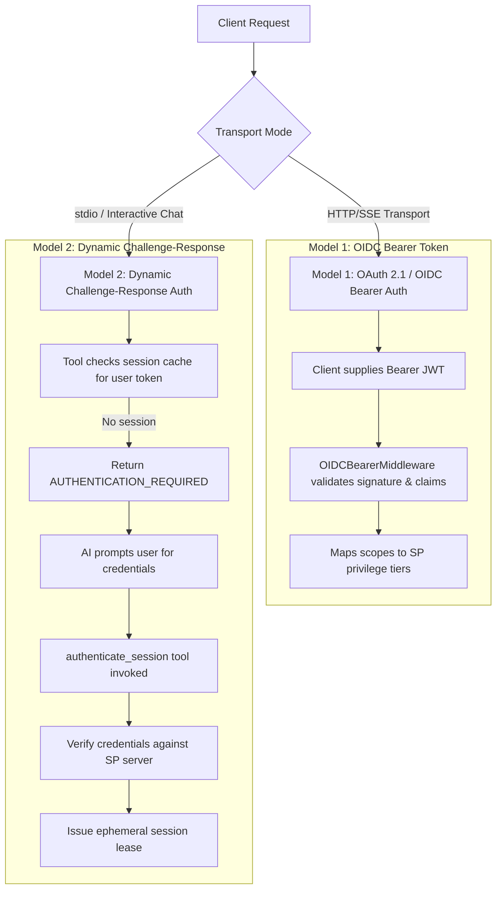
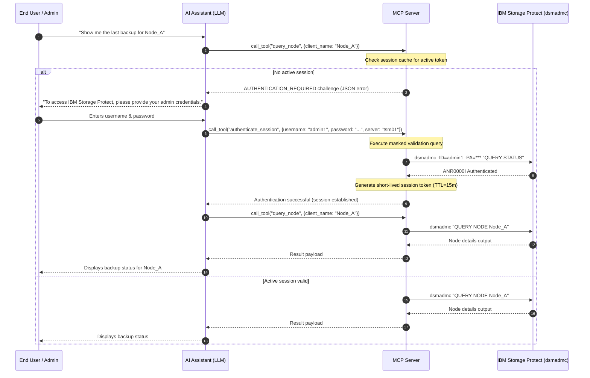

# Dynamic & Delegated User Authentication Design Analysis

* **Revision**: 2026-09 (Post-Audit Remediation — AUD-07, AUD-08, DAUTH-7 Closed)
* **Domain**: Identity, Credentials & Delegated Authentication
* **Design Reference**: [`docs/design/security-dynamic-authn.md`](../design/security-dynamic-authn.md)
* **Implementation Reference**: [`docs/implement/impl-security-dynamic-authn.md`](../implement/impl-security-dynamic-authn.md)
* **Cross-reference**: [`docs/analysis/security-design-analysis.md`](security-design-analysis.md) · [`docs/design/security-identity-credentials.md`](../design/security-identity-credentials.md) · [`docs/design/security-integrations.md`](../design/security-integrations.md) · [`docs/design/security-non-repudiation.md`](../design/security-non-repudiation.md)
* **Source reference**: `src/sp_mcp_server/` · `src/sp_mcp_server/mcp_factory.py` · `src/sp_mcp_server/http_server.py` · `src/sp_mcp_server/cli_wrapper.py`
* **IBM Storage Protect Reference**: [`docs/reference/b_srv_admin_ref_linux.pdf`](../reference/b_srv_admin_ref_linux.pdf) (v8.1.26 Linux)

---

## 1. Overview & Context

In interactive AI assistant environments (such as Claude Desktop, OpenWebUI, or custom chat interfaces), AI agents operate on behalf of human users. Because LLMs cannot securely store persistent plaintext credentials, the Model Context Protocol (MCP) server must act as a secure, stateful gateway.

This document specifies the architecture for **Dynamic & Delegated Authentication (Challenge-Response)**, allowing the MCP server to dynamically challenge chat users for credentials, validate credentials against IBM Storage Protect (`dsmadmc`), establish ephemeral session leases, and support OAuth 2.1 / OIDC token-based delegated authorization.

---

## 2. Authentication Models

The IBM Storage Protect MCP Server supports two complementary authentication models:



---

## 3. Dynamic Challenge-Response Workflow

### 3.1 Stateful Session Verification in MCP Tools
Every administrative tool verifying end-user access checks for an active session context prior to executing commands against the IBM Storage Protect server.



---

## 4. Standardized Challenge Schema

When authentication or step-up verification is required, the tool responds with a structured `AUTHENTICATION_REQUIRED` challenge:

```json
{
  "is_error": true,
  "error_type": "AUTHENTICATION_REQUIRED",
  "message": "Authentication required. Please provide your IBM Storage Protect administrator credentials.",
  "challenge": {
    "server": "tsm_server_01",
    "required_fields": ["username", "password"],
    "supported_schemes": ["basic_delegated", "oidc_bearer"],
    "auth_tool": "authenticate_session"
  }
}
```

---

## 5. Dedicated Authentication Tools

### 5.1 `authenticate_session` Tool Specification
* **Name**: `authenticate_session`
* **Privilege Tier**: `any`
* **Input Schema**:
  * `username` (string, required): IBM Storage Protect administrator ID.
  * `password` (string, required): Administrator password.
  * `target_server` (string, optional): Target SP server instance if multi-server routing is active.
* **Execution & Verification**:
  1. The MCP server executes a lightweight, silent test command (e.g., `QUERY STATUS`) using `DsmAdmcWrapper.execute_silent()` to verify credentials without leaking passwords to local logs.
  2. Upon successful authentication (`returncode == 0`), an ephemeral in-memory session token with a configurable Time-To-Live (TTL) is minted.
  3. The token is associated with the calling user/client context via `contextvars.ContextVar`.

---

## 6. End-to-End Workflow Matrix

| Step | Component | Action | Forensic / Security Note |
|:---:|:---|:---|:---|
| **1** | **User** | Requests administrative action (e.g., `"Restore client data"`). | Human intent expressed in chat. |
| **2** | **AI Agent** | Dispatches MCP tool call `restore_client_data(...)`. | Tool parameters structured. |
| **3** | **MCP Server** | Validates session token in session store / context. | Session lookup by client ID. |
| **4** | **MCP Server** | Returns `AUTHENTICATION_REQUIRED` response. | No credential leakage. |
| **5** | **AI Agent** | Prompts user: `"Please enter your IBM Storage Protect administrator credentials."` | Clear prompt for authentication. |
| **6** | **User** | Provides credentials in client UI. | UI handles input masking if supported. |
| **7** | **AI Agent** | Calls `authenticate_session(username="...", password="...")`. | Dedicated auth tool. |
| **8** | **MCP Server** | Validates via `dsmadmc execute_silent()`, caches token, sets `current_audit_user`. | Credentials omitted from process logs. |
| **9** | **AI Agent** | Retries original administrative tool call automatically. | Seamless execution resumption. |

---

## 7. Security Hardening & Best Practices

1. **Short-Lived Ephemeral Sessions**:
   - In-memory session leases have a strict sliding inactivity timeout (default: 15 minutes, `SP_MCP_SESSION_TTL`) and an absolute maximum (`SP_MCP_SESSION_MAX_TTL`, default 60 minutes).
   - Sessions are discarded on server restart, explicit `revoke_session()` call, `cleanup_expired()`, or user-initiated `logout_session` tool invocation.
   - `SessionManager` uses `RLock` to synchronize all create/get/revoke/cleanup/clear operations.

2. **Zero-Trace Credential Handling (AUD-08)**:
   - All credential validation commands use [`DsmAdmcWrapper.execute_silent()`](../../src/sp_mcp_server/cli_wrapper.py). The command string and credentials are never written to any log handler.
   - `SessionLease.password` is set to `None` on every removal path — `revoke_session()`, expiry in `get_session()`, bulk `cleanup_expired()`, and `clear()` at shutdown.
   - The `logout_session` tool provides user-initiated revocation, zeroing the credential immediately.

3. **Audit Trail & Identity Binding (POL-4 / NR-1)**:
   - When the user authenticates, their verified username is stored in `current_audit_user` and `current_session_id`, and recorded in the SP Activity Log via `DEFINE SCRATCHPADENTRY MCP_AUDIT DESCRIPTION="MCP_AUDIT user=<username> ..."`.

4. **Integration with IBM Storage Protect Native Lockout (POL-3)**:
   - Repeated failed dynamic authentication attempts increment the server's invalid sign-on count, triggering native lockouts when `SET INVALIDPWLIMIT` is exceeded.

5. **Multi-Server Instance Routing (DAUTH-7)**:
   - `target_server` is bound to command execution via `_check_session_target_server()` in `mcp_factory.py`. Sessions authenticated against one server stanza are rejected with `AUTHORIZATION_DENIED` if reused against a different stanza.
   - Single-server deployments (no `target_server` set) skip the check — fully backward-compatible.

---

## 8. Implementation Status Summary (Post-Remediation)

| Control | Implemented | Regression-Tested |
|:---|:---:|:---:|
| AUTHENTICATION_REQUIRED challenge (DAUTH-1) | ✅ | ✅ |
| Zero-trace `authenticate_session` (DAUTH-2) | ✅ | ✅ |
| Bounded sliding-window TTL (DAUTH-3) | ✅ | ✅ |
| Session privilege enforcement (DAUTH-4) | ✅ | ✅ |
| Delegated execution context (DAUTH-5) | ✅ | ✅ |
| Subprocess `-ID`/`-PA` assertion (DAUTH-5a) | ✅ | ✅ |
| Credential context cleanup after call (DAUTH-5b) | ✅ | ✅ |
| `RLock` synchronized SessionManager (DAUTH-6) | ✅ | ✅ |
| `target_server` binding to execution (DAUTH-7) | ✅ | ✅ |
| `SessionLease.password` zeroed on all removal paths (AUD-08) | ✅ | ✅ |
| `logout_session` explicit revocation tool (AUD-08) | ✅ | ✅ |
| Per-scope OIDC privilege mapping and rejection (AUD-03) | ✅ | ✅ |

---

## 9. Cross-References

* Design Specification: [`docs/design/security-dynamic-authn.md`](../design/security-dynamic-authn.md)
* Implementation Specification: [`docs/implement/impl-security-dynamic-authn.md`](../implement/impl-security-dynamic-authn.md)
* Comprehensive Security Analysis: [`docs/analysis/security-design-analysis.md`](security-design-analysis.md)
* Non-Repudiation Design: [`docs/design/security-non-repudiation.md`](../design/security-non-repudiation.md)
* Traceability Matrix: [`docs/traceability/traceability-matrix.md`](../traceability/traceability-matrix.md)
