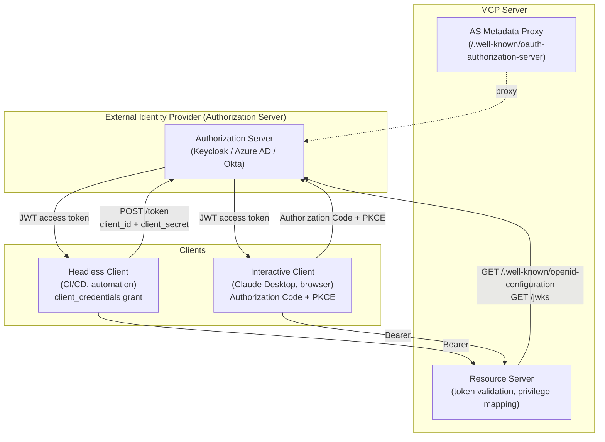
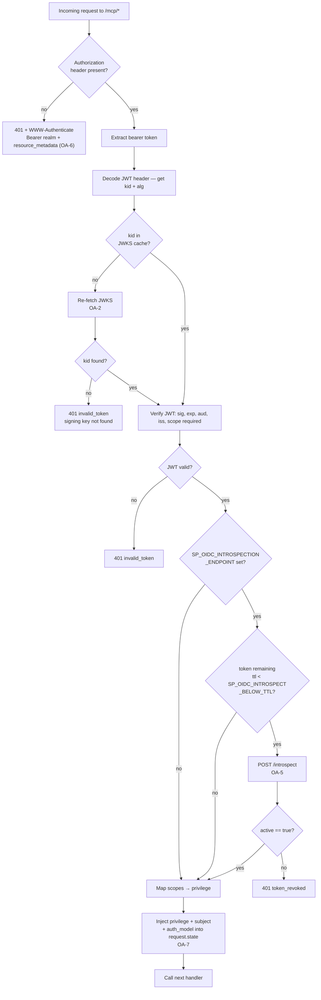
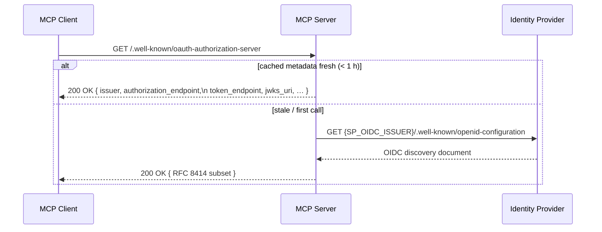
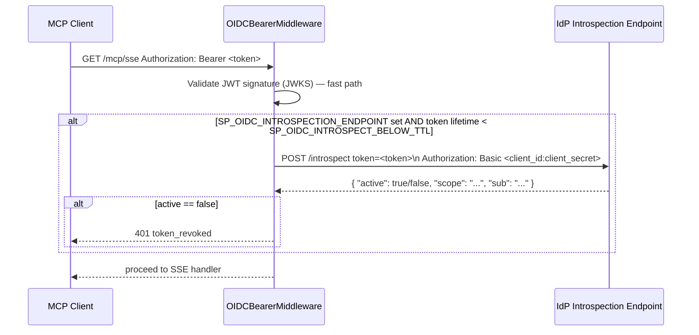

# OAuth 2 Authorization — Security Design Analysis

* **Revision**: 2026-10
* **Domain**: Secure Integrations — OAuth 2 / Authorization Server
* **Design Reference**: [`docs/design/security-oauth2.md`](../design/security-oauth2.md)
* **Implementation Reference**: [`docs/implement/impl-security-oauth2.md`](../implement/impl-security-oauth2.md)
* **Extends**: [`docs/analysis/security-design-analysis.md § 5`](security-design-analysis.md)
* **Cross-references**:
  [`docs/design/security-integrations.md`](../design/security-integrations.md) ·
  [`docs/design/security-dynamic-authn.md`](../design/security-dynamic-authn.md) ·
  [`docs/design/security-non-repudiation.md`](../design/security-non-repudiation.md) ·
  [`docs/guides/local-idp-oauth2-guide.md`](../guides/local-idp-oauth2-guide.md) ·
  [`docs/guides/configure-guide.md`](../guides/configure-guide.md)
* **Source reference**:
  `src/sp_mcp_server/http_server.py` ·
  `src/sp_mcp_server/main.py` ·
  `src/sp_mcp_server/mcp_factory.py` ·
  `src/sp_mcp_server/commands/system/auth.py`
* **Test file**: [`tests/test_sec_oauth2.py`](../../tests/test_sec_oauth2.py) — 26 tests, all passing

---

## 1. Overview & Context

The IBM Storage Protect MCP Server operates as an **OIDC resource server** when deployed over the HTTP/SSE transport. Bearer tokens issued by an external Identity Provider (IdP) are validated against the IdP's JWKS endpoint, scopes are mapped to SP privilege tiers, and TLS is enforced at startup (RG-5). This baseline (INT-2) is specified in [`docs/design/security-integrations.md`](../design/security-integrations.md).

This document analyses the **OAuth 2 authorization requirements** (OA-1 through OA-7) that extend the INT-2 baseline to meet MCP 2025-03 protocol compliance, operational key-rotation resilience, interactive-client (Authorization Code + PKCE) support, token revocation detection, RFC 9470 protected-resource metadata, and forensic audit-model attribution.

### OAuth 2 Role Model

The MCP server participates in two OAuth 2 roles simultaneously:



The MCP server **never issues tokens** — it always delegates issuance to an external IdP. Its responsibilities are:

1. Validate the bearer token (signature, expiry, audience, issuer).
2. Extract scopes and map to SP privilege tiers.
3. Advertise the IdP's metadata so compliant clients can discover the token endpoint automatically.
4. Rotate cached JWKS automatically when signing keys change.

---

## 2. Token Validation Architecture

Every request to `/mcp/*` passes through `OIDCBearerMiddleware`. The full decision flow is:



---

## 3. Requirements Analysis

### OA-1 — Authorization Server Metadata Endpoint

**Standard**: RFC 8414 · MCP 2025-03 specification §3.2

**Requirement**: The MCP 2025-03 specification requires every HTTP MCP server to expose `GET /.well-known/oauth-authorization-server` so that compliant MCP clients can automatically discover the token endpoint from the MCP server URL alone — without any manual client configuration.

**Architecture**: A lightweight metadata proxy route is registered in `create_http_app()`. The route fetches the IdP's own `/.well-known/openid-configuration` once (cached with a 1-hour TTL, shared with the JWKS machinery to avoid redundant network calls), selects the required RFC 8414 fields, and serves them from the MCP server's own well-known path.



**Fields served** (RFC 8414 required + OIDC additions used by MCP clients):

| Field | Source |
|-------|--------|
| `issuer` | `SP_OIDC_ISSUER` |
| `authorization_endpoint` | from IdP discovery |
| `token_endpoint` | from IdP discovery |
| `jwks_uri` | from IdP discovery |
| `response_types_supported` | `["code"]` |
| `grant_types_supported` | `["authorization_code", "client_credentials", "refresh_token"]` |
| `code_challenge_methods_supported` | `["S256"]` |
| `scopes_supported` | `["mcp:read", "mcp:operator", "mcp:storage", "mcp:policy", "mcp:system"]` |

**Source**: [`http_server.py:54`](../../src/sp_mcp_server/http_server.py) (`_fetch_as_metadata()`) · [`http_server.py:437`](../../src/sp_mcp_server/http_server.py) (route registration)

**Tests**: `tests/test_sec_oauth2.py::TestOAuthASMetadata` (4 tests)
- `test_fetch_as_metadata_returns_required_fields`
- `test_as_metadata_cache_prevents_second_idp_call`
- `test_as_metadata_cache_refreshes_after_ttl`
- `test_as_metadata_includes_s256_challenge_method`

---

### OA-2 — JWKS Key Rotation with TTL-Based Cache Refresh

**Standard**: OpenID Connect Core §10.1.1 (key rotation)

**Requirement**: IdP key rotation is a normal operational event. The JWKS cache must expire and refresh automatically so that signing key changes at the IdP do not silently break token validation until the MCP server is restarted. Additionally, a `kid`-miss fast path must force an immediate re-fetch when a JWT presents an `kid` not present in the current cache.

**Architecture**: Module-level TTL-aware helpers replace instance-variable caching:

- **`_get_jwks_with_ttl(issuer, jwks_ttl)`** — Returns the cached JWKS; re-fetches when the cache is empty or older than `SP_OIDC_JWKS_TTL` (default 3600 s).
- **`_get_key_for_kid(issuer, jwks_ttl, kid)`** — If the JWT's `kid` is absent from the current cache, forces an immediate re-fetch (bypassing the TTL). Re-fetches are rate-limited to at most one per 60 seconds (`_JWKS_REFETCH_RATELIMIT`) to prevent a forged-`kid` DoS attack. Each rate-limited miss is logged at `WARNING` for SIEM detection.

**Cache policy**:

| Condition | Action |
|-----------|--------|
| `kid` present in cache, cache age < `SP_OIDC_JWKS_TTL` | Use cached key |
| `kid` missing from cache (key rotation event) | Immediate re-fetch, update cache |
| Cache age ≥ `SP_OIDC_JWKS_TTL` | Background refresh on next request |
| Second `kid`-miss within 60 s (possible DoS) | Rate-limited; log `WARNING` |

**New env variable**: `SP_OIDC_JWKS_TTL` — integer seconds, default `3600`.

**Source**: [`http_server.py:101`](../../src/sp_mcp_server/http_server.py) (`_get_jwks_with_ttl()`, `_get_key_for_kid()`) · [`http_server.py:313–326`](../../src/sp_mcp_server/http_server.py) (middleware call site)

**Tests**: `tests/test_sec_oauth2.py::TestJWKSRotation` (4 tests)
- `test_jwks_cached_within_ttl`
- `test_jwks_refreshed_after_ttl_expiry`
- `test_kid_miss_triggers_one_refetch`
- `test_kid_miss_rate_limited_to_one_refetch`

---

### OA-3 — Authorization Code + PKCE Grant (Interactive Clients)

**Standard**: OAuth 2.1 draft §4.1 · RFC 7636

**Requirement**: Interactive clients (Claude Desktop, browser-based UIs) cannot safely store a `client_secret`. They must use the Authorization Code grant with PKCE (RFC 7636), which is mandatory in OAuth 2.1 for public clients. The MCP server's resource-server role must accommodate tokens issued via this grant and must distinguish them from `client_credentials` tokens in the audit trail.

**Architecture**: The MCP server does not implement the Authorization Code flow itself — that is the IdP's responsibility. The resource-server design work is:

1. The AS metadata endpoint (OA-1) advertises `code_challenge_methods_supported: ["S256"]`.
2. `OIDCBearerMiddleware` accepts tokens from any grant type — grant-type discrimination is not the resource server's role; only signature and claims are validated.
3. The `authmodel` label (OA-7) distinguishes Authorization Code tokens (`preferred_username` claim present → `oidc_bearer`) from `client_credentials` tokens (no `preferred_username` → `client_credentials`).

**Token claim profile**:

| Claim | `client_credentials` token | Authorization Code token |
|-------|--------------------------|--------------------------|
| `sub` | client ID (e.g. `mcp-client`) | human user ID (e.g. `alice@corp.com`) |
| `preferred_username` | absent | present (human login name) |
| `scope` | requested `mcp:*` scopes | requested `mcp:*` scopes |
| `aud` | `SP_OIDC_AUDIENCE` | `SP_OIDC_AUDIENCE` |

Full interactive-client setup steps (Keycloak, `preferred_username` mapper, PKCE protocol) are documented in [`docs/guides/local-idp-oauth2-guide.md`](../guides/local-idp-oauth2-guide.md).

**Tests**: `tests/test_sec_oauth2.py::TestAuthModelAudit::test_oidc_bearer_authmodel_in_actlog` — verifies that a token carrying `preferred_username` results in `authmodel=oidc_bearer` in the ACTLOG record.

---

### OA-4 — IdP PKCE Capability Check at Startup

**Standard**: OAuth 2.1 draft §4.1.1 — PKCE is **required** for Authorization Code public clients

**Requirement**: The resource server must verify at startup that the configured IdP advertises `code_challenge_methods_supported: ["S256"]`. If the IdP does not support PKCE S256, or advertises the insecure `plain` method, operators must be warned before any client attempts to connect.

**Architecture**: `_check_idp_pkce_capability(issuer)` is called once during HTTP startup in [`main.py`](../../src/sp_mcp_server/main.py) immediately after `SP_OIDC_ISSUER` validation. It reuses the OA-1 metadata cache — no additional network call is made when the cache is already warm.

Outcome log messages:

| Condition | Level | Message |
|-----------|-------|---------|
| `S256` present, `plain` absent | `INFO` | `OA-4: IdP PKCE capability check passed (S256 supported).` |
| `S256` absent | `WARNING` | `OA-4: IdP does not advertise PKCE S256 support…` |
| `plain` present | `WARNING` | `OA-4: IdP advertises insecure PKCE 'plain' method…` |
| IdP unreachable | `WARNING` | `OA-4: Could not fetch IdP metadata for PKCE check: …` (non-fatal; server continues) |

**Source**: [`http_server.py:161`](../../src/sp_mcp_server/http_server.py) (`_check_idp_pkce_capability()`) · [`main.py:113–116`](../../src/sp_mcp_server/main.py) (startup call)

**Tests**: `tests/test_sec_oauth2.py::TestPKCECapability` (4 tests)
- `test_s256_supported_logs_info_not_warning`
- `test_missing_s256_emits_warning`
- `test_plain_method_emits_warning`
- `test_idp_unreachable_logs_warning_not_exception`

---

### OA-5 — Token Introspection Support (RFC 7662)

**Standard**: RFC 7662 (Token Introspection)

**Requirement**: Tokens validated exclusively via JWKS signature verification remain valid until `exp` even after revocation at the IdP. For deployments with hard revocation requirements or long-lived tokens, the resource server must support RFC 7662 token introspection to check live revocation status.

**Architecture**: An **optional** per-request introspection step is added to `OIDCBearerMiddleware`. It is activated only when `SP_OIDC_INTROSPECTION_ENDPOINT` is set **and** the token's remaining lifetime (`exp − now`) is below `SP_OIDC_INTROSPECT_BELOW_TTL` (default 300 s). This threshold policy avoids a per-request network call for long-lived tokens while catching revoked tokens in their final minutes of validity.



**Fail-open policy**: If the introspection endpoint is unreachable, the middleware logs `ERROR` and allows the request to proceed. An IdP outage must not lock all users out. Deployments requiring fail-closed behaviour must enforce introspection at a reverse-proxy layer.

**New env variables**:

| Variable | Default | Description |
|----------|---------|-------------|
| `SP_OIDC_INTROSPECTION_ENDPOINT` | unset (disabled) | RFC 7662 introspection URL |
| `SP_OIDC_INTROSPECTION_CLIENT_ID` | `SP_OIDC_AUDIENCE` | Client ID for Basic auth |
| `SP_OIDC_INTROSPECTION_CLIENT_SECRET` | unset | Client secret — must be stored in OS keyring (INT-4 pattern) |
| `SP_OIDC_INTROSPECT_BELOW_TTL` | `300` | Introspect tokens with less than N seconds remaining lifetime |

**Source**: [`http_server.py:253`](../../src/sp_mcp_server/http_server.py) (`_introspect()`)

**Tests**: `tests/test_sec_oauth2.py::TestIntrospection` (5 tests)
- `test_revoked_token_returns_false`
- `test_active_token_returns_true`
- `test_long_lived_token_skips_introspection`
- `test_introspection_fail_open`
- `test_missing_client_secret_skips_introspection`

---

### OA-6 — RFC 9470 Protected Resource Metadata

**Standard**: RFC 9470 (OAuth 2.0 Protected Resource Metadata)

**Requirement**: Standards-compliant MCP clients perform automatic AS discovery by following the `resource_metadata` URI from a `401 Unauthorized` response (`WWW-Authenticate` header). The resource server must: (a) serve a `/.well-known/oauth-protected-resource` document describing the resource and its authorization servers, and (b) include the `resource_metadata` URI in every `401` response.

**Architecture** — two coordinated additions:

**`_protected_resource_doc()` + route** ([`http_server.py:191`](../../src/sp_mcp_server/http_server.py)): `GET /.well-known/oauth-protected-resource` returns the RFC 9470 document:
```json
{
  "resource": "https://sp-mcp.example.com:8443",
  "authorization_servers": ["https://idp.example.com/realms/mcp"],
  "scopes_supported": ["mcp:read","mcp:operator","mcp:storage","mcp:policy","mcp:system"],
  "bearer_methods_supported": ["header"]
}
```

**`_unauthorized()` helper** ([`http_server.py:236`](../../src/sp_mcp_server/http_server.py)): All `401` responses are built via this helper, which appends `resource_metadata` to the `WWW-Authenticate` header when `SP_MCP_PUBLIC_URL` is set:
```
WWW-Authenticate: Bearer realm="sp-mcp-server",
                  resource_metadata="https://sp-mcp.example.com:8443/.well-known/oauth-protected-resource"
```

**New env variable**: `SP_MCP_PUBLIC_URL` — the externally reachable MCP server base URL. Must be set to a hostname resolvable by MCP clients, not `localhost`.

**Source**: [`http_server.py:191`](../../src/sp_mcp_server/http_server.py) · [`http_server.py:236`](../../src/sp_mcp_server/http_server.py)

**Tests**: `tests/test_sec_oauth2.py::TestProtectedResourceMetadata` (5 tests)
- `test_protected_resource_doc_contains_required_fields`
- `test_protected_resource_doc_uses_public_url_as_resource`
- `test_protected_resource_doc_falls_back_to_issuer`
- `test_unauthorized_includes_resource_metadata_uri_when_public_url_set`
- `test_unauthorized_no_resource_metadata_when_public_url_absent`

---

### OA-7 — Unified Auth Model Attribution in ACTLOG

**Standard**: NR-1 (identity binding) · NR-4 (audit integrity) — [`docs/design/security-non-repudiation.md`](../design/security-non-repudiation.md)

**Requirement**: The MCP server supports two authentication models: OIDC bearer tokens (Model A — HTTP/SSE) and the dynamic challenge-response session lease (Model B — `authenticate_session`). Both populate `current_audit_user` but from different sources. An auditor reading `user=alice@corp.com` from ACTLOG cannot determine which model produced the record. The `authmodel` field must be included in every ACTLOG scratchpad entry to eliminate this forensic ambiguity.

**Architecture** — three coordinated changes:

**1. `current_auth_model` ContextVar** ([`mcp_factory.py:21`](../../src/sp_mcp_server/mcp_factory.py)): A `ContextVar[str]` with default `"local"` carries one of four label values:

| Scenario | `authmodel` value |
|----------|------------------|
| `client_credentials` JWT (`preferred_username` absent) | `client_credentials` |
| Authorization Code JWT (`preferred_username` present) | `oidc_bearer` |
| `authenticate_session` tool (Model B) | `dynamic_session` |
| stdio transport / no HTTP auth | `local` |

**2. `OIDCBearerMiddleware.__call__()`** ([`http_server.py:358–370`](../../src/sp_mcp_server/http_server.py)): After successful JWT validation, determines the `auth_model` by inspecting `preferred_username` in the payload and sets both `scope["state"]["mcp_auth_model"]` and the `current_auth_model` ContextVar. The ContextVar is reset in the `finally` block to prevent cross-request leakage.

**3. `authenticate_session.execute()`** ([`commands/system/auth.py:164`](../../src/sp_mcp_server/commands/system/auth.py)): After issuing the ephemeral lease, calls `current_auth_model.set("dynamic_session")`.

**4. `handle_call_tool()`** ([`mcp_factory.py:564–571`](../../src/sp_mcp_server/mcp_factory.py)): Reads `current_auth_model.get()` and includes `authmodel=<value>` in the `DEFINE SCRATCHPADENTRY MCP_AUDIT` description:

```
# Before
MCP_AUDIT user=alice@corp.com tool=delete_node priv=policy corr=e8f7a192

# After — model explicit
MCP_AUDIT user=alice@corp.com authmodel=oidc_bearer    tool=delete_node priv=policy corr=e8f7a192
MCP_AUDIT user=mcp-client     authmodel=client_credentials tool=query_status priv=any corr=3a9f1c00
MCP_AUDIT user=alice          authmodel=dynamic_session tool=delete_node priv=policy corr=c3b2a191
MCP_AUDIT user=local          authmodel=local           tool=query_status priv=any corr=5b2d9e04
```

**Tests**: `tests/test_sec_oauth2.py::TestAuthModelAudit` (4 tests)
- `test_local_authmodel_in_actlog`
- `test_client_credentials_authmodel_in_actlog`
- `test_oidc_bearer_authmodel_in_actlog`
- `test_dynamic_session_authmodel_set_after_authenticate`

---

## 4. Security Hardening & Best Practices

### 4.1 Scope Elevation Prevention

The privilege mapping resolves the **highest** scope present in the token. A token carrying both `mcp:read` and `mcp:system` is treated as `system`. Clients should request only the scopes they need. Guidance for configuring scope-limited clients is in [`docs/guides/configure-guide.md`](../guides/configure-guide.md).

### 4.2 Token Leakage via Logs

The bearer token string must never appear in any log output. `OIDCBearerMiddleware.__call__()` must not log the raw `Authorization` header value. This mirrors the `execute_silent()` principle used for SP command credentials.

### 4.3 JWKS Re-fetch DoS

An attacker who can forge a JWT with an unknown `kid` could trigger a JWKS re-fetch on every request. This is mitigated by:

- Rate-limiting re-fetches to at most one per 60 seconds regardless of `kid`-miss frequency.
- Logging `kid`-miss frequency at `WARNING` level for SIEM detection.

### 4.4 Introspection Credential Handling

`SP_OIDC_INTROSPECTION_CLIENT_SECRET` is a sensitive credential. It must be stored in the OS keyring (INT-4 pattern) or sourced from an `env:` reference. It must not appear in the `.env` file in plaintext in production.

### 4.5 Public URL Exposure

`SP_MCP_PUBLIC_URL` is served in the protected-resource metadata document. It must reflect the externally reachable address of the MCP server — not `localhost` or an internal hostname not resolvable by MCP clients.

---

## 5. HTTP Route Map (INT-2 + OA Baseline)

```python
app = Starlette(
    routes=[
        Route("/health",                                    health),
        Route("/.well-known/oauth-authorization-server",   as_metadata),           # OA-1
        Route("/.well-known/oauth-protected-resource",     protected_resource_metadata),  # OA-6
        Mount("/mcp", routes=[
            Route("/sse",      handle_sse),
            Mount("/messages", app=sse_transport.handle_post_message),
        ]),
    ]
)
```

`/health` and well-known routes are exempt from `OIDCBearerMiddleware` authentication. All `/mcp/*` routes require a valid bearer token.

---

## 6. Environment Variable Reference (OAuth 2 additions)

| Variable | Required | Default | Description |
|----------|----------|---------|-------------|
| `SP_OIDC_ISSUER` | Yes (HTTP) | — | OIDC issuer / AS base URL (existing INT-2) |
| `SP_OIDC_AUDIENCE` | No | `sp-mcp-server` | Token audience claim (existing INT-2) |
| `SP_TLS_CERT` / `SP_TLS_KEY` | Yes (HTTP) | — | TLS cert/key for HTTPS (existing RG-5) |
| `SP_OIDC_JWKS_TTL` | No | `3600` | JWKS cache lifetime in seconds (OA-2) |
| `SP_OIDC_INTROSPECTION_ENDPOINT` | No | unset | RFC 7662 introspection URL (OA-5) |
| `SP_OIDC_INTROSPECTION_CLIENT_ID` | No | `SP_OIDC_AUDIENCE` | Introspection Basic-auth client ID (OA-5) |
| `SP_OIDC_INTROSPECTION_CLIENT_SECRET` | No | unset | Introspection client secret — keyring (OA-5) |
| `SP_OIDC_INTROSPECT_BELOW_TTL` | No | `300` | Introspect tokens with < N seconds remaining (OA-5) |
| `SP_MCP_PUBLIC_URL` | No | derived | MCP server public base URL for RFC 9470 metadata (OA-6) |

---

## 7. Implementation Status Summary

All OA requirements are fully implemented and regression-tested.

| Requirement | Control | Source | Tested |
|-------------|---------|--------|--------|
| OA-1 — AS metadata endpoint | `_fetch_as_metadata()` · `/.well-known/oauth-authorization-server` route | [`http_server.py:54,437`](../../src/sp_mcp_server/http_server.py) | ✅ `TestOAuthASMetadata` (4) |
| OA-2 — JWKS TTL cache + kid-miss re-fetch | `_get_jwks_with_ttl()` · `_get_key_for_kid()` | [`http_server.py:101`](../../src/sp_mcp_server/http_server.py) | ✅ `TestJWKSRotation` (4) |
| OA-3 — Authorization Code + PKCE | `authmodel` discrimination · `local-idp-oauth2-guide.md` | [`http_server.py:358`](../../src/sp_mcp_server/http_server.py) | ✅ `TestAuthModelAudit` |
| OA-4 — IdP PKCE capability check at startup | `_check_idp_pkce_capability()` | [`http_server.py:161`](../../src/sp_mcp_server/http_server.py) | ✅ `TestPKCECapability` (4) |
| OA-5 — Token introspection (RFC 7662) | `_introspect()` · threshold-based · fail-open | [`http_server.py:253`](../../src/sp_mcp_server/http_server.py) | ✅ `TestIntrospection` (5) |
| OA-6 — RFC 9470 protected resource metadata | `_protected_resource_doc()` · `_unauthorized()` | [`http_server.py:191,236`](../../src/sp_mcp_server/http_server.py) | ✅ `TestProtectedResourceMetadata` (5) |
| OA-7 — Auth model in ACTLOG | `current_auth_model` ContextVar · `authmodel=` field | [`mcp_factory.py:21,564`](../../src/sp_mcp_server/mcp_factory.py) | ✅ `TestAuthModelAudit` (4) |

Run with:

```bash
python3 -m pytest tests/test_sec_oauth2.py -v
# 26 passed
```

---

## 8. Cross-References

- Design specification: [`docs/design/security-oauth2.md`](../design/security-oauth2.md)
- Implementation specification: [`docs/implement/impl-security-oauth2.md`](../implement/impl-security-oauth2.md)
- Existing integrations design (INT-2 baseline): [`docs/design/security-integrations.md`](../design/security-integrations.md)
- Existing security analysis (§5 Secure Integrations): [`docs/analysis/security-design-analysis.md`](security-design-analysis.md)
- Dynamic auth analysis: [`docs/analysis/security-dynamic-authn-analysis.md`](security-dynamic-authn-analysis.md)
- Non-repudiation design: [`docs/design/security-non-repudiation.md`](../design/security-non-repudiation.md)
- Local IdP guide (Keycloak + PKCE): [`docs/guides/local-idp-oauth2-guide.md`](../guides/local-idp-oauth2-guide.md)
- Traceability matrix: [`docs/traceability/traceability-matrix.md`](../traceability/traceability-matrix.md)
- Gap analysis: [`docs/traceability/gap-analysis.md`](../traceability/gap-analysis.md)
- Test file: [`tests/test_sec_oauth2.py`](../../tests/test_sec_oauth2.py)
