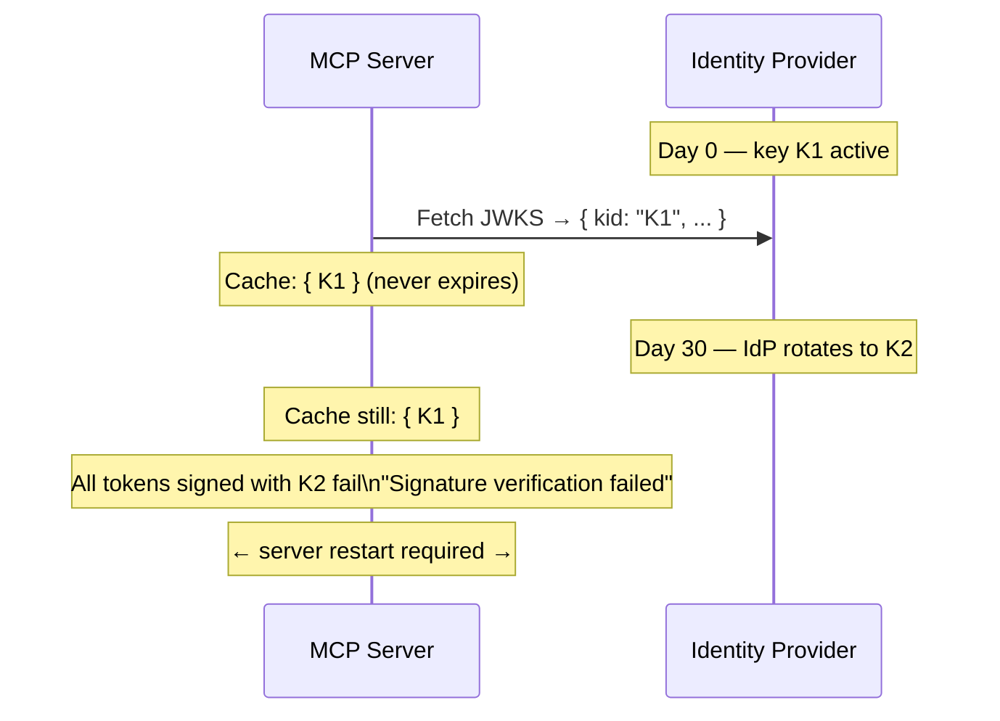

# OAuth 2 Authorization — Security Analysis

* **Revision**: 2026-10
* **Domain**: Secure Integrations — OAuth 2 / Authorization Server
* **Design Reference**: [`docs/design/security-oauth2.md`](../design/security-oauth2.md)
* **Extends**: [`docs/analysis/security-design-analysis.md § 5`](security-design-analysis.md)
* **Implementation Reference**: [`docs/implement/impl-security-integrations.md § INT-2`](../implement/impl-security-integrations.md)
* **Cross-references**:
  [`docs/design/security-integrations.md`](../design/security-integrations.md) ·
  [`docs/design/security-dynamic-authn.md`](../design/security-dynamic-authn.md) ·
  [`docs/design/security-non-repudiation.md`](../design/security-non-repudiation.md) ·
  [`docs/guides/local-idp-guide.md`](../guides/local-idp-guide.md) ·
  [`docs/guides/configure-guide.md`](../guides/configure-guide.md)
* **Source analysed**: `src/sp_mcp_server/http_server.py` · `src/sp_mcp_server/main.py` · `src/sp_mcp_server/mcp_factory.py`

---

## 1. Executive Summary

The INT-2 baseline establishes the MCP server as an OIDC **resource server**: bearer tokens are validated against the IdP's JWKS endpoint, scopes are mapped to SP privilege tiers, and TLS is enforced at startup (RG-5). This baseline is sound but leaves seven security and compliance gaps (OA-1 through OA-7) that limit interoperability with MCP 2025-compliant clients, weaken operational resilience during IdP key rotations, and reduce forensic fidelity in the audit trail.

This analysis documents the current state of each gap, its risk rating, and the design change that closes it.

---

## 2. Scope of Analysis

| Component | Analysed | Gaps found |
|-----------|---------|-----------|
| `http_server.OIDCBearerMiddleware` | Yes | OA-2, OA-4, OA-6, OA-7 |
| `http_server.create_http_app()` | Yes | OA-1, OA-6 |
| `main.py` HTTP startup branch | Yes | OA-4 |
| `mcp_factory.handle_call_tool()` audit record | Yes | OA-7 |
| SP service-account credential path (stdio) | Out of scope | — |
| Dynamic auth session leases (`authenticate_session`) | Cross-reference only | OA-7 |

---

## 3. Gap Analysis

### OA-1 — Missing Authorization Server Metadata Endpoint

**Standard**: RFC 8414 · MCP 2025-03 specification §3.2

**Current state**: `create_http_app()` registers three routes: `/health`, `/mcp/sse`, and `/mcp/messages`. There is no `/.well-known/oauth-authorization-server` route.

**Impact**: MCP clients that implement the MCP 2025-03 specification perform automatic IdP discovery by `GET`-ing `{mcp_server_url}/.well-known/oauth-authorization-server`. Without this endpoint, those clients cannot auto-configure the token endpoint and fall back to requiring manual configuration or fail entirely.

**Risk**: Medium — operational friction for compliant MCP clients; no direct token-security degradation.

**Evidence** (current `create_http_app()` routes):
```python
app = Starlette(
    routes=[
        Route("/health", health),           # present
        Mount("/mcp", routes=[
            Route("/sse",      handle_sse),  # present
            Mount("/messages", ...),         # present
        ]),
        # /.well-known/oauth-authorization-server  ← MISSING
        # /.well-known/oauth-protected-resource    ← MISSING
    ]
)
```

**Closure**: Add AS metadata proxy route (OA-1 in [`docs/design/security-oauth2.md § 3`](../design/security-oauth2.md)).

---

### OA-2 — JWKS Cache Has No Expiry or Key-Rotation Recovery

**Standard**: OpenID Connect Core §10.1.1 (key rotation) · best practice

**Current state**: `OIDCBearerMiddleware._get_jwks()` fetches the JWKS once and stores it in `self._jwks`. There is no TTL, no expiry check, and no `kid`-miss fast path.

```python
async def _get_jwks(self) -> dict:
    if self._jwks is not None:      # ← cached forever
        return self._jwks
    ...
    self._jwks = jwks.json()
    return self._jwks
```

**Impact**: When an IdP rotates its signing keys (a routine operation in all production IdPs), the cached JWKS no longer contains the new key's `kid`. Every subsequent JWT will fail validation with "Signature verification failed" until the MCP server is restarted. The failure is silent from the client's perspective — all requests receive `401 invalid_token`.

**Risk**: High — key rotation is a normal operational event; requiring a manual restart for every rotation is operationally unacceptable in production.

**Failure mode timeline**:



**Closure**: TTL-based cache with `kid`-miss re-fetch (OA-2 in [`docs/design/security-oauth2.md § 3`](../design/security-oauth2.md)).

---

### OA-3 — Authorization Code + PKCE Grant Not Specified

**Standard**: OAuth 2.1 draft §4.1 · RFC 7636

**Current state**: The INT-2 implementation guide and `impl-security-integrations.md § INT-2` show only the `client_credentials` grant. There is no documentation or configuration guidance for interactive clients that cannot hold a `client_secret` and must use Authorization Code + PKCE.

**Impact**: The MCP server's resource-server token validation already accepts tokens issued by any grant type (it validates signature, claims, and scopes — not the grant used to issue the token). The gap is operational: deployers have no documented path for interactive user scenarios, and no integration test verifies that Authorization Code tokens issued with PKCE are accepted.

**Risk**: Low-Medium — no code vulnerability, but restricts the server to headless deployments in practice.

**Closure**: Document the Authorization Code + PKCE token claim profile and update the local IdP guide to show how to configure Keycloak for Authorization Code + PKCE (OA-3 in [`docs/design/security-oauth2.md § 3`](../design/security-oauth2.md)).

---

### OA-4 — No IdP PKCE Capability Check at Startup

**Standard**: OAuth 2.1 draft §4.1.1 — PKCE is **required** for Authorization Code public clients

**Current state**: `main.py`'s HTTP startup branch validates `SP_OIDC_ISSUER` is set but does not fetch the IdP's discovery document to verify that `code_challenge_methods_supported` includes `S256`.

**Impact**: An operator may connect the MCP server to an IdP that does not support PKCE (or supports only the insecure `plain` method). Interactive clients attempting Authorization Code + PKCE flows will fail, with no warning at the MCP server level.

**Risk**: Low — configuration-time issue; does not affect token validation at runtime.

**Closure**: One-time startup check against the IdP discovery document (OA-4 in [`docs/design/security-oauth2.md § 3`](../design/security-oauth2.md)).

---

### OA-5 — No Token Revocation / Introspection Support

**Standard**: RFC 7662 (Token Introspection) · RFC 7009 (Token Revocation notification)

**Current state**: `OIDCBearerMiddleware` validates tokens exclusively via JWKS signature verification. There is no call to a token introspection endpoint.

**Impact**: A token that has been revoked at the IdP (e.g., because the user logged out, the client was deauthorised, or an administrator force-expired a session) continues to be accepted by the MCP server until the token's `exp` claim elapses. For short-lived tokens (15-minute default in most IdPs) this window is acceptable. For long-lived tokens or scenarios where immediate revocation is required (e.g., incident response), this is a gap.

**Risk**: Medium for deployments that issue long-lived tokens or require immediate revocation capability. Low for deployments with short-lived tokens (≤ 15 min).

**Revocation window exposure**:

| Token lifetime | Revocation gap without introspection |
|---------------|-------------------------------------|
| 5 min | ≤ 5 min — acceptable in most environments |
| 60 min | ≤ 60 min — high-value sessions at risk |
| 24 h (offline tokens) | Up to 24 h — unacceptable for privileged operations |

**Closure**: Optional introspection on tokens with remaining lifetime below a configurable threshold (OA-5 in [`docs/design/security-oauth2.md § 3`](../design/security-oauth2.md)).

---

### OA-6 — `WWW-Authenticate` Does Not Carry `resource_metadata` URI

**Standard**: RFC 9470 (OAuth 2.0 Protected Resource Metadata)

**Current state**: The `401 Unauthorized` response from `OIDCBearerMiddleware` carries:
```
WWW-Authenticate: Bearer realm="sp-mcp-server"
```

RFC 9470 specifies that a resource server should include a `resource_metadata` parameter pointing to its own protected-resource metadata document, from which a client can discover the Authorization Server's token endpoint.

**Impact**: Clients implementing RFC 9470 auto-discovery cannot follow the full discovery chain from a bare `401` response. This is particularly relevant for MCP clients that support server-driven AS discovery.

**Risk**: Low — interoperability issue; no direct token-security degradation.

**Closure**: Add `resource_metadata` to `WWW-Authenticate` and add the `/.well-known/oauth-protected-resource` route (OA-6 in [`docs/design/security-oauth2.md § 3`](../design/security-oauth2.md)).

---

### OA-7 — Auth Model Not Recorded in ACTLOG Audit Entries

**Standard**: NR-1 (identity binding) · NR-4 (audit integrity) from [`docs/design/security-non-repudiation.md`](../design/security-non-repudiation.md)

**Current state**: `handle_call_tool()` builds the ACTLOG scratchpad entry as:
```
MCP_AUDIT user=<subject> tool=<name> priv=<tier> corr=<uuid>
```

The `user` field is populated from `current_audit_user`, which is set by two independent paths:

| Path | Value written |
|------|--------------|
| `OIDCBearerMiddleware` (Model A) | `payload["sub"]` — may be a client ID (headless) or a human UPN |
| `authenticate_session` tool (Model B) | username provided at runtime |
| stdio, no auth | `local` |

An auditor reading `user=mcp-client` cannot determine whether this was a `client_credentials` machine token or a human user whose IdP happens to use client IDs as the `sub` claim. Similarly, `user=alice` might come from a dynamic session (Model B) or from an Authorization Code token.

**Risk**: Medium — forensic ambiguity; reduces the reliability of the non-repudiation claim for mixed-model deployments.

**Current ACTLOG format vs proposed**:

```
# Current — auth model unknown
MCP_AUDIT user=alice@corp.com tool=delete_node priv=policy corr=e8f7a192

# Proposed — model explicit
MCP_AUDIT user=alice@corp.com authmodel=oidc_bearer tool=delete_node priv=policy corr=e8f7a192
MCP_AUDIT user=mcp-client authmodel=client_credentials tool=query_status priv=any corr=3a9f1c00
MCP_AUDIT user=alice authmodel=dynamic_session tool=delete_node priv=policy corr=c3b2a191
```

**Closure**: Inject `authmodel` into `request.state` in `OIDCBearerMiddleware` and include it in the ACTLOG record (OA-7 in [`docs/design/security-oauth2.md § 3`](../design/security-oauth2.md)).

---

## 4. Gap Summary & Risk Matrix

| Gap ID | Title | Risk | Standard | Design Change |
|--------|-------|------|----------|---------------|
| **OA-1** | Missing AS metadata endpoint | Medium | RFC 8414 · MCP 2025-03 | AS metadata proxy route |
| **OA-2** | JWKS cache never expires | **High** | OIDC Core §10.1.1 | TTL cache + `kid`-miss re-fetch |
| **OA-3** | No PKCE grant flow documented | Low-Medium | OAuth 2.1 §4.1 | Token profile documentation |
| **OA-4** | No IdP PKCE capability check | Low | OAuth 2.1 §4.1.1 | Startup discovery check |
| **OA-5** | No token introspection | Medium | RFC 7662 | Optional introspection path |
| **OA-6** | `WWW-Authenticate` missing `resource_metadata` | Low | RFC 9470 | Protected resource metadata route |
| **OA-7** | Auth model absent from ACTLOG | Medium | NR-1, NR-4 | `authmodel` field in audit record |

---

## 5. Implemented Controls Verification (INT-2 Baseline)

The following INT-2 controls are confirmed implemented and in scope for regression testing:

| Control | Verified in source | Test |
|---------|--------------------|------|
| Bearer token required for `/mcp/*` | `http_server.py:236-246` | `test_security_controls.py` |
| JWT signature validated against JWKS | `http_server.py:250-262` | Manual + integration |
| Audience and issuer claims checked | `http_server.py:256-261` | Manual |
| `exp`, `iat`, `sub`, `scope` required | `http_server.py:261` | Manual |
| Scope → privilege mapping | `http_server.py:270-277` | `test_security_controls.py` |
| `request.state.mcp_privilege` injected | `http_server.py:278` | Manual |
| `request.state.mcp_subject` injected | `http_server.py:279` | Manual |
| `/health` exempt from auth | `http_server.py:237` | Manual |
| TLS cert/key validated before bind (RG-5) | `main.py:104+` | `test_security_controls.py` |
| `SP_MCP_ALLOW_HTTP_PLAINTEXT=1` emits ERROR | `main.py` | `test_security_controls.py` |

---

## 6. Test Coverage Requirements (OA-1 through OA-7)

The following automated tests must be added to `tests/test_security_controls.py` to close the gaps:

| Test | Gap | Scenario |
|------|-----|----------|
| `TestOAuthASMetadata::test_well_known_returns_token_endpoint` | OA-1 | `GET /.well-known/oauth-authorization-server` returns `token_endpoint` |
| `TestOAuthASMetadata::test_well_known_cached_after_first_fetch` | OA-1 | Second request does not re-fetch from IdP |
| `TestJWKSRotation::test_kid_miss_triggers_refetch` | OA-2 | Token with unknown `kid` causes JWKS re-fetch |
| `TestJWKSRotation::test_jwks_ttl_expiry_triggers_background_refresh` | OA-2 | Cache older than `SP_OIDC_JWKS_TTL` is refreshed |
| `TestJWKSRotation::test_kid_miss_rate_limit` | OA-2 | Multiple unknown `kid`s in quick succession trigger at most one re-fetch per 60 s |
| `TestPKCECapability::test_missing_s256_emits_warning` | OA-4 | IdP discovery without `S256` logs a `WARNING` |
| `TestPKCECapability::test_plain_method_emits_warning` | OA-4 | IdP advertising `plain` logs a `WARNING` |
| `TestIntrospection::test_revoked_token_returns_401` | OA-5 | Introspection returns `active=false` → `401 token_revoked` |
| `TestIntrospection::test_introspection_skipped_for_long_lived_tokens` | OA-5 | Token with remaining TTL > threshold skips introspection |
| `TestProtectedResourceMetadata::test_well_known_protected_resource` | OA-6 | `GET /.well-known/oauth-protected-resource` returns `authorization_servers` |
| `TestProtectedResourceMetadata::test_401_includes_resource_metadata_uri` | OA-6 | 401 response `WWW-Authenticate` header includes `resource_metadata` |
| `TestAuthModelAudit::test_client_credentials_authmodel` | OA-7 | `client_credentials` token → `authmodel=client_credentials` in ACTLOG |
| `TestAuthModelAudit::test_oidc_bearer_authmodel` | OA-7 | Authorization Code token (`preferred_username` present) → `authmodel=oidc_bearer` |
| `TestAuthModelAudit::test_dynamic_session_authmodel` | OA-7 | `authenticate_session` path → `authmodel=dynamic_session` in ACTLOG |

---

## 7. Control & Reference Matrix (OAuth 2 additions)

| Control Area | Gap ID | MCP Server Change | Standard | Status |
|-------------|--------|------------------|----------|--------|
| AS Discovery Endpoint | OA-1 | `/.well-known/oauth-authorization-server` route in `create_http_app()` | RFC 8414 · MCP 2025-03 | 🔲 Design |
| JWKS Key Rotation | OA-2 | TTL cache + `kid`-miss re-fetch in `_get_jwks()` | OIDC Core §10.1.1 | 🔲 Design |
| Authorization Code + PKCE (doc) | OA-3 | Token claim profile · IdP guide update | OAuth 2.1 §4.1 | 🔲 Design |
| IdP PKCE Capability Check | OA-4 | Startup check in `main.py` HTTP branch | OAuth 2.1 §4.1.1 | 🔲 Design |
| Token Introspection | OA-5 | Optional introspection call in `OIDCBearerMiddleware` | RFC 7662 | 🔲 Design |
| Protected Resource Metadata | OA-6 | `/.well-known/oauth-protected-resource` · `resource_metadata` in `WWW-Authenticate` | RFC 9470 | 🔲 Design |
| Auth Model Attribution | OA-7 | `authmodel` field in ACTLOG `DEFINE SCRATCHPADENTRY` | NR-1 · NR-4 | 🔲 Design |

---

## 8. Cross-References

- Design specification: [`docs/design/security-oauth2.md`](../design/security-oauth2.md)
- Existing integrations design (INT-2 baseline): [`docs/design/security-integrations.md`](../design/security-integrations.md)
- Existing security analysis (§5 Secure Integrations): [`docs/analysis/security-design-analysis.md`](security-design-analysis.md)
- Dynamic auth analysis: [`docs/analysis/security-dynamic-authn-analysis.md`](security-dynamic-authn-analysis.md)
- Non-repudiation design: [`docs/design/security-non-repudiation.md`](../design/security-non-repudiation.md)
- Local IdP guide: [`docs/guides/local-idp-guide.md`](../guides/local-idp-guide.md)
- Traceability matrix: [`docs/traceability/traceability-matrix.md`](../traceability/traceability-matrix.md)
