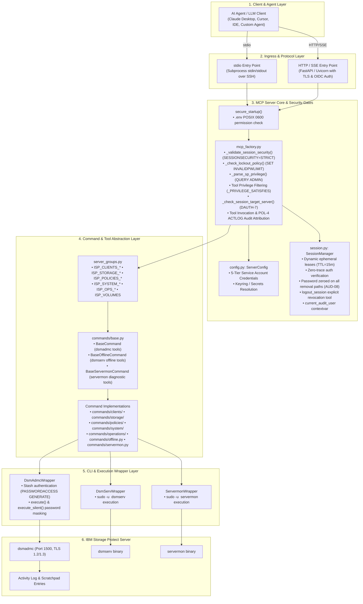
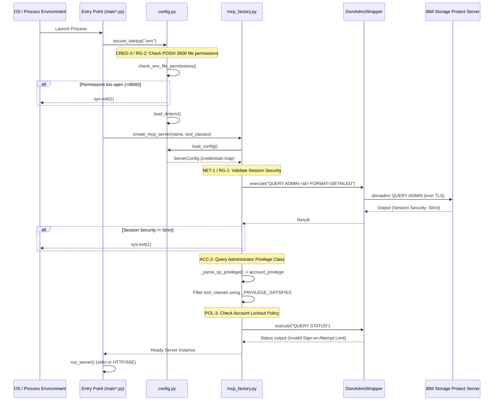
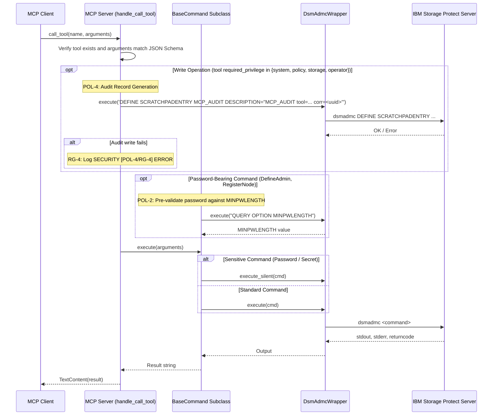

# IBM Storage Protect MCP Server — System Architecture & Design

* **Revision**: 2026-09 (Post-Audit Remediation — AUD-07, AUD-08, DAUTH-7 Closed)
* **Cross-reference**: [`docs/analysis/security-design-analysis.md`](../analysis/security-design-analysis.md) · [`docs/traceability/gap-analysis.md`](../traceability/gap-analysis.md) · [`docs/traceability/audit-report.md`](../traceability/audit-report.md)
* **Source reference**: `src/sp_mcp_server/`

---

## 1. Overview & System Context

The IBM Storage Protect MCP Server provides a standardized Model Context Protocol (MCP) interface enabling AI agents and automated clients to interact with IBM Storage Protect (formerly Tivoli Storage Manager / Spectrum Protect) servers. 

The server provides natural language administration capabilities mapped directly onto native Storage Protect commands while preserving enterprise-grade access control, session security, secret masking, and comprehensive auditability.

The architecture provides two operating models:
1. **Unified MCP Server (`main.py`)**: Runs all or selected functional server groups in a single process over `stdio` or secure `http` SSE transport.
2. **Micro-MCP Servers (`main_<module>_*.py`)**: Fine-grained, isolated server processes (e.g., `main_clients_core.py`, `main_storage_pools.py`, `main_ops_protection.py`) optimized for LLM context window efficiency and least-privilege scoping.

---

## 2. Core Architectural Principles

1. **Strict Least Privilege & Separation of Concerns**:
   - Commands are partitioned into 5 administrative modules (`clients`, `storage`, `policies`, `system`, `operations`).
   - Every tool declares a `required_privilege` (`system`, `policy`, `storage`, `operator`, `any`).
   - In service-account mode, tool discovery queries the configured account's SP authority (`QUERY ADMIN <name> FORMAT=DETAILED`) and restricts tool registration accordingly.
   - Dynamic-session and OIDC privilege claims are enforced at invocation time via `_privilege_satisfies_for_session()` and `current_request_privilege` context variable checks in `handle_call_tool()`.
   - `_check_session_target_server()` enforces `SessionLease.target_server` binding immediately after privilege confirmation; cross-server session reuse is rejected with `AUTHORIZATION_DENIED` (DAUTH-7, closed).
   - Delegated session credentials are applied to command execution via `current_execution_credentials` context variable and cleared in the `finally` block.

2. **Defense-in-Depth Session & Transport Security**:
   - **Local Stdio Transport**: Secured via SSH Ed25519 key authentication, dedicated non-privileged OS user (`mcp-runner`), and explicit strict host key checking.
   - **Remote HTTP/SSE Transport**: Requires TLS 1.2+ certificates and OAuth 2.1 / OIDC Bearer Token authentication (`OIDCBearerMiddleware`) with call-time scope enforcement; per-scope privilege mapping (`mcp:*`) and `AUTHORIZATION_DENIED` rejection validated by `TestOIDCAuthorization` (7 scopes).
   - **Dynamic Authentication (Challenge-Response)**: Allows interactive AI chat users to receive structured `AUTHENTICATION_REQUIRED` responses, verifies credentials via zero-trace `execute_silent()`, issues bounded ephemeral leases, enforces lease privileges, applies delegated credentials to command execution, and supports explicit session revocation via `logout_session`.
   - **Session Lifecycle**: `SessionManager` uses `RLock` and bounds TTLs to `MAX_SESSION_TTL_SECONDS`. Cleanup is opportunistic (on create / explicit call). `SessionLease.password` is zeroed on every removal path — explicit revocation, inactivity/absolute TTL expiry, bulk sweep, and server shutdown (AUD-08, closed).
   - **Backend Storage Protect Channel**: `SESSIONSECURITY=STRICT` validated at startup; `dsm.sys` enforces `SSLREQUIRED Yes` and `PASSWORDACCESS GENERATE`. Service account provisioning script (`scripts/provision-sp-service-accounts.sh`) registers all five tiered accounts with `SESSIONSECURITY=STRICT` and `MFAREQUIRED=NO` (AUD-07, closed).

3. **Two-Person Integrity & Policy Controls**:
   - Destructive operations support IBM SP native Command Approval (`SET COMMANDAPPROVAL ON`, `APPROVE PENDINGCMD`, `REJECT PENDINGCMD`, `WITHDRAW PENDINGCMD`).
   - Password-bearing administrative operations pre-validate length against SP `MINPWLENGTH` and execute via silent channels without exposing plaintext passwords in logs or process arguments.

4. **Auditing & SIEM Traceability**:
   - Every write operation emits a traceable correlation marker into IBM Storage Protect Activity Log via `DEFINE SCRATCHPADENTRY MCP_AUDIT` (`POL-4`).

---

## 3. Layered System Architecture



---

## 4. Server Startup & Security Lifecycle

When an MCP server process starts (either `main.py` or a specialized `main_*.py`), it executes a strict startup sequence:



---

## 5. Tool Execution & Audit Workflow

When an MCP client invokes a tool:



---

## 6. Domain Breakdown & Micro-Servers

The codebase provides multiple dedicated Micro-MCP entry points categorized across 5 administrative modules, in addition to the unified server. Supported entry points use the atomic `secure_startup()` helper before loading configuration.

| Module Category | Micro-MCP Server Entry Point | Command Group | Focus & Administrative Scope |
| :--- | :--- | :--- | :--- |
| **Clients** | [`main_clients_core.py`](../../src/sp_mcp_server/main_clients_core.py)<br>[`main_clients_config.py`](../../src/sp_mcp_server/main_clients_config.py) | `ISP_CLIENTS_CORE`<br>`ISP_CLIENTS_CONFIG` | Node registration, locks, updates, renames, node groups, client option sets (`cloptset`), and schedule associations. |
| **Storage** | [`main_storage_pools.py`](../../src/sp_mcp_server/main_storage_pools.py)<br>[`main_storage_hardware.py`](../../src/sp_mcp_server/main_storage_hardware.py)<br>[`main_storage_device.py`](../../src/sp_mcp_server/main_storage_device.py)<br>[`main_volumes.py`](../../src/sp_mcp_server/main_volumes.py) | `ISP_STORAGE_POOLS`<br>`ISP_STORAGE_HARDWARE`<br>`ISP_STORAGE_DEVICE`<br>`ISP_VOLUMES` | Storage pools, directory containers, tape libraries, drives, paths, device classes, data movers, and volume history. |
| **Policies** | [`main_policies_lifecycle.py`](../../src/sp_mcp_server/main_policies_lifecycle.py)<br>[`main_policies_management.py`](../../src/sp_mcp_server/main_policies_management.py) | `ISP_POLICIES_LIFECYCLE`<br>`ISP_POLICIES_MANAGEMENT` | Policy domains, policy set validation/activation, management classes, copy groups, and retention schedules. |
| **System** | [`main_system_admin.py`](../../src/sp_mcp_server/main_system_admin.py)<br>[`main_system_config.py`](../../src/sp_mcp_server/main_system_config.py) | `ISP_SYSTEM_ADMIN`<br>`ISP_SYSTEM_CONFIG` | Admin accounts, authority granting, command approvals (`APPROVE PENDINGCMD`), server definitions, scripts, and cloud connections. |
| **Operations** | [`main_ops_protection.py`](../../src/sp_mcp_server/main_ops_protection.py)<br>[`main_ops_maintenance.py`](../../src/sp_mcp_server/main_ops_maintenance.py)<br>[`main_ops_rules.py`](../../src/sp_mcp_server/main_ops_rules.py) | `ISP_OPS_PROTECTION`<br>`ISP_OPS_MAINTENANCE`<br>`ISP_OPS_RULES` | DB backup/restore, DR media, replication, data movement, storage reclamation, automation rules, subrules, and alerts. |
| **Unified Server** | [`main.py`](../../src/sp_mcp_server/main.py) | Configurable via `--enable-servers` | Unified server combining all selected modules over stdio or HTTP. |

---

## 7. Security Design References

For domain-specific detailed security control specifications:
- [`docs/design/security-dynamic-authn.md`](../design/security-dynamic-authn.md) — Dynamic & Delegated User Authentication (Challenge-Response).
- [`docs/design/security-network.md`](../design/security-network.md) — Network Security, SSH Transport & TLS Enforcement.
- [`docs/design/security-identity-credentials.md`](../design/security-identity-credentials.md) — Tiered Credentials, Stash Mode & Keyring Integration.
- [`docs/design/security-access.md`](../design/security-access.md) — Tool Privilege Gating & Sudoers Execution.
- [`docs/design/security-policy.md`](../design/security-policy.md) — Command Approval, Password Policies & ACTLOG Audit Trail.
- [`docs/design/security-integrations.md`](../design/security-integrations.md) — OAuth 2.1 / OIDC HTTP Transport & Secrets Reference Resolution.
- [`docs/design/security-non-repudiation.md`](../design/security-non-repudiation.md) — Non-Repudiation, Activity Log Attribution & Forensic Correlation.

---

## 8. Directory Structure & Key Files

```
storage-protect-mcp-server/
├── pyproject.toml                     # Package dependencies, CLI entry points
├── src/sp_mcp_server/
│   ├── __init__.py                    # Package exports
│   ├── cli_wrapper.py                 # DsmAdmcWrapper, DsmServWrapper, ServermonWrapper
│   ├── config.py                      # ServerConfig, secure_startup(), credential resolution
│   ├── http_server.py                 # FastAPI / Starlette OIDC Bearer Token middleware
│   ├── mcp_factory.py                 # Core MCP server factory, security gates, audit logging
│   ├── server_groups.py               # Tool group definitions across all modules
│   ├── main.py                        # Unified server entry point (--enable-servers)
│   ├── main_*.py                      # Domain-specific and legacy micro-server entry points
│   └── commands/                      # Command implementations
│       ├── base.py                    # BaseCommand, BaseOfflineCommand, BaseServermonCommand
│       ├── offline.py                 # Offline DB/log tools (dsmserv)
│       ├── servermon.py               # Servermon diagnostic tools
│       ├── clients/                   # assoc.py, groups.py, info.py, node.py, opt.py
│       ├── storage/                   # content.py, datamover.py, device.py, drive.py, ...
│       ├── policies/                  # copy.py, domain.py, mgmt.py, policyset.py, ...
│       ├── system/                    # admin.py, auth.py (AuthenticateSession, LogoutSession), config.py, conn.py, logs.py, script.py, ...
│       └── operations/                # alerts.py, approval.py, backupset.py, catalog.py, ...
├── config/
│   └── dsm.sys.template               # dsmadmc client-options template (SSL Yes, SSLREQUIRED Yes, PASSWORDACCESS GENERATE)
├── scripts/
│   └── provision-sp-service-accounts.sh  # Idempotent SP service account provisioning (5 tiers, SESSIONSECURITY=STRICT)
├── tests/                             # Test suite
│   ├── test_cli_wrapper.py
│   ├── test_commands.py
│   ├── test_config.py
│   ├── test_core_components.py
│   └── test_security_controls.py      # Security regression tests — 88 tests passing post-remediation
└── docs/                              # Comprehensive documentation
    ├── design/                        # Domain-specific security design specifications
    ├── architecture/                  # System & module-specific architecture docs
    ├── analysis/                      # Security design analysis & gap closure validation
    ├── traceability/                  # Traceability matrix and gap analysis
    └── guides/                        # User, installation, configuration, and troubleshooting guides
```
