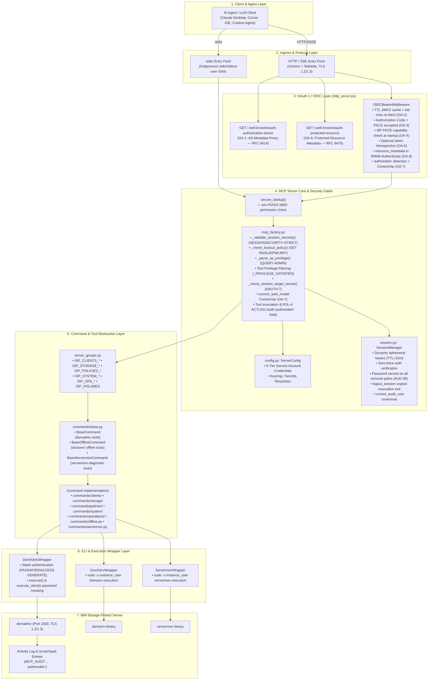
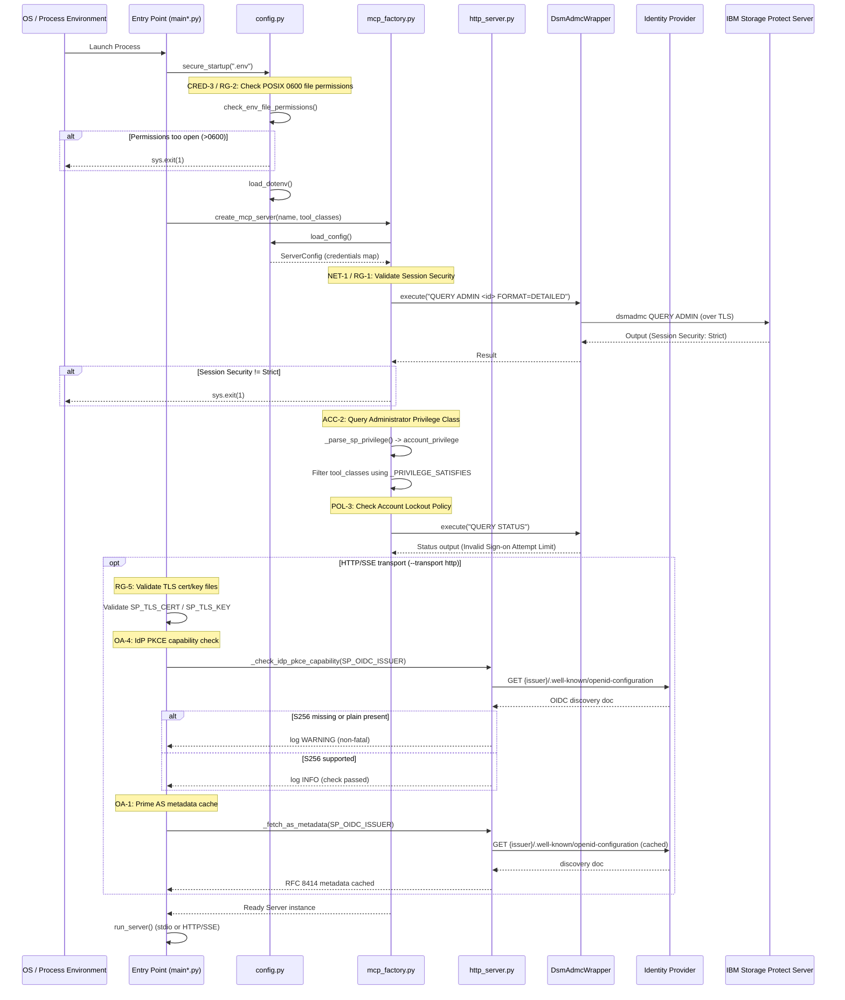
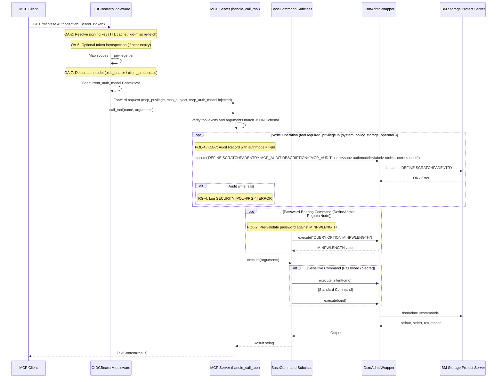
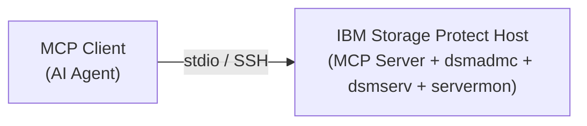
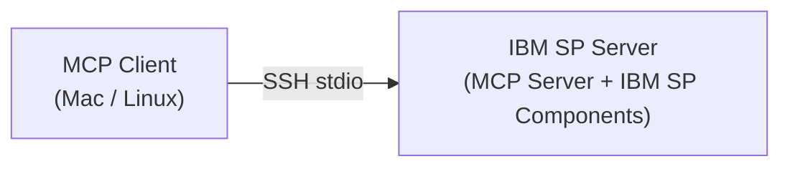
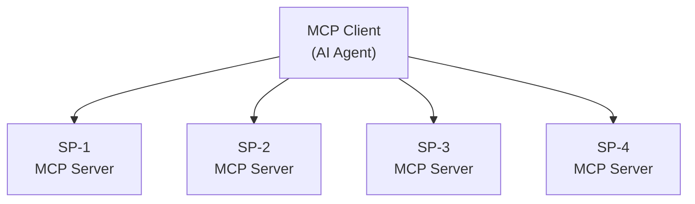

# IBM Storage Protect MCP Server — System Architecture & Design

* **Revision**: 2026-10 (OA-1–OA-7 OAuth 2 Authorization implemented)
* **Cross-reference**: [`docs/analysis/security-design-analysis.md`](../analysis/security-design-analysis.md) · [`docs/traceability/gap-analysis.md`](../traceability/gap-analysis.md) · [`docs/traceability/audit-report.md`](../traceability/audit-report.md)
* **Source reference**: `src/sp_mcp_server/`

---

## 1. Overview & System Context

The IBM Storage Protect MCP Server provides a standardized Model Context Protocol (MCP) interface enabling AI agents and automated clients to interact with IBM Storage Protect (formerly Tivoli Storage Manager / Spectrum Protect) servers.

The server provides natural language administration capabilities mapped directly onto native Storage Protect commands while preserving enterprise-grade access control, session security, secret masking, and comprehensive auditability.

The architecture provides two operating models:
1. **Unified MCP Server (`main.py`)**: Runs all or selected functional server groups in a single process over `stdio` or secure `http` SSE transport.
2. **Micro-MCP Servers (`main_<module>_*.py`)**: Fine-grained, isolated server processes (e.g., `main_clients_core.py`, `main_storage_pools.py`, `main_ops_protection.py`) optimized for LLM context window efficiency and least-privilege scoping.

---

## 2. Core Architectural Principles

1. **Modularity & Extensibility**: Commands are organized into logical functional groups (`clients`, `storage`, `policies`, `system`, `operations`). New commands are added by implementing base command classes and registering them in a server group — no changes to the protocol layer are required.

2. **Strict Least Privilege & Separation of Concerns**:
   - Commands are partitioned into 5 administrative modules (`clients`, `storage`, `policies`, `system`, `operations`).
   - Every tool declares a `required_privilege` (`system`, `policy`, `storage`, `operator`, `any`).
   - In service-account mode, tool discovery queries the configured account's SP authority (`QUERY ADMIN <name> FORMAT=DETAILED`) and restricts tool registration accordingly.
   - Dynamic-session and OIDC privilege claims are enforced at invocation time via `_privilege_satisfies_for_session()` and `current_request_privilege` context variable checks in `handle_call_tool()`.
   - `_check_session_target_server()` enforces `SessionLease.target_server` binding immediately after privilege confirmation; cross-server session reuse is rejected with `AUTHORIZATION_DENIED` (DAUTH-7, closed).
   - Delegated session credentials are applied to command execution via `current_execution_credentials` context variable and cleared in the `finally` block.

3. **Defense-in-Depth Session & Transport Security**:
   - **Local Stdio Transport**: Secured via SSH Ed25519 key authentication, dedicated non-privileged OS user (`mcp-runner`), and explicit strict host key checking.
    - **Remote HTTP/SSE Transport**: Requires TLS 1.2+ certificates (`SP_TLS_CERT` / `SP_TLS_KEY`, RG-5) and OAuth 2.1 / OIDC Bearer Token authentication (`OIDCBearerMiddleware`) with call-time scope enforcement; per-scope privilege mapping (`mcp:*`) and `AUTHORIZATION_DENIED` rejection. The HTTP layer implements the full OAuth 2 resource-server specification: AS metadata endpoint (OA-1), TTL-based JWKS cache with `kid`-miss re-fetch (OA-2), Authorization Code + PKCE support (OA-3/OA-4), optional token introspection (OA-5), RFC 9470 protected-resource metadata (OA-6), and `authmodel=` ACTLOG attribution (OA-7) — see [`module-security.md`](module-security.md).
    - **Dynamic Authentication (Challenge-Response)**: Allows interactive AI chat users to receive structured `AUTHENTICATION_REQUIRED` responses, verifies credentials via zero-trace `execute_silent()`, issues bounded ephemeral leases, enforces lease privileges, applies delegated credentials to command execution, and supports explicit session revocation via `logout_session`.
    - **Session Lifecycle**: `SessionManager` uses `RLock` and bounds TTLs to `MAX_SESSION_TTL_SECONDS`. Cleanup is opportunistic (on create / explicit call). `SessionLease.password` is zeroed on every removal path — explicit revocation, inactivity/absolute TTL expiry, bulk sweep, and server shutdown (AUD-08, closed).
    - **Backend Storage Protect Channel**: `SESSIONSECURITY=STRICT` validated at startup; `dsm.sys` enforces `SSLREQUIRED Yes` and `PASSWORDACCESS GENERATE`. Service account provisioning script (`scripts/provision-sp-service-accounts.sh`) registers all five tiered accounts with `SESSIONSECURITY=STRICT` and `MFAREQUIRED=NO` (AUD-07, closed).

4. **Two-Person Integrity & Policy Controls**:
   - Destructive operations support IBM SP native Command Approval (`SET COMMANDAPPROVAL ON`, `APPROVE PENDINGCMD`, `REJECT PENDINGCMD`, `WITHDRAW PENDINGCMD`).
   - Password-bearing administrative operations pre-validate length against SP `MINPWLENGTH` and execute via silent channels without exposing plaintext passwords in logs or process arguments.

5. **Auditing & SIEM Traceability**:
   - Every write operation emits a traceable correlation marker into IBM Storage Protect Activity Log via `DEFINE SCRATCHPADENTRY MCP_AUDIT` (`POL-4`).

6. **Type Safety & Input Validation**: Comprehensive JSON Schema validation for all tool inputs. Command escaping in CLI wrappers provides defence against injection.

---

## 3. Layered System Architecture



---

## 4. Server Startup & Security Lifecycle

When an MCP server process starts (either `main.py` or a specialized `main_*.py`), it executes a strict startup sequence:



---

## 5. Tool Execution & Audit Workflow

When an MCP client invokes a tool:



---

## 6. Domain Breakdown & Micro-Servers

The codebase provides multiple dedicated Micro-MCP entry points categorized across 5 administrative modules, in addition to the unified server. Supported entry points use the atomic `secure_startup()` helper before loading configuration.

| Module Category | Micro-MCP Server Entry Point | Command Group | Focus & Administrative Scope |
| :--- | :--- | :--- | :--- |
| **Clients** | [`main_clients_core.py`](../../src/sp_mcp_server/main_clients_core.py)<br>[`main_clients_config.py`](../../src/sp_mcp_server/main_clients_config.py) | `ISP_CLIENTS_CORE` (~17)<br>`ISP_CLIENTS_CONFIG` (~10) | Node registration, locks, updates, renames, node groups, client option sets (`cloptset`), and schedule associations. |
| **Storage** | [`main_storage_pools.py`](../../src/sp_mcp_server/main_storage_pools.py)<br>[`main_storage_hardware.py`](../../src/sp_mcp_server/main_storage_hardware.py)<br>[`main_storage_device.py`](../../src/sp_mcp_server/main_storage_device.py)<br>[`main_volumes.py`](../../src/sp_mcp_server/main_volumes.py) | `ISP_STORAGE_POOLS` (~13)<br>`ISP_STORAGE_HARDWARE` (~14)<br>`ISP_STORAGE_DEVICE` (~9)<br>`ISP_VOLUMES` | Storage pools, directory containers, tape libraries, drives, paths, device classes, data movers, and volume history. |
| **Policies** | [`main_policies_lifecycle.py`](../../src/sp_mcp_server/main_policies_lifecycle.py)<br>[`main_policies_management.py`](../../src/sp_mcp_server/main_policies_management.py) | `ISP_POLICIES_LIFECYCLE` (~10)<br>`ISP_POLICIES_MANAGEMENT` (~12) | Policy domains, policy set validation/activation, management classes, copy groups, and retention schedules. |
| **System** | [`main_system_admin.py`](../../src/sp_mcp_server/main_system_admin.py)<br>[`main_system_config.py`](../../src/sp_mcp_server/main_system_config.py) | `ISP_SYSTEM_ADMIN` (~12)<br>`ISP_SYSTEM_CONFIG` (~13) | Admin accounts, authority granting, command approvals (`APPROVE PENDINGCMD`), server definitions, scripts, and cloud connections. |
| **Operations** | [`main_ops_protection.py`](../../src/sp_mcp_server/main_ops_protection.py)<br>[`main_ops_maintenance.py`](../../src/sp_mcp_server/main_ops_maintenance.py)<br>[`main_ops_rules.py`](../../src/sp_mcp_server/main_ops_rules.py) | `ISP_OPS_PROTECTION` (~10)<br>`ISP_OPS_MAINTENANCE` (~12)<br>`ISP_OPS_RULES` (~13) | DB backup/restore, DR media, replication, data movement, storage reclamation, automation rules, subrules, and alerts. |
| **Unified Server** | [`main.py`](../../src/sp_mcp_server/main.py) | Configurable via `--enable-servers` | Unified server combining all selected modules over stdio or HTTP. |

---

## 7. Core Component Reference

### 7.1 Entry Points (`main.py` / `main_*.py`)

**Responsibilities:**
- Parse command-line arguments (`--enable-servers`, `--mode`)
- Invoke `secure_startup()` for `.env` permission and credential checks
- Select and enable server modules based on configuration
- Initialize the async runtime and start the MCP server

### 7.2 MCP Factory (`mcp_factory.py`)

**Responsibilities:**
- Instantiate command classes with appropriate CLI wrappers
- Enforce `SESSIONSECURITY=STRICT` and lockout policy checks at startup
- Query SP administrator privilege class and filter tools accordingly
- Route tool calls: privilege check → session binding check → audit record → command execution
- Configure rotating file logs with console output

### 7.3 Server Groups (`server_groups.py`)

Organizes command classes into named functional groups that entry points register selectively via `--enable-servers`. Enables least-privilege scoping at the process level.

### 7.4 Command Layer (`commands/`)

Three abstract base classes drive all command implementations:

| Base Class | CLI Wrapper | Use Case | Examples |
| :--- | :--- | :--- | :--- |
| `BaseCommand` | `DsmAdmcWrapper` | Online administrative commands; active server connection required | `RegisterNode`, `DefineStoragePool`, `QueryClient` |
| `BaseOfflineCommand` | `DsmServWrapper` | Offline database operations; no active server connection needed | `QueryOfflineDBSpace`, `QueryOfflineLog` |
| `BaseServermonCommand` | `ServermonWrapper` | Server monitoring; parses XML output | `RunServerMon` |

**Command class structure:**

```python
class ExampleCommand(BaseCommand):
    name = "command_name"
    description = "Command description"
    required_privilege = "storage"  # system | policy | storage | operator | any
    read_only = True                # False for write operations

    args_schema = {
        "type": "object",
        "properties": {
            "param1": {"type": "string", "description": "..."},
        },
        "required": ["param1"]
    }

    def execute(self, args: dict) -> str:
        result = self.cli.execute("SP COMMAND PARAM1=%s" % args["param1"])
        return result.stdout
```

### 7.5 CLI Wrapper Layer (`cli_wrapper.py`)

| Wrapper | Binary | Key Behaviours |
| :--- | :--- | :--- |
| `DsmAdmcWrapper` | `dsmadmc` | Stash-file authentication (`PASSWORDACCESS GENERATE`); `execute()` for standard commands; `execute_silent()` for password-bearing commands with masked output |
| `DsmServWrapper` | `dsmserv` | `sudo -u <instance_user>` execution; `LD_LIBRARY_PATH` management for offline DB access |
| `ServermonWrapper` | `servermon` | `sudo -u <instance_user>` execution; XML output parsing; real-time metrics extraction |

### 7.6 Configuration Management (`config.py`)

**Required variables:**
- `SP_ADMIN_ID` — Administrator username
- `SP_ADMIN_PASSWORD` — Administrator password

**Optional variables:**
- `TCPSERVERADDRESS` — Server hostname / IP
- `SP_SERVER_PORT` / `TCPPORT` — Server port (default: 1500)
- `SP_DSMSERV_PATH` — Path to `dsmserv` executable
- `SP_SERVER_INSTANCE_DIR` — Server instance directory
- `SP_SERVERMON_PATH` — Path to `servermon` executable
- `SP_SERVERMON_XML_DIR` — Directory for servermon XML output
- `SP_INSTANCE_USER` — TSM instance user (required for `dsmserv`/`servermon` commands)

The `secure_startup()` helper verifies that the `.env` file has POSIX `0600` permissions before loading it, and exits the process if the check fails.

---

## 8. Operation Modes

| Mode | Description | Command Types Available |
| :--- | :--- | :--- |
| **Full** (default) | All commands available; create, update, delete operations enabled | `read_only=True` and `read_only=False` |
| **Read-Only** | Query and informational commands only; no state-changing operations | `read_only=True` only |

The factory filters registered tool classes at startup based on the selected mode. Read-Only mode is suitable for monitoring, reporting, and auditing workflows.

---

## 9. Extension Points

### 9.1 Adding a New Command

**Step 1 — Implement the command class:**

```python
# src/sp_mcp_server/commands/clients/new_command.py
from ..base import BaseCommand

class NewCommand(BaseCommand):
    name = "new_command"
    description = "Description of the command"
    required_privilege = "any"
    read_only = True

    args_schema = {
        "type": "object",
        "properties": {
            "param": {"type": "string", "description": "Target node name"}
        },
        "required": ["param"]
    }

    def execute(self, args: dict) -> str:
        return self.cli.execute("SP COMMAND NODE=%s" % args["param"]).stdout
```

**Step 2 — Register in the relevant server group:**

```python
# src/sp_mcp_server/server_groups.py
from sp_mcp_server.commands.clients.new_command import NewCommand

ISP_CLIENTS_CORE = [
    # ... existing commands
    NewCommand,
]
```

**Step 3 — Verify via the unified entry point:**

```bash
python -m sp_mcp_server.main --enable-servers clients
```

### 9.2 Adding a New Server Group

**Step 1 — Define the group in `server_groups.py`:**

```python
ISP_NEW_GROUP = [
    Command1,
    Command2,
]
```

**Step 2 — Register in `main.py`:**

```python
SERVER_GROUPS = {
    # ... existing groups
    "new_group": ISP_NEW_GROUP,
}
```

**Step 3 — Enable via CLI:**

```bash
python -m sp_mcp_server.main --enable-servers new_group
```

---

## 10. Deployment Patterns

### 10.1 Standalone (Co-located)

MCP server runs on the same host as IBM Storage Protect:



### 10.2 Remote over SSH

MCP server runs on the client machine; commands forwarded over SSH:



### 10.3 Multi-Server

A single AI agent connects to multiple independent MCP server instances, one per SP server:



---

## 11. Logging & Monitoring

### Log Configuration

| Property | Value |
| :--- | :--- |
| Primary location | `/var/log/ibm-sp-mcp-server/mcp-server.log` |
| Fallback location | `/tmp/ibm-sp-mcp-server/` |
| Rotation | 10 MB max file size, 5 backup files |
| File log level | DEBUG |
| Console log level | INFO |
| Format | `timestamp · logger · level · file:line · message` |

### Log Categories

- **Server Lifecycle** — startup, shutdown, configuration changes
- **Tool Execution** — tool calls, arguments (with secret masking), results
- **CLI Operations** — command execution, output parsing, return codes
- **Security Events** — privilege denials, session lifecycle, audit write failures
- **Errors** — exceptions, schema validation failures, CLI errors

### Monitoring Points

- Tool execution latency
- CLI command success/failure rates
- Error patterns and frequencies
- Session creation, expiry, and revocation events
- Server resource utilization (via `servermon`)

---

## 12. Performance Considerations

1. **Async Execution**: Tool calls execute in a thread pool; MCP protocol I/O is non-blocking; concurrent command execution is supported.
2. **CLI Optimization**: Output parsing is optimized to avoid buffering large result sets; `dsmadmc` stash authentication avoids per-call credential round-trips.
3. **Resource Management**: CLI sub-processes are cleaned up after each invocation; log rotation prevents disk exhaustion.

---

## 13. Testing Strategy

| Test Layer | Scope | Key Areas |
| :--- | :--- | :--- |
| **Unit** | Individual classes and functions | Command validation logic, output parsing, JSON Schema validation |
| **Integration** | CLI wrapper functionality | End-to-end command execution, error handling, mode filtering |
| **Security Regression** | `tests/test_sec_*.py` (6 files) | 114 tests covering all audit remediation items (AUD-07, AUD-08, DAUTH-7, POL-4, OIDC scopes, OA-1–OA-7) |
| **System** | Full server operation | Multi-command workflows, mode switching, session lifecycle |

Run the full test suite:

```bash
pytest tests/ -v
```

---

## 14. Security Design References

For domain-specific detailed security control specifications:
- [`docs/design/security-dynamic-authn.md`](../design/security-dynamic-authn.md) — Dynamic & Delegated User Authentication (Challenge-Response).
- [`docs/design/security-network.md`](../design/security-network.md) — Network Security, SSH Transport & TLS Enforcement.
- [`docs/design/security-identity-credentials.md`](../design/security-identity-credentials.md) — Tiered Credentials, Stash Mode & Keyring Integration.
- [`docs/design/security-access.md`](../design/security-access.md) — Tool Privilege Gating & Sudoers Execution.
- [`docs/design/security-policy.md`](../design/security-policy.md) — Command Approval, Password Policies & ACTLOG Audit Trail.
- [`docs/design/security-integrations.md`](../design/security-integrations.md) — OAuth 2.1 / OIDC HTTP Transport (resource-server baseline) & Secrets Reference Resolution.
- [`docs/design/security-oauth2.md`](../design/security-oauth2.md) — OAuth 2 Authorization: AS metadata endpoint (OA-1), JWKS key rotation (OA-2), Authorization Code + PKCE (OA-3/OA-4), token introspection (OA-5), RFC 9470 protected-resource metadata (OA-6), and auth-model audit attribution (OA-7). All implemented.
- [`docs/design/security-non-repudiation.md`](../design/security-non-repudiation.md) — Non-Repudiation, Activity Log Attribution & Forensic Correlation.

Security analysis documents (requirement analysis and control verification):
- [`docs/analysis/security-design-analysis.md`](../analysis/security-design-analysis.md) — Comprehensive cross-domain analysis; 114 regression tests passing.
- [`docs/analysis/security-dynamic-authn-analysis.md`](../analysis/security-dynamic-authn-analysis.md) — Dynamic authentication requirement analysis.
- [`docs/analysis/security-oauth2-analysis.md`](../analysis/security-oauth2-analysis.md) — OAuth 2 requirement analysis; OA-1–OA-7 all implemented and tested (26 tests).

Module architecture documents:
- [`docs/architecture/module-security.md`](module-security.md) — HTTP/SSE layer and OAuth 2 component reference (`http_server.py`, `main.py` HTTP branch).

---

## 15. Directory Structure & Key Files

```
storage-protect-mcp-server/
├── pyproject.toml                     # Package dependencies, CLI entry points
├── src/sp_mcp_server/
│   ├── __init__.py                    # Package exports
│   ├── cli_wrapper.py                 # DsmAdmcWrapper, DsmServWrapper, ServermonWrapper
│   ├── config.py                      # ServerConfig, secure_startup(), credential resolution
│   ├── http_server.py                 # FastAPI / Starlette OIDC Bearer Token middleware
│   ├── mcp_factory.py                 # Core MCP server factory, security gates, audit logging
│   ├── server_groups.py               # Tool group definitions across all modules
│   ├── main.py                        # Unified server entry point (--enable-servers)
│   ├── main_*.py                      # Domain-specific and legacy micro-server entry points
│   └── commands/                      # Command implementations
│       ├── base.py                    # BaseCommand, BaseOfflineCommand, BaseServermonCommand
│       ├── offline.py                 # Offline DB/log tools (dsmserv)
│       ├── servermon.py               # Servermon diagnostic tools
│       ├── clients/                   # assoc.py, groups.py, info.py, node.py, opt.py
│       ├── storage/                   # content.py, datamover.py, device.py, drive.py, ...
│       ├── policies/                  # copy.py, domain.py, mgmt.py, policyset.py, ...
│       ├── system/                    # admin.py, auth.py (AuthenticateSession, LogoutSession), config.py, conn.py, logs.py, script.py, ...
│       └── operations/                # alerts.py, approval.py, backupset.py, catalog.py, ...
├── config/
│   └── dsm.sys.template               # dsmadmc client-options template (SSL Yes, SSLREQUIRED Yes, PASSWORDACCESS GENERATE)
├── scripts/
│   └── provision-sp-service-accounts.sh  # Idempotent SP service account provisioning (5 tiers, SESSIONSECURITY=STRICT)
├── tests/                             # Test suite
│   ├── test_cli_wrapper.py
│   ├── test_commands.py
│   ├── test_config.py
│   ├── test_core_components.py
│   ├── fixtures.py                    # Shared test constants and helpers
│   ├── test_sec_startup.py            # NET-1, CRED-3, ACC-1–3, POL-3
│   ├── test_sec_dynamic_auth.py       # DAUTH-1–9, OIDC scope enforcement
│   ├── test_sec_session_lifecycle.py  # Session TTL, revocation, zero-trace
│   ├── test_sec_audit_trail.py        # POL-4, RG-4, NR-4, RG-5 TLS
│   ├── test_sec_password_commands.py  # POL-2, INT-3a
│   └── test_sec_oauth2.py             # OA-1–OA-7 — 26 tests passing
└── docs/                              # Comprehensive documentation
    ├── design/                        # Domain-specific security design specifications
    ├── architecture/                  # System & module-specific architecture docs
    ├── analysis/                      # Security design analysis & gap closure validation
    ├── traceability/                  # Traceability matrix and gap analysis
    └── guides/                        # User, installation, configuration, and troubleshooting guides
```

---

## 16. Future Enhancements

1. **Command Result Caching**: Cache query results for frequently accessed data with TTL-based invalidation.
2. **Batch Operations**: Multi-command transactions with atomic rollback support.
3. **Advanced Monitoring**: Real-time metrics streaming and alerting integration.
4. **High Availability**: Failover support, load balancing across SP server replicas, and state synchronization.
