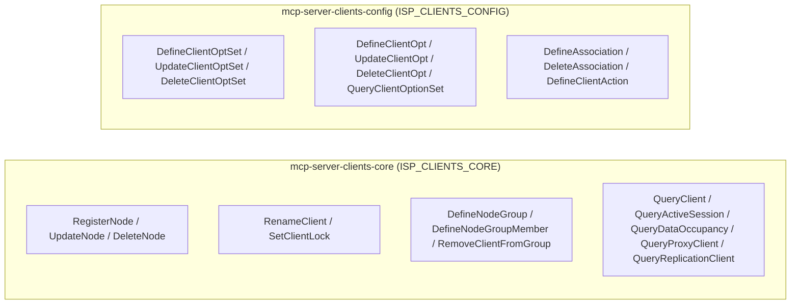

# Module Architecture: Clients

**Revision**: 2025-07 (Post-Remediation Verification & Alignment)  
**Cross-reference**: [`docs/architecture/architecture.md`](architecture.md) · [`docs/analysis/security-design-analysis.md`](../analysis/security-design-analysis.md)  
**Source reference**: `src/sp_mcp_server/commands/clients/` · `src/sp_mcp_server/server_groups.py`

---

## 1. Module Overview

The **Clients Module** manages the lifecycle, properties, groups, option sets, and scheduled associations for backup client nodes in IBM Storage Protect.

It provides fine-grained control over:
- **Node Lifecycle**: Registration, modification, renaming, locking/unlocking, and deletion.
- **Node Grouping**: Defining node groups, adding/removing members, and querying group assignments.
- **Client Options & Configurations**: Option set definition (`cloptset`), individual client options, and schedule associations.
- **Client Diagnostics**: Querying active sessions, data occupancy, backup volumes, proxy relationships, and replication configurations.

---

## 2. Micro-MCP Server Composition

The Clients domain is partitioned into two primary Micro-MCP servers:



---

## 3. Tool Catalog & SP Command Mappings

### 3.1 `mcp-server-clients-core` (`ISP_CLIENTS_CORE`)

| MCP Tool Name | Command Class | Required Privilege | IBM Storage Protect Command | Description & Scope |
| :--- | :--- | :---: | :--- | :--- |
| `register_node` | `RegisterNode` | `policy` | `REGISTER NODE <node> <pwd> [DOMAIN=...]` | Registers a new backup client node. Password is pre-validated against `MINPWLENGTH` and masked in logs. |
| `update_node` | `UpdateNode` | `policy` | `UPDATE NODE <node> [DOMAIN=...] [PASSWORD=...]` | Updates node properties, domain assignments, or password. Password changes use silent execution. |
| `delete_node` | `DeleteNode` / `DeleteClient` | `policy` | `REMOVE NODE <node>` | Decommissions a node from the server. |
| `rename_client` | `RenameClient` | `policy` | `RENAME NODE <current> <new>` | Changes the registered name of a client node. |
| `set_client_lock` | `SetClientLock` | `policy` | `LOCK NODE <node>` / `UNLOCK NODE <node>` | Locks or unlocks node access to the server. |
| `query_client` | `QueryClient` | `any` | `QUERY NODE [node] FORMAT=DETAILED` | Retrieves detailed configuration for registered nodes. |
| `query_active_session` | `QueryActiveSession` | `any` | `QUERY SESSION [FORMAT=DETAILED]` | Queries active client and administrative connections. |
| `query_data_occupancy` | `QueryDataOccupancy` | `any` | `QUERY OCCUPANCY [node]` | Inspects space usage and filespaces per client node. |
| `query_audit_data_occupancy` | `QueryAuditDataOccupancy` | `any` | `QUERY AUDITOCCUPANCY` | Queries license and audit occupancy metrics. |
| `query_client_backup_volume` | `QueryClientBackupVolume` | `any` | `QUERY NODEDATAMVC <node>` | Queries volume placement for client node data. |
| `query_virtual_mount_point` | `QueryVirtualMountPoint` | `any` | `QUERY VIRTUALFS <node>` | Inspects virtual mount point mappings. |
| `query_client_data_placement` | `QueryClientDataPlacement` | `any` | `QUERY CONTENT <volume> NODE=<node>` | Inspects physical file placement on storage volumes. |
| `define_node_group` | `DefineNodeGroup` | `policy` | `DEFINE NODEGROUP <group>` | Creates a logical node group for scheduling and policy. |
| `update_node_group` | `UpdateNodeGroup` | `policy` | `UPDATE NODEGROUP <group>` | Updates attributes of a node group. |
| `delete_node_group` | `DeleteNodeGroup` | `policy` | `DELETE NODEGROUP <group>` | Deletes a node group. |
| `query_client_group` | `QueryClientGroup` | `any` | `QUERY NODEGROUP [group]` | Displays node groups and their member clients. |
| `define_node_group_member` | `DefineNodeGroupMember` | `policy` | `DEFINE NODEGROUPMEMBER <group> <node>` | Adds a client node as a member of a node group. |
| `remove_client_from_group` | `RemoveClientFromGroup` | `policy` | `DELETE NODEGROUPMEMBER <group> <node>` | Removes a client node from a node group. |
| `query_proxy_client` | `QueryProxyClient` | `any` | `QUERY PROXYNODE [TARGET=...]` | Queries multi-node agent proxy permissions. |
| `query_replication_client` | `QueryReplicationClient` | `any` | `QUERY REPLNODE <node>` | Displays node-level replication status and configurations. |

---

### 3.2 `mcp-server-clients-config` (`ISP_CLIENTS_CONFIG`)

| MCP Tool Name | Command Class | Required Privilege | IBM Storage Protect Command | Description & Scope |
| :--- | :--- | :---: | :--- | :--- |
| `define_client_opt_set` | `DefineClientOptSet` | `policy` | `DEFINE CLOPTSET <cloptset>` | Creates a client option set to centrally manage `dsm.opt` options. |
| `update_client_opt_set` | `UpdateClientOptSet` | `policy` | `UPDATE CLOPTSET <cloptset>` | Updates client option set parameters. |
| `delete_client_opt_set` | `DeleteClientOptSet` | `policy` | `DELETE CLOPTSET <cloptset>` | Removes a client option set. |
| `define_client_opt` | `DefineClientOpt` | `policy` | `DEFINE CLIENTOPT <cloptset> <opt> <val>` | Adds an override or default option to a client option set. |
| `update_client_opt` | `UpdateClientOpt` | `policy` | `UPDATE CLIENTOPT <cloptset> <opt> <val>` | Updates a specific option entry in a client option set. |
| `delete_client_opt` | `DeleteClientOpt` | `policy` | `DELETE CLIENTOPT <cloptset> <opt>` | Deletes an option entry from an option set. |
| `query_client_option_set` | `QueryClientOptionSet` | `any` | `QUERY CLOPTSET [cloptset] FORMAT=DETAILED` | Displays configured client option sets and their options. |
| `define_association` | `DefineAssociation` | `policy` | `DEFINE ASSOCIATION <domain> <sched> <node>` | Associates client nodes or node groups with backup schedules. |
| `delete_association` | `DeleteAssociation` | `policy` | `DELETE ASSOCIATION <domain> <sched> <node>` | Removes schedule associations from client nodes. |
| `define_client_action` | `DefineClientAction` | `policy` | `DEFINE CLIENTACTION <node> ACTION=...` | Dispatches an immediate or one-time ad-hoc action schedule to a client. |

---

## 4. Operational Execution & Usage

### Running via Micro-MCP Servers
```bash
# Terminal 1: Core node lifecycle management
python3 -m sp_mcp_server.main_clients_core

# Terminal 2: Client configuration profiles and schedule associations
python3 -m sp_mcp_server.main_clients_config
```

### Running via Unified Server
```bash
python3 -m sp_mcp_server.main --enable-servers clients
```
