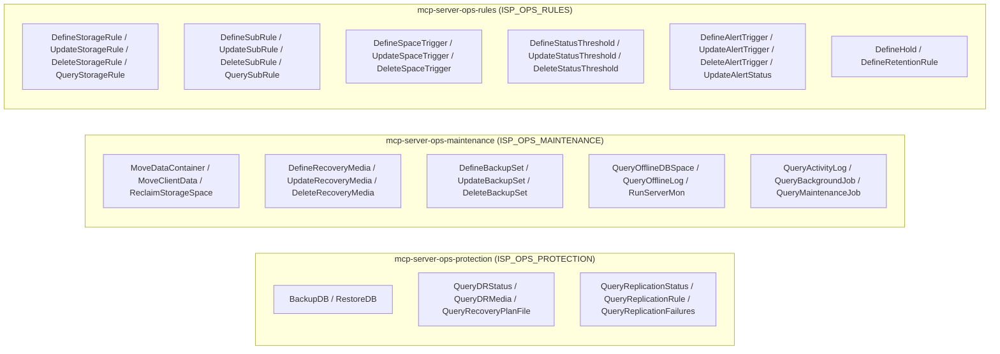

# Module Architecture: Operations

* **Revision**: 2025-07 (Post-Remediation Verification & Alignment)
* **Cross-reference**: [`docs/architecture/architecture.md`](architecture.md) · [`docs/analysis/security-design-analysis.md`](../analysis/security-design-analysis.md)
* **Source reference**: `src/sp_mcp_server/commands/operations/` · `src/sp_mcp_server/server_groups.py`

---

## 1. Module Overview

The **Operations Module** manages day-to-day administrative tasks, data protection, maintenance workflows, automation rules, and disaster recovery.

It provides fine-grained control over:
- **Critical Data Protection**: Database backup (`BACKUP DB`), restore, and disaster recovery media.
- **Data Movement & Space Management**: Volume data movement, storage pool reclamation, and cloud migration.
- **Automation & Rules**: Storage rules (`STGRULE`), subrules, status thresholds, and space triggers.
- **Monitoring & Diagnostic Inspection**: Servermon execution, process monitoring, and activity log (`ACTLOG`) queries.

---

## 2. Micro-MCP Server Composition

The Operations domain is partitioned into three Micro-MCP servers:



---

## 3. Tool Catalog & SP Command Mappings

### 3.1 `mcp-server-ops-protection` (`ISP_OPS_PROTECTION`)

| MCP Tool Name | Command Class | Required Privilege | IBM Storage Protect Command | Description & Scope |
| :--- | :--- | :---: | :--- | :--- |
| `backup_db` | `BackupDB` | `operator` | `BACKUP DB DEVCLASS=... TYPE=...` | Initiates a full, incremental, or snapshot backup of the server database. |
| `restore_db` | `RestoreDB` | `system` | `RESTORE DB ...` | Initiates a restore operation of the server database. |
| `query_dr_status` | `QueryDRStatus` | `any` | `QUERY DRMSTATUS` | Displays Disaster Recovery Manager (DRM) status and configuration. |
| `query_dr_media` | `QueryDRMedia` | `any` | `QUERY DRMEDIA` | Inspects database backup and copy storage pool volumes managed for DR. |
| `query_recovery_plan_file` | `QueryRecoveryPlanFile` | `any` | `QUERY RPFILE` | Queries generated Disaster Recovery recovery plan files. |
| `query_recovery_plan_file_content` | `QueryRecoveryPlanFileContent` | `any` | `QUERY RPFCONTENT <plan>` | Displays the detailed text content of a recovery plan file. |
| `query_replication_status` | `QueryReplicationStatus` | `any` | `QUERY REPLICATION` | Queries node and data replication execution across servers. |
| `query_replication_rule` | `QueryReplicationRule` | `any` | `QUERY REPLRULE` | Queries high-level replication rules and schedules. |
| `query_protection_status` | `QueryProtectionStatus` | `any` | `QUERY PROTECTSTATUS` | Displays protection status for container storage pools. |
| `query_replication_failures` | `QueryReplicationFailures` | `any` | `QUERY REPLFAILURES` | Inspects failed replication operations for diagnostic remediation. |

---

### 3.2 `mcp-server-ops-maintenance` (`ISP_OPS_MAINTENANCE`)

| MCP Tool Name | Command Class | Required Privilege | IBM Storage Protect Command | Description & Scope |
| :--- | :--- | :---: | :--- | :--- |
| `move_data_container` | `MoveDataContainer` | `storage` | `MOVE DATA <vol> [STGPOOL=...]` | Relocates data from one storage pool volume or container to another. |
| `move_client_data` | `MoveClientData` | `storage` | `MOVE NODEDATA <node> [FROMSTGPOOL=...]` | Moves all backed-up files for a specific client to a target pool. |
| `reclaim_storage_space` | `ReclaimStorageSpace` | `storage` | `RECLAIM STGPOOL <pool> [THRESHOLD=...]` | Initiates space reclamation on sequential-access volumes. |
| `define_recovery_media` | `DefineRecoveryMedia` | `operator` | `DEFINE RECOVERYMEDIA <media>` | Creates a recovery media definition for bare-metal restore. |
| `update_recovery_media` | `UpdateRecoveryMedia` | `operator` | `UPDATE RECOVERYMEDIA <media>` | Updates recovery media properties. |
| `delete_recovery_media` | `DeleteRecoveryMedia` | `operator` | `DELETE RECOVERYMEDIA <media>` | Deletes recovery media definitions. |
| `define_backup_set` | `DefineBackupSet` | `operator` | `DEFINE BACKUPSET <node> <set> ...` | Generates a portable, self-contained backup set on sequential media. |
| `update_backup_set` | `UpdateBackupSet` | `operator` | `UPDATE BACKUPSET <node> <set>` | Updates backup set retention or description. |
| `delete_backup_set` | `DeleteBackupSet` | `operator` | `DELETE BACKUPSET <node> <set>` | Deletes a backup set. |
| `query_offline_db_space` | `QueryOfflineDBSpace` | `system` | `dsmserv display dbspace` | Offline execution via `sudo -u <instance_user>` to query DB tablespaces. |
| `query_offline_log` | `QueryOfflineLog` | `system` | `dsmserv display log` | Offline execution via `sudo -u <instance_user>` to inspect recovery log. |
| `run_server_mon` | `RunServerMon` | `operator` | `servermon` | Executes diagnostic monitoring script via `sudo -u <instance_user>`. |
| `query_activity_log` | `QueryActivityLog` | `any` | `QUERY ACTLOG [SEARCH=...]` | Searches and inspects the Storage Protect activity/audit log. |
| `query_background_job` | `QueryBackgroundJob` | `any` | `QUERY PROCESS` | Queries running background server processes. |
| `query_maintenance_job` | `QueryMaintenanceJob` | `any` | `QUERY PROCESS` (maintenance) | Queries maintenance processes (reclamation, migration, expiration). |
| `query_export_job` | `QueryExportJob` | `any` | `QUERY EXPORT` | Queries active or completed data export operations. |
| `query_restore_job` | `QueryRestoreJob` | `any` | `QUERY RESTORE` | Queries active database or client restore jobs. |

---

### 3.3 `mcp-server-ops-rules` (`ISP_OPS_RULES`)

| MCP Tool Name | Command Class | Required Privilege | IBM Storage Protect Command | Description & Scope |
| :--- | :--- | :---: | :--- | :--- |
| `define_alert_trigger` | `DefineAlertTrigger` | `operator` | `DEFINE ALERTTRIGGER <alert>` | Configures automated alert conditions. |
| `update_alert_trigger` | `UpdateAlertTrigger` | `operator` | `UPDATE ALERTTRIGGER <alert>` | Modifies alert trigger criteria or destinations. |
| `delete_alert_trigger` | `DeleteAlertTrigger` | `operator` | `DELETE ALERTTRIGGER <alert>` | Removes an alert trigger. |
| `update_alert_status` | `UpdateAlertStatus` | `operator` | `UPDATE ALERT <id> STATUS=...` | Acknowledges or closes active server alerts. |
| `query_alert_trigger` | `QueryAlertTrigger` | `any` | `QUERY ALERTTRIGGER` | Displays configured alert triggers. |
| `define_storage_rule` | `DefineStorageRule` | `storage` | `DEFINE STGRULE <rule> ...` | Creates automated tiering, replication, or cloud migration rules. |
| `update_storage_rule` | `UpdateStorageRule` | `storage` | `UPDATE STGRULE <rule> ...` | Modifies schedule, action type, or target for storage rules. |
| `delete_storage_rule` | `DeleteStorageRule` | `storage` | `DELETE STGRULE <rule>` | Removes a storage rule. |
| `query_storage_rule` | `QueryStorageRule` | `any` | `QUERY STGRULE` | Queries storage automation rules. |
| `define_space_trigger` | `DefineSpaceTrigger` | `storage` | `DEFINE SPACETRIGGER STG ...` | Configures automated storage pool capacity expansion triggers. |
| `update_space_trigger` | `UpdateSpaceTrigger` | `storage` | `UPDATE SPACETRIGGER STG ...` | Modifies space trigger thresholds. |
| `delete_space_trigger` | `DeleteSpaceTrigger` | `storage` | `DELETE SPACETRIGGER STG` | Removes space triggers. |
| `define_status_threshold` | `DefineStatusThreshold` | `operator` | `DEFINE STATUSTHRESHOLD ...` | Sets status alert thresholds for server resources. |
| `update_status_threshold` | `UpdateStatusThreshold` | `operator` | `UPDATE STATUSTHRESHOLD ...` | Updates resource threshold limits. |
| `delete_status_threshold` | `DeleteStatusThreshold` | `operator` | `DELETE STATUSTHRESHOLD ...` | Deletes resource status thresholds. |
| `define_sub_rule` | `DefineSubRule` | `storage` | `DEFINE SUBRULE <rule> <subrule>` | Adds granular sub-rules to an existing storage rule. |
| `update_sub_rule` | `UpdateSubRule` | `storage` | `UPDATE SUBRULE <rule> <subrule>` | Modifies sub-rule options. |
| `delete_sub_rule` | `DeleteSubRule` | `storage` | `DELETE SUBRULE <rule> <subrule>` | Removes a sub-rule. |
| `query_sub_rule` | `QuerySubRule` | `any` | `QUERY SUBRULE [rule]` | Displays storage sub-rules. |
| `define_hold` | `DefineHold` | `policy` | `DEFINE HOLD <hold>` | Applies a litigation or compliance hold on client data. |
| `define_retention_rule` | `DefineRetentionRule` | `policy` | `DEFINE RETRULE <rule> ...` | Creates automated retention rules for compliance retention sets. |

---

## 4. Operational Execution & Usage

### Running via Micro-MCP Servers
```bash
# Terminal 1: Disaster recovery and database protection
python3 -m sp_mcp_server.main_ops_protection

# Terminal 2: Data movement and maintenance
python3 -m sp_mcp_server.main_ops_maintenance

# Terminal 3: Automation rules and alerting
python3 -m sp_mcp_server.main_ops_rules
```

### Running via Unified Server
```bash
python3 -m sp_mcp_server.main --enable-servers operations
```
