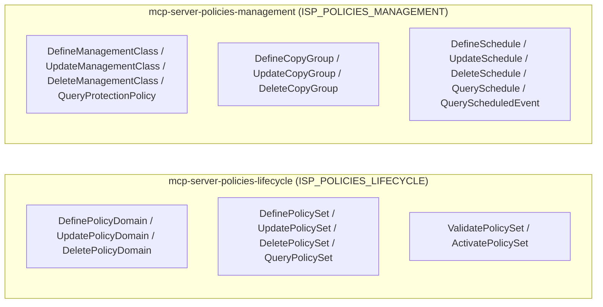

# Module Architecture: Policies

* **Revision**: 2025-07 (Post-Remediation Verification & Alignment)
* **Cross-reference**: [`docs/architecture/architecture.md`](architecture.md) · [`docs/analysis/security-design-analysis.md`](../analysis/security-design-analysis.md)
* **Source reference**: `src/sp_mcp_server/commands/policies/` · `src/sp_mcp_server/server_groups.py`

---

## 1. Module Overview

The **Policy Module** governs data retention, backup lifecycles, and automated retention policies. It manages the full hierarchy of policy domains, policy sets, management classes, copy groups, and administrative/client schedules.

It provides fine-grained control over:
- **Policy Lifecycle**: Defining policy domains, policy sets, and performing formal verification (`VALIDATE POLICYSET`) and activation (`ACTIVATE POLICYSET`).
- **Granular Management Classes**: Configuring default and custom management classes for backup and archive retention.
- **Copy Group Rules**: Setting retention versions (`VEREXISTS`, `VERDELETED`), retention windows (`RETAINEXTRA`, `RETAINONLY`), and target destination storage pools.
- **Schedules**: Defining administrative and client schedules and querying scheduled events.

---

## 2. Micro-MCP Server Composition

The Policy domain is partitioned into two Micro-MCP servers:



---

## 3. Tool Catalog & SP Command Mappings

### 3.1 `mcp-server-policies-lifecycle` (`ISP_POLICIES_LIFECYCLE`)

| MCP Tool Name | Command Class | Required Privilege | IBM Storage Protect Command | Description & Scope |
| :--- | :--- | :---: | :--- | :--- |
| `define_policy_domain` | `DefinePolicyDomain` | `policy` | `DEFINE DOMAIN <domain> [DESC=...]` | Creates a new Policy Domain (SLA boundary). |
| `update_policy_domain` | `UpdatePolicyDomain` | `policy` | `UPDATE DOMAIN <domain> [DESC=...]` | Updates description or settings for a Policy Domain. |
| `delete_policy_domain` | `DeletePolicyDomain` | `policy` | `DELETE DOMAIN <domain>` | Deletes an empty Policy Domain. |
| `query_policy_group` | `QueryPolicyGroup` | `any` | `QUERY DOMAIN [domain] FORMAT=DETAILED` | Displays policy domains and their properties. |
| `define_policy_set` | `DefinePolicySet` | `policy` | `DEFINE POLICYSET <domain> <set>` | Creates an editable (inactive) policy set. |
| `update_policy_set` | `UpdatePolicySet` | `policy` | `UPDATE POLICYSET <domain> <set>` | Updates policy set metadata. |
| `delete_policy_set` | `DeletePolicySet` | `policy` | `DELETE POLICYSET <domain> <set>` | Deletes an inactive policy set. |
| `query_policy_set` | `QueryPolicySet` | `any` | `QUERY POLICYSET [domain] [set]` | Displays policy set contents and status. |
| `validate_policy_set` | `ValidatePolicySet` | `policy` | `VALIDATE POLICYSET <domain> <set>` | Validates that a policy set satisfies all consistency requirements prior to activation. |
| `activate_policy_set` | `ActivatePolicySet` | `policy` | `ACTIVATE POLICYSET <domain> <set>` | Activates the policy set, making its rules the live ACTIVE policy for the domain. |

---

### 3.2 `mcp-server-policies-management` (`ISP_POLICIES_MANAGEMENT`)

| MCP Tool Name | Command Class | Required Privilege | IBM Storage Protect Command | Description & Scope |
| :--- | :--- | :---: | :--- | :--- |
| `define_management_class` | `DefineManagementClass` | `policy` | `DEFINE MGMTCLASS <domain> <set> <class>` | Creates a management class within a policy set. |
| `update_management_class` | `UpdateManagementClass` | `policy` | `UPDATE MGMTCLASS <domain> <set> <class>` | Modifies management class attributes. |
| `delete_management_class` | `DeleteManagementClass` | `policy` | `DELETE MGMTCLASS <domain> <set> <class>` | Deletes a management class from an inactive policy set. |
| `query_protection_policy` | `QueryProtectionPolicy` | `any` | `QUERY MGMTCLASS [domain] [set] [class]` | Displays management classes and their assignation. |
| `define_copy_group` | `DefineCopyGroup` | `policy` | `DEFINE COPYGROUP <domain> <set> <class> ...` | Configures backup/archive retention rules (`VEREXISTS`, `VERDELETED`, `RETE`, `RETO`, `DESTINATION`). |
| `update_copy_group` | `UpdateCopyGroup` | `policy` | `UPDATE COPYGROUP <domain> <set> <class> ...` | Modifies retention criteria or destination pool. |
| `delete_copy_group` | `DeleteCopyGroup` | `policy` | `DELETE COPYGROUP <domain> <set> <class> ...` | Deletes a copy group definition. |
| `query_retention_rule_config` | `QueryRetentionRuleConfig` | `any` | `QUERY COPYGROUP [domain] [set] [class]` | Queries detailed copy group retention parameters. |
| `define_schedule` | `DefineSchedule` | `policy` | `DEFINE SCHEDULE <domain> <sched> ...` | Creates administrative or client backup schedules. |
| `update_schedule` | `UpdateSchedule` | `policy` | `UPDATE SCHEDULE <domain> <sched> ...` | Updates start time, frequency, or actions for a schedule. |
| `delete_schedule` | `DeleteSchedule` | `policy` | `DELETE SCHEDULE <domain> <sched>` | Deletes a schedule. |
| `query_schedule` | `QuerySchedule` | `any` | `QUERY SCHEDULE [domain] [sched]` | Displays schedule details and timing parameters. |
| `query_scheduled_event` | `QueryScheduledEvent` | `any` | `QUERY EVENT [domain] [sched] [BEGINDATE=...]` | Displays execution history and status of scheduled events. |

---

## 4. Operational Execution & Usage

### Running via Micro-MCP Servers
```bash
# Terminal 1: High-level policy lifecycle (domains, validation, activation)
python3 -m sp_mcp_server.main_policies_lifecycle

# Terminal 2: Retention management classes, copy groups, and schedules
python3 -m sp_mcp_server.main_policies_management
```

### Running via Unified Server
```bash
python3 -m sp_mcp_server.main --enable-servers policy
```
