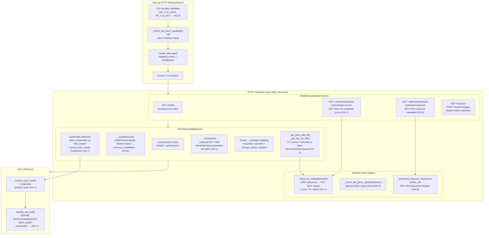
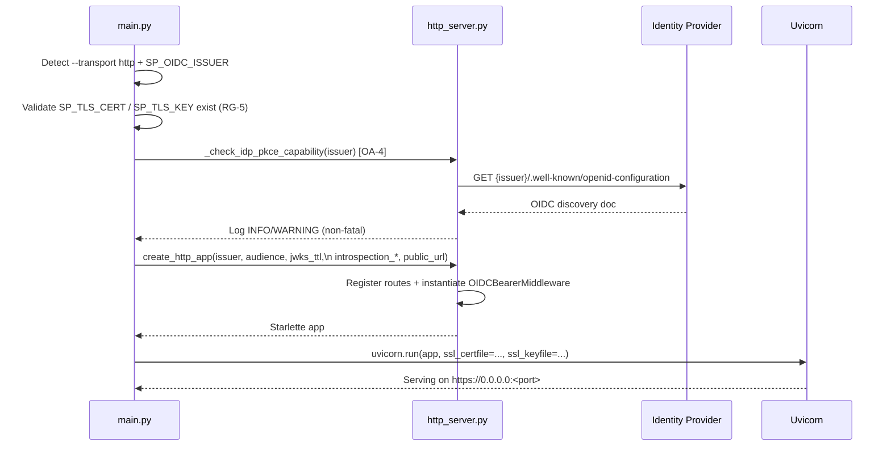

# Module Architecture: Security — HTTPS, OIDC & OAuth 2 Authorization

* **Revision**: 2026-10
* **Cross-reference**: [`docs/architecture/architecture.md`](architecture.md) · [`docs/analysis/security-oauth2-analysis.md`](../analysis/security-oauth2-analysis.md) · [`docs/design/security-oauth2.md`](../design/security-oauth2.md)
* **Source reference**: `src/sp_mcp_server/http_server.py` · `src/sp_mcp_server/main.py` (HTTP branch) · `src/sp_mcp_server/mcp_factory.py` (auth model ContextVar)
* **Test file**: [`tests/test_sec_oauth2.py`](../../tests/test_sec_oauth2.py) — 26 tests

---

## 1. Module Overview

The **HTTP Transport & OAuth 2 module** is responsible for all network-facing concerns when the MCP server is deployed over the HTTP/SSE transport (`--transport http`). It acts as the boundary between external MCP clients (AI agents, browser-based UIs, CI/CD automation) and the internal MCP server core.

The module has two primary responsibilities:

1. **OAuth 2 Resource Server** — validate OIDC bearer tokens, map scopes to SP privilege tiers, and enforce per-request authorisation before any tool call reaches `mcp_factory.py`.
2. **OAuth 2 Discovery Proxy** — expose the RFC 8414 AS metadata endpoint and RFC 9470 protected-resource metadata endpoint so that standards-compliant MCP clients can discover the token endpoint and authorization server from the MCP server URL alone.

The module is implemented in [`src/sp_mcp_server/http_server.py`](../../src/sp_mcp_server/http_server.py) and is activated by [`src/sp_mcp_server/main.py`](../../src/sp_mcp_server/main.py) when `SP_OIDC_ISSUER` is set and `--transport http` is selected.

---

## 2. Component Map



---

## 3. Starlette Route Registration

`create_http_app()` registers the following routes:

| Route | Handler | Auth Required | Requirement |
|-------|---------|:---:|-----------|
| `GET /health` | `health` | No | Liveness probe |
| `GET /.well-known/oauth-authorization-server` | `as_metadata` | No | OA-1 (RFC 8414) |
| `GET /.well-known/oauth-protected-resource` | `protected_resource_metadata` | No | OA-6 (RFC 9470) |
| `GET /mcp/sse` | `handle_sse` | **Yes** | MCP SSE stream |
| `POST /mcp/messages` | `sse_transport.handle_post_message` | **Yes** | MCP message submission |

`OIDCBearerMiddleware` wraps the entire application but exempts `/health` and both `/.well-known/*` paths from token validation.

---

## 4. OIDCBearerMiddleware Request Flow

Every request to `/mcp/*` traverses the full validation pipeline:

```mermaid
flowchart TD
    REQ[Incoming request] --> EXEMPT{Exempt path?\n/health or /.well-known/*}
    EXEMPT -- yes --> PASSTHRU[Pass to route handler]
    EXEMPT -- no --> HEADER{Authorization: Bearer\nheader present?}
    HEADER -- no --> UNAUTH1["_unauthorized()\n401 WWW-Authenticate\n+ resource_metadata (OA-6)"]
    HEADER -- yes --> DECODE[Decode JWT header\nextract kid + alg]
    DECODE --> KIDCACHE{kid in\nJWKS cache?}
    KIDCACHE -- no --> REFETCH[_get_key_for_kid()\nre-fetch JWKS\nrate-limited (OA-2)]
    REFETCH --> KIDFOUND{kid found?}
    KIDFOUND -- no --> UNAUTH2[401 invalid_token\nsigning key not found]
    KIDFOUND -- yes --> VERIFY
    KIDCACHE -- yes --> VERIFY[Verify JWT\nsig · exp · aud · iss · scope]
    VERIFY --> VALID{JWT valid?}
    VALID -- no --> UNAUTH3[401 invalid_token]
    VALID -- yes --> INTROS{SP_OIDC_INTROSPECTION\n_ENDPOINT set AND\ntoken ttl < threshold?}
    INTROS -- no --> MAPSCOPE
    INTROS -- yes --> CALL_INTROS[_introspect(token)\nPOST /introspect (OA-5)]
    CALL_INTROS --> ACTIVE{active == true?}
    ACTIVE -- no --> UNAUTH4[401 token_revoked]
    ACTIVE -- yes --> MAPSCOPE[Map scopes → privilege tier\nhighest scope wins]
    MAPSCOPE --> AUTHMODEL[Detect authmodel\npreferred_username present?\n→ oidc_bearer : client_credentials\nOA-7]
    AUTHMODEL --> INJECT[Inject into request.state:\nmcp_privilege · mcp_subject · mcp_auth_model\nSet current_auth_model ContextVar]
    INJECT --> NEXT[Call next handler]
```

---

## 5. Component Reference

### 5.1 `_fetch_as_metadata(issuer)` — OA-1

Fetches the IdP's `/.well-known/openid-configuration` and returns an RFC 8414-compliant subset. The result is cached in the module-level `_as_metadata_cache` dict with a 1-hour TTL (shared with the JWKS machinery to avoid duplicate network calls at startup).

**Returned fields**: `issuer`, `authorization_endpoint`, `token_endpoint`, `jwks_uri`, `response_types_supported`, `grant_types_supported`, `code_challenge_methods_supported`, `scopes_supported`.

**Source**: [`http_server.py:54`](../../src/sp_mcp_server/http_server.py)

---

### 5.2 `_get_jwks_with_ttl(issuer, jwks_ttl)` / `_get_key_for_kid(issuer, jwks_ttl, kid)` — OA-2

Module-level TTL-aware JWKS cache. `_get_jwks_with_ttl()` returns the cached key set, refreshing when the cache age exceeds `SP_OIDC_JWKS_TTL` (default 3600 s). `_get_key_for_kid()` extends this with a `kid`-miss fast path: if the JWT's `kid` is absent from the current cache, it forces an immediate re-fetch bypassing the TTL.

Re-fetches triggered by `kid`-miss are rate-limited to one per 60 seconds (`_JWKS_REFETCH_RATELIMIT`) to prevent a forged-`kid` DoS attack. Each rate-limited miss is logged at `WARNING` for SIEM detection.

**Module-level cache globals** (reset between tests via `autouse` fixture):

| Global | Purpose |
|--------|---------|
| `_as_metadata_cache` | AS metadata + JWKS URI |
| `_jwks_cache` | Cached JWKS key set |
| `_jwks_cache_ts` | Cache timestamp |
| `_jwks_last_refetch_ts` | Rate-limit timestamp for kid-miss re-fetches |

**Source**: [`http_server.py:101`](../../src/sp_mcp_server/http_server.py)

---

### 5.3 `_check_idp_pkce_capability(issuer)` — OA-4

Called once during HTTP startup in `main.py` immediately after `SP_OIDC_ISSUER` validation. Reuses the OA-1 metadata cache (no additional network call when cache is warm).

| Outcome | Log level |
|---------|-----------|
| `S256` present, `plain` absent | `INFO` |
| `S256` absent | `WARNING` |
| `plain` present | `WARNING` |
| IdP unreachable | `WARNING` (non-fatal; server continues) |

**Source**: [`http_server.py:161`](../../src/sp_mcp_server/http_server.py)

---

### 5.4 `_introspect(token, payload)` — OA-5

Optional per-request RFC 7662 introspection. Activated when `SP_OIDC_INTROSPECTION_ENDPOINT` is set **and** `exp − now < SP_OIDC_INTROSPECT_BELOW_TTL` (default 300 s). Uses HTTP Basic auth with `SP_OIDC_INTROSPECTION_CLIENT_ID` / `SP_OIDC_INTROSPECTION_CLIENT_SECRET`.

- Returns `True` (active) or `False` (revoked).
- **Fail-open**: if the introspection endpoint is unreachable, logs `ERROR` and returns `True` — an IdP outage cannot lock all users out.
- If `SP_OIDC_INTROSPECTION_CLIENT_SECRET` is unset, introspection is skipped silently.

**Source**: [`http_server.py:253`](../../src/sp_mcp_server/http_server.py)

---

### 5.5 `_protected_resource_doc(issuer, public_url)` — OA-6

Builds the RFC 9470 protected-resource metadata document. `resource` is set to `SP_MCP_PUBLIC_URL` when provided, falling back to `SP_OIDC_ISSUER`. `authorization_servers` lists the configured issuer.

**Source**: [`http_server.py:191`](../../src/sp_mcp_server/http_server.py)

---

### 5.6 `_unauthorized(scope, receive, send, message, public_url)` — OA-6

Builds and sends a `401 Unauthorized` JSON response. When `SP_MCP_PUBLIC_URL` is set, appends `resource_metadata="<public_url>/.well-known/oauth-protected-resource"` to the `WWW-Authenticate` header:

```
WWW-Authenticate: Bearer realm="sp-mcp-server",
                  resource_metadata="https://sp-mcp.example.com:8443/.well-known/oauth-protected-resource"
```

**Source**: [`http_server.py:236`](../../src/sp_mcp_server/http_server.py)

---

### 5.7 `current_auth_model` ContextVar — OA-7

Defined in [`mcp_factory.py:21`](../../src/sp_mcp_server/mcp_factory.py). A `ContextVar[str]` with default `"local"` that carries the authentication model label for the current request. Set by `OIDCBearerMiddleware.__call__()` after successful JWT validation; also set by `authenticate_session.execute()` for Model B (dynamic session) calls.

| Auth path | `authmodel` label |
|-----------|------------------|
| `client_credentials` JWT (no `preferred_username`) | `client_credentials` |
| Authorization Code JWT (`preferred_username` present) | `oidc_bearer` |
| `authenticate_session` tool | `dynamic_session` |
| stdio / no HTTP auth | `local` |

`handle_call_tool()` reads `current_auth_model.get()` and includes `authmodel=<label>` in every `DEFINE SCRATCHPADENTRY MCP_AUDIT` description.

---

## 6. Environment Variable Reference

| Variable | Required | Default | Description |
|----------|----------|---------|-------------|
| `SP_OIDC_ISSUER` | Yes (HTTP) | — | OIDC issuer / AS base URL |
| `SP_OIDC_AUDIENCE` | No | `sp-mcp-server` | Expected `aud` claim in tokens |
| `SP_TLS_CERT` | Yes (HTTP) | — | Path to TLS certificate (PEM) |
| `SP_TLS_KEY` | Yes (HTTP) | — | Path to TLS private key (PEM) |
| `SP_MCP_ALLOW_HTTP_PLAINTEXT` | No | unset | Set to `1` to skip TLS in non-production only |
| `SP_OIDC_JWKS_TTL` | No | `3600` | JWKS cache lifetime in seconds (OA-2) |
| `SP_OIDC_INTROSPECTION_ENDPOINT` | No | unset | RFC 7662 introspection URL; disables introspection when absent (OA-5) |
| `SP_OIDC_INTROSPECTION_CLIENT_ID` | No | `SP_OIDC_AUDIENCE` | Client ID for introspection Basic auth (OA-5) |
| `SP_OIDC_INTROSPECTION_CLIENT_SECRET` | No | unset | Client secret for introspection — store in OS keyring (OA-5) |
| `SP_OIDC_INTROSPECT_BELOW_TTL` | No | `300` | Introspect tokens with less than N seconds remaining lifetime (OA-5) |
| `SP_MCP_PUBLIC_URL` | No | derived from bind | MCP server public base URL for RFC 9470 `resource_metadata` URI (OA-6) |

---

## 7. Startup Sequence (HTTP Branch)



---

## 8. Scope → Privilege Mapping

Scopes are mapped to SP privilege tiers by `OIDCBearerMiddleware`. The **highest** scope present in the token wins — a token carrying both `mcp:read` and `mcp:system` is treated as `system`.

| Token scope | SP privilege tier | Accessible tool tiers |
|-------------|:-----------------:|----------------------|
| `mcp:system` | `system` | system, policy, storage, operator, any |
| `mcp:policy` | `policy` | policy, any |
| `mcp:storage` | `storage` | storage, any |
| `mcp:operator` | `operator` | operator, any |
| `mcp:read` (or no `mcp:*`) | `any` | any (read-only tools) |

---

## 9. ACTLOG Audit Record Format (OA-7)

Every write tool call emits a `DEFINE SCRATCHPADENTRY MCP_AUDIT` entry. The `authmodel=` field was added by OA-7:

```
# client_credentials machine token
MCP_AUDIT user=mcp-client  authmodel=client_credentials  tool=query_status      priv=any    corr=3a9f1c00

# Authorization Code interactive user token
MCP_AUDIT user=alice@corp  authmodel=oidc_bearer          tool=delete_node       priv=policy corr=e8f7a192

# Dynamic challenge-response session (Model B)
MCP_AUDIT user=alice       authmodel=dynamic_session      tool=delete_node       priv=policy corr=c3b2a191

# stdio / local (no HTTP auth)
MCP_AUDIT user=local       authmodel=local                tool=query_status      priv=any    corr=5b2d9e04
```

Query all MCP audit records from the SP Activity Log:
```
QUERY ACTLOG SEARCH=MCP_AUDIT BEGINDATE=TODAY-7
QUERY ACTLOG SEARCH=authmodel=oidc_bearer BEGINDATE=TODAY-30
QUERY ACTLOG SEARCH=corr=e8f7a192
```

---

## 10. Test Coverage

All 26 tests are in [`tests/test_sec_oauth2.py`](../../tests/test_sec_oauth2.py).

| Test class | Tests | Requirements covered |
|------------|:-----:|---------------------|
| `TestOAuthASMetadata` | 4 | OA-1 — AS metadata endpoint, TTL cache, S256 field |
| `TestJWKSRotation` | 4 | OA-2 — TTL expiry, kid-miss re-fetch, rate limiting |
| `TestPKCECapability` | 4 | OA-4 — S256 check, plain warning, unreachable IdP |
| `TestIntrospection` | 5 | OA-5 — revoked/active token, long-lived skip, fail-open, no secret |
| `TestProtectedResourceMetadata` | 5 | OA-6 — RFC 9470 doc fields, public_url, WWW-Authenticate header |
| `TestAuthModelAudit` | 4 | OA-3 / OA-7 — authmodel label in ACTLOG for all four auth paths |
| **Total** | **26** | **OA-1–OA-7** |

Run:
```bash
python3 -m pytest tests/test_sec_oauth2.py -v
# 26 passed
```

---

## 11. Cross-References

- Design specification: [`docs/design/security-oauth2.md`](../design/security-oauth2.md)
- INT-2 baseline design: [`docs/design/security-integrations.md`](../design/security-integrations.md)
- Requirement analysis: [`docs/analysis/security-oauth2-analysis.md`](../analysis/security-oauth2-analysis.md)
- Dynamic auth module: [`docs/architecture/module-system.md`](module-system.md) (§3.1 `authenticate_session` / `logout_session`)
- Non-repudiation design: [`docs/design/security-non-repudiation.md`](../design/security-non-repudiation.md)
- Local IdP setup guide: [`docs/guides/local-idp-oauth2-guide.md`](../guides/local-idp-oauth2-guide.md)
- Security module (this document): [`docs/architecture/module-security.md`](module-security.md)
- System architecture: [`docs/architecture/architecture.md`](architecture.md)
