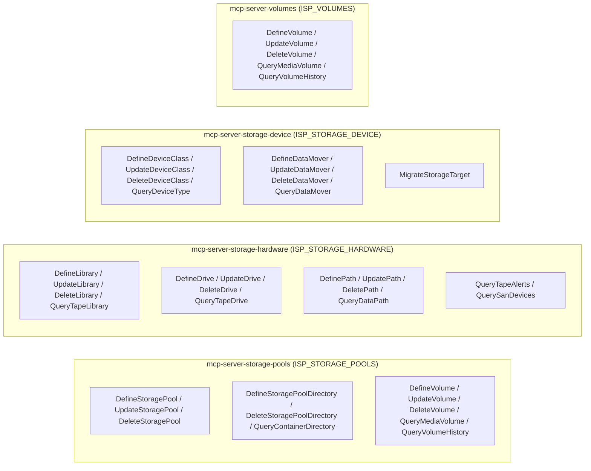

# Module Architecture: Storage

**Revision**: 2025-07 (Post-Remediation Verification & Alignment)  
**Cross-reference**: [`docs/architecture/architecture.md`](architecture.md) · [`docs/analysis/security-design-analysis.md`](../analysis/security-design-analysis.md)  
**Source reference**: `src/sp_mcp_server/commands/storage/` · `src/sp_mcp_server/server_groups.py`

---

## 1. Module Overview

The **Storage Module** manages the physical and logical storage infrastructure in IBM Storage Protect. This includes storage pools, directory containers, volumes, tape libraries, drives, data paths, device classes, and data movers.

It provides fine-grained control over:
- **Logical Storage Hierarchy**: Primary, copy, active-data, and directory container storage pools (`DEFINE STGPOOL`, `DEFINE STGPOOLDIR`).
- **Physical Tape & SAN Hardware**: Automated tape libraries (`3494`, `SCSI`), tape drives, paths, and library volume inventories (`CHECKIN`/`CHECKOUT LIBVOL`).
- **Device Classes & Data Movers**: Disk, file, and tape device classes (`DEVCLASS`), along with NAS and cloud data movers (`DATAMOVER`).
- **Volume Lifecycle & History**: Defining storage pool volumes, updating status (`READWRITE`, `READONLY`, `UNAVAILABLE`), and inspecting volume history (`QUERY VOLHIST`).

---

## 2. Micro-MCP Server Composition

The Storage domain is partitioned into four primary Micro-MCP servers:



---

## 3. Tool Catalog & SP Command Mappings

### 3.1 `mcp-server-storage-pools` (`ISP_STORAGE_POOLS`)

| MCP Tool Name | Command Class | Required Privilege | IBM Storage Protect Command | Description & Scope |
| :--- | :--- | :---: | :--- | :--- |
| `define_storage_pool` | `DefineStoragePool` | `storage` | `DEFINE STGPOOL <pool> <devclass> ...` | Creates a primary, copy, or container storage pool. |
| `update_storage_pool` | `UpdateStoragePool` | `storage` | `UPDATE STGPOOL <pool> ...` | Modifies reclamation thresholds, max scratch, or collocation. |
| `delete_storage_pool` | `DeleteStoragePool` | `storage` | `DELETE STGPOOL <pool>` | Deletes an empty storage pool. |
| `define_storage_pool_directory` | `DefineStoragePoolDirectory` | `storage` | `DEFINE STGPOOLDIR <pool> <dir>` | Adds a storage directory to a directory container pool. |
| `query_container_directory` | `QueryContainerDirectory` | `any` | `QUERY STGPOOLDIR [pool] [dir]` | Displays container directories and filesystem capacity. |
| `delete_storage_pool_directory` | `DeleteStoragePoolDirectory` | `storage` | `DELETE STGPOOLDIR <pool> <dir>` | Removes a directory from a container pool. |
| `query_storage_container` | `QueryStorageContainer` | `any` | `QUERY CONTAINER [container]` | Queries container details within directory pools. |
| `query_occupancy` | `QueryOccupancy` | `any` | `QUERY OCCUPANCY [node]` | Displays client occupancy within storage pools. |
| `define_volume` | `DefineVolume` | `storage` | `DEFINE VOLUME <pool> <vol>` | Adds a physical or pre-allocated volume to a storage pool. |
| `update_volume` | `UpdateVolume` | `storage` | `UPDATE VOLUME <pool> <vol> ACCESS=...` | Updates volume access mode (`READWRITE`, `READONLY`, `UNAVAILABLE`). |
| `delete_volume` | `DeleteVolume` | `storage` | `DELETE VOLUME <pool> <vol>` | Deletes an empty volume from a pool. |
| `query_media_volume` | `QueryMediaVolume` | `any` | `QUERY VOLUME [vol] FORMAT=DETAILED` | Displays volume utilization, status, and device class. |
| `update_volume_history` | `UpdateVolumeHistory` | `storage` | `UPDATE VOLHIST ...` | Updates administrative volume history records. |
| `query_mounted_volumes` | `QueryMountedVolumes` | `any` | `QUERY MOUNT` | Displays currently mounted tape and sequential volumes. |
| `query_volume_history` | `QueryVolumeHistory` | `any` | `QUERY VOLHIST [TYPE=...]` | Queries history of database backups, exports, and dump volumes. |

---

### 3.2 `mcp-server-storage-hardware` (`ISP_STORAGE_HARDWARE`)

| MCP Tool Name | Command Class | Required Privilege | IBM Storage Protect Command | Description & Scope |
| :--- | :--- | :---: | :--- | :--- |
| `define_library` | `DefineLibrary` | `storage` | `DEFINE LIBRARY <lib> LIBTYPE=...` | Defines automated or manual tape libraries (`SCSI`, `VTL`, `FILE`). |
| `update_library` | `UpdateLibrary` | `storage` | `UPDATE LIBRARY <lib> ...` | Modifies library configuration or reset parameters. |
| `delete_library` | `DeleteLibrary` | `storage` | `DELETE LIBRARY <lib>` | Deletes a library definition. |
| `query_tape_library` | `QueryTapeLibrary` | `any` | `QUERY LIBRARY [lib] FORMAT=DETAILED` | Queries library configuration and online status. |
| `define_drive` | `DefineDrive` | `storage` | `DEFINE DRIVE <lib> <drv> [ELEMENT=...]` | Adds a tape drive to an existing tape library. |
| `update_drive` | `UpdateDrive` | `storage` | `UPDATE DRIVE <lib> <drv> ONLINE=...` | Sets drive online/offline status or element address. |
| `delete_drive` | `DeleteDrive` | `storage` | `DELETE DRIVE <lib> <drv>` | Removes a tape drive definition. |
| `query_tape_drive` | `QueryTapeDrive` | `any` | `QUERY DRIVE [lib] [drv] FORMAT=DETAILED` | Displays tape drive operational and online status. |
| `define_path` | `DefinePath` | `storage` | `DEFINE PATH <src> <dest> SRCTYPE=...` | Configures SAN/SCSI communication path between server/data mover and library/drive. |
| `update_path` | `UpdatePath` | `storage` | `UPDATE PATH <src> <dest> SRCTYPE=...` | Modifies device special file path or online status. |
| `delete_path` | `DeletePath` | `storage` | `DELETE PATH <src> <dest> SRCTYPE=...` | Removes a hardware path. |
| `query_data_path` | `QueryDataPath` | `any` | `QUERY PATH [src] [dest] FORMAT=DETAILED` | Queries defined hardware paths and link statuses. |
| `query_tape_alerts` | `QueryTapeAlerts` | `any` | `QUERY TAPEALERT` | Queries SCSI tape alert error records. |
| `query_san_devices` | `QuerySanDevices` | `any` | `QUERY SAN` | Queries discovered Storage Area Network devices. |

---

### 3.3 `mcp-server-storage-device` (`ISP_STORAGE_DEVICE`)

| MCP Tool Name | Command Class | Required Privilege | IBM Storage Protect Command | Description & Scope |
| :--- | :--- | :---: | :--- | :--- |
| `define_device_class` | `DefineDeviceClass` | `storage` | `DEFINE DEVCLASS <devclass> DEVTYPE=...` | Configures device classes (e.g., `LTO`, `FILE`, `CLOUD`). |
| `update_device_class` | `UpdateDeviceClass` | `storage` | `UPDATE DEVCLASS <devclass> ...` | Updates device class parameters (capacity, mount limit). |
| `delete_device_class` | `DeleteDeviceClass` | `storage` | `DELETE DEVCLASS <devclass>` | Deletes an unused device class. |
| `query_device_type` | `QueryDeviceType` | `any` | `QUERY DEVCLASS [devclass] FORMAT=DETAILED` | Displays device class properties and device types. |
| `define_data_mover` | `DefineDataMover` | `storage` | `DEFINE DATAMOVER <mover> TYPE=...` | Defines an external NAS or cloud data mover. |
| `update_data_mover` | `UpdateDataMover` | `storage` | `UPDATE DATAMOVER <mover> ...` | Modifies data mover address or data formats. |
| `delete_data_mover` | `DeleteDataMover` | `storage` | `DELETE DATAMOVER <mover>` | Deletes a data mover. |
| `query_data_mover` | `QueryDataMover` | `any` | `QUERY DATAMOVER [mover]` | Displays configured data movers and connection parameters. |
| `migrate_storage_target` | `MigrateStorageTarget` | `storage` | `MIGRATE STGPOOL <pool> [LOWMIG=...]` | Triggers immediate storage pool migration to next tier. |

---

## 4. Operational Execution & Usage

### Running via Micro-MCP Servers
```bash
# Terminal 1: Storage pools, directories, and volumes
python3 -m sp_mcp_server.main_storage_pools

# Terminal 2: Tape libraries, drives, and data paths
python3 -m sp_mcp_server.main_storage_hardware

# Terminal 3: Device classes and data movers
python3 -m sp_mcp_server.main_storage_device
```

### Running via Unified Server
```bash
python3 -m sp_mcp_server.main --enable-servers storage
```
