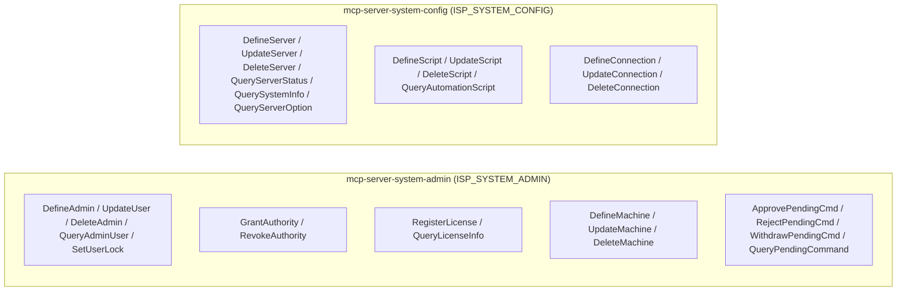

# Module Architecture: System

* **Revision**: 2025-07 (Post-Remediation Verification & Alignment)
* **Cross-reference**: [`docs/architecture/architecture.md`](architecture.md) · [`docs/analysis/security-design-analysis.md`](../analysis/security-design-analysis.md)
* **Source reference**: `src/sp_mcp_server/commands/system/` · `src/sp_mcp_server/server_groups.py`

---

## 1. Module Overview

The **System Module** provides administrative security management, global server settings, server-to-server relationships, command approval orchestration, automation scripts, and cloud connections.

It provides fine-grained control over:
- **Administrative Access Control**: Defining administrators (`REGISTER ADMIN`), updating accounts, granting and revoking SP privilege classes (`GRANT`/`REVOKE AUTHORITY`), and managing account locks (`LOCK`/`UNLOCK ADMIN`).
- **Two-Person Integrity & Command Approvals**: Approving, rejecting, or withdrawing pending destructive administrative commands (`APPROVE`/`REJECT`/`WITHDRAW PENDINGCMD`).
- **Global Server Infrastructure**: Defining servers (`DEFINE SERVER`), managing server licenses (`REGISTER LICENSE`), querying server status (`QUERY STATUS`), and querying system options (`QUERY OPTION`).
- **Automation & Connections**: Creating automation scripts (`DEFINE SCRIPT`) and cloud object storage connection profiles (`DEFINE CONNECTION`) with secure secret resolution.

---

## 2. Micro-MCP Server Composition

The System domain is partitioned into two Micro-MCP servers:



---

## 3. Tool Catalog & SP Command Mappings

### 3.1 `mcp-server-system-admin` (`ISP_SYSTEM_ADMIN`)

| MCP Tool Name | Command Class | Required Privilege | IBM Storage Protect Command | Description & Scope |
| :--- | :--- | :---: | :--- | :--- |
| `define_admin` | `DefineAdmin` | `system` | `REGISTER ADMIN <admin> <pwd> [CONTACT=...]` | Creates a new administrator account. Pre-validates password length against `MINPWLENGTH` and executes silently. |
| `update_user` | `UpdateUser` | `system` | `UPDATE ADMIN <user> [PASSWORD=...] [CONTACT=...]` | Updates administrator account attributes. Uses silent execution if a new password is provided. |
| `delete_admin` | `DeleteAdmin` | `system` | `REMOVE ADMIN <admin>` | Deletes an administrator account. |
| `query_admin_user` | `QueryAdminUser` | `any` | `QUERY ADMIN [admin] FORMAT=DETAILED` | Displays administrator accounts, granted privileges, session security, and contact info. |
| `set_user_lock` | `SetUserLock` | `system` | `LOCK ADMIN <admin>` / `UNLOCK ADMIN <admin>` | Locks or unlocks an administrator account. |
| `grant_authority` | `GrantAuthority` | `system` | `GRANT AUTHORITY <admin> CLASSES=...` | Grants administrative privilege classes (`SYSTEM`, `POLICY`, `STORAGE`, `OPERATOR`). |
| `revoke_authority` | `RevokeAuthority` | `system` | `REVOKE AUTHORITY <admin> CLASSES=...` | Revokes administrative privilege classes from an account. |
| `register_license` | `RegisterLicense` | `system` | `REGISTER LICENSE FILE=...` | Registers a software license certificate file with the server. |
| `query_license_info` | `QueryLicenseInfo` | `any` | `QUERY LICENSE` | Displays server licensing details and capacity authorizations. |
| `define_machine` | `DefineMachine` | `system` | `DEFINE MACHINE <machine> ...` | Registers a physical host or cluster machine. |
| `update_machine` | `UpdateMachine` | `system` | `UPDATE MACHINE <machine> ...` | Updates registered machine attributes. |
| `delete_machine` | `DeleteMachine` | `system` | `DELETE MACHINE <machine>` | Removes a registered machine definition. |
| `approve_pending_command` | `ApprovePendingCmd` | `system` | `APPROVE PENDINGCMD <cmd_id>` | Approves a destructive administrative command requiring two-person integrity. |
| `reject_pending_command` | `RejectPendingCmd` | `system` | `REJECT PENDINGCMD <cmd_id>` | Rejects and cancels a pending administrative command. |
| `withdraw_pending_command` | `WithdrawPendingCmd` | `any` | `WITHDRAW PENDINGCMD <cmd_id>` | Withdraws a pending command previously submitted by the requesting administrator. |
| `query_pending_command` | `QueryPendingCommand` | `any` | `QUERY PENDINGCMD` | Displays all commands currently waiting in the command approval queue. |

---

### 3.2 `mcp-server-system-config` (`ISP_SYSTEM_CONFIG`)

| MCP Tool Name | Command Class | Required Privilege | IBM Storage Protect Command | Description & Scope |
| :--- | :--- | :---: | :--- | :--- |
| `define_server` | `DefineServer` | `system` | `DEFINE SERVER <srv> [HLA=...] [LLA=...]` | Defines a remote Storage Protect server for server-to-server operations. |
| `update_server` | `UpdateServer` | `system` | `UPDATE SERVER <srv> ...` | Modifies connection address, password, or communication parameters. |
| `delete_server` | `DeleteServer` | `system` | `DELETE SERVER <srv>` | Deletes a defined remote server. |
| `query_server_status` | `QueryServerStatus` | `any` | `QUERY STATUS` | Queries global server settings, instance status, and `INVALIDPWLIMIT` lockout policy. |
| `query_system_info` | `QuerySystemInfo` | `any` | `QUERY SYSTEM` | Outputs comprehensive server environment and platform diagnostic information. |
| `query_server_option` | `QueryServerOption` | `any` | `QUERY OPTION [option]` | Inspects server configuration options (e.g., `MINPWLENGTH`, `EXPINTERVAL`). |
| `define_script` | `DefineScript` | `system` | `DEFINE SCRIPT <script> [FILE=...]` | Creates an automated administrative command script. |
| `update_script` | `UpdateScript` | `system` | `UPDATE SCRIPT <script> ...` | Modifies command script contents or sequence. |
| `delete_script` | `DeleteScript` | `system` | `DELETE SCRIPT <script>` | Deletes an administrative command script. |
| `query_automation_script` | `QueryAutomationScript` | `any` | `QUERY SCRIPT [script] FORMAT=DETAILED` | Displays script command definitions and lines. |
| `define_connection` | `DefineConnection` | `system` | `DEFINE CONNECTION <conn> CLOUDTYPE=...` | Configures a cloud object storage endpoint. Resolves secrets via keyring/env and executes silently. |
| `update_connection` | `UpdateConnection` | `system` | `UPDATE CONNECTION <conn> ...` | Updates cloud connection settings. Resolves secrets via keyring/env and executes silently. |
| `delete_connection` | `DeleteConnection` | `system` | `DELETE CONNECTION <conn>` | Deletes a cloud connection profile. |

---

## 4. Operational Execution & Usage

### Running via Micro-MCP Servers
```bash
# Terminal 1: Security, administrators, and command approvals
python3 -m sp_mcp_server.main_system_admin

# Terminal 2: Global server configuration, scripts, and cloud connections
python3 -m sp_mcp_server.main_system_config
```

### Running via Unified Server
```bash
python3 -m sp_mcp_server.main --enable-servers system
```
