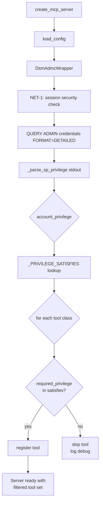
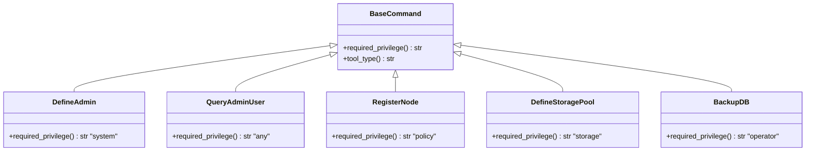
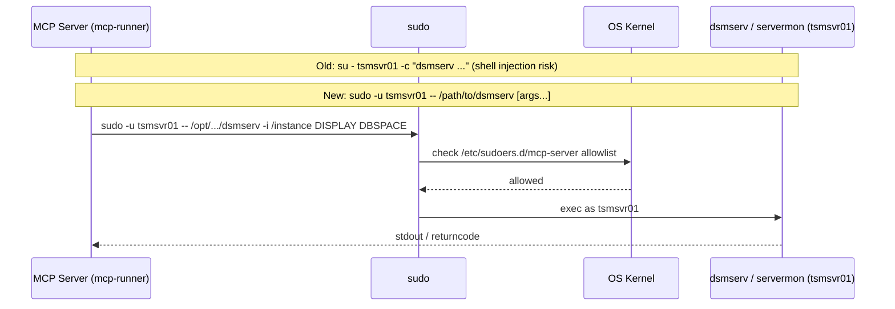

# Security Design: Access Management

* **Domain**: Access Management
* **Status**: Implemented baseline — static, dynamic-session, and OIDC call-time gates are present
* **Implementation spec**: [`docs/implement/impl-security-access.md`](../implement/impl-security-access.md)
* **Gaps closed**: A1, A2, A3, A4 (from [`docs/analysis/security-design-analysis.md`](../analysis/security-design-analysis.md))

---

## Overview

The implementation adds per-tool privilege annotations, static service-account tool registration filtering, dynamic-session privilege checks, OIDC call-time authorization, and replaces `su` with `sudo` to align with the sudoers allowlist model.

| Change | ID | Gaps closed |
|--------|-----|-------------|
| `required_privilege` property on all base command classes | ACC-1 | A1, A2 |
| Self-narrowing tool registration in `mcp_factory.py` | ACC-2 | A1, A2, A3 |
| Annotate all ~130 concrete command classes | ACC-3 | A2, A3 |
| Replace `su` with `sudo -u -- ` in `DsmServWrapper` / `ServermonWrapper` | ACC-4 | A4 |

---

## Architecture

### Privilege Hierarchy

IBM Storage Protect defines five privilege classes. The MCP server maps them to a hierarchy (narrowest → broadest):

```
any  <  operator  <  storage  <  policy  <  system
```

A service account at a given tier **satisfies** all tiers at or below it in the write direction:

| Account privilege | Satisfies | Does NOT satisfy |
|-------------------|-----------|-----------------|
| `system` | system, policy, storage, operator, any | — |
| `policy` | policy, any | system, storage, operator |
| `storage` | storage, any | system, policy, operator |
| `operator` | operator, any | system, policy, storage |
| `any` | any | system, policy, storage, operator |

### Tool Registration Flow (ACC-2)

The flow below describes service-account registration. Dynamic and OIDC modes add the call-time authorization gate in `handle_call_tool()`.



### Privilege Annotation on Command Classes (ACC-3)

Every concrete command class overrides `required_privilege`. The property is injected between `name` and `description` in each class:



### sudo-Based Privilege Escalation (ACC-4)



The `sudo` approach prevents shell-injection attacks that were possible with `su - user -c "joined_string"`. Each argument is passed directly to `exec()` without a shell.

---

## Required sudoers Rule

Deploy this file on each SP server at `/etc/sudoers.d/mcp-server`:

```bash
# /etc/sudoers.d/mcp-server
# Allows mcp-runner to run specific SP binaries as the instance user.
# Adjust paths to match your SP installation.

mcp-runner ALL=(tsmsvr01) NOPASSWD: /opt/tivoli/tsm/server/bin/dsmserv
mcp-runner ALL=(tsmsvr01) NOPASSWD: /opt/tivoli/tsm/server/bin/servermon
```

---

## Privilege Mapping by Command Group

### System commands

| Class | `required_privilege` |
|-------|---------------------|
| `DefineAdmin`, `UpdateUser`, `DeleteAdmin`, `SetUserLock` | `system` |
| `GrantAuthority`, `RevokeAuthority`, `RegisterLicense` | `system` |
| `DefineServer`, `UpdateServer`, `DeleteServer` | `system` |
| `DefineServerGroup`, `UpdateServerGroup`, `DeleteServerGroup` | `system` |
| `DefineGroupMember`, `DeleteGroupMember` | `system` |
| `DefineEventServer`, `DeleteEventServer` | `system` |
| `DefineConnection`, `UpdateConnection`, `DeleteConnection` | `system` |
| `DefineMachine`, `UpdateMachine`, `DeleteMachine` | `system` |
| `DefineScript`, `UpdateScript`, `DeleteScript` | `system` |
| `QueryAdminUser`, `QueryLicenseInfo`, `QueryServerStatus`, `QueryServerOption` | `any` |
| `QueryCatalog*`, `QuerySystemInfo`, `QueryMonitoring*` | `any` |
| `QueryRecoveryLog`, `QueryEnabled/EventRules/Receiver` | `any` |
| `QueryAutomationScript` | `any` |

### Client commands

| Class | `required_privilege` |
|-------|---------------------|
| `RegisterNode`, `RenameClient`, `UpdateNode`, `DeleteClient/Node` | `policy` |
| `DefineAssociation`, `DeleteAssociation` | `policy` |
| `DefineNodeGroup`, `DefineNodeGroupMember`, `UpdateNodeGroup`, `RemoveClientFromGroup`, `DeleteNodeGroup` | `policy` |
| `DefineClientOpt*`, `UpdateClientOpt*`, `UpdateProfile`, `DeleteClientOpt*` | `policy` |
| `SetClientLock` | `operator` |
| All `Query*` client commands | `any` |

### Storage commands

| Class | `required_privilege` |
|-------|---------------------|
| `DefineStoragePool`, `DefineStoragePoolDirectory`, `UpdateStoragePool/Target`, `DeleteStorage*` | `storage` |
| `DefineVolume`, `UpdateVolumeHistory`, `DeleteVolume` | `storage` |
| `DefineLibrary`, `UpdateLibrary`, `DeleteLibrary` | `storage` |
| `DefineDrive`, `UpdateDrive`, `DeleteDrive` | `storage` |
| `DefineDeviceClass`, `UpdateDeviceClass`, `DeleteDeviceClass` | `storage` |
| `DefineDataMover`, `UpdateDataMover`, `DeleteDataMover` | `storage` |
| `DefinePath`, `UpdatePath`, `DeletePath` | `storage` |
| `UpdateVolume` | `operator` |
| All `Query*` storage commands | `any` |

### Policy commands

| Class | `required_privilege` |
|-------|---------------------|
| `DefinePolicyDomain`, `UpdatePolicyDomain`, `UpdateObjectDomain`, `DeletePolicyDomain` | `policy` |
| `DefinePolicySet`, `UpdatePolicySet`, `ActivatePolicySet`, `ValidatePolicySet`, `DeletePolicySet` | `policy` |
| `DefineManagementClass`, `UpdateManagementClass`, `DeleteManagementClass`, `AssignDefMgmtClass` | `policy` |
| `DefineCopyGroup`, `UpdateCopyGroup`, `DeleteCopyGroup` | `policy` |
| `DefineSchedule`, `UpdateSchedule`, `DeleteSchedule` | `policy` |
| All `Query*` policy commands | `any` |

### Operations commands

| Class | `required_privilege` |
|-------|---------------------|
| `BackupDB`, `ProtectCatalog` | `operator` |
| `DefineAlertTrigger`, `UpdateAlertTrigger/Status`, `DeleteAlertTrigger` | `operator` |
| `DefineBackupSet`, `UpdateBackupSet`, `DeleteBackupSet` | `operator` |
| `DefineRecoveryMedia`, `UpdateRecoveryMedia`, `DeleteRecoveryMedia` | `operator` |
| `DefineScratchPadEntry`, `UpdateScratchPadEntry`, `DeleteScratchPadEntry` | `operator` |
| `MoveDataContainer`, `MoveClientData`, `MigrateStorageTarget`, `ReclaimStorageSpace` | `storage` |
| `UpdateCollocationGroup` | `storage` |
| `DefineStorageRule`, `UpdateStorageRule`, `DeleteStorageRule` | `storage` |
| `DefineSpaceTrigger`, `UpdateSpaceTrigger`, `DeleteSpaceTrigger` | `storage` |
| `DefineStatusThreshold`, `UpdateStatusThreshold`, `DeleteStatusThreshold` | `operator` |
| `DefineHold`, `DeleteHold`, `DefineRetentionRule` | `policy` |
| `DefineSubRule`, `UpdateSubRule`, `DeleteSubRule` | `policy` |
| `DefineClientAction` | `policy` |
| `DefineObjectDomain`, `DefineVirtualFSMapping`, `UpdateVirtualFSMapping`, `DeleteVirtualFSMapping` | `policy` |
| `RestoreDB`, `RestoreCatalog` | `system` |
| All `Query*` operations commands | `any` |

### Offline / Servermon

| Class | Base default |
|-------|-------------|
| `QueryOfflineDBSpace`, `QueryOfflineLog` | `system` (via `BaseOfflineCommand`) |
| `RunServerMon` | `operator` (via `BaseServermonCommand`) |

---

## Files Changed

| File | Change |
|------|--------|
| [`src/sp_mcp_server/commands/base.py`](../../src/sp_mcp_server/commands/base.py) | ACC-1: `required_privilege` property + `PRIVILEGE_TIERS` constant added to all three base classes |
| [`src/sp_mcp_server/mcp_factory.py`](../../src/sp_mcp_server/mcp_factory.py) | ACC-2: `_PRIVILEGE_SATISFIES`, `_parse_sp_privilege()`, privilege gate in `create_mcp_server()` |
| All `src/sp_mcp_server/commands/**/*.py` (41 files) | ACC-3: `required_privilege` injected into every concrete command class |
| [`src/sp_mcp_server/cli_wrapper.py`](../../src/sp_mcp_server/cli_wrapper.py) | ACC-4: `su` → `sudo -u <user> --` in `DsmServWrapper` and `ServermonWrapper` |
| [`tests/test_cli_wrapper.py`](../../tests/test_cli_wrapper.py) | Updated test assertions for sudo pattern |
| [`tests/test_core_components.py`](../../tests/test_core_components.py) | Updated test assertions for sudo pattern |

---

## Deployment Checklist

```
[ ] Deploy /etc/sudoers.d/mcp-server on each SP server
[ ] Verify: sudo visudo -cf /etc/sudoers.d/mcp-server (no syntax errors)
[ ] Verify: sudo -u tsmsvr01 /opt/.../dsmserv -? (runs without password prompt)
[ ] Confirm no su calls remain: grep -r "\"su\"" src/
[ ] Test read-only deployment: configure only SP_ADMIN_ID_READONLY,
    verify only Query* tools appear in tool list
[ ] Test system deployment: configure SP_ADMIN_ID_SYSTEM,
    verify all tools appear in tool list
```
