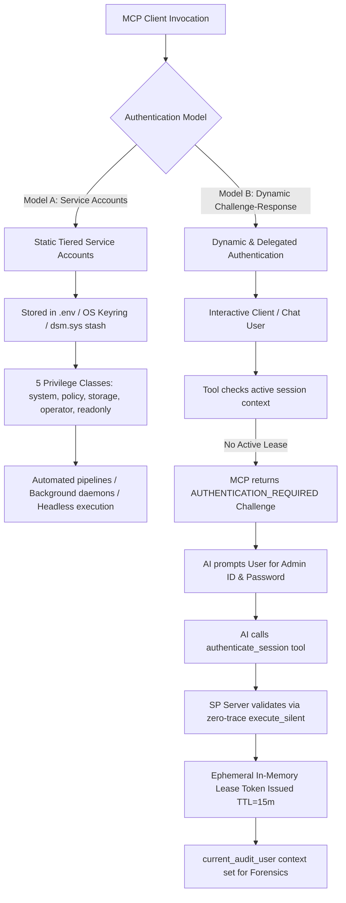
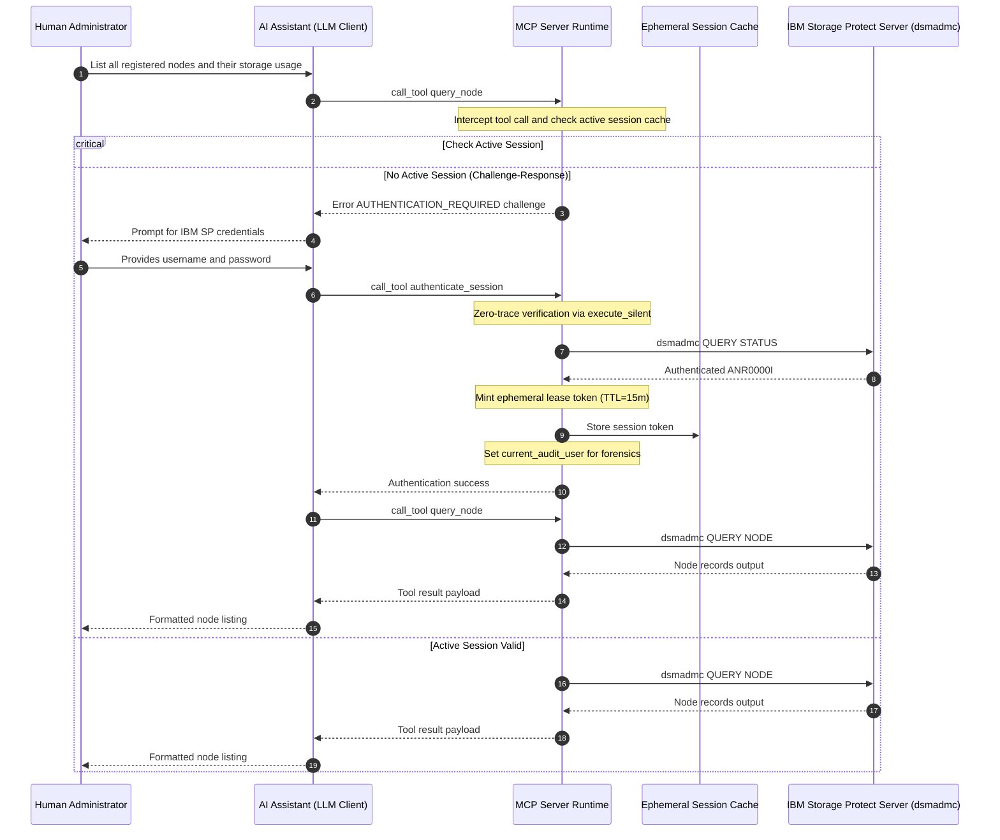

# Security Design: Dynamic & Delegated User Authentication

* **Domain**: Identity, Credentials & Delegated Authentication
* **Revision**: 2026-09 (Post-Audit Remediation — AUD-07, AUD-08, DAUTH-7 Closed)
* **Status**: Fully implemented and regression-tested — challenge, bounded leases, privilege enforcement, delegated execution, credential lifecycle zeroing, explicit logout, and target-server binding all present
* **Implementation spec**: [`docs/implement/impl-security-dynamic-authn.md`](../implement/impl-security-dynamic-authn.md)
* **Analysis reference**: [`docs/analysis/security-dynamic-authn-analysis.md`](../analysis/security-dynamic-authn-analysis.md) · [`docs/analysis/security-design-analysis.md`](../analysis/security-design-analysis.md)
* **Cross-reference**: [`docs/design/security-identity-credentials.md`](security-identity-credentials.md) · [`docs/design/security-integrations.md`](security-integrations.md) · [`docs/design/security-non-repudiation.md`](security-non-repudiation.md) · [`docs/design/security-access.md`](security-access.md) · [`docs/design/security-policy.md`](security-policy.md)
* **IBM Storage Protect Reference**: [`docs/reference/b_srv_admin_ref_linux.pdf`](../reference/b_srv_admin_ref_linux.pdf) (v8.1.26 Linux)

---

## 1. Overview & Problem Statement

In automated, production-grade AI assistant environments (e.g., Claude Desktop, web frontends, autonomous scripts), AI agents act directly on behalf of human administrators. However:
1. **Persistent Static Credentials in AI Chats Are Unsafe**: Large Language Models (LLMs) cannot securely hold persistent administrator passwords across sessions without risking credential exposure.
2. **Shared Service Accounts Obscure Individual Attribution**: While static 5-tier service accounts ([`security-identity-credentials.md`](security-identity-credentials.md)) isolate daemon privileges, end-user interactive sessions require direct verification of the requesting human administrator.
3. **Interactive Step-Up & Re-authentication**: Highly privileged actions require dynamic credential challenges and short-lived session authorization leases.

To address this, the IBM Storage Protect MCP Server defines **Dynamic Authentication (Challenge-Response)** as an alternative and complementary model alongside static tiered service accounts. The implementation verifies credentials, creates a bounded ephemeral lease, records the authenticated identity, enforces the lease privilege at tool invocation, and applies the delegated credentials to command execution.

---

## 2. Authentication Architecture Comparison

The MCP Server supports two primary operational authentication models:



### Model Comparison Matrix

| Feature | Model A: Tiered Service Accounts | Model B: Dynamic Challenge-Response |
|:---|:---|:---|
| **Primary Use Case** | Headless CI/CD, batch automation, cron jobs | Interactive AI chat (Claude Desktop, OpenWebUI), ad-hoc operations |
| **Credential Storage** | Local `.env` (0600), OS keyring, `dsm.sys` stash | Ephemeral in-memory lease; credentials provided at runtime by human |
| **Identity Attribution** | Service account name (`mcp-svc-*`) | Actual human administrator ID bound into `current_audit_user` and used for delegated command execution |
| **Session Lifetime** | Persistent daemon lifetime | Short-lived lease (15-minute sliding TTL, max 60 minutes) |
| **Transport Compatibility**| stdio, SSE, HTTP | stdio, SSE, HTTP |
| **MFA Compatibility** | Exemption with compensating controls (CRED-4) | Native SP password verification + potential MFA challenge |

---

## 3. Dynamic Challenge-Response Architecture

### 3.1 Interaction Sequence Diagram



---

## 4. Challenge Schema & Tool Design

### 4.1 Standardized Challenge Schema

When a tool requires authentication or step-up verification, it yields an error response structured to guide the AI assistant without revealing sensitive internal details:

```json
{
  "is_error": true,
  "error_type": "AUTHENTICATION_REQUIRED",
  "message": "Authentication required. Please provide your IBM Storage Protect administrator credentials.",
  "challenge": {
    "server": "tsm_server_01",
    "required_fields": ["username", "password"],
    "supported_schemes": ["basic_delegated", "oidc_bearer"],
    "auth_tool": "authenticate_session"
  }
}
```

### 4.2 `authenticate_session` Tool Interface

* **Tool Name**: `authenticate_session`
* **Access Class**: `any` (Available to all callers without prior authentication)
* **Schema Definition**:
  ```json
  {
    "name": "authenticate_session",
    "description": "Authenticate an interactive session with IBM Storage Protect administrator credentials to obtain a temporary lease.",
    "inputSchema": {
      "type": "object",
      "properties": {
        "username": {
          "type": "string",
          "description": "IBM Storage Protect administrator ID"
        },
        "password": {
          "type": "string",
          "description": "IBM Storage Protect administrator password"
        },
        "target_server": {
          "type": "string",
          "description": "Optional target server stanza name if multi-server routing is configured"
        }
      },
      "required": ["username", "password"]
    }
  }
  ```

### 4.3 Zero-Trace Credential Verification

In accordance with security requirement **CRED-2** and **RG-3**, the password supplied to `authenticate_session` must **never** be logged or passed to shell processes where it could be visible in process listings (`ps aux`) or file logs (`mcp-server.log`).

1. Credential validation uses `DsmAdmcWrapper.execute_silent()` — the command string and credentials are never written to any log handler.
2. The session lease retains the verified plaintext password in-memory for delegated command execution. `SessionLease.password` is set to `None` on every removal path — explicit `revoke_session()`, inactivity/absolute TTL expiry in `get_session()`, bulk `cleanup_expired()`, and `clear()` at shutdown (AUD-08).
3. Subsequent commands use `current_execution_credentials` to pass `(-ID=, -PA=)` arguments to `dsmadmc`, which are cleared in the `finally` block of `handle_call_tool()`.
4. **Target-server binding (DAUTH-7):** `_check_session_target_server()` validates `SessionLease.target_server` against `config.server_address` immediately after privilege confirmation. Mismatched sessions are rejected with `AUTHORIZATION_DENIED`; single-server deployments (no `target_server` set) are unaffected.
5. The `logout_session` tool (`required_privilege: any`) allows users to explicitly revoke their session before TTL expiry, zeroing the in-memory credential immediately.

---

## 5. Security & Forensic Alignment

### 5.1 Non-Repudiation Binding (NR-1 & POL-4)
When dynamic authentication succeeds:
1. The validated username is injected into `contextvars.ContextVar("current_audit_user")`.
2. All subsequent mutating commands executed during this session emit the user identity to the IBM Storage Protect Activity Log:
   ```
   DEFINE SCRATCHPADENTRY MCP_AUDIT DESCRIPTION="MCP_AUDIT user=admin_alice tool=delete_node priv=policy corr=e8f7a192b0c3"
   ```
3. This adds the human administrator to the SP audit correlation record and aligns the command execution context with the authenticated session.

### 5.2 Native Lockout Protection (POL-3)
Authentication attempts directly exercise the IBM Storage Protect authentication engine. Failed attempts increment the administrator's failed sign-on counter on the SP server, preserving native brute-force protection (`SET INVALIDPWLIMIT`).

---

## 6. Cross-References

* Analysis Document: [`docs/analysis/security-dynamic-authn-analysis.md`](../analysis/security-dynamic-authn-analysis.md)
* Implementation Specification: [`docs/implement/impl-security-dynamic-authn.md`](../implement/impl-security-dynamic-authn.md)
* Identity & Credentials Design: [`docs/design/security-identity-credentials.md`](security-identity-credentials.md)
* Integrations Design: [`docs/design/security-integrations.md`](security-integrations.md)
* Non-Repudiation Design: [`docs/design/security-non-repudiation.md`](security-non-repudiation.md)
* Access Management Design: [`docs/design/security-access.md`](security-access.md)
* Policy Management Design: [`docs/design/security-policy.md`](security-policy.md)
* Traceability Matrix: [`docs/traceability/traceability-matrix.md`](../traceability/traceability-matrix.md)
