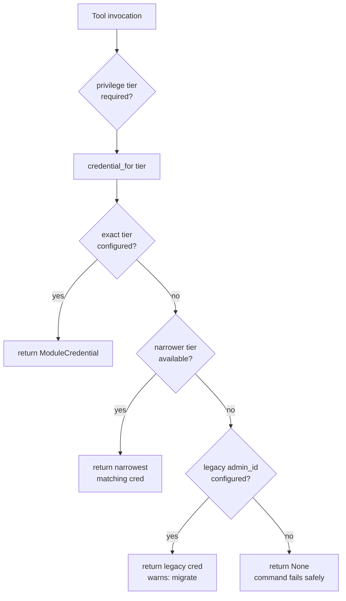
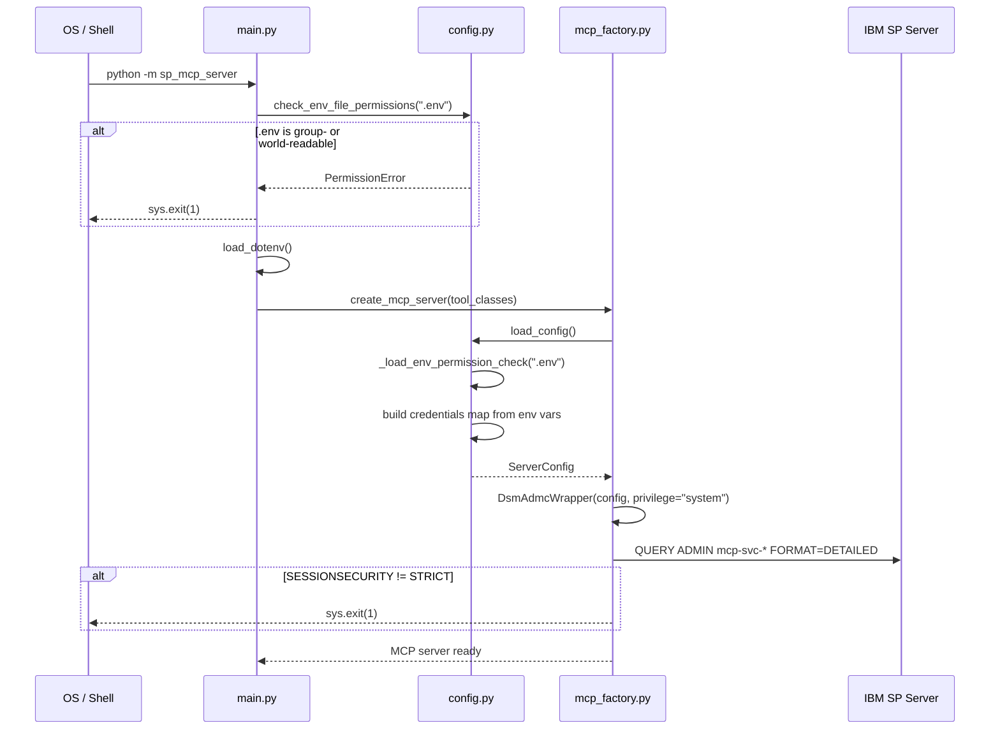
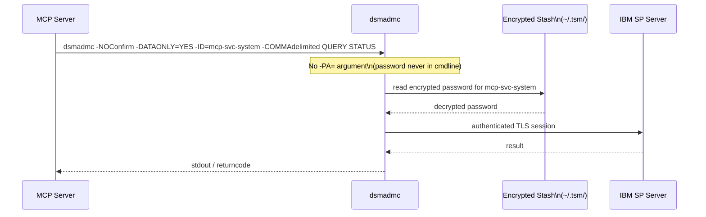
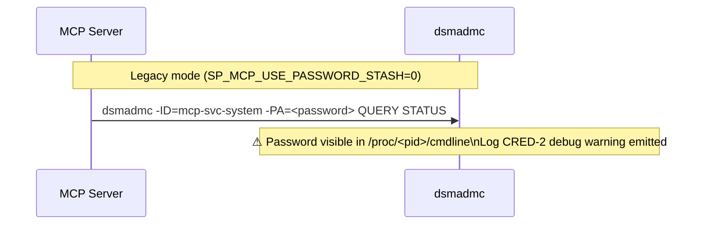
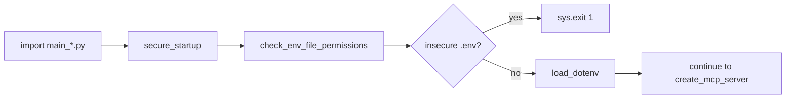
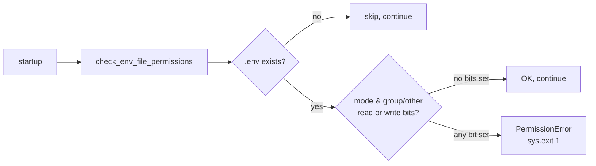

# Security Design: Identity & Credentials Management

* **Domain**: Identity & Credentials Management
* **Status**: Partially implemented — credential resolution and silent execution exist; entry-point coverage and delegated dynamic credentials remain open
* **Implementation spec**: [`docs/implement/impl-security-identity-credentials.md`](../implement/impl-security-identity-credentials.md)
* **Gaps closed**: I1, I2, I3, I4, I5, RG-2, RG-3 (from [`docs/analysis/security-design-analysis.md`](../analysis/security-design-analysis.md))

---

## Overview

The implementation adds five tiered service-account credentials, password-stash support, keyring-first resolution, and startup permission enforcement. The atomic `secure_startup()` helper is not yet used by every legacy entry point, and dynamic authentication currently verifies user credentials without using them for subsequent command execution. Refer to audit findings AUD-02, AUD-05, and AUD-07 before treating this domain as complete.

| Change | ID | Gaps closed |
|--------|-----|-------------|
| Per-privilege-class `ModuleCredential` map in `ServerConfig` | CRED-1 | I1, I5 |
| Remove `-PA=` from `dsmadmc` subprocess; use `PASSWORDACCESS GENERATE` stash | CRED-2 | I2 |
| `.env` file permission check at startup | CRED-3 | I3 |
| MFA exemption policy documented with compensating controls | CRED-4 | I4 |
| SP server provisioning script for five tiered accounts | CRED-5 | I1, I5 |
| `secure_startup()` atomic helper enforces CRED-3 across all entry points | CRED-3 / RG-2 | RG-2 |
| `_execute_silent_query()` in `BaseCommand`; password-bearing commands use it | RG-3 | RG-3 |

---

## Architecture

### Credential Resolution (CRED-1)



IBM Storage Protect defines five privilege classes. The MCP server maps each to a dedicated service account:

| SP Privilege Class | Service Account | MCP Server Module |
|--------------------|----------------|-------------------|
| System | `mcp-svc-system` | System administration |
| Policy | `mcp-svc-policy` | Policy management |
| Storage | `mcp-svc-storage` | Storage pool management |
| Operator | `mcp-svc-operator` | Operations |
| Any-admin (read-only) | `mcp-svc-readonly` | All query tools |

The privilege tier hierarchy, from narrowest to broadest:

```
any  <  operator  <  storage  <  policy  <  system
```

`credential_for(tier)` walks from the requested tier down to `any` and returns the first configured credential. This means a deployment that only configures `SP_ADMIN_ID_SYSTEM` can still serve all tools using that single system credential, while a deployment that configures all five tiers uses the narrowest one that satisfies each tool's requirement.

### Startup Sequence with Credential and Permission Checks (CRED-1, CRED-3)



### Password Stash Mode (CRED-2)

With `SP_MCP_USE_PASSWORD_STASH=1`, the `-PA=` argument is **omitted** from the `dsmadmc` subprocess call. IBM SP reads the password from the encrypted stash (stored under `~/.tsm/`) that was populated when `PASSWORDACCESS GENERATE` was active in `dsm.sys`.





### `secure_startup()` — Atomic Startup Guard (CRED-3 / RG-2)

`config.py` exports `secure_startup(env_path)` which combines `check_env_file_permissions()` and `load_dotenv()` in a single call. The primary entry point and a subset of domain entry points use it, but legacy `main*.py` entry points still use the separate two-call pattern. Source remediation must normalize the supported entry-point set before this control is described as universal.



The check is performed **three** times in total (defence in depth):
1. `secure_startup()` in each `main_*.py` — before any env var is read
2. `check_env_file_permissions()` in `main.py` (via `secure_startup()`) — primary entry point
3. `_load_env_permission_check()` inside `load_config()` — guard for any path that calls config directly

### Password-Bearing Command Silent Execution (RG-3)

`BaseCommand` gains `_execute_silent_query()` which calls `cli.execute_silent()` instead of `cli.execute()`. Commands that embed a password in the SP command string must use this helper:

| Command class | SP command | Method used |
|--------------|------------|-------------|
| `DefineAdmin` | `REGISTER ADMIN <name> <pwd>` | `_execute_silent_query` |
| `UpdateUser` (with password) | `UPDATE ADMIN <name> <pwd>` | `_execute_silent_query` |
| `RegisterNode` | `REGISTER NODE <name> <pwd> DOMAIN=` | `_execute_silent_query` |
| `UpdateNode` (with password) | `UPDATE NODE <name> <pwd>` | `_execute_silent_query` |
| All other commands | — | `_execute_simple_query` |

`UpdateUser` and `UpdateNode` fall back to `_execute_simple_query` when no password is in the call — contact-only or domain-only updates do not need silent execution.

### .env Permission Enforcement (CRED-3)



The check is performed **twice**:
1. In `main.py` **before** `load_dotenv()` — so the file is never read when permissions are wrong.
2. Inside `load_config()` — as a defence-in-depth guard for entry points that call `load_config()` directly.

---

## Environment Variable Reference

| Variable | Privilege tier | Purpose |
|----------|---------------|---------|
| `SP_ADMIN_ID_SYSTEM` | system | System-privilege service account ID |
| `SP_ADMIN_PASSWORD_SYSTEM` | system | Password (or omit when stash active) |
| `SP_ADMIN_ID_POLICY` | policy | Policy-privilege service account ID |
| `SP_ADMIN_PASSWORD_POLICY` | policy | Password |
| `SP_ADMIN_ID_STORAGE` | storage | Storage-privilege service account ID |
| `SP_ADMIN_PASSWORD_STORAGE` | storage | Password |
| `SP_ADMIN_ID_OPERATOR` | operator | Operator-privilege service account ID |
| `SP_ADMIN_PASSWORD_OPERATOR` | operator | Password |
| `SP_ADMIN_ID_READONLY` | any | Read-only service account ID |
| `SP_ADMIN_PASSWORD_READONLY` | any | Password |
| `SP_ADMIN_ID` | legacy | Deprecated; emits CRED-1 warning |
| `SP_ADMIN_PASSWORD` | legacy | Deprecated |
| `SP_MCP_USE_PASSWORD_STASH` | — | `1` = omit `-PA=`; use dsm.sys stash |

---

## MFA Exemption Policy (CRED-4)

IBM SP's `MFAREQUIRED=YES` requires a TOTP passcode on every interactive login. `dsmadmc` running non-interactively cannot satisfy a TOTP challenge. Service accounts are therefore explicitly set `MFAREQUIRED=NO`.

This is a **deliberate and documented** trade-off. Compensating controls are:

| Compensating control | Reference |
|---------------------|-----------|
| `SESSIONSECURITY=STRICT` (TLS 1.2+) enforced at startup | [`docs/design/security-network.md`](security-network.md) |
| Encrypted stash — password never on CLI | CRED-2 above |
| 30-day password expiration on service accounts | CRED-5 below |
| Account lockout after 5 failed attempts | `impl-security-policy.md § POL-3` |
| LDAP-backed service account passwords (optional) | `impl-security-integrations.md § INT-1` |

Human administrators must retain `MFAREQUIRED=YES`:

```
UPDATE ADMIN <human-admin-name> MFAREQUIRED=YES
```

---

## Service Account Provisioning (CRED-5)

The script [`scripts/provision-sp-service-accounts.sh`](../../scripts/provision-sp-service-accounts.sh) creates all five accounts on the SP server. It is idempotent — accounts that already exist receive `UPDATE ADMIN` rather than `REGISTER ADMIN`.

```mermaid
sequenceDiagram
    participant Ops as Operator (one-time)
    participant Script as provision-sp-service-accounts.sh
    participant SP as IBM SP Server

    Ops->>Script: export SP_ADMIN_ID, MCP_PWD_* ; bash provision-sp-service-accounts.sh
    loop for each tier (readonly, operator, storage, policy, system)
        Script->>SP: REGISTER ADMIN mcp-svc-<tier> <pwd>
        Script->>SP: GRANT AUTHORITY mcp-svc-<tier> CLASSES=<class>
        Script->>SP: UPDATE ADMIN mcp-svc-<tier> SESSIONSECURITY=STRICT PASSWORDEXPIRATION=30 MFAREQUIRED=NO
    end
    Script->>SP: QUERY ADMIN mcp-svc-* FORMAT=DETAILED
    SP-->>Script: verification output
    Script-->>Ops: Done. Populate dsm.sys stash next.
```

After provisioning, the stash must be populated once per account per SP server:

```bash
export DSM_CONFIG=/opt/sp-mcp-server/config/dsm.sys
# Populate stash interactively (one-time per account):
dsmadmc -id=mcp-svc-readonly -pa=<password> -se=SP_SERVER_1 "QUERY STATUS"
# Then verify stash works without -pa=:
dsmadmc -id=mcp-svc-readonly "QUERY STATUS"
# Once all accounts are stashed, enable stash mode:
echo "SP_MCP_USE_PASSWORD_STASH=1" >> /opt/sp-mcp-server/.env
```

---

## Files Changed

| File | Change |
|------|--------|
| [`src/sp_mcp_server/config.py`](../../src/sp_mcp_server/config.py) | CRED-1: `ModuleCredential`, per-module `credentials` map, `credential_for()`; CRED-3: `_load_env_permission_check()`, `check_env_file_permissions()`; **RG-2**: `secure_startup()` |
| [`src/sp_mcp_server/cli_wrapper.py`](../../src/sp_mcp_server/cli_wrapper.py) | CRED-1: `DsmAdmcWrapper` accepts `privilege` param; CRED-2: omits `-PA=` when stash active; ACC-4: `su` → `sudo -u -- ` in `DsmServWrapper` and `ServermonWrapper` |
| [`src/sp_mcp_server/commands/base.py`](../../src/sp_mcp_server/commands/base.py) | **RG-3**: `_execute_silent_query()` helper |
| [`src/sp_mcp_server/commands/system/admin.py`](../../src/sp_mcp_server/commands/system/admin.py) | **RG-3**: `DefineAdmin` and `UpdateUser` use `_execute_silent_query` |
| [`src/sp_mcp_server/commands/clients/node.py`](../../src/sp_mcp_server/commands/clients/node.py) | **RG-3**: `RegisterNode` and `UpdateNode` use `_execute_silent_query` |
| `src/sp_mcp_server/main.py` + supported domain entry points | **RG-2**: use `secure_startup()`; legacy entry points remain to be normalized |
| [`src/sp_mcp_server/mcp_factory.py`](../../src/sp_mcp_server/mcp_factory.py) | NET-1 check updated to iterate all configured accounts via `credential_for()` |
| `scripts/provision-sp-service-accounts.sh` (referenced, not present in audited tree) | CRED-5: deployment artifact required or documentation link must be corrected |
| [`tests/test_security_controls.py`](../../tests/test_security_controls.py) | **RG-6**: new — 36 automated security regression tests |
| [`tests/test_cli_wrapper.py`](../../tests/test_cli_wrapper.py) | Updated `su` → `sudo` assertions |
| [`tests/test_core_components.py`](../../tests/test_core_components.py) | Updated `su` → `sudo` assertions |

---

## Deployment Checklist

```
[ ] Run scripts/provision-sp-service-accounts.sh on each SP server
[ ] Verify QUERY ADMIN mcp-svc-* shows SESSIONSECURITY=Strict for all accounts
[ ] Populate dsm.sys stash for each service account (one-time interactive dsmadmc)
[ ] Set SP_MCP_USE_PASSWORD_STASH=1 in .env once stash is verified
[ ] Remove SP_ADMIN_PASSWORD_* from .env after stash is active
[ ] Set .env permissions: chmod 600 /opt/sp-mcp-server/.env
[ ] Set .env ownership: chown mcp-runner:mcp-runner /opt/sp-mcp-server/.env
[ ] Add sudoers entries for mcp-runner → dsmserv and servermon (if used)
[ ] Set SP_MCP_ENV=production in .env on all production hosts (RG-1)
[ ] Confirm SP_MCP_SKIP_SECURITY_CHECKS is NOT set in production .env (RG-1)
[ ] Verify no main_*.py directly calls load_dotenv() without secure_startup() (RG-2)
```
