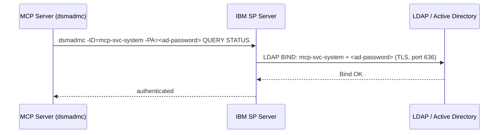
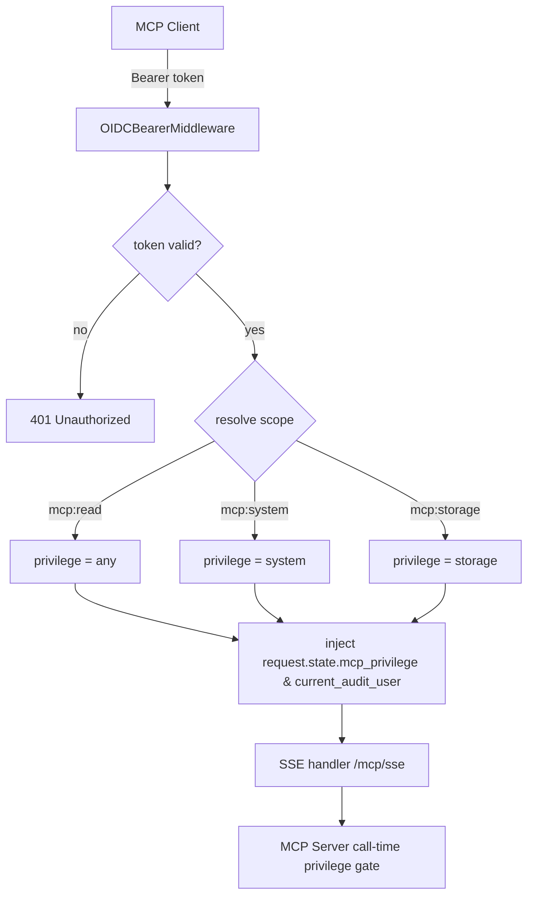
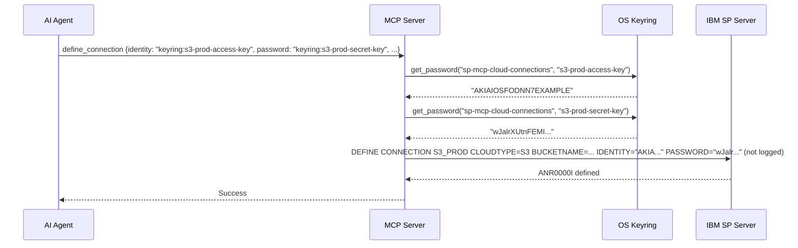
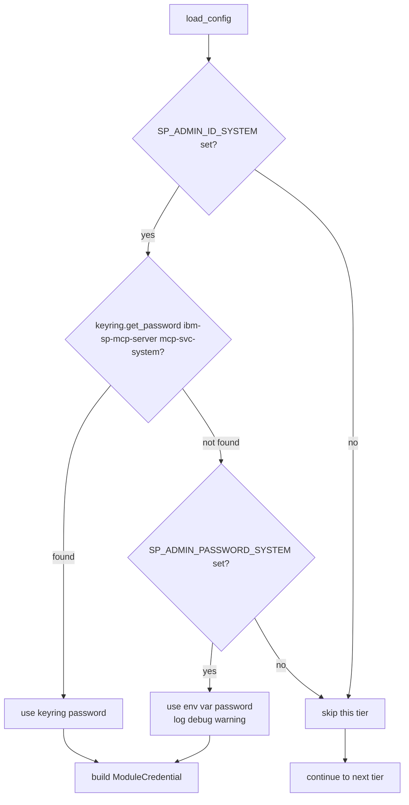

# Security Design: Secure Integrations

* **Domain**: Secure Integrations
* **Status**: Implemented baseline — token validation and call-time scope authorization are present
* **Implementation spec**: [`docs/implement/impl-security-integrations.md`](../implement/impl-security-integrations.md)
* **Gaps closed**: SI1, SI2, SI3, SI4, RG-5 (from [`docs/analysis/security-design-analysis.md`](../analysis/security-design-analysis.md))

---

## Overview

The integration work adds keyring-first credential resolution, secret references, OIDC bearer-token validation, HTTP TLS startup checks, and call-time enforcement of the mapped OIDC privilege.

| Change | ID | Gaps closed |
|--------|-----|-------------|
| LDAP authentication for SP service accounts (deployment runbook) | INT-1 | SI1 |
| OAuth 2.1 / OIDC HTTP/SSE transport (opt-in) | INT-2 | SI2 |
| Secrets-reference pattern in `define_connection` / `update_connection` | INT-3 | SI3 |
| `keyring`-first credential resolution in `config.py` | INT-4 | SI4 |
| TLS certificate/key presence enforced before HTTP transport binds | RG-5 | RG-5 |

---

## INT-1: LDAP Authentication for SP Service Accounts

This is a **server-side configuration change only** — no Python source code is modified.

When enabled, IBM SP delegates service account password verification to an LDAP/Active Directory server. The MCP server continues to use the same `SP_ADMIN_ID_*` / `SP_ADMIN_PASSWORD_*` environment variables, but those passwords are now the AD account passwords, governed by AD policy (automatic rotation, account disablement on HR offboarding, centralized MFA controls).



Deployment steps are documented in [`docs/implement/impl-security-integrations.md § INT-1`](../implement/impl-security-integrations.md).

---

## INT-2: OAuth 2.1 / OIDC HTTP/SSE Transport

The default stdio transport is local-only and has no client authentication. The opt-in HTTP transport (`--transport http`) wraps the MCP SSE handler in a Starlette app with OIDC bearer token middleware.

### Architecture



### Token scope → privilege mapping

| OIDC scope | Privilege tier | Tools accessible |
|------------|---------------|-----------------|
| `mcp:read` | `any` | All `QUERY` / read-only tools |
| `mcp:operator` | `operator` | Operator tools + read-only tools |
| `mcp:storage` | `storage` | Storage tools + read-only tools |
| `mcp:policy` | `policy` | Policy tools + read-only tools |
| `mcp:system` | `system` | All tools |

### Activation

```bash
# Start HTTP transport with OIDC (TLS required)
SP_OIDC_ISSUER=https://login.microsoftonline.com/<tenant>/v2.0 \
SP_OIDC_AUDIENCE=sp-mcp-server \
SP_TLS_CERT=/etc/certs/sp-mcp.crt \
SP_TLS_KEY=/etc/certs/sp-mcp.key \
python3 -m sp_mcp_server.main --transport http --port 8443
```

### TLS Enforcement (RG-5)

**RG-5 (closed)**: `main.py` now validates TLS certificate presence before binding the HTTP listener. Startup behaviour:

| `SP_TLS_CERT` / `SP_TLS_KEY` | `SP_MCP_ALLOW_HTTP_PLAINTEXT` | Result |
|------------------------------|-------------------------------|--------|
| Both set and files exist | (any) | ✅ TLS listener started |
| Missing or file not found | not set / `0` | ❌ `sys.exit(1)` with `SECURITY [RG-5]` error |
| Missing | `1` | ⚠ `ERROR` logged (`PRODUCTION UNSAFE`), plaintext HTTP started |

`SP_MCP_ALLOW_HTTP_PLAINTEXT=1` is a last-resort escape hatch for loopback-only test deployments — it always emits an `ERROR` log and must never be used in production.

### New file: [`src/sp_mcp_server/http_server.py`](../../src/sp_mcp_server/http_server.py)

Contains `OIDCBearerMiddleware`, `create_http_app()`, and `SCOPE_PRIVILEGE_MAP`.

---

## INT-3: Secrets-Reference Pattern for Cloud Credentials

### The problem

The `define_connection` tool previously accepted raw `identity` (Access Key ID) and `password` (Secret Access Key) as plain JSON string arguments — visible in:
- The MCP tool call payload
- The MCP server log (`_execute_simple_query` logs the command)
- The `dsmadmc` process argument list

### The solution: secrets references

Arguments are now opaque references resolved at execution time:

| Reference format | Resolution |
|-----------------|-----------|
| `keyring:<key-name>` | OS credential store (macOS Keychain, Linux Secret Service) |
| `env:MY_VAR` | Environment variable read at call time |
| *(literal)* | Passed as-is (warns in log) |



Credentials are **never logged** — `execute_silent()` was added to `DsmAdmcWrapper` for this purpose.

---

## INT-4: `keyring`-First Credential Resolution

### Resolution order in `load_config()`



### `.env` after keyring migration

Once credentials are stored in the OS keyring, `.env` only needs account IDs:

```dotenv
# .env — no passwords stored here
TCPSERVERADDRESS=sp-server-01.example.com
SP_SERVER_PORT=1500

SP_ADMIN_ID_READONLY=mcp-svc-readonly
SP_ADMIN_ID_OPERATOR=mcp-svc-operator
SP_ADMIN_ID_STORAGE=mcp-svc-storage
SP_ADMIN_ID_POLICY=mcp-svc-policy
SP_ADMIN_ID_SYSTEM=mcp-svc-system
```

### One-time keyring population

```bash
python3 << 'EOF'
import keyring
SERVICE = "ibm-sp-mcp-server"
for account in ["mcp-svc-readonly","mcp-svc-operator","mcp-svc-storage",
                "mcp-svc-policy","mcp-svc-system"]:
    import getpass
    pwd = getpass.getpass(f"Password for {account}: ")
    keyring.set_password(SERVICE, account, pwd)
    print(f"Stored: {account}")
EOF
```

---

## Files Changed

| File | Change |
|------|--------|
| [`src/sp_mcp_server/http_server.py`](../../src/sp_mcp_server/http_server.py) | INT-2 / NR-1: `OIDCBearerMiddleware`, `create_http_app()`, `SCOPE_PRIVILEGE_MAP`, sets `current_audit_user` ContextVar |
| [`src/sp_mcp_server/main.py`](../../src/sp_mcp_server/main.py) | INT-2: `--transport` and `--port` arguments; uvicorn HTTP startup branch; **RG-5**: TLS cert/key validation |
| [`src/sp_mcp_server/commands/system/conn.py`](../../src/sp_mcp_server/commands/system/conn.py) | INT-3: `_resolve_secret()`, updated `DefineConnection`/`UpdateConnection` |
| [`src/sp_mcp_server/cli_wrapper.py`](../../src/sp_mcp_server/cli_wrapper.py) | INT-3: `DsmAdmcWrapper.execute_silent()` |
| [`src/sp_mcp_server/config.py`](../../src/sp_mcp_server/config.py) | INT-4: `_get_password()`, keyring-first resolution in `load_config()` |

---

## Deployment Checklist

```
INT-1 (LDAP — optional):
  [ ] Install LDAP CA cert in IBM SP key database (dsmcert.kdb)
  [ ] SET LDAPURL, SET LDAPBINDDN, SET LDAPBINDPW, SET LDAPUSERDN on SP server
  [ ] UPDATE ADMIN mcp-svc-* AUTHENTICATION=LDAP
  [ ] Verify: QUERY ADMIN mcp-svc-* FORMAT=DETAILED | grep Authentication

INT-2 (HTTP transport — optional):
  [ ] Configure SP_OIDC_ISSUER and SP_OIDC_AUDIENCE in .env
  [ ] Provide SP_TLS_CERT=/path/to/cert.crt and SP_TLS_KEY=/path/to/key.key (RG-5)
  [ ] Confirm both files exist on the server filesystem before starting
  [ ] Start with: python3 -m sp_mcp_server.main --transport http --port 8443
  [ ] Test: curl -H "Authorization: Bearer <token>" https://sp-mcp-01:8443/health
  [ ] Never set SP_MCP_ALLOW_HTTP_PLAINTEXT=1 in production (RG-5)

INT-3 (Secrets references):
  [ ] Store cloud credentials in keyring under service 'sp-mcp-cloud-connections'
  [ ] Update all define_connection / update_connection tool calls to use 'keyring:<key>'
  [ ] Verify: execute_silent is used (no raw credential strings in logs)

INT-4 (keyring):
  [ ] Install keyring backend: pip install secretstorage (Linux) or use macOS Keychain
  [ ] Populate keyring: python3 << 'EOF' (see above)
  [ ] Remove SP_ADMIN_PASSWORD_* from .env after verification
  [ ] Verify: SP_ADMIN_PASSWORD_* env vars are unset; server starts successfully
```
