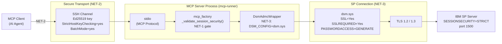
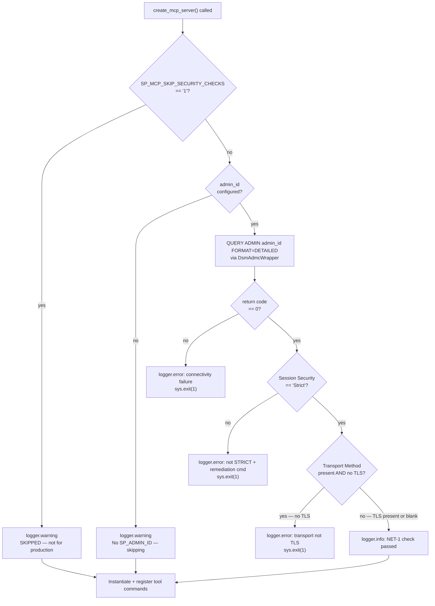
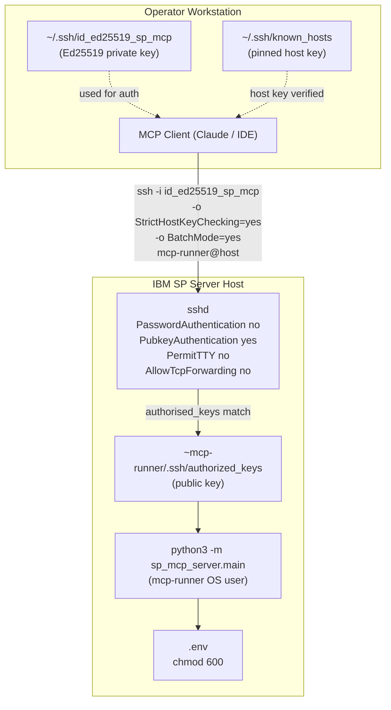
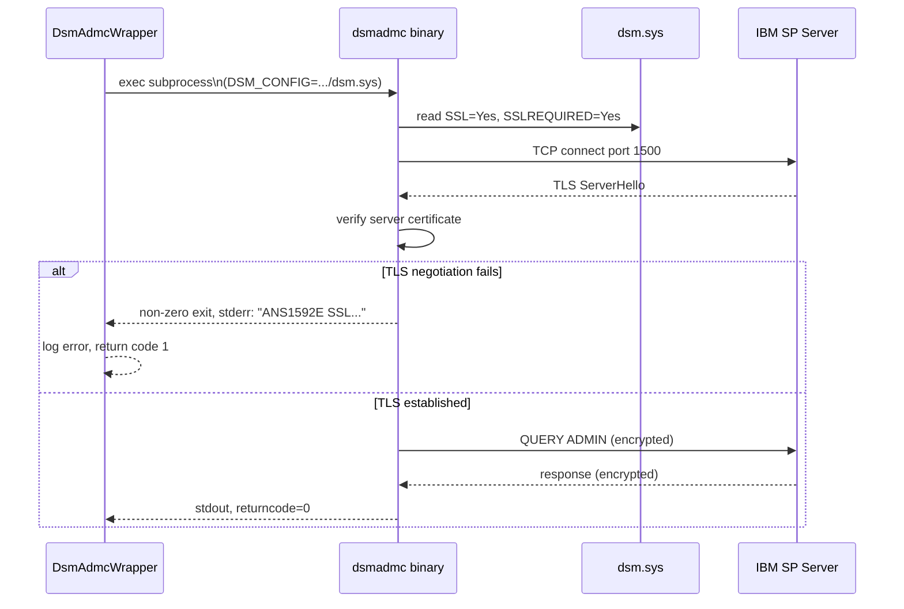
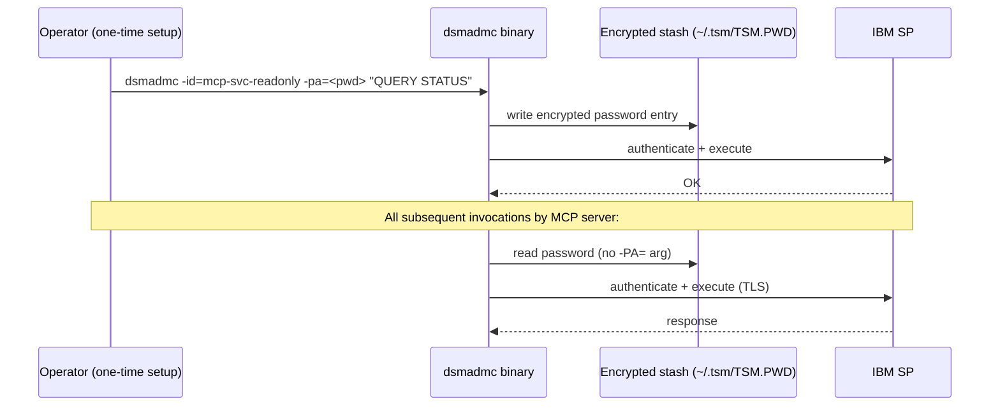
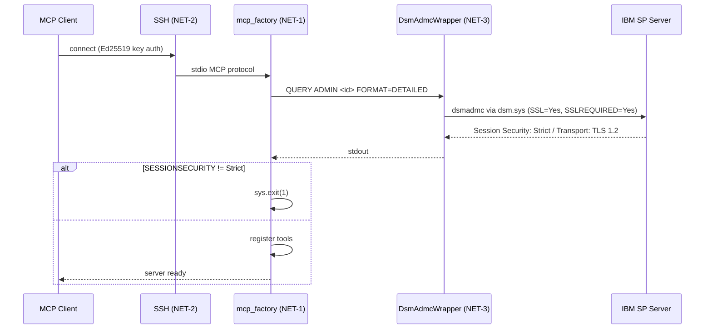

# Network Security Design

**Domain**: Network Security  
**Implemented in**: [`src/sp_mcp_server/mcp_factory.py`](../../src/sp_mcp_server/mcp_factory.py), [`config/dsm.sys.template`](../../config/dsm.sys.template), [`docs/guides/configure-guide.md`](../guides/configure-guide.md)  
**Analysis**: [`docs/analysis/security-design-analysis.md § 1`](../analysis/security-design-analysis.md)  
**Implementation spec**: [`docs/implement/impl-security-network.md`](../implement/impl-security-network.md)

---

## Overview

Three network-layer security controls are implemented. Together they ensure that every layer of the communication path — from the MCP client to the IBM SP server — is authenticated, encrypted, and verified before any administrative command is executed.

| Control | ID | What it closes |
|---------|----|----------------|
| Startup `SESSIONSECURITY=STRICT` validation | NET-1 | Gap N1: SP session security not validated |
| SSH key authentication for remote access | NET-2 | Gap N2: `sshpass` / MITM exposure |
| `dsm.sys` TLS enforcement for SP connection | NET-3 | Gap N3: No TLS cert validation on SP channel |

---

## Communication Path

The full request path from AI agent to IBM SP server, with all security controls in place:



---

## NET-1 — Startup Session Security Validation

### Design

On every call to `create_mcp_server()`, before any tool class is instantiated or registered, the factory queries IBM SP for the configured service account's session-security settings. If the account is not on `SESSIONSECURITY=STRICT` the process exits with a clear remediation message. This prevents the MCP server from ever operating over a downgraded or unencrypted connection.

### Decision flow



### IBM SP fields parsed

The check parses `QUERY ADMIN <id> FORMAT=DETAILED` output line by line using `key: value` splitting:

| Field | Required value | Failure action |
|-------|---------------|----------------|
| `Session Security` | `Strict` (case-insensitive) | `sys.exit(1)` |
| `Transport Method` | Must contain `TLS` if present | `sys.exit(1)` |

A blank `Transport Method` (SP version that does not report it) is accepted — the `Session Security: Strict` check is the hard gate.

### SP server prerequisite

```
UPDATE ADMIN mcp-svc-system   SESSIONSECURITY=STRICT
UPDATE ADMIN mcp-svc-storage  SESSIONSECURITY=STRICT
UPDATE ADMIN mcp-svc-policy   SESSIONSECURITY=STRICT
UPDATE ADMIN mcp-svc-operator SESSIONSECURITY=STRICT
UPDATE ADMIN mcp-svc-readonly SESSIONSECURITY=STRICT
```

Verify:
```
QUERY ADMIN mcp-svc-system FORMAT=DETAILED
```
Expected excerpt:
```
  Session Security: Strict
  Transport Method: TLS 1.2
```

### Env-var override (tests only) — RG-1 production guard

```
SP_MCP_SKIP_SECURITY_CHECKS=1
```

**RG-1 (closed)**: The override is now guarded by `SP_MCP_ENV`. Behaviour:

| `SP_MCP_SKIP_SECURITY_CHECKS` | `SP_MCP_ENV` | Result |
|-------------------------------|-------------|--------|
| not set | any | Normal — security checks run |
| `1` | not set / `test` / `dev` | `WARNING` logged; checks skipped (test/dev use) |
| `1` | `production` | `ERROR` logged; `sys.exit(1)` — startup aborted |

Set `SP_MCP_ENV=production` on all production hosts. This prevents a misconfigured or compromised `.env` from silently disabling all session security checks.

---

## NET-2 — SSH Key Authentication

### Design

The previous configuration used `sshpass -p <root_password>` with `StrictHostKeyChecking=no`. This exposed the root password in the MCP client config file, allowed man-in-the-middle attacks, and ran the server as root. NET-2 replaces this entirely.

### Component model



### Security properties

| Property | Old (`sshpass`) | New (NET-2) |
|----------|----------------|-------------|
| Authentication | Password on CLI, plaintext in JSON config | Ed25519 key, private key never transmitted |
| Host verification | `StrictHostKeyChecking=no` — disabled | `StrictHostKeyChecking=yes` + `known_hosts` pinning |
| OS user | `root` | `mcp-runner` (non-root, limited permissions) |
| Port forwarding | Not restricted | `AllowTcpForwarding no` |
| TTY | Not restricted | `PermitTTY no` |
| Password brute-force | Possible | `PasswordAuthentication no` — impossible |

### SSH options in MCP client config

```json
{
  "command": "ssh",
  "args": [
    "-i", "~/.ssh/id_ed25519_sp_mcp",
    "-o", "StrictHostKeyChecking=yes",
    "-o", "BatchMode=yes",
    "mcp-runner@your-sp-server",
    "cd /opt/sp-mcp-server && source .venv/bin/activate && python3 -m sp_mcp_server.main --mode read-only"
  ]
}
```

`BatchMode=yes` prevents SSH from prompting for a passphrase if the key file is missing — it fails closed instead.

---

## NET-3 — `dsm.sys` TLS Enforcement

### Design

IBM SP's `dsmadmc` binary reads client connection options from a `dsm.sys` file. Without this file, TLS is opt-in and the binary may silently fall back to unencrypted TCP. NET-3 ships a `dsm.sys.template` that enforces:

- `SSL=Yes` — use TLS for authentication (default from SP v8.1.2+, but made explicit)
- `SSLREQUIRED=Yes` — refuse to connect if TLS negotiation fails
- `PASSWORDACCESS=GENERATE` — store the password in an encrypted stash; no `-PA=` on CLI

### TLS negotiation flow



### `dsm.sys` template key settings

| Option | Value | Effect |
|--------|-------|--------|
| `SSL` | `Yes` | Enables TLS for all sessions |
| `SSLREQUIRED` | `Yes` | Hard-fails if TLS cannot be established |
| `PASSWORDACCESS` | `GENERATE` | Reads credentials from encrypted stash — eliminates `-PA=<password>` from subprocess args |
| `TCPPORT` | `1500` | Explicit SP admin port |
| `COMMMETHOD` | `TCPIP` | TCP/IP transport |

### Password stash — eliminating `-PA=` from process args



With `SP_MCP_USE_PASSWORD_STASH=1` set in `.env`, `DsmAdmcWrapper` omits `-PA=` from the subprocess argument list. The password is never visible in `/proc/<pid>/cmdline` or process listings.

---

## Interaction Between NET-1, NET-2, and NET-3



NET-2 secures the path from the AI agent to the MCP server. NET-3 secures the path from the MCP server to IBM SP. NET-1 verifies at startup that both the SP server and the service account are configured to meet the minimum TLS standard — and refuses to operate if they are not.

---

## Deployment Checklist

### RG-1: On all production hosts

```dotenv
# .env — required in production
SP_MCP_ENV=production
```

With `SP_MCP_ENV=production` set, attempting to start with `SP_MCP_SKIP_SECURITY_CHECKS=1` will abort startup with an ERROR.

### On the IBM SP server (one-time)

```
UPDATE ADMIN mcp-svc-system   SESSIONSECURITY=STRICT
UPDATE ADMIN mcp-svc-storage  SESSIONSECURITY=STRICT
UPDATE ADMIN mcp-svc-policy   SESSIONSECURITY=STRICT
UPDATE ADMIN mcp-svc-operator SESSIONSECURITY=STRICT
UPDATE ADMIN mcp-svc-readonly SESSIONSECURITY=STRICT
```

### On the SP server host OS (one-time)

```bash
# Create mcp-runner user
useradd -m -d /opt/sp-mcp-server -s /bin/bash mcp-runner

# Deploy SSH public key
mkdir -p /opt/sp-mcp-server/.ssh
chmod 700 /opt/sp-mcp-server/.ssh
# (copy public key to authorized_keys)
chmod 600 /opt/sp-mcp-server/.ssh/authorized_keys
chown -R mcp-runner:mcp-runner /opt/sp-mcp-server

# Restrict sshd for mcp-runner
# Add to /etc/ssh/sshd_config.d/mcp-runner.conf:
#   PasswordAuthentication no
#   PubkeyAuthentication yes
#   PermitTTY no
#   AllowTcpForwarding no
systemctl reload sshd

# Deploy dsm.sys from template
cp config/dsm.sys.template /opt/sp-mcp-server/config/dsm.sys
sed -i "s/your-sp-server/${SP_SERVER_ADDRESS}/" /opt/sp-mcp-server/config/dsm.sys
chmod 600 /opt/sp-mcp-server/config/dsm.sys

# Populate password stash (one-time per account)
export DSM_CONFIG=/opt/sp-mcp-server/config/dsm.sys
dsmadmc -id=mcp-svc-readonly -pa=<password> -se=SP_SERVER_1 "QUERY STATUS"
```

### In `.env`

```dotenv
TCPSERVERADDRESS=your-sp-server
SP_SERVER_PORT=1500
SP_ADMIN_ID=mcp-svc-readonly
SP_ADMIN_PASSWORD=<password>          # can be removed once stash is populated
SP_MCP_USE_PASSWORD_STASH=1           # enable after stash population
```

### On the operator workstation (one-time)

```bash
ssh-keygen -t ed25519 -f ~/.ssh/id_ed25519_sp_mcp -C "mcp-server-access" -N ""
ssh-copy-id -i ~/.ssh/id_ed25519_sp_mcp.pub mcp-runner@your-sp-server
ssh-keyscan -H your-sp-server >> ~/.ssh/known_hosts
```

---

## Related Documents

- Architecture overview: [`docs/architecture/architecture.md`](../architecture/architecture.md)
- Analysis (gaps N1–N3): [`docs/analysis/security-design-analysis.md § 1`](../analysis/security-design-analysis.md)
- Implementation spec: [`docs/implement/impl-security-network.md`](../implement/impl-security-network.md)
- Configuration guide: [`docs/guides/configure-guide.md`](../guides/configure-guide.md)
- `dsm.sys` template: [`config/dsm.sys.template`](../../config/dsm.sys.template)
