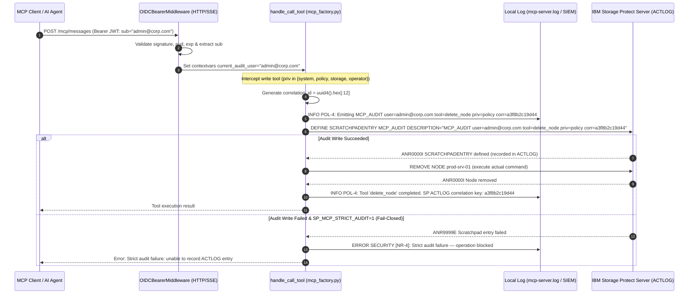

# Security Design: Non-Repudiation & Forensic Auditability

* **Domain**: Non-Repudiation & Forensic Auditability
* **Status**: Partially implemented — audit correlation controls exist; identity-to-execution binding and deployment controls require qualification
* **Implementation spec**: [`docs/implement/impl-security-non-repudiation.md`](../implement/impl-security-non-repudiation.md)
* **Analysis reference**: [`docs/analysis/security-design-analysis.md § 7`](../analysis/security-design-analysis.md)
* **Cross-reference**: [`docs/design/security-policy.md`](security-policy.md) · [`docs/design/security-integrations.md`](security-integrations.md)

---

## 1. Overview & Principles

Non-repudiation provides evidence linking an authenticated context to an administrative operation. In the current implementation, the recorded dynamic/OIDC identity can differ from the configured service account that executes the command; therefore the audit record is an attribution signal, not yet incontrovertible proof of credential-level actor identity.

To establish non-repudiation across the MCP Server architecture, the system enforces the **Five Forensic Dimensions**:

```
             +-------------------------------------------------------------+
             |                 THE 5 FORENSIC DIMENSIONS                   |
             +-------------------------------------------------------------+
             | 1. WHO     -> Authenticated End-User (OIDC sub) or Account |
             | 2. WHAT    -> MCP Tool Name, Parameters & SP CLI Command    |
             | 3. WHEN    -> Standardized ISO 8601 UTC Timestamp (Z)       |
             | 4. WHERE   -> Target SP Server, Remote Host & IP Address    |
             | 5. OUTCOME -> SP Return Code, Output Length & Error Detail  |
             +-------------------------------------------------------------+
```

---

## 2. Architecture & Dual-Layer Audit Model

The non-repudiation architecture links the stateless MCP tool layer to the enterprise IBM SP Activity Log via a bidirectional correlation token:



---

## 3. Implemented Controls & Gaps Resolution

| Control ID | Threat / Gap Addressed | Implemented Mechanism | Code Location |
|:---|:---|:---|:---|
| **NR-1** | **Identity Impersonation / Deniability**: Inability to determine human user behind shared SP service accounts | Current implementation propagates a dynamic/OIDC identity through `current_audit_user` and binds it into the scratchpad payload. This does not yet prove that the command executed under that identity; delegated credential binding remains open. | [`src/sp_mcp_server/mcp_factory.py:16`](../../src/sp_mcp_server/mcp_factory.py:16)<br>[`src/sp_mcp_server/http_server.py:144`](../../src/sp_mcp_server/http_server.py:144) |
| **NR-2** | **Log Tampering / Erasure**: Modification of local server log files | Guidance for forwarding logs to central SIEM (IBM QRadar Suite SIEM) over TLS and write-once WORM retention policies on host log files. | [`docs/implement/impl-security-non-repudiation.md`](../implement/impl-security-non-repudiation.md) |
| **NR-3** | **Reconnaissance Blindspots**: Unaudited read queries | Targeted diagnostic ACTLOG queries (`query_activity_log`) and guidance for selective high-sensitivity read auditing without log flooding. | [`src/sp_mcp_server/commands/operations/misc.py:104`](../../src/sp_mcp_server/commands/operations/misc.py:104) |
| **NR-4** | **Advisory Audit Bypass**: Unaudited operations executing when audit log write fails | Strict fail-closed audit option (`SP_MCP_STRICT_AUDIT=1`). When set, any scratchpad write failure aborts the administrative command immediately. | [`src/sp_mcp_server/mcp_factory.py:403`](../../src/sp_mcp_server/mcp_factory.py:403) |
| **NR-5** | **Timeline Skew / Clock Drift**: Ambiguous timestamps across multi-region environments | ISO 8601 UTC timestamp formatting (`%Y-%m-%dT%H:%M:%SZ`) enforced with `logging.Formatter.converter = time.gmtime`. | [`src/sp_mcp_server/mcp_factory.py:38`](../../src/sp_mcp_server/mcp_factory.py:38) |

---

## 4. Forensic Investigation Workflow

When conducting security forensics or compliance audits, investigators correlate artifacts across both layers:

### Step 1: Query SP Activity Log
Search for the audit marker or a specific correlation token:
```
QUERY ACTLOG SEARCH=MCP_AUDIT BEGINDATE=TODAY-30
QUERY ACTLOG SEARCH=corr=a3f8b2c19d44
```

### Step 2: Correlate with MCP Process Log
Search `/var/log/ibm-sp-mcp-server/mcp-server.log` or SIEM stream for the correlation ID:
```bash
grep "corr=a3f8b2c19d44" /var/log/ibm-sp-mcp-server/mcp-server.log
```

### Step 3: Verify Integrity & Attributed Identity
Match the following fields:
1. `user=<identity>` from the scratchpad description.
2. Exact parameters and execution timestamp from the local log.
3. Downstream SP command execution result (return code and output length).
