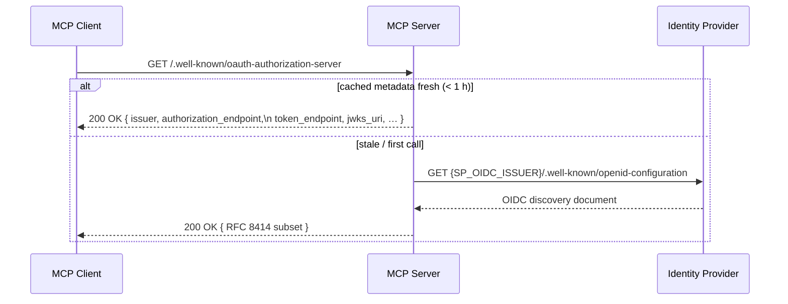
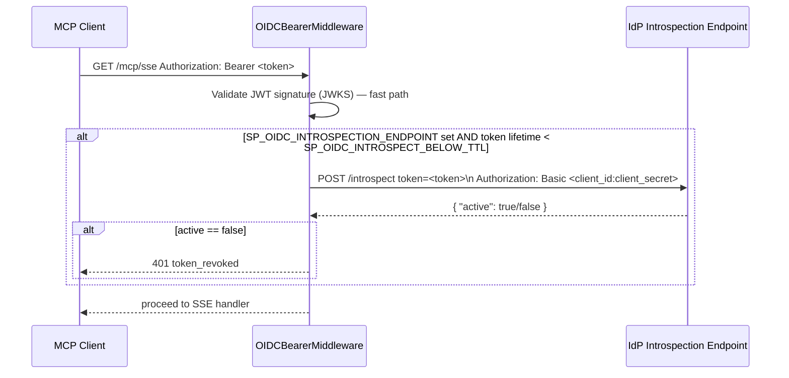
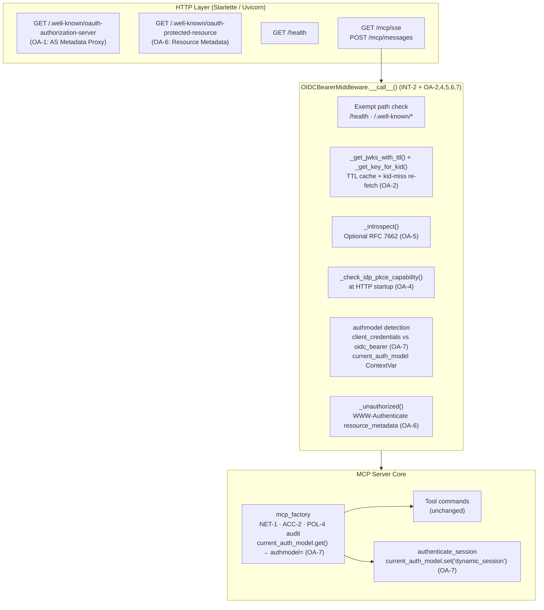

# Security Design: OAuth 2 Authorization for the MCP Server

* **Domain**: Secure Integrations — OAuth 2 / Authorization Server
* **Status**: Implemented — extends the INT-2 resource-server baseline
* **Revision**: 2026-10
* **Analysis reference**: [`docs/analysis/security-oauth2-analysis.md`](../analysis/security-oauth2-analysis.md)
* **Architecture reference**: [`docs/architecture/module-security.md`](../architecture/module-security.md)
* **Extends**: [`docs/design/security-integrations.md § INT-2`](security-integrations.md)
* **Implementation spec**: [`docs/implement/impl-security-oauth2.md`](../implement/impl-security-oauth2.md)
* **Cross-references**:
  [`docs/design/security-identity-credentials.md`](security-identity-credentials.md) ·
  [`docs/design/security-dynamic-authn.md`](security-dynamic-authn.md) ·
  [`docs/design/security-access.md`](security-access.md) ·
  [`docs/design/security-non-repudiation.md`](security-non-repudiation.md) ·
  [`docs/guides/local-idp-oauth2-guide.md`](../guides/local-idp-oauth2-guide.md) ·
  [`docs/guides/configure-guide.md`](../guides/configure-guide.md)

---

## 1. Overview & Requirements

The INT-2 baseline (implemented in `http_server.py`) established the MCP server as an **OIDC resource server**: it accepts bearer tokens, validates them against a remote IdP's JWKS endpoint, extracts scopes, and maps those scopes to SP privilege tiers. This document specifies the OAuth 2 authorization requirements (OA-1 through OA-7) that extend the INT-2 baseline:

| Requirement | Description | Standard |
|-------------|-------------|---------|
| **OA-1** | Expose `/.well-known/oauth-authorization-server` for dynamic client discovery | RFC 8414 · MCP 2025-03 |
| **OA-2** | JWKS cache with configurable TTL and `kid`-miss re-fetch with DoS rate limit | OIDC Core §10.1.1 |
| **OA-3** | Authorization Code + PKCE grant support for interactive clients | OAuth 2.1 §4.1 · RFC 7636 |
| **OA-4** | IdP PKCE capability check at startup — warn if S256 absent or `plain` present | OAuth 2.1 §4.1.1 |
| **OA-5** | Optional RFC 7662 token introspection for near-expiry revocation detection | RFC 7662 |
| **OA-6** | `/.well-known/oauth-protected-resource` route + `resource_metadata` in `WWW-Authenticate` | RFC 9470 |
| **OA-7** | `authmodel=` field in ACTLOG `DEFINE SCRATCHPADENTRY` to distinguish auth paths | NR-1 · NR-4 |

All requirements are implemented. The existing stdio transport, service-account model, and dynamic-auth session-lease implementation are unchanged.

---

## 2. OAuth 2 Role Model for the MCP Server

The MCP server participates in **two OAuth 2 roles simultaneously**:


The MCP server **never issues tokens** — it always delegates to an external IdP. Its resource-server role is:

1. Validate the bearer token (signature, expiry, audience, issuer).
2. Extract scopes and map to SP privilege tiers.
3. Advertise the IdP's metadata endpoint so compliant clients can discover the token endpoint automatically.
4. Rotate cached JWKS automatically when signing keys change.

---

## 3. Requirement Specifications

### OA-1 — Authorization Server Metadata Endpoint (RFC 8414 / MCP 2025-03)

**Requirement**: The MCP 2025-03 specification mandates that every HTTP MCP server expose `GET /.well-known/oauth-authorization-server` returning a JSON document that points clients to the real token endpoint.

**Design**: A lightweight metadata proxy route is registered in `create_http_app()`. It fetches the IdP's own `/.well-known/openid-configuration` once, selects the required RFC 8414 fields, and serves them from the MCP server's well-known path. The cache is shared with the JWKS machinery (OA-2) so only one network call is made at startup.



**Fields served** (RFC 8414 required + OIDC additions):

| Field | Source |
|-------|--------|
| `issuer` | `SP_OIDC_ISSUER` |
| `authorization_endpoint` | from IdP discovery |
| `token_endpoint` | from IdP discovery |
| `jwks_uri` | from IdP discovery |
| `response_types_supported` | `["code"]` |
| `grant_types_supported` | `["authorization_code", "client_credentials", "refresh_token"]` |
| `code_challenge_methods_supported` | `["S256"]` |
| `scopes_supported` | `["mcp:read", "mcp:operator", "mcp:storage", "mcp:policy", "mcp:system"]` |

**Implementation**: `_fetch_as_metadata(issuer)` in `http_server.py`. No new env var; reuses `SP_OIDC_ISSUER`.

---

### OA-2 — JWKS Key Rotation with TTL Cache + `kid`-Miss Re-fetch

**Requirement**: JWKS must be cached with a configurable TTL. When an IdP rotates its signing keys, the new key's `kid` will not appear in the current cache; an immediate re-fetch must be attempted before rejecting the token.

**Design**: Module-level cache globals replace the former instance-variable single-fetch. Two cooperating helpers manage the lifecycle:

- `_get_jwks_with_ttl(issuer, jwks_ttl)` — returns cached JWKS; refreshes when age exceeds `SP_OIDC_JWKS_TTL`.
- `_get_key_for_kid(issuer, jwks_ttl, kid)` — if `kid` is missing, forces an immediate bypass of the TTL. Re-fetches are rate-limited to one per 60 s (`_JWKS_REFETCH_RATELIMIT`) to prevent a forged-`kid` DoS. Each rate-limited miss is logged at `WARNING`.

```mermaid
flowchart TD
    A[Incoming bearer token] --> B[Decode JWT header — extract kid]
    B --> C{kid in\ncached JWKS?}
    C -- yes --> D[Validate token with cached key]
    C -- no --> E[_get_key_for_kid()\nrate-limited re-fetch]
    E --> F{kid found\nafter re-fetch?}
    F -- yes --> G[Update cache + validate]
    F -- no --> H[401 invalid_token\n'signing key not found']
    D --> I{Token valid?}
    G --> I
    I -- yes --> J[Inject privilege into request state]
    I -- no --> K[401 invalid_token]
```

**Cache policy**:

| Condition | Action |
|-----------|--------|
| `kid` in cache, age < `SP_OIDC_JWKS_TTL` | Use cached key |
| `kid` missing from cache | Immediate re-fetch (rate-limited) |
| Age ≥ `SP_OIDC_JWKS_TTL` | Background refresh on next request |
| Second miss within 60 s | Rate-limited; log `WARNING` |

**New env variable**: `SP_OIDC_JWKS_TTL` — integer seconds, default `3600`.

---

### OA-3 — Authorization Code + PKCE Grant Flow (Interactive Clients)

**Requirement**: Interactive clients cannot safely store a `client_secret`. They must use Authorization Code + PKCE (RFC 7636), which is mandatory in OAuth 2.1 for public clients.

**Design**: The MCP server does **not** implement the Authorization Code flow — that is the IdP's responsibility. The resource-server design work is:

1. The AS metadata endpoint (OA-1) advertises `code_challenge_methods_supported: ["S256"]`.
2. `OIDCBearerMiddleware` already accepts tokens from any grant type — only signature and claims are validated.
3. The `authmodel` label (OA-7) distinguishes Authorization Code tokens from `client_credentials` tokens in the audit trail.

**Token claim profile**:

| Claim | `client_credentials` token | Authorization Code token |
|-------|--------------------------|--------------------------|
| `sub` | client ID (e.g. `mcp-client`) | human user ID (e.g. `alice@corp.com`) |
| `preferred_username` | absent | present (human login name) |
| `scope` | requested `mcp:*` scopes | requested `mcp:*` scopes |
| `aud` | `SP_OIDC_AUDIENCE` | `SP_OIDC_AUDIENCE` |
| `azp` | client ID | client ID |

The `sub` claim from Authorization Code tokens is a human principal and must be bound to `current_audit_user` (NR-1). See OA-7.

Interactive client setup (Keycloak, `preferred_username` mapper, PKCE): [`docs/guides/local-idp-oauth2-guide.md`](../guides/local-idp-oauth2-guide.md).

---

### OA-4 — IdP PKCE Capability Check at Startup

**Requirement**: The resource server must verify at startup that the configured IdP advertises `code_challenge_methods_supported: ["S256"]`. If the IdP does not support PKCE S256 or advertises the insecure `plain` method, operators must be warned immediately.

**Design**: `_check_idp_pkce_capability(issuer)` is called once during HTTP startup in `main.py` immediately after `SP_OIDC_ISSUER` validation. It reuses the OA-1 metadata cache (no additional network call when cache is warm):

```python
# http_server.py
async def _check_idp_pkce_capability(issuer: str) -> None:
    try:
        meta    = await _fetch_as_metadata(issuer)
        methods = meta.get("code_challenge_methods_supported", [])
    except Exception as exc:
        logger.warning("OA-4: Could not fetch IdP metadata for PKCE check: %s", exc)
        return

    if "S256" not in methods:
        logger.warning(
            "OA-4: IdP at %s does not advertise PKCE S256 support. "
            "Authorization Code + PKCE flows for interactive clients may not work.", issuer
        )
    if "plain" in methods:
        logger.warning(
            "OA-4: IdP at %s advertises insecure PKCE 'plain' method. "
            "Ensure all clients use S256 only.", issuer
        )
    if "S256" in methods and "plain" not in methods:
        logger.info("OA-4: IdP PKCE capability check passed (S256 supported).")
```

---

### OA-5 — Token Introspection Support (RFC 7662)

**Requirement**: Tokens validated only via JWKS remain valid until `exp` even after revocation. Token introspection allows the resource server to check live revocation status.

**Design**: An **optional** introspection step is added to `OIDCBearerMiddleware.__call__()`. It is only invoked when `SP_OIDC_INTROSPECTION_ENDPOINT` is set **and** the token's remaining lifetime (`exp − now`) is below `SP_OIDC_INTROSPECT_BELOW_TTL` (default 300 s). This threshold policy avoids a per-request network call for long-lived tokens.



**Fail-open policy**: If the introspection endpoint is unreachable, the middleware logs `ERROR` and allows the request. An IdP outage must not lock all users out. Deployments requiring fail-closed must enforce introspection at a reverse-proxy layer.

**New env variables**:

| Variable | Default | Description |
|----------|---------|-------------|
| `SP_OIDC_INTROSPECTION_ENDPOINT` | unset (disabled) | RFC 7662 introspection URL |
| `SP_OIDC_INTROSPECTION_CLIENT_ID` | `SP_OIDC_AUDIENCE` | Client ID for introspection Basic auth |
| `SP_OIDC_INTROSPECTION_CLIENT_SECRET` | unset | Client secret — store in OS keyring (INT-4) |
| `SP_OIDC_INTROSPECT_BELOW_TTL` | `300` | Introspect tokens with < N seconds remaining lifetime |

---

### OA-6 — RFC 9470 Protected Resource Metadata + `resource_metadata` Header

**Requirement**: RFC 9470 requires that a resource server's `401 Unauthorized` response include a `resource_metadata` URI pointing to the resource server's protected-resource metadata document, enabling automatic AS discovery by standards-compliant clients.

**Design** — two coordinated additions:

**Route `GET /.well-known/oauth-protected-resource`**: Served by `_protected_resource_doc(public_url, issuer)`, returning the RFC 9470 document:

```json
{
  "resource": "https://<SP_MCP_PUBLIC_URL>",
  "authorization_servers": ["<SP_OIDC_ISSUER>"],
  "scopes_supported": ["mcp:read", "mcp:operator", "mcp:storage", "mcp:policy", "mcp:system"],
  "bearer_methods_supported": ["header"]
}
```

**`_unauthorized(error, message)` helper**: All `401` responses are built via this method. When `SP_MCP_PUBLIC_URL` is set, the `WWW-Authenticate` header includes:
```
WWW-Authenticate: Bearer realm="sp-mcp-server",
                  resource_metadata="https://sp-mcp.example.com:8443/.well-known/oauth-protected-resource"
```

**New env variable**: `SP_MCP_PUBLIC_URL` — externally reachable MCP server base URL. Must not be `localhost` or an address unreachable by MCP clients. If unset, the `resource_metadata` parameter is omitted from `WWW-Authenticate`.

---

### OA-7 — Unified Auth Model Attribution in ACTLOG

**Requirement**: `current_audit_user` is populated from two different sources — `payload["sub"]` for OIDC bearer tokens (Model A) and the username from `authenticate_session` (Model B). An auditor reading `user=mcp-client` cannot tell which model was used. The ACTLOG record must carry the `authmodel` field.

**Design** — three coordinated changes:

**`current_auth_model` ContextVar** in `mcp_factory.py`: A `ContextVar[str]` with default `"local"` carries the authentication model for the current request:

| Token origin | `authmodel` value |
|-------------|------------------|
| `client_credentials` JWT (`preferred_username` absent) | `client_credentials` |
| Authorization Code JWT (`preferred_username` present) | `oidc_bearer` |
| `authenticate_session` tool (Model B) | `dynamic_session` |
| stdio transport (no auth) | `local` |

**`OIDCBearerMiddleware.__call__()`**: After successful JWT validation, determines `auth_model` by checking for `preferred_username` in the payload, sets `scope["state"]["mcp_auth_model"]`, and sets the `current_auth_model` ContextVar. The ContextVar is reset in the `finally` block to prevent cross-request leakage.

**`authenticate_session.execute()`**: After issuing the ephemeral lease, calls `current_auth_model.set("dynamic_session")`.

**`handle_call_tool()`**: Reads `current_auth_model.get()` and includes `authmodel=<value>` in the `DEFINE SCRATCHPADENTRY MCP_AUDIT` description:

```
# client_credentials machine token
MCP_AUDIT user=mcp-client    authmodel=client_credentials  tool=query_status  priv=any    corr=3a9f1c00

# Authorization Code interactive user
MCP_AUDIT user=alice@corp    authmodel=oidc_bearer          tool=delete_node   priv=policy corr=e8f7a192

# Dynamic challenge-response session
MCP_AUDIT user=alice         authmodel=dynamic_session      tool=delete_node   priv=policy corr=c3b2a191

# stdio / local (no HTTP auth)
MCP_AUDIT user=local         authmodel=local                tool=query_status  priv=any    corr=5b2d9e04
```

---

## 4. Component Architecture



---

## 5. Token Validation Decision Flow

```mermaid
flowchart TD
    A[Incoming request to /mcp/*] --> B{Authorization\nheader present?}
    B -- no --> C["401 + WWW-Authenticate\nBearer realm + resource_metadata (OA-6)"]
    B -- yes --> D[Extract bearer token]
    D --> E[Decode JWT header — get kid + alg]
    E --> F{kid in\nJWKS cache?}
    F -- no --> G[_get_key_for_kid()\nrate-limited re-fetch (OA-2)]
    G --> H{kid found?}
    H -- no --> I[401 invalid_token\nsigning key not found]
    H -- yes --> J
    F -- yes --> J[Verify JWT: sig, exp, aud, iss, scope]
    J --> K{JWT valid?}
    K -- no --> L[401 invalid_token]
    K -- yes --> M{SP_OIDC_INTROSPECTION\n_ENDPOINT set AND\nttl < threshold?}
    M -- no --> N[Map scopes → privilege]
    M -- yes --> O[_introspect() OA-5]
    O --> P{active == true?}
    P -- no --> Q[401 token_revoked]
    P -- yes --> N
    N --> R[Detect authmodel\npreferred_username? → oidc_bearer\nelse client_credentials (OA-7)]
    R --> S[Inject privilege + subject + auth_model\nSet current_auth_model ContextVar (OA-7)]
    S --> T[Call next handler]
```

---

## 6. Environment Variable Reference

| Variable | Required | Default | Description |
|----------|----------|---------|-------------|
| `SP_OIDC_ISSUER` | Yes (HTTP) | — | OIDC issuer / AS base URL (existing) |
| `SP_OIDC_AUDIENCE` | No | `sp-mcp-server` | Token audience claim (existing) |
| `SP_TLS_CERT` / `SP_TLS_KEY` | Yes (HTTP) | — | TLS cert/key for HTTPS (existing, RG-5) |
| `SP_OIDC_JWKS_TTL` | No | `3600` | JWKS cache lifetime in seconds (OA-2) |
| `SP_OIDC_INTROSPECTION_ENDPOINT` | No | unset | RFC 7662 introspection URL (OA-5) |
| `SP_OIDC_INTROSPECTION_CLIENT_ID` | No | `SP_OIDC_AUDIENCE` | Introspection Basic-auth client ID (OA-5) |
| `SP_OIDC_INTROSPECTION_CLIENT_SECRET` | No | unset | Introspection client secret — store in keyring (OA-5) |
| `SP_OIDC_INTROSPECT_BELOW_TTL` | No | `300` | Introspect tokens with < N seconds remaining (OA-5) |
| `SP_MCP_PUBLIC_URL` | No | derived from bind | MCP server public base URL for RFC 9470 metadata (OA-6) |

---

## 7. Security Considerations

### 7.1 Scope Elevation Prevention

The privilege mapping resolves the **highest** scope present in the token. A token carrying both `mcp:read` and `mcp:system` is treated as `system`. Clients should request only the scopes they need — see [`docs/guides/configure-guide.md`](../guides/configure-guide.md).

### 7.2 Token Leakage via Logs

The bearer token string must never appear in any log output. `OIDCBearerMiddleware.__call__()` must not log the raw `Authorization` header. The existing `execute_silent()` pattern in `BaseCommand` covers SP command credentials; this principle is extended to HTTP headers.

### 7.3 JWKS Re-fetch DoS

An attacker who can forge a JWT with an unknown `kid` could trigger a JWKS re-fetch on every request. Mitigations:
- Re-fetches rate-limited to at most one per 60 seconds regardless of `kid`-miss frequency.
- `kid`-miss frequency logged at `WARNING` for SIEM detection.

### 7.4 Introspection Credential Handling

`SP_OIDC_INTROSPECTION_CLIENT_SECRET` is a sensitive credential. It must be stored in the OS keyring (INT-4 pattern) or sourced from an `env:` reference. It must not appear in the `.env` file in plaintext in production.

### 7.5 Public URL Exposure

`SP_MCP_PUBLIC_URL` is served in the protected-resource metadata document. It must reflect the externally reachable address of the MCP server — not `localhost` or an internal hostname not resolvable by MCP clients.

---

## 8. Deployment Checklist

```
OA-1 (AS Metadata):
  [x] SP_OIDC_ISSUER is set and IdP is reachable at startup
  [x] GET /.well-known/oauth-authorization-server returns 200 with token_endpoint and jwks_uri
  [x] MCP client can discover token_endpoint from the MCP server URL alone

OA-2 (JWKS rotation):
  [x] SP_OIDC_JWKS_TTL set to match IdP key rotation policy (recommend 3600)
  [x] Force a key rotation on a test IdP and verify tokens validate after rotation
      without server restart

OA-3/OA-4 (PKCE):
  [x] Startup log shows no OA-4 warning for S256 missing
  [x] No "plain" challenge method advertised by IdP
  [x] Interactive client (Claude Desktop) obtains token via Authorization Code + PKCE
      and successfully calls /mcp/sse

OA-5 (Introspection — optional):
  [x] SP_OIDC_INTROSPECTION_ENDPOINT set if revocation speed is required
  [x] SP_OIDC_INTROSPECTION_CLIENT_SECRET stored in keyring, not .env
  [x] Revoke a token at the IdP and confirm the MCP server returns 401 within
      SP_OIDC_INTROSPECT_BELOW_TTL seconds

OA-6 (RFC 9470 resource metadata):
  [x] SP_MCP_PUBLIC_URL set to the externally reachable MCP server URL
  [x] GET /.well-known/oauth-protected-resource returns 200
  [x] 401 response includes resource_metadata URI

OA-7 (Auth model binding):
  [x] ACTLOG entries for client_credentials tokens show authmodel=client_credentials
  [x] ACTLOG entries for interactive user tokens show authmodel=oidc_bearer
      and sub=<human principal>
  [x] ACTLOG entries for dynamic-session tools show authmodel=dynamic_session
```

---

## 9. Relationship to Existing Design Documents

| Existing control | Interaction |
|-----------------|-------------|
| INT-2 (`OIDCBearerMiddleware`) | Extended by OA-2, OA-4, OA-5, OA-6, OA-7 — additive only; no interface changes |
| DAUTH (`authenticate_session`) | OA-7 adds `authmodel=dynamic_session` to ACTLOG records; session-lease logic unchanged |
| NR-1 (identity binding) | OA-7 enriches ACTLOG with `authmodel`; closes forensic gap in cross-model attribution |
| CRED-3 (`.env` permissions) | `SP_OIDC_INTROSPECTION_CLIENT_SECRET` follows the same `0600` / keyring-first rule |
| RG-5 (TLS enforcement) | Unchanged; all new endpoints served over the same TLS listener |
| NET-1 (session security) | Unchanged; OIDC bearer path does not bypass the SP session-security startup check |

---

## 10. Related Documents

- Requirement analysis: [`docs/analysis/security-oauth2-analysis.md`](../analysis/security-oauth2-analysis.md)
- Module architecture: [`docs/architecture/module-security.md`](../architecture/module-security.md)
- Implementation specification: [`docs/implement/impl-security-oauth2.md`](../implement/impl-security-oauth2.md)
- Existing integrations design: [`docs/design/security-integrations.md`](security-integrations.md)
- Local IdP guide (Keycloak + PKCE): [`docs/guides/local-idp-oauth2-guide.md`](../guides/local-idp-oauth2-guide.md)
- Configuration guide (HTTP transport): [`docs/guides/configure-guide.md`](../guides/configure-guide.md)
- Dynamic auth design: [`docs/design/security-dynamic-authn.md`](security-dynamic-authn.md)
- Non-repudiation design: [`docs/design/security-non-repudiation.md`](security-non-repudiation.md)
