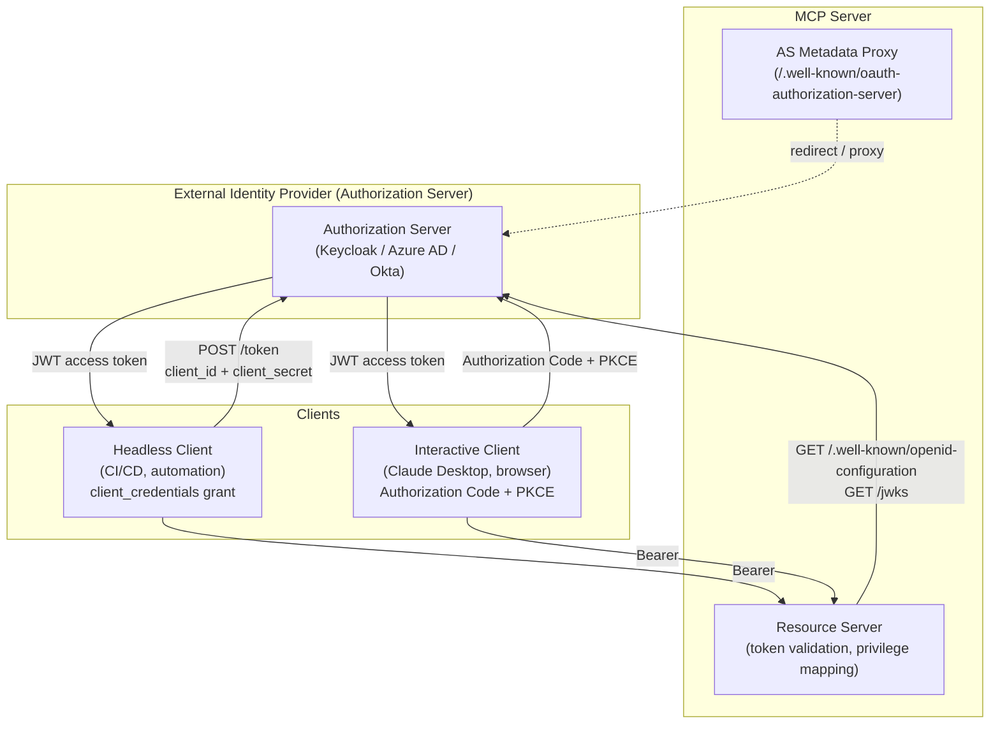
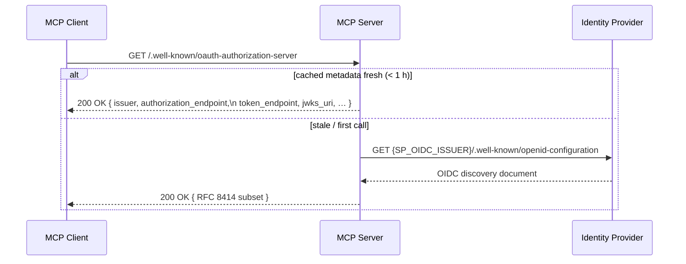
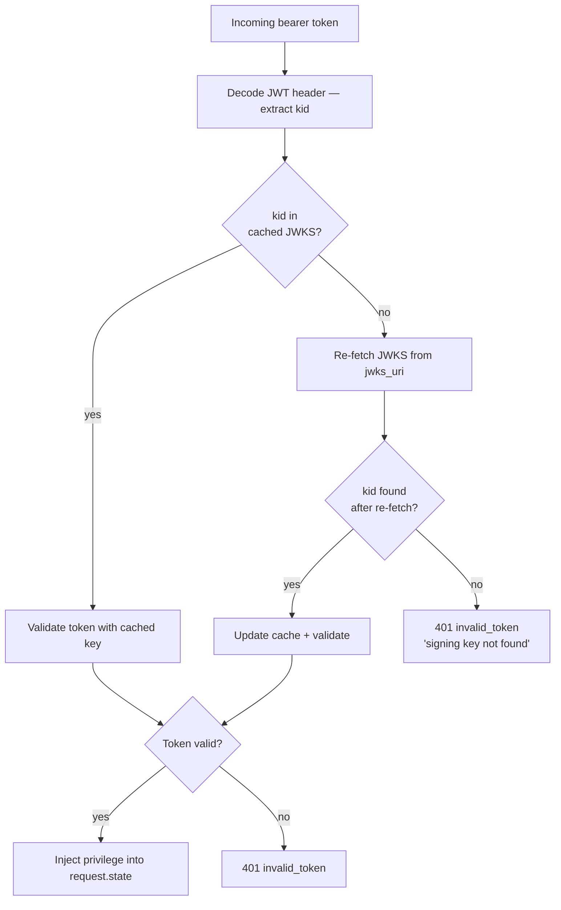
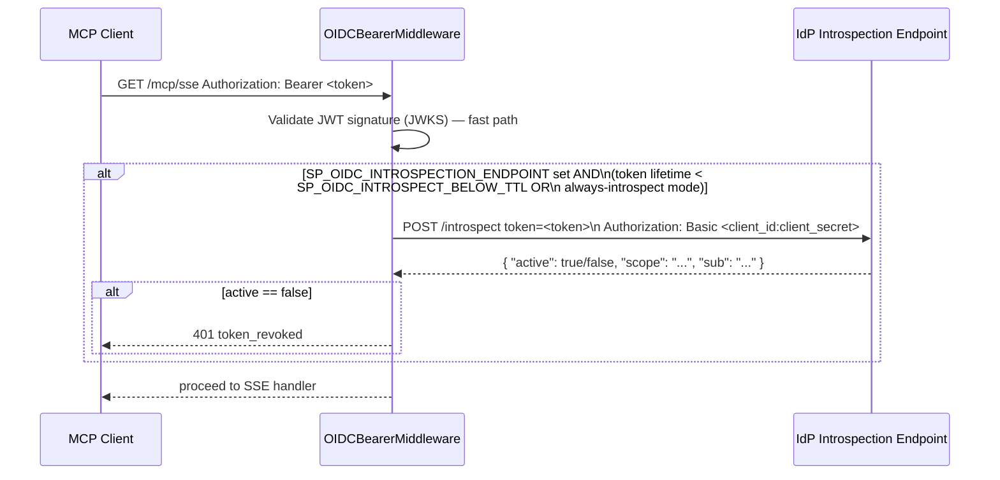
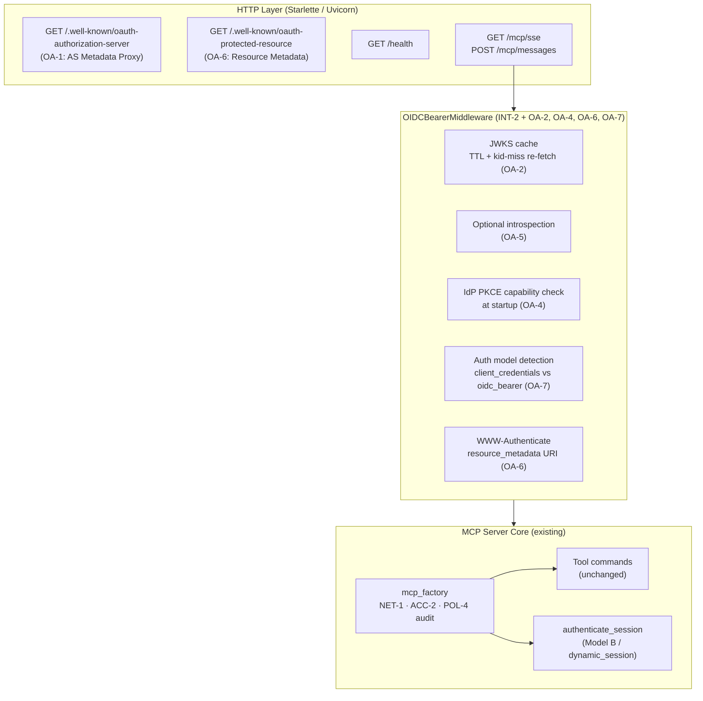
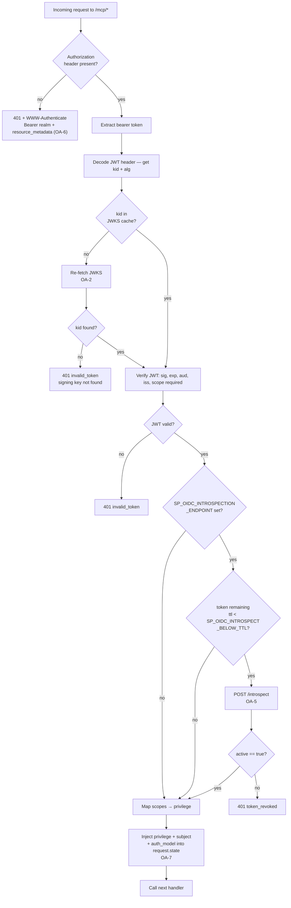

# Security Design: OAuth 2 Authorization for the MCP Server

* **Domain**: Secure Integrations — OAuth 2 / Authorization Server
* **Status**: Design specification — extends the INT-2 resource-server baseline
* **Revision**: 2026-10
* **Analysis reference**: [`docs/analysis/security-oauth2-analysis.md`](../analysis/security-oauth2-analysis.md)
* **Extends**: [`docs/design/security-integrations.md § INT-2`](security-integrations.md)
* **Implementation spec**: [`docs/implement/impl-security-integrations.md § INT-2`](../implement/impl-security-integrations.md)
* **Cross-references**:
  [`docs/design/security-identity-credentials.md`](security-identity-credentials.md) ·
  [`docs/design/security-dynamic-authn.md`](security-dynamic-authn.md) ·
  [`docs/design/security-access.md`](security-access.md) ·
  [`docs/design/security-non-repudiation.md`](security-non-repudiation.md) ·
  [`docs/guides/local-idp-guide.md`](../guides/local-idp-guide.md) ·
  [`docs/guides/configure-guide.md`](../guides/configure-guide.md)

---

## 1. Overview & Problem Statement

The INT-2 baseline (implemented in `http_server.py`) established the MCP server as an **OIDC resource server**: it accepts bearer tokens, validates them against a remote IdP's JWKS endpoint, extracts scopes, and maps those scopes to SP privilege tiers. That baseline closes the initial authentication gap but leaves the following open:

| Gap ID | Description | Impact |
|--------|-------------|--------|
| **OA-1** | No `/.well-known/oauth-authorization-server` metadata endpoint — MCP 2025-03 spec requires it for dynamic client discovery | MCP clients that follow the spec cannot auto-discover token endpoints |
| **OA-2** | JWKS fetched once at first request and cached indefinitely — key rotation (e.g., IdP rolling signing keys) silently breaks token validation | Operational fragility; security risk during key rollover |
| **OA-3** | Only `client_credentials` grant documented — human users (interactive sessions) have no standardized OAuth grant path | Limits MCP server to headless automation use cases |
| **OA-4** | PKCE (`code_challenge` / `code_verifier`) not specified for Authorization Code flows — required by OAuth 2.1 for public clients | Non-compliant with OAuth 2.1; CSRF and auth-code interception risk |
| **OA-5** | No token introspection endpoint (RFC 7662) — opaque token validation falls back to JWKS-only; revoked tokens remain valid until expiry | Revocation window creates a session-hijack risk |
| **OA-6** | `WWW-Authenticate` response on 401 carries only `Bearer realm` — does not include `resource_metadata` URI required by RFC 9470 (OAuth 2.0 Protected Resource Metadata) | Prevents standards-compliant clients from resolving the AS endpoint |
| **OA-7** | Dynamic authentication (Model B / `authenticate_session`) and OAuth bearer (Model A) are entirely separate code paths with no unified identity binding in audit records | `current_audit_user` populated differently per model; correlation gaps in ACTLOG |

This document specifies the design changes required to close OA-1 through OA-7 without altering the existing stdio transport, service-account model, or dynamic-auth session-lease implementation.

---

## 2. OAuth 2 Role Model for the MCP Server

The MCP server participates in **two OAuth 2 roles simultaneously**:



The MCP server **never issues tokens** — it always delegates to an external IdP. Its resource-server role is:

1. Validate the bearer token (signature, expiry, audience, issuer).
2. Extract scopes and map to SP privilege tiers.
3. Advertise the IdP's metadata endpoint so compliant clients can discover the token endpoint automatically.
4. Rotate cached JWKS automatically when signing keys change.

---

## 3. Design Changes

### OA-1 — Authorization Server Metadata Endpoint (RFC 8414 / MCP 2025-03)

**Requirement**: The MCP 2025-03 specification mandates that every HTTP MCP server expose
`GET /.well-known/oauth-authorization-server` returning a JSON document that points clients to the real token endpoint.

**Design**: Add a lightweight metadata proxy route to `create_http_app()`. The route fetches the IdP's own
`/.well-known/openid-configuration` once at startup, selects the required RFC 8414 fields, and serves them from the MCP server's own well-known path. This way the MCP server URL is the only endpoint a client needs to know.



**Fields served** (RFC 8414 required + OIDC additions used by MCP clients):

| Field | Source |
|-------|--------|
| `issuer` | `SP_OIDC_ISSUER` |
| `authorization_endpoint` | from IdP discovery |
| `token_endpoint` | from IdP discovery |
| `jwks_uri` | from IdP discovery |
| `response_types_supported` | `["code"]` |
| `grant_types_supported` | `["authorization_code", "client_credentials", "refresh_token"]` |
| `code_challenge_methods_supported` | `["S256"]` |
| `scopes_supported` | `["mcp:read", "mcp:operator", "mcp:storage", "mcp:policy", "mcp:system"]` |

**New env variable**: none. Reuses `SP_OIDC_ISSUER`.

---

### OA-2 — JWKS Key Rotation with TTL-Based Cache Refresh

**Requirement**: `OIDCBearerMiddleware._get_jwks()` caches JWKS indefinitely. Key rotations (IdP rolling its signing keys) silently break all token validation until the MCP server restarts.

**Design**: Replace the single-fetch cache with a TTL-based cache. Add a `kid`-miss fast path: if the JWT's `kid` header is not found in the cached JWKS, immediately re-fetch before failing.



**Cache policy**:

| Condition | Action |
|-----------|--------|
| `kid` present in cache, cache age < `SP_OIDC_JWKS_TTL` (default 3600 s) | Use cached key |
| `kid` missing from cache (key rotation) | Immediate re-fetch, update cache |
| Cache age ≥ `SP_OIDC_JWKS_TTL` | Background refresh on next request |

**New env variable**: `SP_OIDC_JWKS_TTL` — integer seconds, default `3600`.

---

### OA-3 — Authorization Code + PKCE Grant Flow (Interactive Clients)

**Requirement**: Interactive clients (Claude Desktop, browser-based UIs) cannot safely store a `client_secret`. They must use the Authorization Code grant with PKCE (RFC 7636), which is mandatory in OAuth 2.1 for public clients.

**Design**: The MCP server does **not** implement the Authorization Code flow itself — that is the IdP's responsibility. The design work here is:

1. Ensure the AS metadata endpoint (OA-1) advertises `code_challenge_methods_supported: ["S256"]`.
2. Ensure `OIDCBearerMiddleware` accepts tokens issued via Authorization Code grant (it already does — grant type is not checked at the resource server; only the token signature and claims matter).
3. Document the expected token claims for Authorization Code tokens vs `client_credentials` tokens so the audit identity binding (OA-7) can distinguish them.

**Authorization Code + PKCE token claim profile**:

| Claim | `client_credentials` token | Authorization Code token |
|-------|--------------------------|--------------------------|
| `sub` | client ID (e.g. `mcp-client`) | human user ID (e.g. `alice@corp.com`) |
| `preferred_username` | absent | present (human login name) |
| `scope` | requested `mcp:*` scopes | requested `mcp:*` scopes |
| `aud` | `SP_OIDC_AUDIENCE` | `SP_OIDC_AUDIENCE` |
| `azp` | client ID | client ID |

The `sub` claim from Authorization Code tokens is a human principal and must be bound to `current_audit_user` (NR-1). See OA-7.

---

### OA-4 — PKCE Validation at the Resource Server

**Requirement**: RFC 7636 / OAuth 2.1 require PKCE for Authorization Code flows. The resource server does not perform PKCE verification (that is the Authorization Server's job), but the resource server must:

1. Verify that the IdP's discovery document advertises `code_challenge_methods_supported: ["S256"]` when advertising the AS metadata (OA-1). If missing, log a startup warning.
2. Ensure no `plain` challenge method is advertised.

**Design**: Add a one-time IdP capability check at startup alongside the existing `SP_OIDC_ISSUER` validation:

```python
# http_server.py — new startup check
async def _check_idp_pkce_capability(issuer: str) -> None:
    async with httpx.AsyncClient() as c:
        disc = await c.get(f"{issuer}/.well-known/openid-configuration", timeout=10)
        disc.raise_for_status()
        methods = disc.json().get("code_challenge_methods_supported", [])
    if "S256" not in methods:
        logger.warning(
            "OA-4: IdP does not advertise PKCE S256 support. "
            "Authorization Code + PKCE flows for interactive clients may not work. "
            "Verify IdP configuration at %s", issuer
        )
    if "plain" in methods:
        logger.warning(
            "OA-4: IdP advertises PKCE 'plain' method — this is insecure. "
            "Ensure clients use S256 only."
        )
```

---

### OA-5 — Token Introspection Support (RFC 7662)

**Requirement**: Tokens validated only via JWKS remain valid until `exp` even after being revoked at the IdP. Token introspection allows the resource server to check live revocation status.

**Design**: Add an **optional** introspection path. When `SP_OIDC_INTROSPECTION_ENDPOINT` is set, the middleware calls the endpoint for each request (or for tokens below a configurable remaining-lifetime threshold) before accepting the token.



**New env variables**:

| Variable | Default | Description |
|----------|---------|-------------|
| `SP_OIDC_INTROSPECTION_ENDPOINT` | unset (disabled) | RFC 7662 introspection URL |
| `SP_OIDC_INTROSPECTION_CLIENT_ID` | `SP_OIDC_AUDIENCE` | Client ID for introspection Basic auth |
| `SP_OIDC_INTROSPECTION_CLIENT_SECRET` | unset | Client secret for introspection Basic auth |
| `SP_OIDC_INTROSPECT_BELOW_TTL` | `300` | Introspect tokens with less than N seconds remaining lifetime |

> When `SP_OIDC_INTROSPECTION_ENDPOINT` is not set, the middleware uses JWKS-only validation (current behaviour). Introspection adds a per-request network call and should be enabled only where revocation speed is a hard requirement.

---

### OA-6 — RFC 9470 `resource_metadata` in `WWW-Authenticate`

**Requirement**: RFC 9470 specifies that a resource server's `401 Unauthorized` response should include a `resource_metadata` parameter pointing to the resource server's own protected-resource metadata URL, allowing a client to discover the AS automatically.

**Design**: Update `OIDCBearerMiddleware` to include the parameter in the `WWW-Authenticate` header on all 401 responses:

```
WWW-Authenticate: Bearer realm="sp-mcp-server",
                  resource_metadata="https://<mcp-host>:<port>/.well-known/oauth-protected-resource"
```

Add a second well-known route `GET /.well-known/oauth-protected-resource` (RFC 9470) alongside the AS metadata route (OA-1):

```json
{
  "resource": "https://<mcp-host>:<port>",
  "authorization_servers": ["<SP_OIDC_ISSUER>"],
  "scopes_supported": [
    "mcp:read", "mcp:operator", "mcp:storage", "mcp:policy", "mcp:system"
  ],
  "bearer_methods_supported": ["header"]
}
```

**New env variable**: `SP_MCP_PUBLIC_URL` — the public base URL of the MCP server (e.g. `https://sp-mcp-01.corp.example.com:8443`). Used to construct the `resource_metadata` URI. If unset, the URL is derived from the Uvicorn bind address.

---

### OA-7 — Unified Identity Binding Across OAuth and Dynamic-Auth Models

**Requirement**: `current_audit_user` is populated from two different sources — `payload["sub"]` for OIDC bearer tokens (Model A) and the username provided to `authenticate_session` (Model B). The ACTLOG scratchpad entry format is the same, but the semantics differ. An auditor reading `user=mcp-client` (a service account `sub`) vs `user=alice@corp.com` (a human principal) cannot tell which model was used.

**Design**: Enrich the `current_audit_user` context and the ACTLOG scratchpad entry to carry the authentication model:

```
DEFINE SCRATCHPADENTRY MCP_AUDIT
  DESCRIPTION="MCP_AUDIT user=alice@corp.com authmodel=oidc_bearer
               tool=delete_node priv=policy corr=e8f7a192b0c3"

DEFINE SCRATCHPADENTRY MCP_AUDIT
  DESCRIPTION="MCP_AUDIT user=alice authmodel=dynamic_session
               tool=delete_node priv=policy corr=e8f7a192b0c3"

DEFINE SCRATCHPADENTRY MCP_AUDIT
  DESCRIPTION="MCP_AUDIT user=mcp-client authmodel=client_credentials
               tool=query_status priv=any corr=3a9f1c002b11"
```

**Implementation**: `OIDCBearerMiddleware.dispatch()` injects an additional `request.state.mcp_auth_model` string alongside `request.state.mcp_subject`. `handle_call_tool()` reads both when constructing the ACTLOG record.

**Auth model label values**:

| Token origin | `authmodel` value |
|-------------|------------------|
| `client_credentials` grant — no `preferred_username` in token | `client_credentials` |
| Authorization Code grant — `preferred_username` present | `oidc_bearer` |
| `authenticate_session` tool (Model B) | `dynamic_session` |
| stdio transport (no auth) | `local` |

---

## 4. Component Architecture After All Changes



---

## 5. Environment Variable Reference (OAuth 2 additions)

| Variable | Required | Default | Description |
|----------|----------|---------|-------------|
| `SP_OIDC_ISSUER` | Yes (HTTP) | — | OIDC issuer / AS base URL (existing) |
| `SP_OIDC_AUDIENCE` | No | `sp-mcp-server` | Token audience claim (existing) |
| `SP_TLS_CERT` / `SP_TLS_KEY` | Yes (HTTP) | — | TLS cert/key for HTTPS (existing, RG-5) |
| `SP_OIDC_JWKS_TTL` | No | `3600` | JWKS cache lifetime in seconds (OA-2) |
| `SP_OIDC_INTROSPECTION_ENDPOINT` | No | unset | RFC 7662 introspection URL (OA-5) |
| `SP_OIDC_INTROSPECTION_CLIENT_ID` | No | `SP_OIDC_AUDIENCE` | Introspection Basic-auth client ID (OA-5) |
| `SP_OIDC_INTROSPECTION_CLIENT_SECRET` | No | unset | Introspection Basic-auth client secret (OA-5) |
| `SP_OIDC_INTROSPECT_BELOW_TTL` | No | `300` | Introspect tokens with < N seconds remaining (OA-5) |
| `SP_MCP_PUBLIC_URL` | No | derived from bind | MCP server public base URL for RFC 9470 metadata (OA-6) |

---

## 6. Token Validation Decision Flow (Full)



---

## 7. Security Considerations

### 7.1 Scope Elevation Prevention

The privilege mapping resolves the **highest** scope present in the token, not the first. A token carrying both `mcp:read` and `mcp:system` is treated as `system`. Clients should request only the scopes they need — guidance belongs in [`docs/guides/configure-guide.md`](../guides/configure-guide.md).

### 7.2 Token Leakage via Logs

The bearer token string must never appear in any log output. `OIDCBearerMiddleware.dispatch()` must not log the raw `Authorization` header. The existing `execute_silent()` pattern in `BaseCommand` covers SP command credentials; this principle is extended to HTTP headers.

### 7.3 JWKS Re-fetch DoS

An attacker who can forge a JWT with an unknown `kid` could trigger a JWKS re-fetch on every request. Mitigate by:
- Rate-limiting JWKS re-fetches to at most one per 60 seconds regardless of `kid`-miss frequency.
- Logging `kid`-miss frequency at `WARNING` level for SIEM detection.

### 7.4 Introspection Credential Handling

`SP_OIDC_INTROSPECTION_CLIENT_SECRET` is a sensitive credential. It must be stored in the OS keyring (INT-4 pattern) or sourced from an `env:` reference. It must not appear in the `.env` file in plaintext in production.

### 7.5 Public URL Exposure

`SP_MCP_PUBLIC_URL` is served in the protected-resource metadata document. It must reflect the externally reachable address of the MCP server — not `localhost` or an internal hostname not resolvable by MCP clients.

---

## 8. Deployment Checklist

```
OA-1 (AS Metadata):
  [ ] SP_OIDC_ISSUER is set and IdP is reachable at startup
  [ ] GET /.well-known/oauth-authorization-server returns 200 with token_endpoint and jwks_uri
  [ ] MCP client can discover token_endpoint from the MCP server URL alone

OA-2 (JWKS rotation):
  [ ] SP_OIDC_JWKS_TTL set to match IdP key rotation policy (recommend 3600)
  [ ] Force a key rotation on a test IdP and verify tokens validate after rotation
      without server restart

OA-3/OA-4 (PKCE):
  [ ] Startup log shows no OA-4 warning for S256 missing
  [ ] No "plain" challenge method advertised by IdP
  [ ] Interactive client (Claude Desktop) obtains token via Authorization Code + PKCE
      and successfully calls /mcp/sse

OA-5 (Introspection — optional):
  [ ] SP_OIDC_INTROSPECTION_ENDPOINT set if revocation speed is required
  [ ] SP_OIDC_INTROSPECTION_CLIENT_SECRET stored in keyring, not .env
  [ ] Revoke a token at the IdP and confirm the MCP server returns 401 within
      SP_OIDC_INTROSPECT_BELOW_TTL seconds

OA-6 (RFC 9470 resource metadata):
  [ ] SP_MCP_PUBLIC_URL set to the externally reachable MCP server URL
  [ ] GET /.well-known/oauth-protected-resource returns 200
  [ ] 401 response includes resource_metadata URI

OA-7 (Auth model binding):
  [ ] ACTLOG entries for client_credentials tokens show authmodel=client_credentials
  [ ] ACTLOG entries for interactive user tokens show authmodel=oidc_bearer
      and sub=<human principal>
  [ ] ACTLOG entries for dynamic-session tools show authmodel=dynamic_session
```

---

## 9. Relationship to Existing Design Documents

| Existing control | Interaction with this design |
|-----------------|------------------------------|
| INT-2 (`OIDCBearerMiddleware`) | Extended by OA-2, OA-4, OA-5, OA-6, OA-7 — no interface changes, additive only |
| DAUTH (`authenticate_session`) | OA-7 adds `authmodel=dynamic_session` tag to ACTLOG records; no change to session-lease logic |
| NR-1 (identity binding) | OA-7 enriches the ACTLOG record with `authmodel`; closes a forensic gap in cross-model attribution |
| CRED-3 (`.env` permissions) | `SP_OIDC_INTROSPECTION_CLIENT_SECRET` must follow the same `0600` / keyring-first rule as service-account passwords |
| RG-5 (TLS enforcement) | Unchanged; all new endpoints are served over the same TLS listener |
| NET-1 (session security) | Unchanged; OIDC bearer path does not bypass the SP session-security startup check |

---

## 10. Related Documents

- Analysis: [`docs/analysis/security-oauth2-analysis.md`](../analysis/security-oauth2-analysis.md)
- Existing integrations design: [`docs/design/security-integrations.md`](security-integrations.md)
- Implementation: [`docs/implement/impl-security-integrations.md § INT-2`](../implement/impl-security-integrations.md)
- Local IdP guide: [`docs/guides/local-idp-guide.md`](../guides/local-idp-guide.md)
- Configuration guide (HTTP transport): [`docs/guides/configure-guide.md`](../guides/configure-guide.md)
- Dynamic auth design: [`docs/design/security-dynamic-authn.md`](security-dynamic-authn.md)
- Non-repudiation design: [`docs/design/security-non-repudiation.md`](security-non-repudiation.md)
