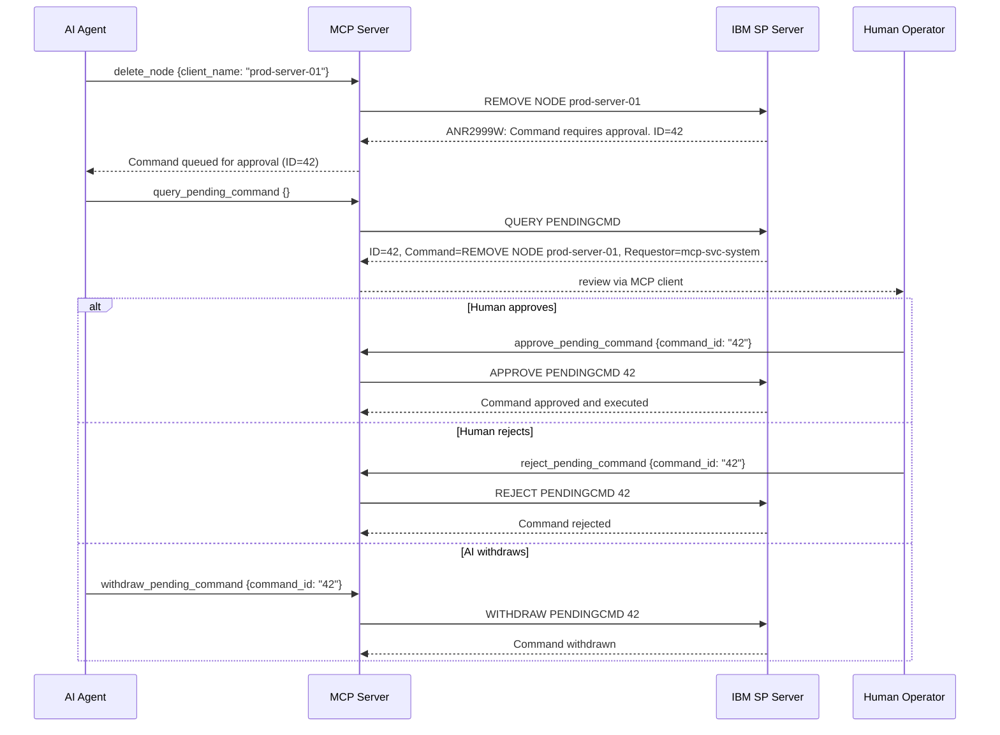
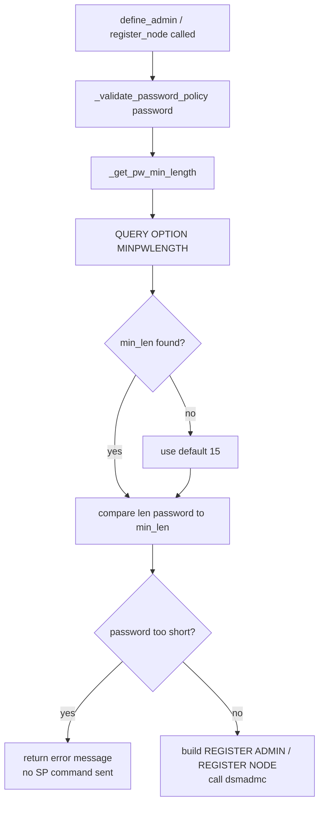
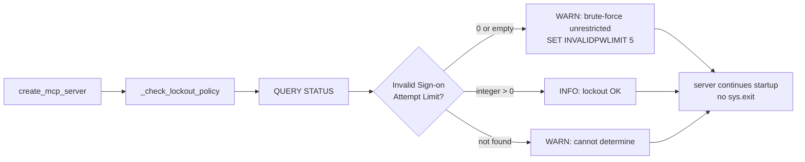
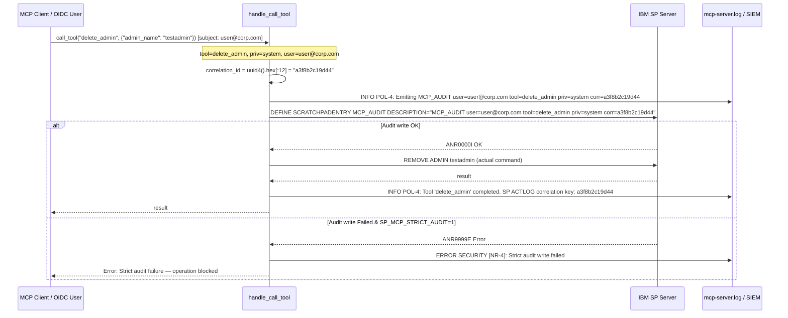

# Security Design: Policy Management

* **Domain**: Policy Management & Non-Repudiation
* **Status**: Implemented (RG-4, NR-1, NR-4, NR-5 closed)
* **Implementation spec**: [`docs/implement/impl-security-policy.md`](../implement/impl-security-policy.md)
* **Gaps closed**: P1, P2, P3, P4, RG-4, NR-1, NR-2, NR-3, NR-4, NR-5 (from [`docs/analysis/security-design-analysis.md`](../analysis/security-design-analysis.md))

---

## Overview

The original codebase had no mechanism to interact with IBM SP's Command Approval system (P1), no password pre-validation before issuing `REGISTER ADMIN`/`REGISTER NODE` (P2), no startup lockout check (P3), and no audit trail correlating MCP tool calls to IBM SP activity log entries (P4). This domain adds all four controls.

| Change | ID | Gaps closed |
|--------|-----|-------------|
| `ApprovePendingCmd`, `RejectPendingCmd`, `WithdrawPendingCmd` approval tools | POL-1 | P1 |
| Password pre-validation in `DefineAdmin`, `RegisterNode`, `UpdateUser`, `UpdateNode` | POL-2 | P2 |
| Startup lockout threshold check `_check_lockout_policy()` in `mcp_factory.py` | POL-3 | P3 |
| `DEFINE SCRATCHPADENTRY` audit correlation for write operations in `handle_call_tool` | POL-4 | P4 |
| Audit write failure logged at `ERROR` (not `WARNING`); non-zero return code also logged | RG-4 | RG-4 |
| Identity-enriched audit payload (`user=<sub_or_id>`) in scratchpad entries | NR-1 | NR-1 |
| Strict audit fail-closed enforcement via `SP_MCP_STRICT_AUDIT=1` | NR-4 | NR-4 |
| Standardized ISO 8601 UTC timestamp format (`%Y-%m-%dT%H:%M:%SZ`) in logging | NR-5 | NR-5 |

---

## Architecture

### Command Approval Workflow (POL-1)

IBM SP's `SET COMMANDAPPROVAL ON` places restricted destructive commands in a pending queue. Before this change, the MCP server could read the queue (`query_pending_command`) but could not complete the approval cycle.



**SP server prerequisite:**
```
SET COMMANDAPPROVAL ON
SET APPROVERSREQUIREAPPROVAL ON
UPDATE ADMIN mcp-svc-system CMDAPPROVER=YES
```

### Password Pre-Validation (POL-2)



The helper `_validate_password_policy()` in `BaseCommand` is available to all command classes. Only `DefineAdmin`, `UpdateUser`, `RegisterNode`, and `UpdateNode` call it.

### Startup Lockout Check (POL-3)



POL-3 is a **warning**, not a hard failure. The server starts regardless — the check is advisory because the operator may have a valid reason for not enabling lockout in a test environment.

### Audit Trail Correlation & Non-Repudiation (POL-4 / RG-4 / NR-1 / NR-4 / NR-5)

For every tool call whose `required_privilege` is `system`, `policy`, `storage`, or `operator` (all write operations), the `handle_call_tool` closure emits a `DEFINE SCRATCHPADENTRY` to the IBM SP activity log **before** executing the actual command.

**Non-Repudiation & Audit Enhancements**:
- **NR-1 (closed)**: The audit payload binds the authenticated user/subject identity via `contextvars.ContextVar` (`user=<sub_or_id>`), recording `MCP_AUDIT user=<user> tool=<name> priv=<priv> corr=<id>` directly into SP ACTLOG.
- **NR-4 (closed)**: When `SP_MCP_STRICT_AUDIT=1` is configured, if `DEFINE SCRATCHPADENTRY` fails or returns non-zero, tool execution is aborted immediately with a security exception (fail-closed mode).
- **NR-5 (closed)**: Local loggers output ISO 8601 UTC timestamps (`%Y-%m-%dT%H:%M:%SZ`) across all handlers using `time.gmtime`.
- **RG-4 (closed)**: In advisory audit mode, audit write failures are logged at `ERROR` level with `SECURITY [POL-4 / RG-4]`.



**Querying the audit trail from SP:**
```
* Find all MCP-originated write operations
QUERY ACTLOG SEARCH=MCP_AUDIT

* Find a specific tool call by correlation ID
QUERY ACTLOG SEARCH=corr=a3f8b2c19d44
```

The MCP server log records the same `corr=` value, creating a bidirectional cross-reference between `mcp-server.log` and the IBM SP `ACTLOG`.

---

## Files Changed

| File | Change |
|------|--------|
| [`src/sp_mcp_server/commands/operations/approval.py`](../../src/sp_mcp_server/commands/operations/approval.py) | POL-1: New file — `ApprovePendingCmd`, `RejectPendingCmd`, `WithdrawPendingCmd` |
| [`src/sp_mcp_server/commands/operations/__init__.py`](../../src/sp_mcp_server/commands/operations/__init__.py) | POL-1: Export new approval tool classes |
| [`src/sp_mcp_server/server_groups.py`](../../src/sp_mcp_server/server_groups.py) | POL-1: Add approval tools to `ISP_SYSTEM_ADMIN` group |
| [`src/sp_mcp_server/commands/base.py`](../../src/sp_mcp_server/commands/base.py) | POL-2: `_get_pw_min_length()` and `_validate_password_policy()` helpers on `BaseCommand` |
| [`src/sp_mcp_server/commands/system/admin.py`](../../src/sp_mcp_server/commands/system/admin.py) | POL-2: `DefineAdmin.execute()` and `UpdateUser.execute()` pre-validate password |
| [`src/sp_mcp_server/commands/clients/node.py`](../../src/sp_mcp_server/commands/clients/node.py) | POL-2: `RegisterNode.execute()` and `UpdateNode.execute()` pre-validate password |
| [`src/sp_mcp_server/mcp_factory.py`](../../src/sp_mcp_server/mcp_factory.py) | POL-3: `_check_lockout_policy()` called at startup; POL-4 / NR-1 / NR-4 / NR-5: `current_audit_user` context, `_WRITE_PRIVILEGES`, ISO 8601 UTC format, strict audit fail-closed support |
| [`src/sp_mcp_server/http_server.py`](../../src/sp_mcp_server/http_server.py) | NR-1: Sets `current_audit_user` context variable from OIDC `sub` claim |

---

## SP Server Configuration Checklist

```
[ ] Enable command approval (prevents unreviewed destructive operations):
      SET COMMANDAPPROVAL ON
      SET APPROVERSREQUIREAPPROVAL ON
      UPDATE ADMIN mcp-svc-system CMDAPPROVER=YES

[ ] Enable account lockout (prevents brute-force):
      SET INVALIDPWLIMIT 5
      QUERY STATUS  <- verify "Invalid Sign-on Attempt Limit: 5"

[ ] Verify MINPWLENGTH is configured:
      QUERY OPTION MINPWLENGTH  <- should be 15 or higher for IBM SP v8.1.16+

[ ] Brand service account CONTACT fields for audit attribution:
      UPDATE ADMIN mcp-svc-system   CONTACT="MCP Server | host:sp-mcp-01 | role:system"
      UPDATE ADMIN mcp-svc-storage  CONTACT="MCP Server | host:sp-mcp-01 | role:storage"
      UPDATE ADMIN mcp-svc-policy   CONTACT="MCP Server | host:sp-mcp-01 | role:policy"
      UPDATE ADMIN mcp-svc-operator CONTACT="MCP Server | host:sp-mcp-01 | role:operator"
      UPDATE ADMIN mcp-svc-readonly CONTACT="MCP Server | host:sp-mcp-01 | role:readonly"
```
