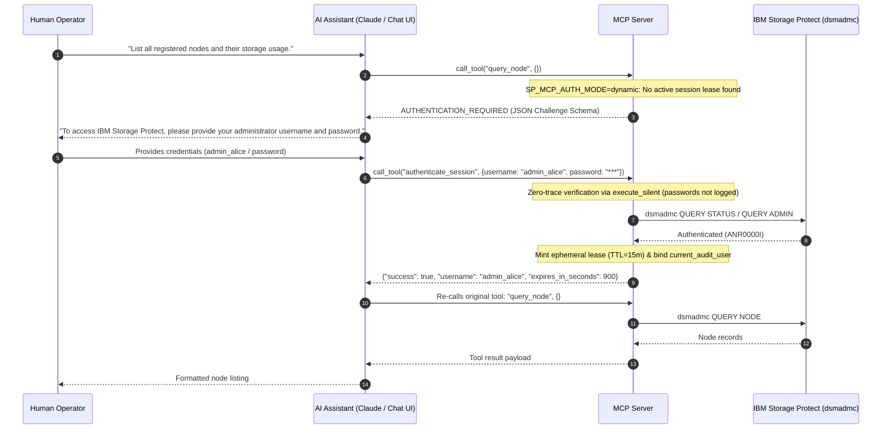

# Configuration Guide

> **Before configuring:** Complete [`planning-guide.md`](planning-guide.md) to choose your deployment topology and plan your SP server inventory, service accounts, and SSH keys. Complete [`install-guide.md`](install-guide.md) to install the MCP server software. The steps in this guide assume both are done.

This guide contains MCP client configuration examples for connecting to the IBM Storage Protect MCP Server, covering all supported transports and deployment scenarios.

> **Security note**: All configurations use SSH key authentication with a dedicated non-root `mcp-runner` OS user (NET-2). The legacy `sshpass`/`StrictHostKeyChecking=no`/`root` pattern has been removed. See [`install-guide.md`](install-guide.md) for SSH key setup steps.

---

## Table of Contents

- [Transport Options](#transport-options)
- [Part 1 — stdio Transport (SSH)](#part-1--stdio-transport-ssh)
  - [Step 1 — SSH key setup](#step-1--ssh-key-setup-one-time-from-the-mcp-client-workstation)
  - [Step 2 — MCP client configuration](#step-2--mcp-client-configuration)
    - [Linux / macOS — full access](#linux--macos--full-access)
    - [Linux / macOS — read-only (monitoring and reporting)](#linux--macos--read-only-monitoring-and-reporting)
    - [Linux / macOS — scoped to specific modules](#linux--macos--scoped-to-specific-modules)
    - [Windows — remote access to a Linux SP server](#windows--remote-access-to-a-linux-sp-server)
    - [Windows — remote access to a Windows SP server](#windows--remote-access-to-a-windows-sp-server)
  - [`sshd_config` hardening on the SP server (recommended)](#sshd_config-hardening-on-the-sp-server-recommended)
- [Part 2 — HTTP Transport (OIDC Bearer Token / OAuth 2)](#part-2--http-transport-oidc-bearer-token--oauth-2)
  - [Token scope → privilege mapping](#token-scope--privilege-mapping)
  - [Grant type quick-reference](#grant-type-quick-reference)
  - [Required `.env` additions](#required-env-additions)
  - [Starting the HTTP transport](#starting-the-http-transport)
  - [Verify the HTTP transport and OAuth 2 metadata](#verify-the-http-transport-and-oauth-2-metadata)
  - [Obtaining a token and calling the server](#obtaining-a-token-and-calling-the-server)
  - [MCP client configuration for HTTP transport](#mcp-client-configuration-for-http-transport)
  - [JWKS key-rotation resilience](#jwks-key-rotation-resilience)
  - [Token introspection / revocation (optional)](#token-introspection--revocation-optional)
  - [Auth model audit trail](#auth-model-audit-trail)
  - [Complete `.env` reference — HTTP transport variables](#complete-env-reference--http-transport-variables)
  - [Troubleshooting HTTP transport](#troubleshooting-http-transport)
- [Part 3 — Dynamic & Delegated User Authentication (Challenge-Response)](#part-3--dynamic--delegated-user-authentication-challenge-response)
  - [Enabling Dynamic Authentication](#enabling-dynamic-authentication)
  - [How Challenge-Response Works in Chat](#how-challenge-response-works-in-chat)
  - [Security Properties of Dynamic Authentication](#security-properties-of-dynamic-authentication)
- [Part 4 — Privilege-Aware Tool Registration](#part-4--privilege-aware-tool-registration)
  - [Combining `--mode` and service account privilege](#combining---mode-and-service-account-privilege)
- [Part 5 — Command Approval (Optional but Recommended)](#part-5--command-approval-optional-but-recommended)
- [Part 6 — Managing Multiple SP Servers](#part-6--managing-multiple-sp-servers)
  - [Topology A — Co-located](#topology-a--co-located-mcp-server-on-each-sp-server-host)
    - [Step A-1 — Install on each SP server host](#step-a-1--install-on-each-sp-server-host)
    - [Step A-2 — SSH key setup](#step-a-2--ssh-key-setup-one-time-from-the-mcp-client-workstation)
    - [Step A-3 — MCP client configuration](#step-a-3--mcp-client-configuration)
    - [Step A-4 — Per-server `.env` layout](#step-a-4--per-server-env-layout)
    - [Step A-5 — Provisioning checklist](#step-a-5--provisioning-checklist-repeat-per-sp-server-host)
  - [Topology B — Centralised](#topology-b--centralised-all-mcp-servers-on-one-control-host)
    - [Step B-1 — Install on the control host (once)](#step-b-1--install-on-the-control-host-once)
    - [Step B-2 — SSH key setup](#step-b-2--ssh-key-setup-one-time-from-the-mcp-client-workstation)
    - [Step B-3 — MCP client configuration](#step-b-3--mcp-client-configuration)
    - [Step B-4 — Per-server `.env` layout on the control host](#step-b-4--per-server-env-layout-on-the-control-host)
    - [Step B-5 — Security controls in Topology B](#step-b-5--security-controls-in-topology-b)
    - [Step B-6 — Provisioning checklist (control host)](#step-b-6--provisioning-checklist-control-host)
  - [Common — Scoping tools per server (both topologies)](#common--scoping-tools-per-server-both-topologies)
  - [Common — Addressing multiple servers in prompts (both topologies)](#common--addressing-multiple-servers-in-prompts-both-topologies)
  - [Common — Security controls applicable to both topologies](#common--security-controls-applicable-to-both-topologies)
- [Related Documentation](#related-documentation)

---

## Transport Options

The MCP server supports two transport modes:

| Transport | Flag | Authentication | Typical use |
|-----------|------|---------------|-------------|
| `stdio` (default) | `--transport stdio` | SSH key / Tiered Service Accounts or Dynamic Challenge-Response | Local or single-client deployments (e.g. Claude Desktop) |
| `http` | `--transport http` | OIDC bearer token (OAuth 2.1) / Dynamic session tokens | Enterprise / multi-client deployments (e.g. Web UIs, REST gateways) |

---

## Part 1 — stdio Transport (SSH)

The stdio transport runs the MCP server as a subprocess launched over an SSH connection. The MCP client's stdin/stdout tunnel becomes the MCP protocol channel. No network port is opened by the MCP server itself.

### Step 1 — SSH key setup (one-time, from the MCP client workstation)

**Linux / macOS:**

```bash
# Generate a dedicated Ed25519 key
ssh-keygen -t ed25519 -f ~/.ssh/id_ed25519_sp_mcp -C "mcp-server-access" -N ""

# Deploy the public key to the mcp-runner account on the SP server
ssh-copy-id -i ~/.ssh/id_ed25519_sp_mcp.pub mcp-runner@your-sp-server

# Pin the host key to prevent future MITM attacks
ssh-keyscan -H your-sp-server >> ~/.ssh/known_hosts

# Verify — must succeed without a password prompt
ssh -i ~/.ssh/id_ed25519_sp_mcp -o StrictHostKeyChecking=yes \
    -o BatchMode=yes mcp-runner@your-sp-server echo "OK"
```

**Windows (PowerShell):**

```powershell
ssh-keygen -t ed25519 -f "$HOME\.ssh\id_ed25519_sp_mcp" -C "mcp-server-access"
ssh-copy-id -i "$HOME\.ssh\id_ed25519_sp_mcp.pub" mcp-runner@your-sp-server
ssh-keyscan -H your-sp-server >> "$HOME\.ssh\known_hosts"
```

### Step 2 — MCP client configuration

Replace `your-sp-server` and the path to your virtual environment throughout.

#### Linux / macOS — full access

```json
{
  "mcpServers": {
    "sp-mcp-server": {
      "command": "ssh",
      "args": [
        "-i", "~/.ssh/id_ed25519_sp_mcp",
        "-o", "StrictHostKeyChecking=yes",
        "-o", "BatchMode=yes",
        "mcp-runner@your-sp-server",
        "cd /opt/sp-mcp-server && source .venv/bin/activate && python3 -m sp_mcp_server.main --mode full --enable-servers system,operations,clients,policy,storage"
      ],
      "disabled": false,
      "alwaysAllow": []
    }
  }
}
```

#### Linux / macOS — read-only (monitoring and reporting)

```json
{
  "mcpServers": {
    "sp-mcp-readonly": {
      "command": "ssh",
      "args": [
        "-i", "~/.ssh/id_ed25519_sp_mcp",
        "-o", "StrictHostKeyChecking=yes",
        "-o", "BatchMode=yes",
        "mcp-runner@your-sp-server",
        "cd /opt/sp-mcp-server && source .venv/bin/activate && python3 -m sp_mcp_server.main --mode read-only"
      ],
      "disabled": false,
      "alwaysAllow": []
    }
  }
}
```

#### Linux / macOS — scoped to specific modules

Use `--enable-servers` to register only the tool groups you need. Available modules: `system`, `operations`, `clients`, `policy`, `storage`.

```json
{
  "mcpServers": {
    "sp-mcp-storage-only": {
      "command": "ssh",
      "args": [
        "-i", "~/.ssh/id_ed25519_sp_mcp",
        "-o", "StrictHostKeyChecking=yes",
        "-o", "BatchMode=yes",
        "mcp-runner@your-sp-server",
        "cd /opt/sp-mcp-server && source .venv/bin/activate && python3 -m sp_mcp_server.main --mode full --enable-servers storage"
      ],
      "disabled": false,
      "alwaysAllow": []
    }
  }
}
```

#### Windows — remote access to a Linux SP server

```json
{
  "mcpServers": {
    "sp-mcp-server": {
      "command": "ssh",
      "args": [
        "-i", "C:\\Users\\<your-username>\\.ssh\\id_ed25519_sp_mcp",
        "-o", "StrictHostKeyChecking=yes",
        "-o", "BatchMode=yes",
        "mcp-runner@your-sp-server",
        "cd /opt/sp-mcp-server && source .venv/bin/activate && python3 -m sp_mcp_server.main --mode full --enable-servers system,operations,clients,policy,storage"
      ],
      "disabled": false,
      "alwaysAllow": []
    }
  }
}
```

#### Windows — remote access to a Windows SP server

```json
{
  "mcpServers": {
    "sp-mcp-server-windows": {
      "command": "ssh",
      "args": [
        "-i", "C:\\Users\\<your-username>\\.ssh\\id_ed25519_sp_mcp",
        "-o", "StrictHostKeyChecking=yes",
        "-o", "BatchMode=yes",
        "mcp-runner@<windows-sp-server-ip>",
        "powershell -NoProfile -Command \"cd C:\\sp-mcp-server; .\\.venv\\Scripts\\Activate.ps1; python -m sp_mcp_server.main --mode full --enable-servers system,operations,clients,policy,storage\""
      ],
      "disabled": false,
      "alwaysAllow": []
    }
  }
}
```

### `sshd_config` hardening on the SP server (recommended)

On the Linux SP server, restrict the `mcp-runner` account to key-only auth with no TTY or port-forwarding. Add to `/etc/ssh/sshd_config.d/mcp-runner.conf`:

```
Match User mcp-runner
    PasswordAuthentication no
    PubkeyAuthentication   yes
    PermitTTY              no
    AllowTcpForwarding     no
    X11Forwarding          no
```

> Do **not** add `ForceCommand` — the MCP server needs to exec arbitrary Python commands through the SSH session.

```bash
systemctl reload sshd
```

---

## Part 2 — HTTP Transport (OIDC Bearer Token / OAuth 2)

The HTTP transport starts a local HTTPS/SSE server. Each MCP client authenticates with an OIDC bearer token issued by your enterprise identity provider. Token scopes map to IBM SP privilege tiers so each client only accesses the tools its token authorises.

> **No enterprise IdP?** For testing, training, or demo purposes you can run a fully local Keycloak instance that issues real OIDC tokens with the `mcp:*` scopes used in this section. See [`local-idp-oauth2-guide.md`](local-idp-oauth2-guide.md) for the step-by-step setup. Do not use that setup in production.

### Token scope → privilege mapping

| OIDC scope in token | SP privilege tier | Tools accessible |
|---------------------|------------------|-----------------|
| `mcp:read` | `any` | All `QUERY` / read-only tools |
| `mcp:operator` | `operator` | Operator tools + read-only |
| `mcp:storage` | `storage` | Storage tools + read-only |
| `mcp:policy` | `policy` | Policy tools + read-only |
| `mcp:system` | `system` | All tools |

When a token carries multiple `mcp:*` scopes, the **highest** privilege is applied. Always request the minimum scope the task requires.

### Grant type quick-reference

| Use case | Grant type | `authmodel` in ACTLOG | Notes |
|----------|-----------|----------------------|-------|
| CI/CD, batch scripts, automation | `client_credentials` | `client_credentials` | Requires `client_secret`; suitable for confidential clients |
| Interactive user (Claude Desktop, browser) | Authorization Code + PKCE | `oidc_bearer` | No `client_secret`; `preferred_username` must be in token |
| Chat session with direct SP credential | Dynamic auth (`authenticate_session`) | `dynamic_session` | Model B; ephemeral 15-min lease; any transport |

### Required `.env` additions

Add these variables to the existing `.env` that already contains your SP connection settings (`TCPSERVERADDRESS`, `SP_ADMIN_ID_*`, etc.):

```dotenv
# ── OIDC — required for --transport http ─────────────────────────────────
# Issuer discovery URL (replace <tenant> with your Azure AD / Entra tenant ID)
SP_OIDC_ISSUER=https://login.microsoftonline.com/<tenant>/v2.0

# Audience claim that tokens must carry (must match what your IdP issues)
SP_OIDC_AUDIENCE=sp-mcp-server

# ── TLS — required; server exits with SECURITY [RG-5] without these ──────
SP_TLS_CERT=/opt/sp-mcp-server/certs/server.crt
SP_TLS_KEY=/opt/sp-mcp-server/certs/server.key

# ── OA-6: public URL served in /.well-known/oauth-protected-resource ──────
# Set to the externally reachable base URL of this MCP server instance.
SP_MCP_PUBLIC_URL=https://sp-mcp-01.corp.example.com:8443

# ── OA-2: JWKS cache lifetime — set to match your IdP's key-rotation policy
# Azure AD rotates roughly every 6 weeks. Default is 3600 (1 hour).
SP_OIDC_JWKS_TTL=3600
```

> For a **local Keycloak** test environment substitute `SP_OIDC_ISSUER=https://localhost:8080/realms/mcp-demo`, `SP_OIDC_AUDIENCE=mcp-client`, and `SP_MCP_PUBLIC_URL=https://localhost:8443`. See [`local-idp-oauth2-guide.md` Step 4](local-idp-oauth2-guide.md).

### Starting the HTTP transport

```bash
cd /opt/sp-mcp-server
source .venv/bin/activate
python3 -m sp_mcp_server.main \
  --transport http \
  --port 8443 \
  --mode full \
  --enable-servers system,operations,clients,policy,storage
```

> **TLS is mandatory.** The server exits with `SECURITY [RG-5]` if `SP_TLS_CERT` or `SP_TLS_KEY` are missing or the files do not exist. Set `SP_MCP_ALLOW_HTTP_PLAINTEXT=1` **only** for loopback-only test deployments (emits an `ERROR` log).

Expected startup log (no errors):

```
INFO:  OIDC: Loaded issuer metadata from https://.../.well-known/openid-configuration
INFO:  OA-1: AS metadata cached from https://.../.well-known/openid-configuration
INFO:  OA-4: IdP PKCE capability check passed (S256 supported).
INFO:  RG-5: TLS configured — cert=/opt/sp-mcp-server/certs/server.crt
INFO:  Uvicorn running on https://0.0.0.0:8443
```

> If the startup log shows `WARNING: OA-4: IdP does not advertise PKCE S256 support`, your IdP needs PKCE configured before interactive clients can authenticate. See [Troubleshooting](#troubleshooting-http-transport).

### Verify the HTTP transport and OAuth 2 metadata

```bash
# Health check (no token required)
curl --cacert /opt/sp-mcp-server/certs/ca.crt \
  https://sp-mcp-01.example.com:8443/health
# Expected: {"status":"ok"}

# OA-1: AS metadata — MCP 2025-03 auto-discovery endpoint
curl --cacert /opt/sp-mcp-server/certs/ca.crt \
  https://sp-mcp-01.example.com:8443/.well-known/oauth-authorization-server \
  | python3 -m json.tool
# Expected: JSON with token_endpoint, jwks_uri, scopes_supported, code_challenge_methods_supported

# OA-6: Protected-resource metadata (RFC 9470)
curl --cacert /opt/sp-mcp-server/certs/ca.crt \
  https://sp-mcp-01.example.com:8443/.well-known/oauth-protected-resource \
  | python3 -m json.tool
# Expected: JSON with authorization_servers, scopes_supported

# OA-6: Verify resource_metadata appears in a 401 WWW-Authenticate header
curl -v --cacert /opt/sp-mcp-server/certs/ca.crt \
  https://sp-mcp-01.example.com:8443/mcp/sse 2>&1 | grep "WWW-Authenticate"
# Expected: Bearer realm="sp-mcp-server", resource_metadata="https://.../.well-known/oauth-protected-resource"
```

### Obtaining a token and calling the server

#### Headless / automation: `client_credentials` grant

**Azure AD / Entra ID:**

```bash
TOKEN=$(curl -s -X POST \
  "https://login.microsoftonline.com/${TENANT_ID}/oauth2/v2.0/token" \
  -d "client_id=${CLIENT_ID}" \
  -d "client_secret=${CLIENT_SECRET}" \
  -d "scope=api://${SP_OIDC_AUDIENCE}/mcp:read" \
  -d "grant_type=client_credentials" \
  | python3 -c "import sys,json; print(json.load(sys.stdin)['access_token'])")

curl --cacert /opt/sp-mcp-server/certs/ca.crt \
  -H "Authorization: Bearer ${TOKEN}" \
  https://sp-mcp-01.example.com:8443/mcp/sse
```

**Programmatic token refresh (shell script):**

```bash
#!/usr/bin/env bash
SP_MCP_ACCESS_TOKEN=$(curl -s -X POST \
  "${TOKEN_ENDPOINT}" \
  -d "client_id=${CLIENT_ID}" \
  -d "client_secret=${CLIENT_SECRET}" \
  -d "scope=api://${SP_OIDC_AUDIENCE}/mcp:system" \
  -d "grant_type=client_credentials" \
  | python3 -c "import sys,json; print(json.load(sys.stdin)['access_token'])")
export SP_MCP_ACCESS_TOKEN
```

Tokens from this grant carry `authmodel=client_credentials` in the SP ACTLOG.

#### Interactive users: Authorization Code + PKCE

The MCP server accepts Authorization Code tokens without extra configuration — PKCE verification is the IdP's responsibility. Requirements at the IdP:

- Public client (no `client_secret`) with Authorization Code grant and `code_challenge_method=S256`.
- Redirect URI matching the MCP client's callback.
- The five `mcp:*` scopes as optional scopes on the client.
- `preferred_username` claim included in the access token (see table below).

**Token claim profile:**

| Claim | `client_credentials` token | Authorization Code token |
|-------|--------------------------|--------------------------|
| `sub` | client ID | human user ID (e.g. `alice@corp.com`) |
| `preferred_username` | absent | **present** — required for `authmodel=oidc_bearer` |
| `scope` | requested `mcp:*` | requested `mcp:*` |
| `aud` | `SP_OIDC_AUDIENCE` | `SP_OIDC_AUDIENCE` |

> For MCP clients implementing MCP 2025-03 auto-discovery, only the MCP server URL is needed in the client config — the client fetches `/.well-known/oauth-authorization-server` and performs the Authorization Code + PKCE flow automatically.

Tokens from this grant carry `authmodel=oidc_bearer` in the SP ACTLOG.

### MCP client configuration for HTTP transport

**Headless / service-account token (pre-obtained):**

```json
{
  "mcpServers": {
    "sp-mcp-http": {
      "url": "https://sp-mcp-01.example.com:8443/mcp/sse",
      "headers": {
        "Authorization": "Bearer <token-from-client-credentials-flow>"
      }
    }
  }
}
```

**Interactive user — MCP 2025-03 auto-discovery (client handles OAuth flow):**

```json
{
  "mcpServers": {
    "sp-mcp-http": {
      "url": "https://sp-mcp-01.example.com:8443"
    }
  }
}
```

> Replace `<token-from-client-credentials-flow>` with a token obtained from your IdP. Tokens are short-lived — automate refresh in your deployment tooling.

### JWKS key-rotation resilience

IdPs periodically rotate their signing keys. `SP_OIDC_JWKS_TTL` (already set above) controls the cache lifetime. If a token arrives signed with a key not yet in the cache, the server re-fetches the JWKS once (rate-limited to once per 60 s) before failing. No server restart is needed.

To verify recovery after a forced key rotation on a test IdP, check for this log pattern:

```
WARNING: OA-2: kid 'new-kid-value' not in JWKS cache — forcing re-fetch
INFO:    OA-2: JWKS refreshed from https://... (2 keys)
```

### Token introspection / revocation (optional)

By default, tokens are validated by JWKS signature only and remain accepted until `exp`. To enforce immediate revocation, enable token introspection:

```dotenv
# OA-5: RFC 7662 token introspection.
# Leave unset to disable. When set, tokens below SP_OIDC_INTROSPECT_BELOW_TTL
# seconds remaining are verified live against the IdP.
SP_OIDC_INTROSPECTION_ENDPOINT=https://login.microsoftonline.com/<tenant>/oauth2/v2.0/introspect

# Client ID authorised to call the introspection endpoint (defaults to SP_OIDC_AUDIENCE).
SP_OIDC_INTROSPECTION_CLIENT_ID=sp-mcp-server

# Introspect tokens with less than N seconds remaining lifetime (default 300).
SP_OIDC_INTROSPECT_BELOW_TTL=300
```

**Store the introspection client secret in the OS keyring — not in `.env`:**

```bash
python3 << 'EOF'
import keyring, getpass
keyring.set_password(
    "ibm-sp-mcp-server",
    "introspection-secret",
    getpass.getpass("Introspection client secret: ")
)
print("Stored.")
EOF
```

### Auth model audit trail

Every write-operation tool call records an `authmodel` field in the SP ACTLOG `DEFINE SCRATCHPADENTRY`. Use these queries to verify attribution:

```
QUERY ACTLOG SEARCH=authmodel=client_credentials BEGINDATE=TODAY
QUERY ACTLOG SEARCH=authmodel=oidc_bearer BEGINDATE=TODAY
QUERY ACTLOG SEARCH=authmodel=dynamic_session BEGINDATE=TODAY
```

Example ACTLOG entries:

```
MCP_AUDIT user=mcp-client    authmodel=client_credentials tool=query_status  priv=any    corr=3a9f1c00
MCP_AUDIT user=alice@corp.com authmodel=oidc_bearer        tool=delete_node  priv=policy corr=e8f7a192
MCP_AUDIT user=alice          authmodel=dynamic_session    tool=delete_node  priv=policy corr=c3b2a191
```

Use `QUERY ACTLOG SEARCH=corr=<correlation-id>` to trace a specific tool call across both the MCP server log and the SP ACTLOG.

### Complete `.env` reference — HTTP transport variables

| Variable | Required | Default | Description |
|----------|----------|---------|-------------|
| `SP_OIDC_ISSUER` | **Yes** | — | OIDC issuer base URL |
| `SP_OIDC_AUDIENCE` | No | `sp-mcp-server` | Token audience claim |
| `SP_TLS_CERT` | **Yes** | — | Path to TLS certificate (RG-5) |
| `SP_TLS_KEY` | **Yes** | — | Path to TLS private key (RG-5) |
| `SP_MCP_PUBLIC_URL` | Recommended | derived | Externally reachable MCP server URL (OA-6) |
| `SP_OIDC_JWKS_TTL` | No | `3600` | JWKS cache lifetime in seconds (OA-2) |
| `SP_OIDC_INTROSPECTION_ENDPOINT` | No | unset | RFC 7662 introspection URL (OA-5) |
| `SP_OIDC_INTROSPECTION_CLIENT_ID` | No | `SP_OIDC_AUDIENCE` | Introspection Basic-auth client ID (OA-5) |
| `SP_OIDC_INTROSPECTION_CLIENT_SECRET` | No | keyring | Store in OS keyring, not `.env` (OA-5) |
| `SP_OIDC_INTROSPECT_BELOW_TTL` | No | `300` | Introspect tokens with < N seconds remaining (OA-5) |
| `SP_MCP_ALLOW_HTTP_PLAINTEXT` | No | unset | Set to `1` for loopback-only test only — always logs ERROR |

### Troubleshooting HTTP transport

| Symptom | Likely cause | Fix |
|---------|-------------|-----|
| `SECURITY [RG-5]` at startup | `SP_TLS_CERT` / `SP_TLS_KEY` missing or file not found | Verify paths in `.env`; run `ls -l` on both files |
| `WARNING: OA-4: IdP does not advertise PKCE S256 support` | IdP PKCE not configured | Enable PKCE on the IdP client; for Keycloak set `PKCE Code Challenge Method = S256` in client Advanced settings |
| `WARNING: OA-4: IdP advertises insecure PKCE 'plain' method` | IdP allows `plain` | Disable `plain` on the IdP; enforce `S256` only |
| `/.well-known/oauth-authorization-server` returns `503` | `SP_OIDC_ISSUER` unreachable | Verify network path from MCP server host to IdP; check TLS trust for IdP cert |
| `/.well-known/oauth-protected-resource` shows `"resource": ""` | `SP_MCP_PUBLIC_URL` not set | Set `SP_MCP_PUBLIC_URL` in `.env` |
| `WWW-Authenticate` header missing `resource_metadata` | `SP_MCP_PUBLIC_URL` not set | Same fix as above |
| `401 invalid_token` | Expired, wrong audience, or wrong issuer | Inspect token claims: `echo $TOKEN \| cut -d'.' -f2 \| base64 -d \| python3 -m json.tool` |
| `401 token_revoked` for an apparently valid token | Introspection returning `active=false` | Token was revoked at IdP; obtain a new token |
| `WARNING: OA-5: SP_OIDC_INTROSPECTION_CLIENT_SECRET is missing` | Secret not in keyring | Run the `keyring.set_password` snippet in the introspection section above |
| `WARNING: OA-2: kid '...' not in JWKS cache — forcing re-fetch` | IdP rotated signing key | Expected behaviour; single re-fetch logged. If persistent, verify IdP configuration |
| `authmodel=local` in ACTLOG | stdio transport in use | Start with `--transport http` for HTTP; `local` is correct for stdio |
| `preferred_username` absent, `authmodel=client_credentials` for interactive user | IdP not including claim | Add `preferred_username` protocol mapper to IdP client |
| All tools return `403 insufficient privilege` | Token scope too narrow | Request a higher `mcp:*` scope when obtaining the token |

---

## Part 3 — Dynamic & Delegated User Authentication (Challenge-Response)

When the MCP server is deployed for interactive AI chat environments (e.g. Claude Desktop, OpenWebUI, or IDE extensions), human administrators interact with tools directly. Instead of embedding static passwords in shared daemon configurations, the server can be configured in **Dynamic Authentication Mode**.

### Enabling Dynamic Authentication

In your `.env` file (or environment):

```dotenv
# Enable Dynamic Challenge-Response mode
SP_MCP_AUTH_MODE=dynamic

# Sliding inactivity timeout in seconds (default: 15 minutes)
SP_MCP_SESSION_TTL=900

# Maximum hard session lease duration in seconds (default: 60 minutes)
SP_MCP_SESSION_MAX_TTL=3600
```

### How Challenge-Response Works in Chat



### Security Properties of Dynamic Authentication
1. **Zero-Trace Credential Verification**: Passwords provided to `authenticate_session` are verified via [`cli_wrapper.DsmAdmcWrapper.execute_silent()`](../../src/sp_mcp_server/cli_wrapper.py) and are **never** logged to `/var/log/ibm-sp-mcp-server/mcp-server.log` or shell process trees.
2. **Ephemeral In-Memory Leases**: Session leases are kept only in memory with a sliding inactivity window (`SP_MCP_SESSION_TTL`, default 15 minutes) and are destroyed upon process restart or explicit timeout.
3. **Forensic Attribution (Non-Repudiation)**: Once authenticated, the user's verified identity is stored in `current_audit_user` ContextVar and emitted to the IBM Storage Protect Activity Log (`DEFINE SCRATCHPADENTRY MCP_AUDIT user=<username> ...`) for every modifying operation.

---

## Part 4 — Privilege-Aware Tool Registration

The MCP server automatically narrows the registered tool set at startup based on the IBM SP privilege class of the configured service account. This is the primary access control gate and operates independently of `--mode`.

| Configured account privilege | Tools registered |
|------------------------------|-----------------|
| `system` | All tools (100%) |
| `policy` | Policy + read-only tools |
| `storage` | Storage + read-only tools |
| `operator` | Operator + read-only tools |
| `any` (read-only) | Query/read-only tools only |

### Combining `--mode` and service account privilege

| Scenario | `--mode` | Account | Net effect |
|----------|----------|---------|-----------|
| Full monitoring + admin | `full` | `system` credential | All tools registered |
| Monitoring only | `read-only` | any | Only query tools, even if account is `system` |
| Storage management only | `full` | `storage` credential | Storage + query tools; no policy or system tools |
| Read-only by account | `full` | `any` (readonly) credential | Only query tools (mode filter redundant) |

---

## Part 5 — Command Approval (Optional but Recommended)

IBM SP's command-approval workflow queues destructive operations for human review before execution. The MCP server provides `approve_pending_command`, `reject_pending_command`, and `withdraw_pending_command` tools to complete the approval cycle.

Enable on the IBM SP server:

```
SET COMMANDAPPROVAL ON
SET APPROVERSREQUIREAPPROVAL ON
UPDATE ADMIN mcp-svc-system CMDAPPROVER=YES
```

With `SET APPROVERSREQUIREAPPROVAL ON`, even the `mcp-svc-system` account's own commands require a second approver — enforcing two-person integrity for the most destructive SP operations.

---

## Part 6 — Managing Multiple SP Servers

The MCP server is a **one-process-to-one-SP-server** deployment unit. A single MCP server process connects to exactly one IBM SP server defined by `TCPSERVERADDRESS` in its `.env`. To manage multiple SP servers from a single AI agent session, run one MCP server process per SP server and register each as a separate named entry in the MCP client configuration.

Two deployment topologies are supported — see [`planning-guide.md`](planning-guide.md) for diagrams, a comparison table, pros/cons, and the full pre-installation checklist. Follow only the section matching your chosen topology.

> **`isp_server_name` parameter note:** Many tools expose an `isp_server_name` optional parameter in their schema. This parameter is documented ahead of a planned multi-server registry feature and is **not yet wired into command execution** — it is currently ignored at runtime. Until that feature is implemented, use the per-process pattern below to target a specific SP server.

---

### Topology A — Co-located (MCP Server on each SP Server host)

Each MCP server process runs on the same host as the IBM SP server it manages. The MCP client SSH-es to each SP server host independently. See [`planning-guide.md`](planning-guide.md) for the full topology diagram and comparison.

> **Using HTTP transport + OIDC across multiple co-located servers?** A single local Keycloak instance can serve all MCP servers in this topology. One Keycloak runs on a designated host; every MCP server's `.env` points `SP_OIDC_ISSUER` at it; each host gets its own TLS cert signed by a shared demo CA. See [`local-idp-oauth2-guide.md — Part B`](local-idp-oauth2-guide.md#part-b--multiple-co-located-servers-shared-idp) for the step-by-step procedure. This applies to testing, training, and demo environments only.

#### Step A-1 — Install on each SP server host

Follow [`install-guide.md` — Topology A](install-guide.md) on every SP server host. Each host gets:

- `mcp-runner` OS user and `.venv` under `/opt/sp-mcp-server/`
- Its own `/opt/sp-mcp-server/.env` with `TCPSERVERADDRESS` pointing at that host's SP server
- Five service accounts provisioned via `scripts/provision-sp-service-accounts.sh`
- Its own `dsm.sys` with a unique `SERVERNAME` stanza and stash populated per account

#### Step A-2 — SSH key setup (one-time, from the MCP client workstation)

Generate a **dedicated key per SP server host** so a compromised key for one server does not expose the others:

```bash
# Key for SPSVR01
ssh-keygen -t ed25519 -f ~/.ssh/id_ed25519_spsvr01 -C "mcp-spsvr01" -N ""
ssh-copy-id -i ~/.ssh/id_ed25519_spsvr01.pub mcp-runner@spsvr01.corp.example.com
ssh-keyscan -H spsvr01.corp.example.com >> ~/.ssh/known_hosts

# Key for SPSVR02
ssh-keygen -t ed25519 -f ~/.ssh/id_ed25519_spsvr02 -C "mcp-spsvr02" -N ""
ssh-copy-id -i ~/.ssh/id_ed25519_spsvr02.pub mcp-runner@spsvr02.corp.example.com
ssh-keyscan -H spsvr02.corp.example.com >> ~/.ssh/known_hosts

# Verify — each must succeed without a password prompt
ssh -i ~/.ssh/id_ed25519_spsvr01 -o StrictHostKeyChecking=yes \
    -o BatchMode=yes mcp-runner@spsvr01.corp.example.com echo "OK"
ssh -i ~/.ssh/id_ed25519_spsvr02 -o StrictHostKeyChecking=yes \
    -o BatchMode=yes mcp-runner@spsvr02.corp.example.com echo "OK"
```

#### Step A-3 — MCP client configuration

Register each SP server host as a separate named MCP server entry. The MCP client SSH-es to each host and starts the process there.

```json
{
  "mcpServers": {
    "sp-mcp-spsvr01": {
      "command": "ssh",
      "args": [
        "-i", "~/.ssh/id_ed25519_spsvr01",
        "-o", "StrictHostKeyChecking=yes",
        "-o", "BatchMode=yes",
        "mcp-runner@spsvr01.corp.example.com",
        "cd /opt/sp-mcp-server && source .venv/bin/activate && python3 -m sp_mcp_server.main --mode full --enable-servers system,operations,clients,policy,storage"
      ],
      "disabled": false,
      "alwaysAllow": []
    },
    "sp-mcp-spsvr02": {
      "command": "ssh",
      "args": [
        "-i", "~/.ssh/id_ed25519_spsvr02",
        "-o", "StrictHostKeyChecking=yes",
        "-o", "BatchMode=yes",
        "mcp-runner@spsvr02.corp.example.com",
        "cd /opt/sp-mcp-server && source .venv/bin/activate && python3 -m sp_mcp_server.main --mode full --enable-servers system,operations,clients,policy,storage"
      ],
      "disabled": false,
      "alwaysAllow": []
    }
  }
}
```

> Each entry launches an independent process. The MCP client connects to all entries simultaneously. Each process runs its own NET-1 session security check and registers only the tools the configured service accounts permit.

#### Step A-4 — Per-server `.env` layout

The only variable that changes between hosts is `TCPSERVERADDRESS`.

**`/opt/sp-mcp-server/.env` on `spsvr01.corp.example.com`:**
```dotenv
# chmod 600, chown mcp-runner:mcp-runner
TCPSERVERADDRESS=spsvr01.corp.example.com
SP_SERVER_PORT=1500
SP_ADMIN_ID_SYSTEM=mcp-svc-system
SP_ADMIN_ID_POLICY=mcp-svc-policy
SP_ADMIN_ID_STORAGE=mcp-svc-storage
SP_ADMIN_ID_OPERATOR=mcp-svc-operator
SP_ADMIN_ID_READONLY=mcp-svc-readonly
SP_MCP_USE_PASSWORD_STASH=1
DSM_CONFIG=/opt/sp-mcp-server/config/dsm.sys
SP_DSMSERV_PATH=/opt/tivoli/tsm/server/bin/dsmserv
SP_SERVER_INSTANCE_DIR=/tsminst1
SP_SERVERMON_PATH=/opt/tivoli/tsm/server/bin/servermon
SP_SERVERMON_XML_DIR=/tmp/servermon
SP_INSTANCE_USER=tsminst1
SP_MCP_ENV=production
# HTTP transport + OIDC (omit if using SSH/stdio transport)
# SP_OIDC_ISSUER=https://idp.corp.example.com/realms/mcp
# SP_OIDC_AUDIENCE=sp-mcp-server
# SP_MCP_PUBLIC_URL=https://spsvr01.corp.example.com:8443
# SP_OIDC_JWKS_TTL=3600
```

**`/opt/sp-mcp-server/.env` on `spsvr02.corp.example.com`:** — identical except:
```dotenv
TCPSERVERADDRESS=spsvr02.corp.example.com
# SP_MCP_PUBLIC_URL=https://spsvr02.corp.example.com:8443
```

#### Step A-5 — Provisioning checklist (repeat per SP server host)

```
[ ] mcp-runner OS user created; /opt/sp-mcp-server owned by mcp-runner
[ ] Python venv at /opt/sp-mcp-server/.venv; package installed
[ ] dsmadmc available in PATH for mcp-runner
[ ] scripts/provision-sp-service-accounts.sh run on this SP server
[ ] QUERY ADMIN mcp-svc-* shows SESSIONSECURITY=Strict for all 5 accounts
[ ] dsm.sys at /opt/sp-mcp-server/config/dsm.sys; SERVERNAME unique (e.g. SP_SPSVR01)
[ ] Password stash populated per account; SP_MCP_USE_PASSWORD_STASH=1 confirmed working
[ ] .env at /opt/sp-mcp-server/.env; chmod 600; TCPSERVERADDRESS set to this SP server
[ ] SP_MCP_ENV=production set in .env
[ ] sudoers rule deployed for dsmserv/servermon (if offline tools needed)
[ ] Dedicated Ed25519 key generated and deployed to mcp-runner@<this-host>
[ ] Host key pinned in known_hosts on the MCP client workstation
[ ] MCP client config entry added; StrictHostKeyChecking=yes; correct key per host
[ ] Startup verified via SSH: NET-1 check passes, tools registered
[ ] sshd_config hardened: PasswordAuthentication no, PermitTTY no, AllowTcpForwarding no
```

---

### Topology B — Centralised (all MCP Servers on one Control Host)

All MCP server processes run on a single dedicated control host. The MCP client SSH-es only to that one host. Each process runs from its own subdirectory (`/opt/sp-mcp/<servername>/`) and loads its own `.env` pointing remotely at its respective SP server over TCP 1500. See [`planning-guide.md`](planning-guide.md) for the full topology diagram, pros/cons, and comparison.

> **How `.env` isolation works in Topology B:** `secure_startup()` resolves `.env` relative to the **current working directory** of the process. Each MCP client config entry uses `cd /opt/sp-mcp/<servername>` before launching Python, so that process loads its own `.env` — with no `--env-file` flag needed.

#### Step B-1 — Install on the control host (once)

Follow [`install-guide.md` — Topology B](install-guide.md) on the control host. This creates:

- `mcp-runner` OS user with home at `/opt/sp-mcp/`
- A shared Python venv at `/opt/sp-mcp/shared/.venv`
- One subdirectory per SP server: `/opt/sp-mcp/spsvr01/`, `/opt/sp-mcp/spsvr02/`, ...
- One `.env` per subdirectory, each with its own `TCPSERVERADDRESS`
- A single `dsm.sys` at `/opt/sp-mcp/config/dsm.sys` with one stanza per SP server

#### Step B-2 — SSH key setup (one-time, from the MCP client workstation)

A single key to the control host is sufficient. Generate a dedicated key for the control host:

```bash
ssh-keygen -t ed25519 -f ~/.ssh/id_ed25519_ctrl -C "mcp-ctrl-access" -N ""
ssh-copy-id -i ~/.ssh/id_ed25519_ctrl.pub mcp-runner@ctrl.corp.example.com
ssh-keyscan -H ctrl.corp.example.com >> ~/.ssh/known_hosts

# Verify
ssh -i ~/.ssh/id_ed25519_ctrl -o StrictHostKeyChecking=yes \
    -o BatchMode=yes mcp-runner@ctrl.corp.example.com echo "OK"
```

#### Step B-3 — MCP client configuration

Each entry SSH-es to the **same control host** but changes the working directory (`cd`) before starting Python, so each process loads a different `.env`.

```json
{
  "mcpServers": {
    "sp-mcp-spsvr01": {
      "command": "ssh",
      "args": [
        "-i", "~/.ssh/id_ed25519_ctrl",
        "-o", "StrictHostKeyChecking=yes",
        "-o", "BatchMode=yes",
        "mcp-runner@ctrl.corp.example.com",
        "cd /opt/sp-mcp/spsvr01 && source /opt/sp-mcp/shared/.venv/bin/activate && python3 -m sp_mcp_server.main --mode full --enable-servers system,operations,clients,policy,storage"
      ],
      "disabled": false,
      "alwaysAllow": []
    },
    "sp-mcp-spsvr02": {
      "command": "ssh",
      "args": [
        "-i", "~/.ssh/id_ed25519_ctrl",
        "-o", "StrictHostKeyChecking=yes",
        "-o", "BatchMode=yes",
        "mcp-runner@ctrl.corp.example.com",
        "cd /opt/sp-mcp/spsvr02 && source /opt/sp-mcp/shared/.venv/bin/activate && python3 -m sp_mcp_server.main --mode full --enable-servers system,operations,clients,policy,storage"
      ],
      "disabled": false,
      "alwaysAllow": []
    }
  }
}
```

> The `cd /opt/sp-mcp/<servername>` before `python3 -m sp_mcp_server.main` is what causes each process to load its own `.env`. This is the only mechanism — there is no `--env-file` flag.

#### Step B-4 — Per-server `.env` layout on the control host

```dotenv
# /opt/sp-mcp/spsvr01/.env  — chmod 600, chown mcp-runner:mcp-runner
TCPSERVERADDRESS=spsvr01.corp.example.com
SP_SERVER_PORT=1500
SP_ADMIN_ID_SYSTEM=mcp-svc-system
SP_ADMIN_ID_POLICY=mcp-svc-policy
SP_ADMIN_ID_STORAGE=mcp-svc-storage
SP_ADMIN_ID_OPERATOR=mcp-svc-operator
SP_ADMIN_ID_READONLY=mcp-svc-readonly
SP_MCP_USE_PASSWORD_STASH=1
DSM_CONFIG=/opt/sp-mcp/config/dsm.sys
SP_MCP_ENV=production
# SP_INSTANCE_USER / SP_DSMSERV_PATH / SP_SERVERMON_PATH — omit in Topology B
# HTTP transport + OIDC (omit if using SSH/stdio transport)
# SP_OIDC_ISSUER=https://idp.corp.example.com/realms/mcp
# SP_OIDC_AUDIENCE=sp-mcp-server
# SP_MCP_PUBLIC_URL=https://ctrl.corp.example.com:8443/spsvr01
# SP_OIDC_JWKS_TTL=3600
```

`/opt/sp-mcp/spsvr02/.env` — identical except `TCPSERVERADDRESS=spsvr02.corp.example.com` (and `SP_MCP_PUBLIC_URL` suffix if used).

#### Step B-5 — Security controls in Topology B

Every security control applies, with the following Topology B-specific notes:

| Control | Topology B behaviour |
|---|---|
| **NET-1** `SESSIONSECURITY=STRICT` | Each process validates against its own remote SP server at startup. A failure on one process does not affect others. |
| **CRED-1** Five tiered accounts | Service accounts are on the remote SP servers — provisioned identically to Topology A. |
| **CRED-2** Password stash | All stash entries live in `~mcp-runner/.tsm/` on the control host. Each entry is keyed by `SERVERNAME` + account ID — stanza names in `dsm.sys` must be unique per SP server. |
| **CRED-3** `.env` `0600` permission check | Each process checks its own per-server `.env`. All `.env` files are on the control host — OS directory permissions on `/opt/sp-mcp/` must restrict access to `mcp-runner` only. |
| **NET-2** SSH key auth | One key to the control host. The control host's `sshd_config` should still enforce `PasswordAuthentication no`, `PermitTTY no`, `AllowTcpForwarding no` for the `mcp-runner` user. |
| **POL-4** ACTLOG audit | Audit records are on each remote SP server's ACTLOG. Run `QUERY ACTLOG SEARCH=MCP_AUDIT` on each SP server individually. |
| **RG-1** Production bypass guard | `SP_MCP_ENV=production` must be set in each per-server `.env`. |
| **Offline tools** | ❌ Not supported. `dsmserv` and `servermon` require local SP server binaries. |

#### Step B-6 — Provisioning checklist (control host)

```
[ ] mcp-runner OS user created; /opt/sp-mcp owned by mcp-runner; mode 700
[ ] Python venv at /opt/sp-mcp/shared/.venv; package installed
[ ] dsmadmc installed on control host and in mcp-runner's PATH
[ ] TCP 1500 verified open from control host to each SP server (nc -zv <host> 1500)
[ ] Per-server subdirectory created: /opt/sp-mcp/<servername>/
[ ] Per-server .env created; chmod 600; TCPSERVERADDRESS set per SP server
[ ] SP_MCP_ENV=production set in each per-server .env
[ ] scripts/provision-sp-service-accounts.sh run on each SP server
[ ] QUERY ADMIN mcp-svc-* shows SESSIONSECURITY=Strict on each SP server
[ ] dsm.sys at /opt/sp-mcp/config/dsm.sys; one unique SERVERNAME stanza per SP server
[ ] Password stash populated on control host for each account × each SP server stanza
[ ] SP_MCP_USE_PASSWORD_STASH=1 set in each per-server .env
[ ] Ed25519 key generated; deployed to mcp-runner@ctrl.corp.example.com
[ ] ctrl host key pinned in known_hosts on the MCP client workstation
[ ] MCP client config entries added; each uses cd /opt/sp-mcp/<servername> before python3
[ ] Startup verified per entry: NET-1 check passes, tools registered
[ ] sshd_config on ctrl host: PasswordAuthentication no, PermitTTY no, AllowTcpForwarding no
[ ] Offline tools (dsmserv/servermon) explicitly NOT configured — not supported in Topology B
```

---

### Common — Scoping tools per server (both topologies)

Different SP servers may need different tool scopes regardless of topology. Use `--mode` and `--enable-servers` per MCP client config entry:

```json
"sp-mcp-spsvr01-full":      { "args": ["...", "python3 -m sp_mcp_server.main --mode full --enable-servers system,operations,clients,policy,storage"] },
"sp-mcp-spsvr02-ops-only":  { "args": ["...", "python3 -m sp_mcp_server.main --mode full --enable-servers operations,clients"] },
"sp-mcp-spsvr03-readonly":  { "args": ["...", "python3 -m sp_mcp_server.main --mode read-only"] }
```

### Common — Addressing multiple servers in prompts (both topologies)

The registered MCP server name becomes the routing key the AI agent uses to target a specific SP server:

```text
On sp-mcp-spsvr01, show me all failed backup operations from the last 24 hours.
```

```text
Compare storage pool utilisation on sp-mcp-spsvr01 and sp-mcp-spsvr02.
```

```text
Register node APPSVR10_NODE in policy domain DOM_GENERAL on sp-mcp-spsvr02.
```

### Common — Security controls applicable to both topologies

Every security control applies independently per MCP server process regardless of topology:

| Control | Scope | Notes |
|---|---|---|
| **NET-1** `SESSIONSECURITY=STRICT` | Per process at startup | Each process validates its own SP server. A failure on one does not affect others. |
| **CRED-1** Five tiered service accounts | Per SP server | Accounts are on the IBM SP server — provisioned identically in both topologies. |
| **CRED-3** `.env` `0600` check | Per process at startup | Each process checks its own `.env` before reading any secret. |
| **POL-4** ACTLOG audit attribution | Per SP server | Run `QUERY ACTLOG SEARCH=MCP_AUDIT` on each SP server to retrieve its own audit trail. |
| **RG-1** Production bypass guard | Per process | `SP_MCP_ENV=production` required in each `.env`. |

---

## Related Documentation

- Deployment planning: [`planning-guide.md`](planning-guide.md)
- Installation steps: [`install-guide.md`](install-guide.md)
- User guide: [`user-guide.md`](user-guide.md)
- Troubleshooting: [`troubleshoot.md`](troubleshoot.md)
- Security — Identity & Credentials: [`../design/security-identity-credentials.md`](../design/security-identity-credentials.md)
- Security — Network: [`../design/security-network.md`](../design/security-network.md)
- Security — Implementation (Credentials): [`../implement/impl-security-identity-credentials.md`](../implement/impl-security-identity-credentials.md)
- Security — Implementation (Network): [`../implement/impl-security-network.md`](../implement/impl-security-network.md)
- Security — Integrations: [`../implement/impl-security-integrations.md`](../implement/impl-security-integrations.md)
- Local mock IdP + OAuth 2 (testing & demo): [`local-idp-oauth2-guide.md`](local-idp-oauth2-guide.md)
