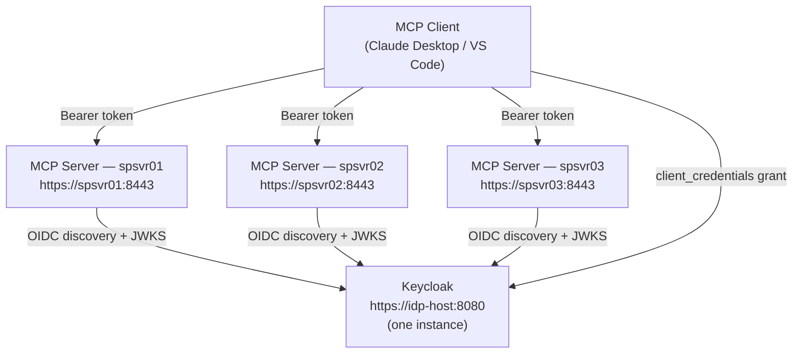

# Local Mock Identity Provider & OAuth 2 — Testing, Training & Demo

> **⚠ NOT FOR PRODUCTION.** This guide describes a self-signed OIDC environment built on [Keycloak](https://www.keycloak.org/) running in Docker. It is suitable only for testing, training, and demo purposes. Do not use self-signed certificates or development-mode Keycloak in any environment reachable from untrusted networks.

This guide covers two scenarios:

- **Part A — Single server** (Steps 1–7): one MCP server on `localhost`. No network access required. Complete this first — Part B builds on it.
- **Part B — Multiple co-located servers** (Steps S-1–S-7): one shared Keycloak instance serving multiple MCP servers on separate hosts (Topology A). Requires network reachability between hosts.

Both parts use the same Keycloak realm, scopes, and client configured in Step 3. No external IdP account, corporate network, or firewall change is needed.

---

## Table of Contents

- [Prerequisites](#prerequisites)
- [Part A — Single Server Setup](#part-a--single-server-setup)
  - [What you will have at the end](#what-you-will-have-at-the-end)
  - [Step 1 — Create a local self-signed CA and certificates](#step-1--create-a-local-self-signed-ca-and-certificates)
  - [Step 2 — Start Keycloak in development mode](#step-2--start-keycloak-in-development-mode)
  - [Step 3 — Create the `mcp-demo` realm and configure scopes](#step-3--create-the-mcp-demo-realm-and-configure-scopes)
    - [3a–3e Service-account identity](#3a3e--service-account-identity-mcp-client)
      - [3f User identity (optional)](#3f--user-identity-mcp-user-optional)
      - [3g preferred\_username protocol mapper (optional)](#3g--preferred_username-protocol-mapper-optional)
    - [Step 4 — Configure the MCP server `.env`](#step-4--configure-the-mcp-server-env)
    - [Step 5 — Start the MCP server with HTTP transport](#step-5--start-the-mcp-server-with-http-transport)
    - [Step 6 — Obtain a token and verify end-to-end](#step-6--obtain-a-token-and-verify-end-to-end)
      - [6A Service-account token (`client_credentials`)](#6a--service-account-token-client_credentials-grant)
      - [6B User token (`password` grant)](#6b--user-identity-token-password-grant--requires-step-3f)
      - [6C OAuth 2 metadata endpoints](#6c--verify-oauth-2-metadata-endpoints)
    - [Step 7 — MCP client configuration](#step-7--mcp-client-configuration)
- [Part B — Multiple Co-located Servers (Shared IdP)](#part-b--multiple-co-located-servers-shared-idp)
  - [How it works](#how-it-works)
  - [What changes from Part A](#what-changes-from-part-a)
  - [Step S-1 — Choose the IdP host and verify reachability](#step-s-1--choose-the-idp-host-and-verify-reachability)
  - [Step S-2 — Create a shared CA and per-host certificates](#step-s-2--create-a-shared-ca-and-per-host-certificates)
  - [Step S-3 — Distribute the CA and server certificates](#step-s-3--distribute-the-ca-and-server-certificates)
  - [Step S-4 — Start Keycloak bound to all interfaces](#step-s-4--start-keycloak-bound-to-all-interfaces)
  - [Step S-5 — Configure each MCP server `.env`](#step-s-5--configure-each-mcp-server-env)
  - [Step S-6 — Start each MCP server and verify](#step-s-6--start-each-mcp-server-and-verify)
  - [Step S-7 — MCP client configuration for the shared IdP](#step-s-7--mcp-client-configuration-for-the-shared-idp)
- [Teardown](#teardown)
  - [Part A — single server](#part-a--single-server)
  - [Part B — shared multi-server](#part-b--shared-multi-server)
- [Troubleshooting](#troubleshooting)
- [Related Documentation](#related-documentation)

---

## Prerequisites

- Docker Engine 24+ (or Docker Desktop) running on the test host
- `openssl` 1.1+ on PATH
- `curl` on PATH
- The MCP server virtual environment already installed (`pip install -e ".[sse]"`)

---

## Part A — Single Server Setup

### What you will have at the end

| Component | Address | Purpose |
|-----------|---------|---------|
| Keycloak (dev mode) | `https://localhost:8080` | Issues OIDC tokens; hosts the `mcp-demo` realm |
| Self-signed CA | `/opt/sp-mcp-server/certs/ca.crt` | Signs both the Keycloak and MCP server TLS certificates |
| MCP server TLS cert | `/opt/sp-mcp-server/certs/server.crt` | Used by `SP_TLS_CERT` / `SP_TLS_KEY` |
| Service-account client | `mcp-client` in Keycloak | Obtains tokens via `client_credentials` grant (machine identity) |
| Demo user identity | `mcp-user` in Keycloak | Obtains tokens via `password` grant (human identity — Step 3f) |
| OAuth 2 metadata | `/.well-known/oauth-authorization-server` on MCP server | MCP 2025-03 auto-discovery endpoint (OA-1) — Step 6C |
| Protected-resource metadata | `/.well-known/oauth-protected-resource` on MCP server | RFC 9470 discovery (OA-6) — Step 6C |

---

### Step 1 — Create a local self-signed CA and certificates

Run as the `mcp-runner` user on the MCP server host:

```bash
mkdir -p /opt/sp-mcp-server/certs
cd /opt/sp-mcp-server/certs
```

**1a — Generate the CA key and self-signed root certificate (10-year validity):**

```bash
openssl genrsa -out ca.key 4096

openssl req -x509 -new -nodes \
  -key ca.key \
  -sha256 -days 3650 \
  -subj "/CN=MCP-Demo-CA/O=Demo/C=US" \
  -out ca.crt
```

**1b — Generate the MCP server TLS key and CSR:**

```bash
openssl genrsa -out server.key 2048

openssl req -new \
  -key server.key \
  -subj "/CN=localhost/O=Demo/C=US" \
  -out server.csr
```

**1c — Sign the server certificate with the CA (SAN covers `localhost` and `127.0.0.1`):**

```bash
cat > server-ext.cnf <<'EOF'
[req]
req_extensions = v3_req
[v3_req]
subjectAltName = @alt_names
[alt_names]
DNS.1 = localhost
IP.1  = 127.0.0.1
EOF

openssl x509 -req \
  -in server.csr \
  -CA ca.crt -CAkey ca.key -CAcreateserial \
  -out server.crt \
  -days 825 -sha256 \
  -extfile server-ext.cnf -extensions v3_req
```

**1d — Generate a Keycloak TLS key and certificate (signed by the same CA):**

```bash
openssl genrsa -out keycloak.key 2048

openssl req -new \
  -key keycloak.key \
  -subj "/CN=localhost/O=Demo/C=US" \
  -out keycloak.csr

openssl x509 -req \
  -in keycloak.csr \
  -CA ca.crt -CAkey ca.key -CAcreateserial \
  -out keycloak.crt \
  -days 825 -sha256 \
  -extfile server-ext.cnf -extensions v3_req
```

**1e — Verify the certificate chain:**

```bash
openssl verify -CAfile ca.crt server.crt
openssl verify -CAfile ca.crt keycloak.crt
# Expected: server.crt: OK  /  keycloak.crt: OK
```

---

### Step 2 — Start Keycloak in development mode

Run Keycloak as a detached Docker container, mounting the certificates from Step 1:

```bash
docker run -d \
  --name keycloak-mcp-demo \
  --restart unless-stopped \
  -p 127.0.0.1:8080:8443 \
  -e KEYCLOAK_ADMIN=admin \
  -e KEYCLOAK_ADMIN_PASSWORD=admin \
  -e KC_HTTPS_CERTIFICATE_FILE=/opt/keycloak/conf/keycloak.crt \
  -e KC_HTTPS_CERTIFICATE_KEY_FILE=/opt/keycloak/conf/keycloak.key \
  -v /opt/sp-mcp-server/certs/keycloak.crt:/opt/keycloak/conf/keycloak.crt:ro \
  -v /opt/sp-mcp-server/certs/keycloak.key:/opt/keycloak/conf/keycloak.key:ro \
  quay.io/keycloak/keycloak:26.0 \
  start-dev --https-port=8443
```

> The `-p 127.0.0.1:8080:8443` binding limits Keycloak to loopback only. For multi-server use (Part B), change this to `-p 0.0.0.0:8080:8443`.

Wait for Keycloak to become ready (usually 20–30 seconds):

```bash
until curl -sk https://localhost:8080/health/ready | grep -q '"status":"UP"'; do
  echo "Waiting for Keycloak..."; sleep 3
done
echo "Keycloak is ready."
```

Verify the OIDC discovery document is reachable:

```bash
curl --cacert /opt/sp-mcp-server/certs/ca.crt \
  https://localhost:8080/realms/master/.well-known/openid-configuration \
  | python3 -m json.tool | head -5
```

---

### Step 3 — Create the `mcp-demo` realm and configure scopes

> **Shared step.** In Part B (multi-server), this step is performed once on `idp-host` after Step S-4. The commands are identical.

Use the Keycloak Admin CLI (`kcadm.sh`) inside the running container via `docker exec`:

#### 3a–3e — Service-account identity (`mcp-client`)

**3a — Log in to the Admin CLI:**

```bash
docker exec keycloak-mcp-demo \
  /opt/keycloak/bin/kcadm.sh config credentials \
    --server https://localhost:8443 \
    --realm master \
    --user admin \
    --password admin \
    --truststore /opt/keycloak/conf/keycloak.crt \
    --truststoreType PEM
```

**3b — Create the `mcp-demo` realm:**

```bash
docker exec keycloak-mcp-demo \
  /opt/keycloak/bin/kcadm.sh create realms \
    --set realm=mcp-demo \
    --set enabled=true
```

**3c — Create the five `mcp:*` client scopes:**

```bash
for SCOPE in mcp:read mcp:operator mcp:storage mcp:policy mcp:system; do
  docker exec keycloak-mcp-demo \
    /opt/keycloak/bin/kcadm.sh create client-scopes \
      -r mcp-demo \
      --set "name=${SCOPE}" \
      --set "protocol=openid-connect" \
      --set 'attributes={"include.in.token.scope":"true"}'
done
```

**3d — Create the `mcp-client` service account (client_credentials grant only):**

```bash
docker exec keycloak-mcp-demo \
  /opt/keycloak/bin/kcadm.sh create clients \
    -r mcp-demo \
    --set clientId=mcp-client \
    --set enabled=true \
    --set "secret=mcp-client-secret" \
    --set serviceAccountsEnabled=true \
    --set publicClient=false \
    --set "standardFlowEnabled=false" \
    --set "directAccessGrantsEnabled=false"
```

**3e — Assign all five scopes to the client as optional scopes:**

```bash
# Retrieve the internal client UUID
CLIENT_ID=$(docker exec keycloak-mcp-demo \
  /opt/keycloak/bin/kcadm.sh get clients -r mcp-demo \
    --fields id,clientId \
  | python3 -c "
import sys, json
clients = json.load(sys.stdin)
print(next(c['id'] for c in clients if c['clientId'] == 'mcp-client'))
")

for SCOPE in mcp:read mcp:operator mcp:storage mcp:policy mcp:system; do
  SCOPE_ID=$(docker exec keycloak-mcp-demo \
    /opt/keycloak/bin/kcadm.sh get client-scopes -r mcp-demo \
      --fields id,name \
    | python3 -c "
import sys, json
scopes = json.load(sys.stdin)
print(next(s['id'] for s in scopes if s['name'] == '${SCOPE}'))
")
  docker exec keycloak-mcp-demo \
    /opt/keycloak/bin/kcadm.sh create \
      clients/${CLIENT_ID}/optional-client-scopes/${SCOPE_ID} \
      -r mcp-demo
done
```

#### 3f — User identity (`mcp-user`) — optional

> Skip this sub-step if you only need machine-to-machine (`client_credentials`) access. Complete it whenever you want to authenticate as a named human user with a username and password.

First, enable the Resource Owner Password Credentials grant on `mcp-client` so it can issue tokens for real users:

```bash
# Retrieve the internal client UUID (skip if CLIENT_ID is already set from 3e)
CLIENT_ID=$(docker exec keycloak-mcp-demo \
  /opt/keycloak/bin/kcadm.sh get clients -r mcp-demo \
    --fields id,clientId \
  | python3 -c "
import sys, json
clients = json.load(sys.stdin)
print(next(c['id'] for c in clients if c['clientId'] == 'mcp-client'))
")

docker exec keycloak-mcp-demo \
  /opt/keycloak/bin/kcadm.sh update clients/${CLIENT_ID} \
    -r mcp-demo \
    --set directAccessGrantsEnabled=true
```

> **Security note (demo only).** The password grant is disabled in production Keycloak deployments. Enable it only in this isolated test environment.

Next, create the demo user and set a password:

```bash
# Create the user
docker exec keycloak-mcp-demo \
  /opt/keycloak/bin/kcadm.sh create users \
    -r mcp-demo \
    --set username=mcp-user \
    --set email=mcp-user@demo.local \
    --set firstName=Demo \
    --set lastName=User \
    --set enabled=true

# Set a temporary password (user will NOT be forced to change it in dev mode)
docker exec keycloak-mcp-demo \
  /opt/keycloak/bin/kcadm.sh set-password \
    -r mcp-demo \
    --username mcp-user \
    --new-password mcp-user-pass \
    --temporary false
```

Assign the five `mcp:*` scopes to the user directly (optional — ensures the scopes appear in password-grant tokens without requiring per-request scope negotiation):

```bash
# Retrieve the user's internal UUID
USER_ID=$(docker exec keycloak-mcp-demo \
  /opt/keycloak/bin/kcadm.sh get users -r mcp-demo \
    --fields id,username \
  | python3 -c "
import sys, json
users = json.load(sys.stdin)
print(next(u['id'] for u in users if u['username'] == 'mcp-user'))
")

echo "mcp-user UUID: ${USER_ID}"
```

> The scopes themselves are already attached to `mcp-client` as optional client scopes (Step 3e). When requesting a password-grant token, pass the desired scopes in the `scope` parameter — the same as for `client_credentials`.

To add a second user, repeat the `create users` and `set-password` commands with a different `--set username` value. All other realm and client configuration is shared.

#### 3g — `preferred_username` protocol mapper — optional

> Complete this sub-step only if you want Authorization Code tokens (or password-grant user tokens) to carry the `preferred_username` claim so the MCP server records `authmodel=oidc_bearer` (rather than `authmodel=client_credentials`) in the SP ACTLOG. See [Step 6C](#6c--verify-oauth-2-metadata-endpoints).

```bash
# Retrieve the internal client UUID (skip if CLIENT_ID is already set from 3e/3f)
CLIENT_ID=$(docker exec keycloak-mcp-demo \
  /opt/keycloak/bin/kcadm.sh get clients -r mcp-demo \
    --fields id,clientId \
  | python3 -c "
import sys, json
clients = json.load(sys.stdin)
print(next(c['id'] for c in clients if c['clientId'] == 'mcp-client'))
")

docker exec keycloak-mcp-demo \
  /opt/keycloak/bin/kcadm.sh create \
    clients/${CLIENT_ID}/protocol-mappers/models \
    -r mcp-demo \
    --set "name=preferred_username" \
    --set "protocol=openid-connect" \
    --set "protocolMapper=oidc-usermodel-property-mapper" \
    --set 'config={"user.attribute":"username","claim.name":"preferred_username","jsonType.label":"String","id.token.claim":"true","access.token.claim":"true","userinfo.token.claim":"true"}'
```

After this, tokens issued for `mcp-user` (via the `password` grant) include `"preferred_username": "mcp-user"` and the MCP server records `authmodel=oidc_bearer` in ACTLOG entries.

---

### Step 4 — Configure the MCP server `.env`

Add the following to `/opt/sp-mcp-server/.env` (keep all existing SP connection variables):

```dotenv
# ── Local mock IdP (testing / demo only) ──────────────────────────────────
SP_OIDC_ISSUER=https://localhost:8080/realms/mcp-demo
SP_OIDC_AUDIENCE=mcp-client

# TLS — server cert signed by the local CA
SP_TLS_CERT=/opt/sp-mcp-server/certs/server.crt
SP_TLS_KEY=/opt/sp-mcp-server/certs/server.key

# ── OA-6: public URL for OAuth 2 protected-resource metadata ──────────────
SP_MCP_PUBLIC_URL=https://localhost:8443

# ── OA-2: JWKS cache TTL — Keycloak does not auto-rotate by default, 3600 is fine
SP_OIDC_JWKS_TTL=3600
```

**Add the CA to the OS trust store** so Python's `ssl` module trusts Keycloak's TLS certificate when fetching OIDC metadata:

```bash
# RHEL / Rocky / CentOS
sudo cp /opt/sp-mcp-server/certs/ca.crt \
  /etc/pki/ca-trust/source/anchors/mcp-demo-ca.crt
sudo update-ca-trust

# Ubuntu / Debian
sudo cp /opt/sp-mcp-server/certs/ca.crt \
  /usr/local/share/ca-certificates/mcp-demo-ca.crt
sudo update-ca-certificates
```

> Alternatively, set `SSL_CERT_FILE=/opt/sp-mcp-server/certs/ca.crt` in the process environment before starting the server.

---

### Step 5 — Start the MCP server with HTTP transport

```bash
cd /opt/sp-mcp-server
source .venv/bin/activate
python3 -m sp_mcp_server.main \
  --transport http \
  --port 8443 \
  --mode full
```

Expected startup log (no errors):

```
INFO: NET-1: Session security check passed ...
INFO: RG-5: TLS configured — cert=/opt/sp-mcp-server/certs/server.crt
INFO: OIDC: Loaded issuer metadata from https://localhost:8080/realms/mcp-demo
INFO: OA-1: AS metadata cached from https://localhost:8080/realms/mcp-demo
INFO: OA-4: IdP PKCE capability check passed (S256 supported).
INFO: Uvicorn running on https://0.0.0.0:8443
```

> Keycloak in development mode supports PKCE S256 by default, so the OA-4 check will pass without any additional configuration.

---

### Step 6 — Obtain a token and verify end-to-end

#### 6A — Service-account token (`client_credentials` grant)

**6a — Request a token as the service account:**

```bash
TOKEN=$(curl -s \
  --cacert /opt/sp-mcp-server/certs/ca.crt \
  -d "client_id=mcp-client" \
  -d "client_secret=mcp-client-secret" \
  -d "grant_type=client_credentials" \
  -d "scope=mcp:read" \
  https://localhost:8080/realms/mcp-demo/protocol/openid-connect/token \
  | python3 -c "import sys,json; print(json.load(sys.stdin)['access_token'])")

echo "Token obtained: ${TOKEN:0:40}..."
```

Repeat with `scope=mcp:system` for full-access tests.

**6b — Inspect service-account token claims (optional):**

```bash
echo "${TOKEN}" | cut -d'.' -f2 | \
  python3 -c "
import sys, base64, json
payload = sys.stdin.read().strip()
payload += '=' * (4 - len(payload) % 4)
print(json.dumps(json.loads(base64.urlsafe_b64decode(payload)), indent=2))
" | grep -E '"scope"|"iss"|"aud"|"exp"'
```

Expected output (values will differ):

```json
  "iss": "https://localhost:8080/realms/mcp-demo",
  "aud": "mcp-client",
  "scope": "mcp:read",
  "exp": 1740000000
```

**6c — Health check the MCP server:**

```bash
curl --cacert /opt/sp-mcp-server/certs/ca.crt \
  https://localhost:8443/health
# Expected: {"status":"ok"}
```

**6d — Make an authenticated tool call as the service account:**

```bash
curl --cacert /opt/sp-mcp-server/certs/ca.crt \
  -H "Authorization: Bearer ${TOKEN}" \
  https://localhost:8443/mcp/sse
# Expected: SSE stream opens; first event is the tools/list response
```

---

#### 6B — User identity token (`password` grant) — requires Step 3f

**6e — Request a token as `mcp-user`:**

```bash
USER_TOKEN=$(curl -s \
  --cacert /opt/sp-mcp-server/certs/ca.crt \
  -d "client_id=mcp-client" \
  -d "client_secret=mcp-client-secret" \
  -d "grant_type=password" \
  -d "username=mcp-user" \
  -d "password=mcp-user-pass" \
  -d "scope=mcp:read" \
  https://localhost:8080/realms/mcp-demo/protocol/openid-connect/token \
  | python3 -c "import sys,json; print(json.load(sys.stdin)['access_token'])")

echo "User token obtained: ${USER_TOKEN:0:40}..."
```

> If Keycloak returns `{"error":"unauthorized_client","error_description":"Client not enabled for direct access grants"}`, you skipped Step 3f — run the `update clients` command there first.

**6f — Inspect user token claims (optional):**

```bash
echo "${USER_TOKEN}" | cut -d'.' -f2 | \
  python3 -c "
import sys, base64, json
payload = sys.stdin.read().strip()
payload += '=' * (4 - len(payload) % 4)
print(json.dumps(json.loads(base64.urlsafe_b64decode(payload)), indent=2))
" | grep -E '"scope"|"iss"|"preferred_username"|"sub"|"exp"'
```

Expected output (values will differ):

```json
  "iss": "https://localhost:8080/realms/mcp-demo",
  "preferred_username": "mcp-user",
  "sub": "<uuid>",
  "scope": "mcp:read",
  "exp": 1740000000
```

Note `preferred_username` and `sub` — these are the user-specific claims absent from service-account tokens.

**6g — Make an authenticated tool call as the user:**

```bash
curl --cacert /opt/sp-mcp-server/certs/ca.crt \
  -H "Authorization: Bearer ${USER_TOKEN}" \
  https://localhost:8443/mcp/sse
# Expected: SSE stream opens; first event is the tools/list response
```

---

#### 6C — Verify OAuth 2 metadata endpoints

Run these after Step 6A to confirm OA-1 and OA-6 are working:

```bash
# OA-1: AS metadata (MCP 2025-03 auto-discovery)
curl --cacert /opt/sp-mcp-server/certs/ca.crt \
  https://localhost:8443/.well-known/oauth-authorization-server \
  | python3 -m json.tool
# Expected: JSON with token_endpoint, jwks_uri, code_challenge_methods_supported: ["S256"]

# OA-6: Protected-resource metadata (RFC 9470)
curl --cacert /opt/sp-mcp-server/certs/ca.crt \
  https://localhost:8443/.well-known/oauth-protected-resource \
  | python3 -m json.tool
# Expected: {"resource":"https://localhost:8443","authorization_servers":["https://localhost:8080/realms/mcp-demo"],...}

# OA-6: resource_metadata in 401 WWW-Authenticate header
curl -v --cacert /opt/sp-mcp-server/certs/ca.crt \
  https://localhost:8443/mcp/sse 2>&1 | grep "WWW-Authenticate"
# Expected: Bearer realm="sp-mcp-server", resource_metadata="https://localhost:8443/.well-known/oauth-protected-resource"
```

**Verify ACTLOG auth model attribution (requires Step 3g):**

After a tool call using the user token from Step 6e, query the SP ACTLOG:

```
QUERY ACTLOG SEARCH=authmodel=oidc_bearer BEGINDATE=TODAY
```

Expected entry:

```
MCP_AUDIT user=mcp-user authmodel=oidc_bearer tool=query_status priv=any corr=<uuid>
```

For service-account tokens (Step 6a):

```
QUERY ACTLOG SEARCH=authmodel=client_credentials BEGINDATE=TODAY
```

---

### Step 7 — MCP client configuration

**Pre-obtained token (service account or user identity):**

```json
{
  "mcpServers": {
    "sp-mcp-local-demo": {
      "url": "https://localhost:8443/mcp/sse",
      "headers": {
        "Authorization": "Bearer <token-from-step-6a-or-6e>"
      }
    }
  }
}
```

**MCP 2025-03 auto-discovery (client handles OAuth flow — requires Step 3g for user auth):**

```json
{
  "mcpServers": {
    "sp-mcp-local-demo": {
      "url": "https://localhost:8443"
    }
  }
}
```

For automated test scripts, obtain the token programmatically (Step 6a or 6e) and pass it as an environment variable or argument.

---

## Part B — Multiple Co-located Servers (Shared IdP)

A single Keycloak instance can issue tokens for all MCP servers in a co-located multi-server environment (Topology A — one MCP server process per SP server host). The Realm, scopes, and client created in Step 3 are shared — no per-server Keycloak configuration is needed.

### How it works



- Keycloak runs on **one designated host** (`idp-host`) — this can be one of the SP server hosts, the MCP client workstation, or any reachable demo machine.
- Each MCP server process independently fetches the OIDC discovery document from `SP_OIDC_ISSUER` at startup to load signing keys.
- Each MCP server has its **own TLS certificate** covering its hostname, but all certificates are signed by the same demo CA.
- A single token obtained from Keycloak is valid for all MCP servers — the `scope` claim controls which tools are available on each.

### What changes from Part A

| Item | Part A (single server) | Part B (shared, multi-server) |
|------|------------------------|-------------------------------|
| Keycloak host | `localhost` | `idp-host` (real hostname or IP) |
| Keycloak port binding | `127.0.0.1:8080` (loopback only) | `0.0.0.0:8080` (all interfaces) |
| Keycloak cert SAN | `DNS:localhost, IP:127.0.0.1` | `DNS:idp-host, IP:<idp-ip>` |
| MCP server cert SAN | `DNS:localhost, IP:127.0.0.1` | Per host: `DNS:spsvr01`, `DNS:spsvr02`, etc. |
| `SP_OIDC_ISSUER` in `.env` | `https://localhost:8080/realms/mcp-demo` | `https://idp-host:8080/realms/mcp-demo` (same on all hosts) |
| CA distribution | Local host only | All SP server hosts + MCP client workstation |
| Realm / scopes / client | Configured once locally | Configured once on `idp-host` (Step 3 applies unchanged) |

---

### Step S-1 — Choose the IdP host and verify reachability

Pick the host that will run Keycloak and note its hostname and IP. Replace `idp-host` and `<idp-ip>` throughout Part B with these values.

Verify that every SP server host can reach `idp-host` on port 8080:

```bash
# Run on each SP server host — must succeed before proceeding
nc -zv idp-host 8080
```

---

### Step S-2 — Create a shared CA and per-host certificates

Run on `idp-host`. All certificates are created in a shared directory:

```bash
mkdir -p /opt/sp-mcp-demo/certs
cd /opt/sp-mcp-demo/certs
```

**S-2a — Generate the shared CA:**

```bash
openssl genrsa -out ca.key 4096

openssl req -x509 -new -nodes \
  -key ca.key \
  -sha256 -days 3650 \
  -subj "/CN=MCP-Demo-CA/O=Demo/C=US" \
  -out ca.crt
```

**S-2b — Create the SAN extension config for the Keycloak host:**

```bash
cat > idp-ext.cnf <<EOF
[req]
req_extensions = v3_req
[v3_req]
subjectAltName = @alt_names
[alt_names]
DNS.1 = idp-host
IP.1  = <idp-ip>
EOF
```

Replace `idp-host` and `<idp-ip>` with the actual values for the Keycloak host.

**S-2c — Generate and sign the Keycloak certificate:**

```bash
openssl genrsa -out keycloak.key 2048

openssl req -new \
  -key keycloak.key \
  -subj "/CN=idp-host/O=Demo/C=US" \
  -out keycloak.csr

openssl x509 -req \
  -in keycloak.csr \
  -CA ca.crt -CAkey ca.key -CAcreateserial \
  -out keycloak.crt \
  -days 825 -sha256 \
  -extfile idp-ext.cnf -extensions v3_req
```

**S-2d — Generate one TLS certificate per SP server host:**

Repeat the following block for each SP server host, substituting its hostname and IP:

```bash
SERVER=spsvr01          # replace for each host
SERVER_IP=<spsvr01-ip>  # replace for each host

cat > ${SERVER}-ext.cnf <<EOF
[req]
req_extensions = v3_req
[v3_req]
subjectAltName = @alt_names
[alt_names]
DNS.1 = ${SERVER}
DNS.2 = ${SERVER}.corp.example.com
IP.1  = ${SERVER_IP}
EOF

openssl genrsa -out ${SERVER}.key 2048

openssl req -new \
  -key ${SERVER}.key \
  -subj "/CN=${SERVER}/O=Demo/C=US" \
  -out ${SERVER}.csr

openssl x509 -req \
  -in ${SERVER}.csr \
  -CA ca.crt -CAkey ca.key -CAcreateserial \
  -out ${SERVER}.crt \
  -days 825 -sha256 \
  -extfile ${SERVER}-ext.cnf -extensions v3_req
```

**S-2e — Verify all certificates before distributing:**

```bash
for CRT in keycloak.crt spsvr01.crt spsvr02.crt; do
  echo -n "${CRT}: "; openssl verify -CAfile ca.crt ${CRT}
done
# Expected: keycloak.crt: OK  /  spsvr01.crt: OK  /  spsvr02.crt: OK
```

---

### Step S-3 — Distribute the CA and server certificates

The CA must be trusted on every host that runs an MCP server or the MCP client. Each host's TLS certificate goes only to that host.

**Distribute the CA cert to every SP server host:**

```bash
for HOST in spsvr01.corp.example.com spsvr02.corp.example.com; do
  ssh mcp-runner@${HOST} "mkdir -p /opt/sp-mcp-server/certs"
  scp /opt/sp-mcp-demo/certs/ca.crt \
    mcp-runner@${HOST}:/opt/sp-mcp-server/certs/ca.crt
done
```

**Distribute each host's TLS cert and key:**

```bash
scp /opt/sp-mcp-demo/certs/spsvr01.{crt,key} \
  mcp-runner@spsvr01.corp.example.com:/opt/sp-mcp-server/certs/

scp /opt/sp-mcp-demo/certs/spsvr02.{crt,key} \
  mcp-runner@spsvr02.corp.example.com:/opt/sp-mcp-server/certs/
```

**Add the CA to the OS trust store on every SP server host and the MCP client workstation:**

```bash
# RHEL / Rocky / CentOS — run on each host
sudo cp /opt/sp-mcp-server/certs/ca.crt \
  /etc/pki/ca-trust/source/anchors/mcp-demo-ca.crt
sudo update-ca-trust

# Ubuntu / Debian — run on each host
sudo cp /opt/sp-mcp-server/certs/ca.crt \
  /usr/local/share/ca-certificates/mcp-demo-ca.crt
sudo update-ca-certificates
```

---

### Step S-4 — Start Keycloak bound to all interfaces

Start Keycloak on `idp-host`, binding to all interfaces so SP server hosts on other machines can reach it:

```bash
docker run -d \
  --name keycloak-mcp-demo \
  --restart unless-stopped \
  -p 0.0.0.0:8080:8443 \
  -e KEYCLOAK_ADMIN=admin \
  -e KEYCLOAK_ADMIN_PASSWORD=admin \
  -e KC_HTTPS_CERTIFICATE_FILE=/opt/keycloak/conf/keycloak.crt \
  -e KC_HTTPS_CERTIFICATE_KEY_FILE=/opt/keycloak/conf/keycloak.key \
  -v /opt/sp-mcp-demo/certs/keycloak.crt:/opt/keycloak/conf/keycloak.crt:ro \
  -v /opt/sp-mcp-demo/certs/keycloak.key:/opt/keycloak/conf/keycloak.key:ro \
  quay.io/keycloak/keycloak:26.0 \
  start-dev --https-port=8443
```

Verify reachability from `idp-host` and from a remote SP server host:

```bash
# From idp-host
curl --cacert /opt/sp-mcp-demo/certs/ca.crt \
  https://idp-host:8080/health/ready

# From spsvr01 (CA already in OS trust store after Step S-3)
curl https://idp-host:8080/health/ready

# Expected on both: {"status":"UP"}
```

Now run **Step 3** (3a–3e) on `idp-host` to create the `mcp-demo` realm, scopes, and `mcp-client`. Use `https://localhost:8443` as the `--server` argument since you are running `docker exec` on `idp-host` itself. These are configured **once** and shared by all MCP servers.

---

### Step S-5 — Configure each MCP server `.env`

On every SP server host, `SP_OIDC_ISSUER` is the same shared Keycloak address. Only the TLS cert/key paths differ per host.

**`/opt/sp-mcp-server/.env` on `spsvr01`:**

```dotenv
# ── Local mock IdP — shared (testing / demo only) ─────────────────────────
SP_OIDC_ISSUER=https://idp-host:8080/realms/mcp-demo
SP_OIDC_AUDIENCE=mcp-client

SP_TLS_CERT=/opt/sp-mcp-server/certs/spsvr01.crt
SP_TLS_KEY=/opt/sp-mcp-server/certs/spsvr01.key
```

**`/opt/sp-mcp-server/.env` on `spsvr02`:** — identical except:

```dotenv
SP_TLS_CERT=/opt/sp-mcp-server/certs/spsvr02.crt
SP_TLS_KEY=/opt/sp-mcp-server/certs/spsvr02.key
```

---

### Step S-6 — Start each MCP server and verify

Start the HTTP transport on each SP server host:

```bash
cd /opt/sp-mcp-server
source .venv/bin/activate
python3 -m sp_mcp_server.main --transport http --port 8443 --mode full
```

Obtain a token from the shared Keycloak (from the MCP client workstation or any host with the CA trusted):

```bash
TOKEN=$(curl -s \
  --cacert /opt/sp-mcp-demo/certs/ca.crt \
  -d "client_id=mcp-client" \
  -d "client_secret=mcp-client-secret" \
  -d "grant_type=client_credentials" \
  -d "scope=mcp:system" \
  https://idp-host:8080/realms/mcp-demo/protocol/openid-connect/token \
  | python3 -c "import sys,json; print(json.load(sys.stdin)['access_token'])")

# Verify each MCP server (CA already trusted by OS after Step S-3)
curl -H "Authorization: Bearer ${TOKEN}" https://spsvr01:8443/health
curl -H "Authorization: Bearer ${TOKEN}" https://spsvr02:8443/health
# Expected: {"status":"ok"} from each
```

---

### Step S-7 — MCP client configuration for the shared IdP

Register each MCP server as a separate entry in `claude_desktop_config.json`. All entries use the same token — the `scope` claim in the token controls which tools are available on each server:

```json
{
  "mcpServers": {
    "sp-mcp-spsvr01": {
      "url": "https://spsvr01:8443/mcp/sse",
      "headers": { "Authorization": "Bearer <token-from-step-s-6>" }
    },
    "sp-mcp-spsvr02": {
      "url": "https://spsvr02:8443/mcp/sse",
      "headers": { "Authorization": "Bearer <token-from-step-s-6>" }
    }
  }
}
```

---

## Teardown

### Part A — single server

```bash
# Stop and remove Keycloak
docker stop keycloak-mcp-demo && docker rm keycloak-mcp-demo

# Remove certificates
rm -rf /opt/sp-mcp-server/certs

# Revert .env — remove the lines added in Step 4:
#   SP_OIDC_ISSUER, SP_OIDC_AUDIENCE, SP_TLS_CERT, SP_TLS_KEY
```

### Part B — shared multi-server

```bash
# Stop and remove Keycloak on idp-host
docker stop keycloak-mcp-demo && docker rm keycloak-mcp-demo

# Remove the shared cert directory on idp-host
rm -rf /opt/sp-mcp-demo/certs

# On each SP server host — remove certs and revert .env
rm -rf /opt/sp-mcp-server/certs
# Remove SP_OIDC_ISSUER, SP_OIDC_AUDIENCE, SP_TLS_CERT, SP_TLS_KEY from .env
```

---

## Troubleshooting

| Symptom | Applies to | Likely cause | Fix |
|---------|-----------|-------------|-----|
| `curl: (60) SSL certificate problem` | A, B | CA not trusted by curl | Add `--cacert <path-to-ca.crt>` to the curl command |
| Keycloak `health/ready` returns connection refused | A, B | Container still starting | Wait 30 s and retry |
| `OIDC: failed to fetch issuer metadata` in MCP server log | A, B | CA not trusted by Python's `ssl` module | Add CA to OS trust store (Step 4 / Step S-3) or set `SSL_CERT_FILE=<path-to-ca.crt>` |
| `invalid_client` from token endpoint | A, B | Wrong `client_secret` | Confirm `mcp-client-secret` matches the value set in Step 3d |
| Token `scope` claim is empty | A, B | Scopes not assigned to client | Re-run Step 3e; check optional-client-scopes in the Keycloak admin UI |
| MCP server exits with `SECURITY [RG-5]` | A, B | `SP_TLS_CERT` / `SP_TLS_KEY` path wrong or files missing | Verify paths in `.env` match the cert files created in Step 1 / Step S-2 |
| `connection refused` to `idp-host:8080` from SP server host | B | Keycloak bound to `127.0.0.1` only | Re-run Step S-4 with `-p 0.0.0.0:8080:8443` |
| `SSL certificate problem: unable to get local issuer` on SP server host | B | CA not distributed to that host | Run the CA distribution commands from Step S-3 on the failing host |
| `OIDC: certificate subject/SAN mismatch` | B | Keycloak cert SAN doesn't include `idp-host` | Regenerate the Keycloak certificate (Step S-2c) with the correct SAN |
| MCP server TLS cert rejected by MCP client | B | MCP server cert SAN doesn't match the host's name | Regenerate the per-host certificate (Step S-2d) with the correct SAN |
| One MCP server reaches Keycloak but another cannot | B | Firewall or routing issue between hosts | Verify `nc -zv idp-host 8080` from the failing SP server host |
| Token from shared Keycloak rejected by one MCP server | B | `SP_OIDC_ISSUER` in that host's `.env` still points to `localhost` | Update `.env` on the failing host: `SP_OIDC_ISSUER=https://idp-host:8080/realms/mcp-demo` |
| `{"error":"unauthorized_client","error_description":"Client not enabled for direct access grants"}` | A, B | `directAccessGrantsEnabled` is still `false` on `mcp-client` | Run the `update clients` command in Step 3f to enable the password grant |
| `{"error":"invalid_grant","error_description":"Invalid user credentials"}` | A, B | Wrong username or password in the token request | Confirm `username=mcp-user` and `password=mcp-user-pass` match the values set in Step 3f |
| `{"error":"invalid_grant","error_description":"Account is not fully set up"}` | A, B | User was created with `--temporary true` password | Re-run `set-password` with `--temporary false` (Step 3f) |
| `preferred_username` missing from token claims | A, B | Using `client_credentials` grant instead of `password` grant | Use `grant_type=password` with `username` / `password` parameters (Step 6e) |
| User created but `kcadm.sh get users` returns empty list | A, B | Wrong realm (`-r` flag) | Ensure `-r mcp-demo` is passed; the user lives in `mcp-demo`, not `master` |
| `/.well-known/oauth-authorization-server` returns `503` | A, B | Keycloak not running or `SP_OIDC_ISSUER` wrong | Confirm Keycloak is ready (`curl -sk https://localhost:8080/health/ready`) and `SP_OIDC_ISSUER` matches the realm URL |
| `/.well-known/oauth-protected-resource` shows `"resource": ""` | A, B | `SP_MCP_PUBLIC_URL` not set in `.env` | Add `SP_MCP_PUBLIC_URL=https://localhost:8443` (Step 4) |
| `authmodel=client_credentials` in ACTLOG for user token | A, B | `preferred_username` claim absent from token | Run Step 3g to add the protocol mapper |
| `WARNING: OA-4: IdP does not advertise PKCE S256 support` | A, B | Keycloak client PKCE not configured | In the Keycloak admin console, open `mcp-client` → Advanced → set `PKCE Code Challenge Method = S256` |

---

## Related Documentation

- HTTP/OAuth 2 transport configuration (enterprise): [`configure-guide.md — Part 2`](configure-guide.md)
- Multi-server deployment: [`configure-guide.md — Part 6`](configure-guide.md)
- Installation steps: [`install-guide.md`](install-guide.md)
- OAuth 2 design specification: [`docs/design/security-oauth2.md`](../design/security-oauth2.md)
- OAuth 2 implementation spec: [`docs/implement/impl-security-oauth2.md`](../implement/impl-security-oauth2.md)
- Troubleshooting: [`troubleshoot.md`](troubleshoot.md)
