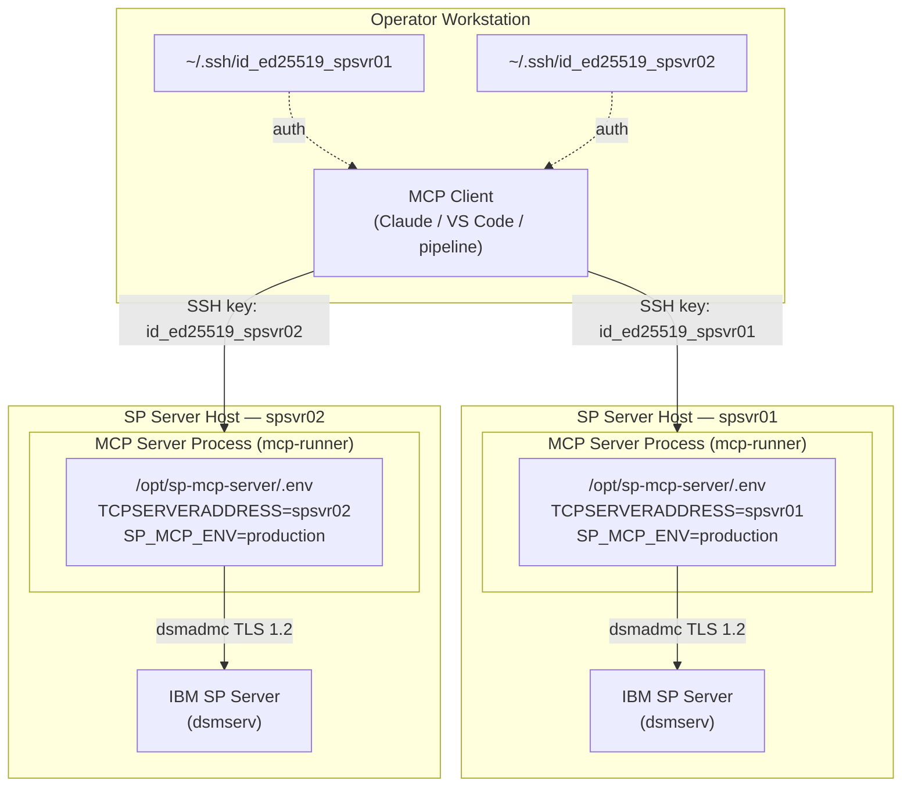
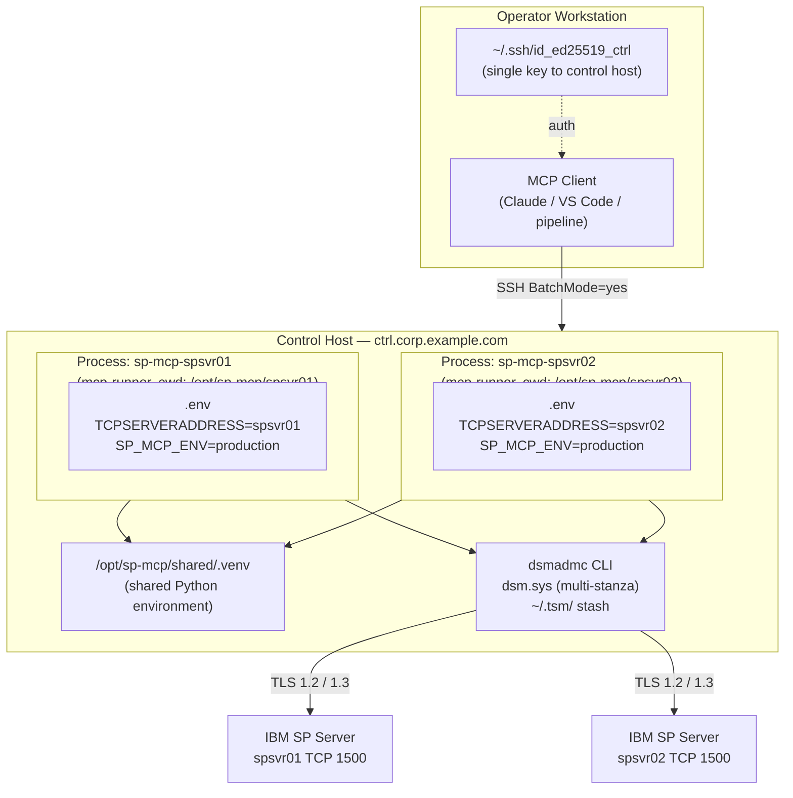

# Planning Guide

This guide helps you plan your IBM Storage Protect MCP Server deployment **before** running any installation or configuration steps. Read and complete this guide first, then follow [`install-guide.md`](install-guide.md) and [`configure-guide.md`](configure-guide.md) for the topology you choose.

---

## Step 1 — Choose a Deployment Topology

The MCP server is a **one-process-to-one-SP-server** unit. Before installing anything, decide where those processes will run.

### Topology A — Co-located

The MCP server process runs **on the same host as the IBM SP server** it manages. The MCP client SSH-es directly to each SP server host to start a process there.



### Topology B — Centralised

All MCP server processes run on a **single dedicated control host**. The MCP client SSH-es only to that one host. Each process runs from its own working directory containing its own `.env` pointing **remotely** at its respective SP server over TCP 1500.



### Topology comparison

| | **Topology A — Co-located** | **Topology B — Centralised** |
|---|---|---|
| **MCP server installed on** | Each SP server host | One dedicated control host |
| **SSH targets** | One per SP server host | One (the control host) |
| **Working directory** | `/opt/sp-mcp-server/` (one per host) | `/opt/sp-mcp/<servername>/` (one per SP server, on the control host) |
| **`dsmadmc` connects to SP server** | Locally (loopback or same LAN segment) | Remotely over TCP 1500 |
| **Offline tools** (`dsmserv` / `servermon`) | ✅ Supported — binaries are local | ❌ Not supported — binaries must run on the SP host |
| **Key management** | One SSH key per SP server host | One SSH key to the control host |
| **SP server host access required** | Yes — SSH access to each SP host | No — only control host needs SSH access |
| **Credential blast radius** | Contained per host — one `.env` per SP server | All `.env` files on one host — stricter OS controls required |
| **Operational overhead** | Higher — install/patch on every SP host | Lower — install/patch once on the control host |
| **Network dependency** | Low — `dsmadmc` talks to local SP process | Higher — TCP 1500 must be open from control host to each SP server |
| **Recommended for** | Environments where SSH access to SP hosts is acceptable and offline tools are needed | Environments with a dedicated management network and no direct access to SP server hosts |

> **Offline tools note:** The `dsmserv` and `servermon` offline diagnostic tools invoke local binaries on the SP server host via `sudo`. They require the SP server binaries to be present on the same machine as the MCP process. Topology B cannot support these tools because the control host does not have the SP server binaries installed.

---

## Step 2 — Inventory Your SP Servers

For each IBM SP server you intend to manage, record the following before proceeding to installation:

| Field | Notes |
|-------|-------|
| SP server hostname / IP | Used as `TCPSERVERADDRESS` in `.env` and in `dsm.sys` |
| SP admin port | Default `1500`; confirm it is not changed |
| SP server name (short label) | Used as `SERVERNAME` in `dsm.sys` (e.g. `SP_SPSVR01`) — must be unique per server |
| MCP server name (for MCP client config) | e.g. `sp-mcp-spsvr01` — becomes the AI agent routing key |
| MCP process host | Topology A: the SP server host itself. Topology B: the control host |
| Tool scope required | `full` / `read-only` / specific modules (`system`, `operations`, `clients`, `policy`, `storage`) |
| Offline tools needed? | Yes → Topology A only. No → either topology |
| SP instance OS user | e.g. `tsminst1` — required only for offline tools (Topology A) |

**Example inventory for three SP servers:**

| SP Server | `TCPSERVERADDRESS` | `SERVERNAME` | MCP entry name | Topology | Scope |
|---|---|---|---|---|---|
| Production primary | `spsvr01.corp.example.com` | `SP_SPSVR01` | `sp-mcp-spsvr01` | A or B | full |
| Production secondary | `spsvr02.corp.example.com` | `SP_SPSVR02` | `sp-mcp-spsvr02` | A or B | full |
| DR / monitoring | `spsvr03.corp.example.com` | `SP_SPSVR03` | `sp-mcp-spsvr03` | A or B | read-only |

---

## Step 3 — Prerequisites Checklist

Verify all prerequisites before starting installation. The required location differs by topology.

### Topology A — prerequisites per SP server host

| Requirement | Detail |
|-------------|--------|
| Python 3.10+ (3.11 recommended) | Must be installable on each SP server host |
| `dsmadmc` CLI | Must be in `PATH` on each SP server host |
| Root / sudo access | Required to create `mcp-runner` OS user and sudoers rule |
| SSH access from MCP client workstation | Required to deploy keys and launch processes |
| IBM SP server running | Reachable on TCP 1500 from the same host |

### Topology B — prerequisites on the control host

| Requirement | Detail |
|-------------|--------|
| Python 3.10+ (3.11 recommended) | Installed once on the control host |
| `dsmadmc` CLI | Installed on the control host; must reach every SP server on TCP 1500 |
| Root / sudo access | Required to create `mcp-runner` OS user on the control host |
| SSH access from MCP client workstation | One key to the control host |
| TCP 1500 open | From control host to **each** SP server — verify with `nc -zv <sp-host> 1500` |
| `dsmadmc` version compatibility | The control host's `dsmadmc` must be compatible with all SP server versions being managed |

### Common prerequisites (both topologies)

| Requirement | Detail |
|-------------|--------|
| IBM SP service accounts | Five per-privilege accounts (`mcp-svc-readonly`, `mcp-svc-operator`, `mcp-svc-storage`, `mcp-svc-policy`, `mcp-svc-system`) must be creatable on each SP server |
| System-privileged SP admin | Required to run `REGISTER ADMIN`, `GRANT AUTHORITY`, and `UPDATE ADMIN` on each SP server |
| MCP client workstation | Where the AI agent (Claude / VS Code / pipeline) runs and where SSH keys are generated |

---

## Step 4 — Plan Your Service Accounts

Five IBM SP service accounts are provisioned on each SP server. Plan the account names and privilege assignments before running `scripts/provision-sp-service-accounts.sh`.

The same account names are reused across SP servers for consistency. They are distinct SP objects on each server with independent passwords.

| Account name | SP privilege class | Tools available | Required for |
|---|---|---|---|
| `mcp-svc-readonly` | Any-admin | All `QUERY` / read-only tools | Any deployment |
| `mcp-svc-operator` | Operator | Operations + read-only | Operations module |
| `mcp-svc-storage` | Storage | Storage management + read-only | Storage module |
| `mcp-svc-policy` | Policy | Policy management + client management + read-only | Policy / clients modules |
| `mcp-svc-system` | System | All tools — broadest scope | System module / full deployment |

> **MFA note:** Service accounts must be set `MFAREQUIRED=NO` because `dsmadmc` running non-interactively cannot satisfy a TOTP challenge. Human administrators must retain `MFAREQUIRED=YES`. This is a documented trade-off compensated by `SESSIONSECURITY=STRICT`, the encrypted password stash, and account lockout policy.

---

## Step 5 — Plan Your `dsm.sys` SERVERNAME Labels

Each SP server needs a unique `SERVERNAME` label in `dsm.sys`. The password stash key is `SERVERNAME` + account ID — collisions cause authentication failures.

Use the short SP server hostname, prefixed with `SP_`, uppercased:

| SP Server | Recommended `SERVERNAME` |
|---|---|
| `spsvr01.corp.example.com` | `SP_SPSVR01` |
| `spsvr02.corp.example.com` | `SP_SPSVR02` |
| `sp-dr.corp.example.com` | `SP_SPDR` |

**Topology A:** one `dsm.sys` per SP server host, each with a single stanza.
**Topology B:** one `dsm.sys` on the control host, one stanza per SP server — all stanza names must be unique within that file.

---

## Step 6 — Plan Your SSH Keys

| Topology | Keys needed | Key naming convention |
|---|---|---|
| **A** | One Ed25519 key per SP server host | `~/.ssh/id_ed25519_<hostname>` — e.g. `id_ed25519_spsvr01` |
| **B** | One Ed25519 key to the control host | `~/.ssh/id_ed25519_ctrl` |

**Topology A key isolation:** A dedicated key per host means a compromised key for one SP server cannot be used to access any other. Do not reuse keys across hosts.

---

## Step 7 — Plan Your MCP Client Configuration Entry Names

The name you give each entry in the MCP client configuration (`mcpServers`) becomes the routing key the AI agent uses to target that SP server in prompts:

```
On sp-mcp-spsvr01, show me all failed backup operations from the last 24 hours.
```

Choose names that are:
- Unambiguous — the AI agent matches server names from prompts
- Consistent — use the same naming convention across all entries
- Descriptive — encode the SP server identity (e.g. `sp-mcp-spsvr01`, `sp-mcp-spdr-readonly`)

---

## Step 8 — Plan Your Tool Scope per SP Server

Each MCP client config entry can independently set `--mode` and `--enable-servers`. Plan this before configuring:

| Entry | `--mode` | `--enable-servers` | Rationale |
|---|---|---|---|
| Production full-admin | `full` | `system,operations,clients,policy,storage` | Full administrative scope |
| Production ops-only | `full` | `operations,clients` | Limit exposure on ops-team shared tool |
| DR / monitoring | `read-only` | *(default: all)* | No write operations permitted on DR server |

---

## Step 9 — Pre-Installation Sign-off

Complete the following before moving to [`install-guide.md`](install-guide.md):

```
[ ] Deployment topology chosen: Topology A (co-located) or Topology B (centralised)
[ ] SP server inventory complete — hostname, port, SERVERNAME label, MCP entry name, scope
[ ] Prerequisites verified for chosen topology (Python, dsmadmc, TCP 1500, access)
[ ] Five service account names confirmed; System-privileged SP admin available to provision them
[ ] dsm.sys SERVERNAME labels planned — unique per SP server, no collisions
[ ] SSH key naming convention decided
[ ] MCP client config entry names decided
[ ] Tool scope (--mode / --enable-servers) decided per SP server
[ ] Offline tools requirement confirmed — if yes, Topology A is required
```

---

## Next Steps

Once this checklist is complete:

1. **[`install-guide.md`](install-guide.md)** — OS user, Python environment, package install, `.env`, service accounts, `dsm.sys`, sudoers (Topology A only), verification
2. **[`configure-guide.md`](configure-guide.md)** — SSH key deployment, MCP client configuration, transport options, multi-server setup

---

## Related Documentation

- Installation: [`install-guide.md`](install-guide.md)
- MCP client configuration: [`configure-guide.md`](configure-guide.md)
- User guide: [`user-guide.md`](user-guide.md)
- Troubleshooting: [`troubleshoot.md`](troubleshoot.md)
- Security — Identity & Credentials: [`../design/security-identity-credentials.md`](../design/security-identity-credentials.md)
- Security — Network: [`../design/security-network.md`](../design/security-network.md)
