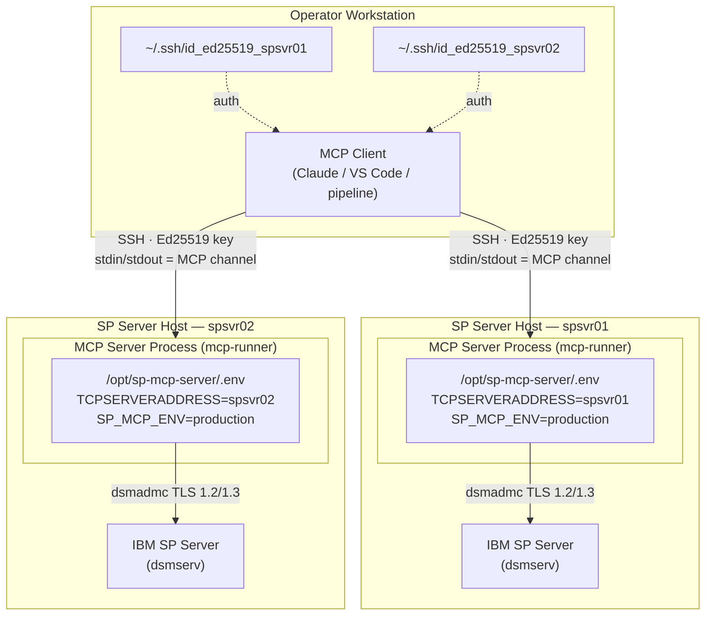
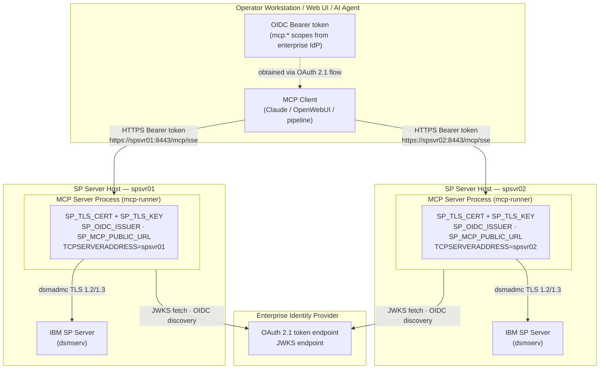
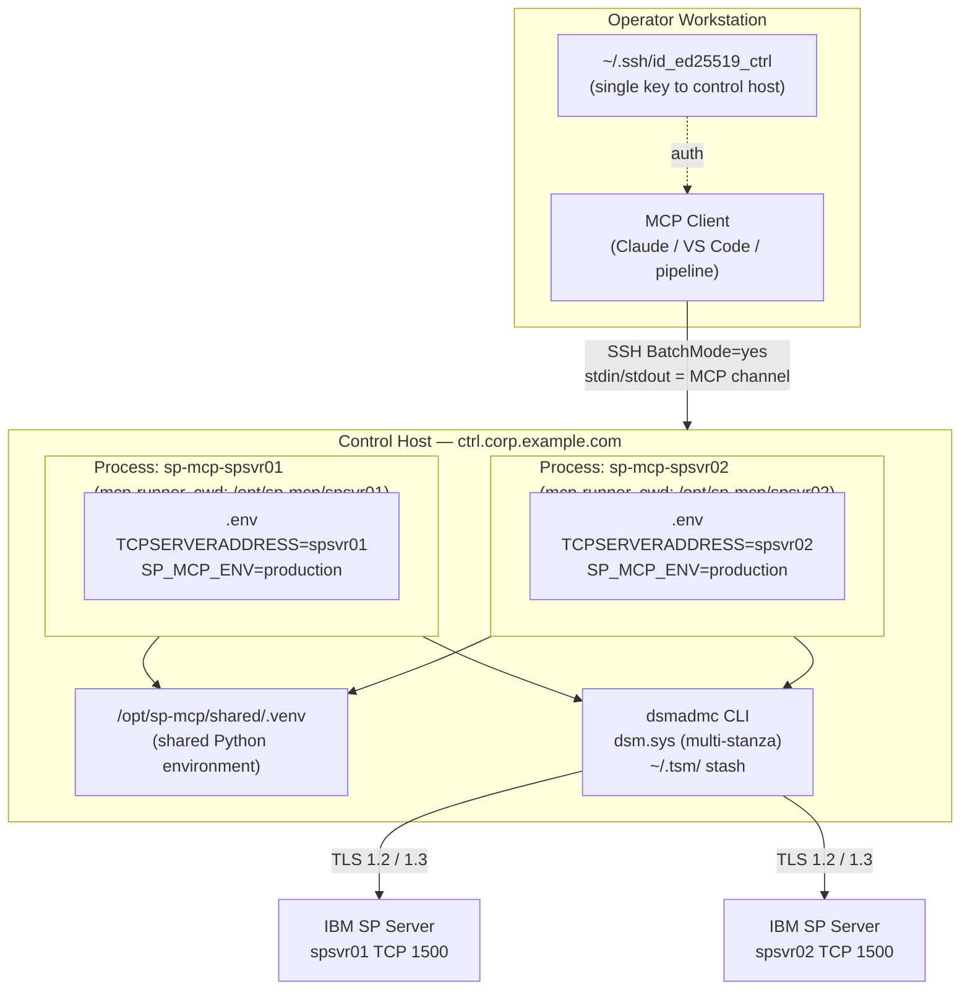
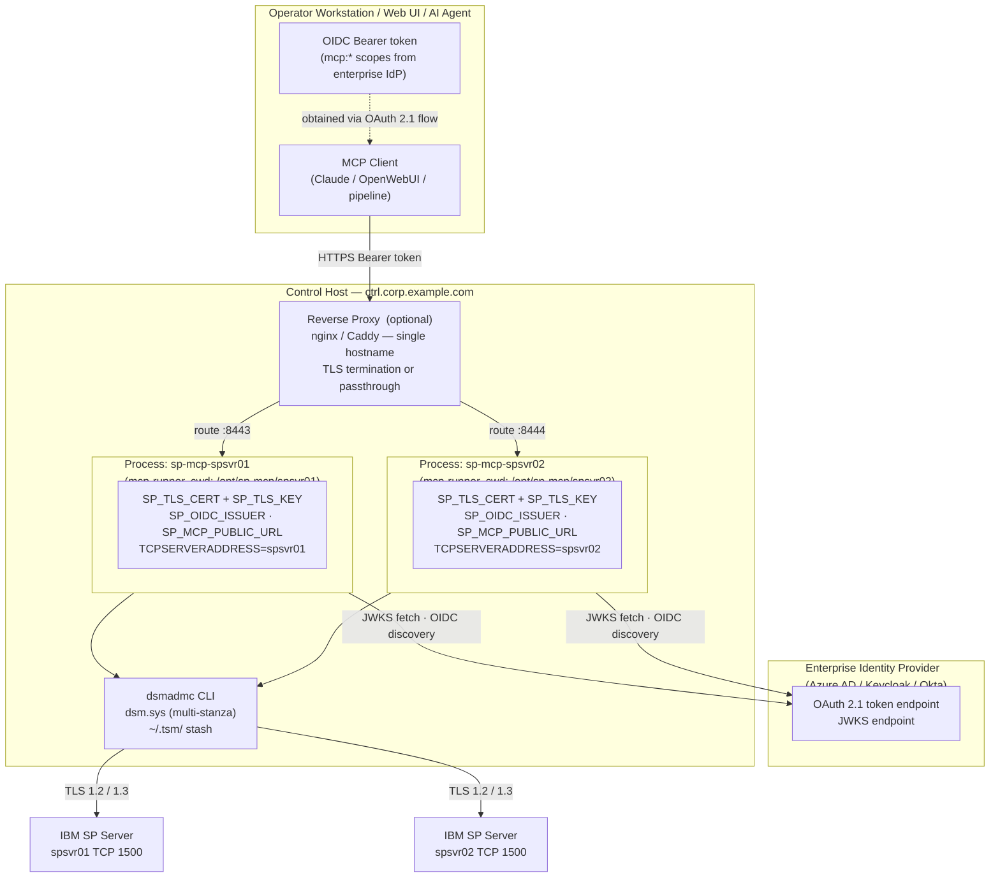
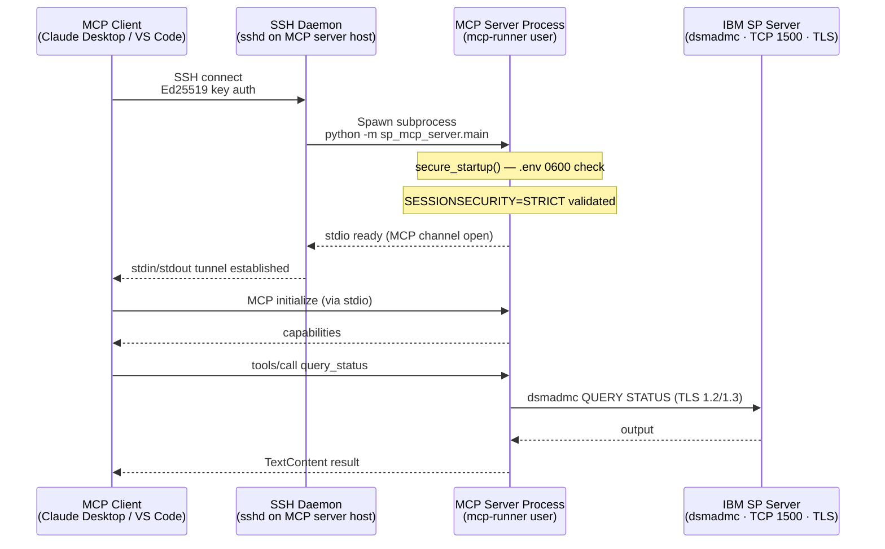
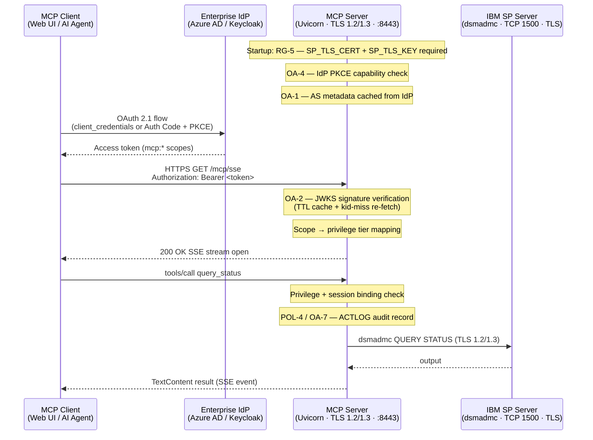
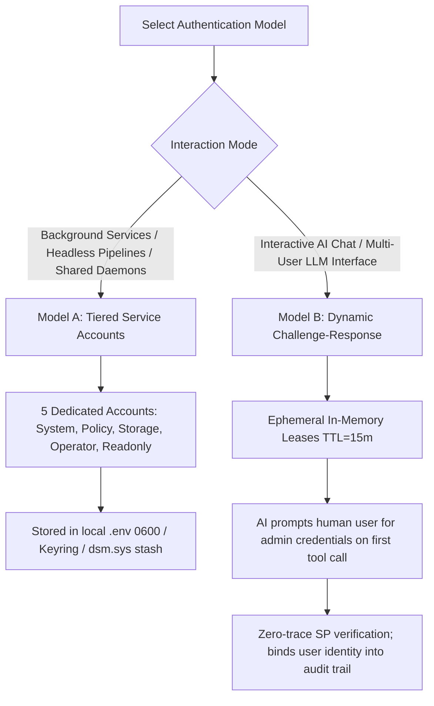

# Planning Guide

This guide helps you plan your IBM Storage Protect MCP Server deployment **before** running any installation or configuration steps. Read and complete this guide first, then follow [`install-guide.md`](install-guide.md) and [`configure-guide.md`](configure-guide.md) for the topology you choose.

---

## Table of Contents

- [Step 1 — Choose a Deployment Topology](#step-1--choose-a-deployment-topology)
  - [Topology A — Co-located](#topology-a--co-located)
    - [Topology A — Transport A (stdio over SSH)](#topology-a--transport-a-stdio-over-ssh)
    - [Topology A — Transport B (streamable-http with TLS)](#topology-a--transport-b-streamable-http-with-tls)
  - [Topology B — Centralised](#topology-b--centralised)
    - [Topology B — Transport A (stdio over SSH)](#topology-b--transport-a-stdio-over-ssh)
    - [Topology B — Transport B (streamable-http with TLS)](#topology-b--transport-b-streamable-http-with-tls)
  - [Topology comparison](#topology-comparison)
- [Step 1.5 — Choose a Transport Protocol](#step-15--choose-a-transport-protocol)
  - [Transport A — stdio over SSH](#transport-a--stdio-over-ssh)
  - [Transport B — streamable-http with TLS](#transport-b--streamable-http-with-tls)
  - [Transport comparison](#transport-comparison)
  - [Topology × Transport matrix](#topology--transport-matrix)
- [Step 2 — Choose an Authentication Model](#step-2--choose-an-authentication-model)
  - [Authentication Models Comparison](#authentication-models-comparison)
- [Step 3 — Inventory Your SP Servers](#step-3--inventory-your-sp-servers)
- [Step 4 — Prerequisites Checklist](#step-4--prerequisites-checklist)
  - [Topology A — prerequisites per SP server host](#topology-a--prerequisites-per-sp-server-host)
  - [Topology B — prerequisites on the control host](#topology-b--prerequisites-on-the-control-host)
  - [Common prerequisites (both topologies)](#common-prerequisites-both-topologies)
- [Step 5 — Plan Your Service Accounts](#step-5--plan-your-service-accounts)
- [Step 6 — Plan Your `dsm.sys` SERVERNAME Labels](#step-6--plan-your-dsmsys-servername-labels)
- [Step 7 — Plan Your SSH Keys](#step-7--plan-your-ssh-keys)
- [Step 8 — Plan Your MCP Client Configuration Entry Names](#step-8--plan-your-mcp-client-configuration-entry-names)
- [Step 9 — Plan Your Tool Scope per SP Server](#step-9--plan-your-tool-scope-per-sp-server)
- [Step 10 — Pre-Installation Sign-off](#step-10--pre-installation-sign-off)
- [Next Steps](#next-steps)
- [Related Documentation](#related-documentation)

---

## Step 1 — Choose a Deployment Topology

The MCP server is a **one-process-to-one-SP-server** unit. Before installing anything, decide where those processes will run.

> Each topology diagram below is shown for **both transport options** — `stdio over SSH` (Transport A) and `streamable-http with TLS` (Transport B). You will choose your transport in [Step 1.5](#step-15--choose-a-transport-protocol); the topology and transport decisions are independent.

### Topology A — Co-located

The MCP server process runs **on the same host as the IBM SP server** it manages.

#### Topology A — Transport A (stdio over SSH)

The MCP client SSH-es directly to each SP server host and spawns a server subprocess there. The SSH stdin/stdout pipe is the MCP protocol channel — no listening port is opened by the MCP server.


```mermaid
graph TB
    subgraph WORKSTATION["Operator Workstation"]
        CLIENT["MCP Client\n(Claude / VS Code / pipeline)"]
        K1["~/.ssh/id_ed25519_spsvr01"]
        K2["~/.ssh/id_ed25519_spsvr02"]
    end

    subgraph SPSVR01["SP Server Host — spsvr01"]
        subgraph MCP1["MCP Server Process  (mcp-runner)\nstdio transport"]
            P1["/opt/sp-mcp-server/.env\nTCPSERVERADDRESS=spsvr01\nSP_MCP_ENV=production"]
        end
        SP1["IBM SP Server\n(dsmserv)"]
        P1 -->|"dsmadmc  TLS 1.2/1.3"| SP1
    end

    subgraph SPSVR02["SP Server Host — spsvr02"]
        subgraph MCP2["MCP Server Process  (mcp-runner)\nstdio transport"]
            P2["/opt/sp-mcp-server/.env\nTCPSERVERADDRESS=spsvr02\nSP_MCP_ENV=production"]
        end
        SP2["IBM SP Server\n(dsmserv)"]
        P2 -->|"dsmadmc  TLS 1.2/1.3"| SP2
    end

    CLIENT -->|"SSH · Ed25519 key\nstdin/stdout = MCP channel"| MCP1
    CLIENT -->|"SSH · Ed25519 key\nstdin/stdout = MCP channel"| MCP2
    K1 -.->|"auth"| CLIENT
    K2 -.->|"auth"| CLIENT
```

#### Topology A — Transport B (streamable-http with TLS)

Each SP server host runs its own MCP server process listening on HTTPS port `8443`. The MCP client presents an OIDC Bearer token; no SSH connection is required for MCP traffic.


```mermaid
graph TB
    subgraph WORKSTATION["Operator Workstation / Web UI / AI Agent"]
        CLIENT["MCP Client\n(Claude / OpenWebUI / pipeline)"]
        IDP_TOKEN["OIDC Bearer token\n(mcp:* scopes from enterprise IdP)"]
    end

    subgraph IDP["Enterprise Identity Provider\n(Azure AD / Keycloak / Okta)"]
        OIDC["OAuth 2.1 token endpoint\nJWKS endpoint"]
    end

    subgraph SPSVR01["SP Server Host — spsvr01"]
        subgraph MCP1["MCP Server Process  (mcp-runner)\nstreamable-http · TLS 1.2/1.3 · :8443"]
            P1["SP_TLS_CERT + SP_TLS_KEY\nSP_OIDC_ISSUER · SP_MCP_PUBLIC_URL\nTCPSERVERADDRESS=spsvr01"]
        end
        SP1["IBM SP Server\n(dsmserv)"]
        P1 -->|"dsmadmc  TLS 1.2/1.3"| SP1
    end

    subgraph SPSVR02["SP Server Host — spsvr02"]
        subgraph MCP2["MCP Server Process  (mcp-runner)\nstreamable-http · TLS 1.2/1.3 · :8443"]
            P2["SP_TLS_CERT + SP_TLS_KEY\nSP_OIDC_ISSUER · SP_MCP_PUBLIC_URL\nTCPSERVERADDRESS=spsvr02"]
        end
        SP2["IBM SP Server\n(dsmserv)"]
        P2 -->|"dsmadmc  TLS 1.2/1.3"| SP2
    end

    IDP_TOKEN -.->|"obtained via OAuth 2.1 flow"| CLIENT
    MCP1 -->|"JWKS fetch · OIDC discovery"| OIDC
    MCP2 -->|"JWKS fetch · OIDC discovery"| OIDC
    CLIENT -->|"HTTPS Bearer token\nhttps://spsvr01:8443/mcp/sse"| MCP1
    CLIENT -->|"HTTPS Bearer token\nhttps://spsvr02:8443/mcp/sse"| MCP2
```

### Topology B — Centralised

All MCP server processes run on a **single dedicated control host**. Each process runs from its own working directory containing its own `.env` pointing **remotely** at its respective SP server over TCP 1500.

#### Topology B — Transport A (stdio over SSH)

The MCP client SSH-es only to the control host. The control host spawns one subprocess per SP server on demand — no listening port is opened by the MCP server.


```mermaid
graph TB
    subgraph WORKSTATION["Operator Workstation"]
        CLIENT["MCP Client\n(Claude / VS Code / pipeline)"]
        KEY["~/.ssh/id_ed25519_ctrl\n(single key to control host)"]
    end

    subgraph CTRL["Control Host  —  ctrl.corp.example.com"]
        subgraph MCP1["Process: sp-mcp-spsvr01\n(mcp-runner, cwd: /opt/sp-mcp/spsvr01)\nstdio transport"]
            E1[".env\nTCPSERVERADDRESS=spsvr01\nSP_MCP_ENV=production"]
        end
        subgraph MCP2["Process: sp-mcp-spsvr02\n(mcp-runner, cwd: /opt/sp-mcp/spsvr02)\nstdio transport"]
            E2[".env\nTCPSERVERADDRESS=spsvr02\nSP_MCP_ENV=production"]
        end
        VENV["/opt/sp-mcp/shared/.venv\n(shared Python environment)"]
        DSMADMC["dsmadmc CLI\ndsm.sys  (multi-stanza)\n~/.tsm/ stash"]
    end

    SP1["IBM SP Server\nspsvr01  TCP 1500"]
    SP2["IBM SP Server\nspsvr02  TCP 1500"]

    CLIENT -->|"SSH  BatchMode=yes\nstdin/stdout = MCP channel"| CTRL
    KEY -.->|"auth"| CLIENT
    MCP1 --> VENV
    MCP2 --> VENV
    MCP1 --> DSMADMC
    MCP2 --> DSMADMC
    DSMADMC -->|"TLS 1.2 / 1.3"| SP1
    DSMADMC -->|"TLS 1.2 / 1.3"| SP2
```

#### Topology B — Transport B (streamable-http with TLS)

Each MCP server process on the control host listens on its own HTTPS port. A reverse proxy (optional) can consolidate them behind a single hostname. The MCP client presents an OIDC Bearer token; no SSH connection is needed.


```mermaid
graph TB
    subgraph WORKSTATION["Operator Workstation / Web UI / AI Agent"]
        CLIENT["MCP Client\n(Claude / OpenWebUI / pipeline)"]
        IDP_TOKEN["OIDC Bearer token\n(mcp:* scopes from enterprise IdP)"]
    end

    subgraph IDP["Enterprise Identity Provider\n(Azure AD / Keycloak / Okta)"]
        OIDC["OAuth 2.1 token endpoint\nJWKS endpoint"]
    end

    subgraph CTRL["Control Host  —  ctrl.corp.example.com"]
        PROXY["Reverse Proxy  (optional)\nnginx / Caddy — single hostname\nTLS termination or passthrough"]

        subgraph MCP1["Process: sp-mcp-spsvr01\n(mcp-runner, cwd: /opt/sp-mcp/spsvr01)\nstreamable-http · TLS 1.2/1.3 · :8443"]
            E1["SP_TLS_CERT + SP_TLS_KEY\nSP_OIDC_ISSUER · SP_MCP_PUBLIC_URL\nTCPSERVERADDRESS=spsvr01"]
        end
        subgraph MCP2["Process: sp-mcp-spsvr02\n(mcp-runner, cwd: /opt/sp-mcp/spsvr02)\nstreamable-http · TLS 1.2/1.3 · :8444"]
            E2["SP_TLS_CERT + SP_TLS_KEY\nSP_OIDC_ISSUER · SP_MCP_PUBLIC_URL\nTCPSERVERADDRESS=spsvr02"]
        end
        DSMADMC["dsmadmc CLI\ndsm.sys  (multi-stanza)\n~/.tsm/ stash"]
    end

    SP1["IBM SP Server\nspsvr01  TCP 1500"]
    SP2["IBM SP Server\nspsvr02  TCP 1500"]

    IDP_TOKEN -.->|"obtained via OAuth 2.1 flow"| CLIENT
    MCP1 -->|"JWKS fetch · OIDC discovery"| OIDC
    MCP2 -->|"JWKS fetch · OIDC discovery"| OIDC
    CLIENT -->|"HTTPS Bearer token"| PROXY
    PROXY -->|"route :8443"| MCP1
    PROXY -->|"route :8444"| MCP2
    MCP1 --> DSMADMC
    MCP2 --> DSMADMC
    DSMADMC -->|"TLS 1.2 / 1.3"| SP1
    DSMADMC -->|"TLS 1.2 / 1.3"| SP2
```

### Topology comparison

| | **Topology A — Co-located** | **Topology B — Centralised** |
|---|---|---|
| **MCP server installed on** | Each SP server host | One dedicated control host |
| **SSH targets** | One per SP server host | One (the control host) |
| **Working directory** | `/opt/sp-mcp-server/` (one per host) | `/opt/sp-mcp/<servername>/` (one per SP server, on the control host) |
| **`dsmadmc` connects to SP server** | Locally (loopback or same LAN segment) | Remotely over TCP 1500 |
| **Offline tools** (`dsmserv` / `servermon`) | ✅ Supported — binaries are local | ❌ Not supported — binaries must run on the SP host |
| **Key management** | One SSH key per SP server host | One SSH key to the control host |
| **SP server host access required** | Yes — SSH access to each SP host | No — only control host needs SSH access |
| **Credential blast radius** | Contained per host — one `.env` per SP server | All `.env` files on one host — stricter OS controls required |
| **Operational overhead** | Higher — install/patch on every SP host | Lower — install/patch once on the control host |
| **Network dependency** | Low — `dsmadmc` talks to local SP process | Higher — TCP 1500 must be open from control host to each SP server |
| **Recommended for** | Environments where SSH access to SP hosts is acceptable and offline tools are needed | Environments with a dedicated management network and no direct access to SP server hosts |

> **Offline tools note:** The `dsmserv` and `servermon` offline diagnostic tools invoke local binaries on the SP server host via `sudo`. They require the SP server binaries to be present on the same machine as the MCP process. Topology B cannot support these tools because the control host does not have the SP server binaries installed.

---

## Step 1.5 — Choose a Transport Protocol

Before configuring the MCP client you must decide **how** it communicates with the MCP server process. The server supports two transport protocols:

| | **Transport A — stdio over SSH** | **Transport B — streamable-http with TLS** |
|---|---|---|
| **MCP protocol channel** | stdin / stdout of the server subprocess, tunnelled through SSH | HTTP (Streamable HTTP / SSE), secured with TLS 1.2/1.3 |
| **Authentication layer** | SSH Ed25519 key to the host; SP service account credentials in `.env` | OAuth 2.1 OIDC Bearer token issued by an enterprise IdP |
| **TLS provided by** | SSH session (no separate certificate required for MCP traffic) | Requires `SP_TLS_CERT` / `SP_TLS_KEY` (rule RG-5); server exits on startup if missing |
| **Network port opened** | None — the MCP server opens **no** listening socket | `--port 8443` (or as configured) must be reachable from MCP clients |
| **Typical use** | Single-operator workstations, Claude Desktop, VS Code, CI/CD pipelines | Enterprise web UIs (OpenWebUI), multi-client deployments, REST API gateways |

The choice of transport is **independent** of the deployment topology: both Transport A and Transport B can be used with either Topology A (co-located) or Topology B (centralised).

### Transport A — stdio over SSH

The MCP client launches the server as a remote subprocess over SSH. The SSH session itself carries the MCP protocol messages; no extra port or certificate is needed on the server side.


```mermaid
sequenceDiagram
    participant CLIENT as MCP Client<br/>(Claude Desktop / VS Code)
    participant SSH as SSH Daemon<br/>(sshd on MCP server host)
    participant PROC as MCP Server Process<br/>(mcp-runner user)
    participant SP as IBM SP Server<br/>(dsmadmc · TCP 1500 · TLS)

    CLIENT->>SSH: SSH connect<br/>Ed25519 key auth
    SSH->>PROC: Spawn subprocess<br/>python -m sp_mcp_server.main
    note over PROC: secure_startup() — .env 0600 check
    note over PROC: SESSIONSECURITY=STRICT validated
    PROC-->>SSH: stdio ready (MCP channel open)
    SSH-->>CLIENT: stdin/stdout tunnel established

    CLIENT->>PROC: MCP initialize (via stdio)
    PROC-->>CLIENT: capabilities

    CLIENT->>PROC: tools/call  query_status
    PROC->>SP: dsmadmc QUERY STATUS (TLS 1.2/1.3)
    SP-->>PROC: output
    PROC-->>CLIENT: TextContent result
```

**Key properties:**
- No network port opened by the MCP server — the SSH session *is* the channel.
- The MCP client config entry uses `command: ssh` with the server's `python -m sp_mcp_server.main` as the remote command.
- Authentication is SSH key only; SP credentials are pre-loaded in `.env` (service account mode) or provided interactively (dynamic challenge-response mode).
- Compatible with both Topology A (key per SP server host) and Topology B (single key to the control host).

### Transport B — streamable-http with TLS

The MCP server listens on a TLS-protected HTTPS port. Each MCP client authenticates with an OIDC Bearer token. The protocol uses HTTP streaming (Streamable HTTP / SSE) as the MCP transport layer.


```mermaid
sequenceDiagram
    participant CLIENT as MCP Client<br/>(Web UI / AI Agent)
    participant IDP as Enterprise IdP<br/>(Azure AD / Keycloak)
    participant SERVER as MCP Server<br/>(Uvicorn · TLS 1.2/1.3 · :8443)
    participant SP as IBM SP Server<br/>(dsmadmc · TCP 1500 · TLS)

    note over SERVER: Startup: RG-5 — SP_TLS_CERT + SP_TLS_KEY required
    note over SERVER: OA-4 — IdP PKCE capability check
    note over SERVER: OA-1 — AS metadata cached from IdP

    CLIENT->>IDP: OAuth 2.1 flow<br/>(client_credentials or Auth Code + PKCE)
    IDP-->>CLIENT: Access token (mcp:* scopes)

    CLIENT->>SERVER: HTTPS GET /mcp/sse<br/>Authorization: Bearer <token>
    note over SERVER: OA-2 — JWKS signature verification<br/>(TTL cache + kid-miss re-fetch)
    note over SERVER: Scope → privilege tier mapping
    SERVER-->>CLIENT: 200 OK  SSE stream open

    CLIENT->>SERVER: tools/call  query_status
    note over SERVER: Privilege + session binding check
    note over SERVER: POL-4 / OA-7 — ACTLOG audit record
    SERVER->>SP: dsmadmc QUERY STATUS (TLS 1.2/1.3)
    SP-->>SERVER: output
    SERVER-->>CLIENT: TextContent result  (SSE event)
```

**Key properties:**
- Server listens on a configurable HTTPS port (default `8443`).
- TLS is **mandatory** — `SP_TLS_CERT` and `SP_TLS_KEY` must be present; the process exits with `SECURITY [RG-5]` otherwise.
- Each connecting client presents a Bearer token; scopes (`mcp:read`, `mcp:operator`, `mcp:storage`, `mcp:policy`, `mcp:system`) map to SP privilege tiers.
- Supports multiple simultaneous clients with independent privilege levels on a single server process.
- MCP client config entry uses a plain `url:` key pointing at the HTTPS endpoint — no `command:` or SSH required.
- Compatible with both Topology A and Topology B.

**Prerequisites specific to this transport:**

| Requirement | Detail |
|-------------|--------|
| TLS certificate & key | Issued for the MCP server hostname; path set in `SP_TLS_CERT` / `SP_TLS_KEY` |
| Enterprise IdP | Must issue OIDC tokens with `mcp:*` scopes; Azure AD, Keycloak, Okta, or local Keycloak test instance |
| Network port open | TCP `8443` (or your chosen port) from every MCP client host to the MCP server host |
| Firewall rules | MCP server host must be able to reach the IdP's OIDC discovery and JWKS endpoints |
| `SP_MCP_PUBLIC_URL` | Set to the externally reachable HTTPS base URL (used in RFC 9470 `/.well-known/oauth-protected-resource`) |

### Transport comparison

| Dimension | Transport A — stdio over SSH | Transport B — streamable-http with TLS |
|---|---|---|
| **MCP channel** | SSH stdin/stdout | HTTPS / SSE (Streamable HTTP) |
| **TLS scope** | SSH session only (no separate MCP certificate) | Full TLS on the MCP HTTPS port — certificate required |
| **Authentication** | SSH key to host + SP service account in `.env` | OIDC Bearer token (OAuth 2.1) issued by enterprise IdP |
| **Multi-client** | One SSH process per client connection | Multiple simultaneous clients on one HTTPS port |
| **IdP required** | No | Yes — enterprise IdP or local Keycloak |
| **Port exposure** | None — no new listening socket | TCP `8443` (or configured) must be reachable |
| **Firewall change** | Usually none — uses existing SSH port | New inbound rule for `8443` (or chosen port) |
| **Dynamic auth (challenge-response)** | ✅ Supported | ✅ Supported (any transport) |
| **Offline tools (dsmserv / servermon)** | ✅ Supported | ✅ Supported |
| **Per-scope privilege** | ❌ Not applicable — full `.env` account privilege | ✅ Token scopes map to SP privilege tiers |
| **Recommended for** | Single-operator, Claude Desktop, CI/CD, simple deployments | Enterprise web UIs, shared AI platforms, multi-client or multi-tenant deployments |

### Topology × Transport matrix

All four combinations are supported. Choose the row that matches your decisions from Step 1 and this step:

| | **Transport A — stdio / SSH** | **Transport B — streamable-http / TLS** |
|---|---|---|
| **Topology A (co-located)** | MCP client SSH-es to each SP server host; server subprocess started per connection. **Simplest setup.** | MCP server on each SP host listens on `8443`; clients present Bearer tokens. Requires cert per host and IdP. |
| **Topology B (centralised)** | MCP client SSH-es to the control host; one subprocess per SP server, launched on demand. **Recommended for most enterprises.** | MCP server processes on the control host each listen on distinct ports; a reverse proxy can consolidate them behind a single hostname. Requires one cert (or SAN cert) and IdP. |

> **Recommendation:** Start with **Transport A + Topology B** if you are new to the platform. It requires only an SSH key and avoids the IdP and certificate infrastructure. Move to **Transport B** when you need shared multi-user access, per-user identity attribution, or browser / web UI clients.

---

## Step 2 — Choose an Authentication Model

The MCP Server supports two primary authentication models depending on your operational and client architecture:


```mermaid
flowchart TD
    A[Select Authentication Model] --> B{Interaction Mode}
    B -->|Background Services / Headless Pipelines / Shared Daemons| C[Model A: Tiered Service Accounts]
    B -->|Interactive AI Chat / Multi-User LLM Interface| D[Model B: Dynamic Challenge-Response]

    C --> C1[5 Dedicated Accounts: System, Policy, Storage, Operator, Readonly]
    C1 --> C2[Stored in local .env 0600 / Keyring / dsm.sys stash]
    
    D --> D1[Ephemeral In-Memory Leases TTL=15m]
    D1 --> D2[AI prompts human user for admin credentials on first tool call]
    D2 --> D3[Zero-trace SP verification; binds user identity into audit trail]
```

### Authentication Models Comparison

| Dimension | Model A: Tiered Service Accounts | Model B: Dynamic Challenge-Response |
|---|---|---|
| **Primary Architecture** | Automated pipelines, CI/CD, dedicated single-tenant bots | Interactive user chat (Claude Desktop, OpenWebUI), multi-tenant sessions |
| **Credential Management** | `.env` files (mode `0600`), system keyring, or `dsm.sys` stash (`PASSWORDACCESS GENERATE`) | Ephemeral in-memory session leases; user provides credentials interactively |
| **Identity Attribution (Forensics)** | Service account identifier (`mcp-svc-*`) | Actual authenticated human user ID recorded in SP Activity Log (`MCP_AUDIT`) |
| **Session Lifetime** | Persistent server lifetime | Sliding window lease (15-minute default TTL, max 60 minutes) |
| **MFA Compatibility** | Exemption policy with compensating controls ([`CRED-4`](../design/security-identity-credentials.md)) | Native SP admin password verification with lockout enforcement |
| **Detailed Design** | [`docs/design/security-identity-credentials.md`](../design/security-identity-credentials.md) | [`docs/design/security-dynamic-authn.md`](../design/security-dynamic-authn.md) |

---

## Step 3 — Inventory Your SP Servers

For each IBM SP server you intend to manage, record the following before proceeding to installation:

| Field | Notes |
|-------|-------|
| SP server hostname / IP | Used as `TCPSERVERADDRESS` in `.env` and in `dsm.sys` |
| SP admin port | Default `1500`; confirm it is not changed |
| SP server name (short label) | Used as `SERVERNAME` in `dsm.sys` (e.g. `SP_SPSVR01`) — must be unique per server |
| MCP server name (for MCP client config) | e.g. `sp-mcp-spsvr01` — becomes the AI agent routing key |
| MCP process host | Topology A: the SP server host itself. Topology B: the control host |
| Tool scope required | `full` / `read-only` / specific modules (`system`, `operations`, `clients`, `policy`, `storage`) |
| Offline tools needed? | Yes → Topology A only. No → either topology |
| SP instance OS user | e.g. `tsminst1` — required only for offline tools (Topology A) |

**Example inventory for three SP servers:**

| SP Server | `TCPSERVERADDRESS` | `SERVERNAME` | MCP entry name | Topology | Scope |
|---|---|---|---|---|---|
| Production primary | `spsvr01.corp.example.com` | `SP_SPSVR01` | `sp-mcp-spsvr01` | A or B | full |
| Production secondary | `spsvr02.corp.example.com` | `SP_SPSVR02` | `sp-mcp-spsvr02` | A or B | full |
| DR / monitoring | `spsvr03.corp.example.com` | `SP_SPSVR03` | `sp-mcp-spsvr03` | A or B | read-only |

---

## Step 4 — Prerequisites Checklist

Verify all prerequisites before starting installation. The required location differs by topology.

### Topology A — prerequisites per SP server host

| Requirement | Detail |
|-------------|--------|
| Python 3.10+ (3.11 recommended) | Must be installable on each SP server host |
| `dsmadmc` CLI | Must be in `PATH` on each SP server host |
| Root / sudo access | Required to create `mcp-runner` OS user and sudoers rule |
| SSH access from MCP client workstation | Required to deploy keys and launch processes |
| IBM SP server running | Reachable on TCP 1500 from the same host |

### Topology B — prerequisites on the control host

| Requirement | Detail |
|-------------|--------|
| Python 3.10+ (3.11 recommended) | Installed once on the control host |
| `dsmadmc` CLI | Installed on the control host; must reach every SP server on TCP 1500 |
| Root / sudo access | Required to create `mcp-runner` OS user on the control host |
| SSH access from MCP client workstation | One key to the control host |
| TCP 1500 open | From control host to **each** SP server — verify with `nc -zv <sp-host> 1500` |
| `dsmadmc` version compatibility | The control host's `dsmadmc` must be compatible with all SP server versions being managed |

### Common prerequisites (both topologies)

| Requirement | Detail |
|-------------|--------|
| IBM SP service accounts | Five per-privilege accounts (`mcp-svc-readonly`, `mcp-svc-operator`, `mcp-svc-storage`, `mcp-svc-policy`, `mcp-svc-system`) must be creatable on each SP server |
| System-privileged SP admin | Required to run `REGISTER ADMIN`, `GRANT AUTHORITY`, and `UPDATE ADMIN` on each SP server |
| MCP client workstation | Where the AI agent (Claude / VS Code / pipeline) runs and where SSH keys are generated |

### Additional prerequisites for Transport B — streamable-http with TLS

These apply **only** if you chose Transport B in Step 1.5:

| Requirement | Detail |
|-------------|--------|
| TLS certificate & key | Issued for the MCP server hostname (or control host for Topology B); paths set via `SP_TLS_CERT` / `SP_TLS_KEY`. Use your PKI CA, Let's Encrypt, or a self-signed cert for lab use |
| Enterprise IdP | An OIDC-compliant IdP (Azure AD / Entra ID, Keycloak, Okta) configured with the five `mcp:*` custom scopes. For lab testing a local Keycloak container is sufficient — see [`local-idp-oauth2-guide.md`](local-idp-oauth2-guide.md) |
| Inbound TCP port `8443` | Open from every MCP client host to the MCP server host(s); confirm with `nc -zv <mcp-server-host> 8443` |
| Outbound HTTPS from MCP server host | The MCP server must reach the IdP's OIDC discovery URL (`/.well-known/openid-configuration`) and JWKS endpoint at startup and during token validation |
| `SP_MCP_PUBLIC_URL` | Set to the externally reachable HTTPS base URL (e.g. `https://sp-mcp-01.corp.example.com:8443`) so that RFC 9470 `WWW-Authenticate` headers are correctly populated |

---

## Step 5 — Plan Your Service Accounts

Five IBM SP service accounts are provisioned on each SP server. Plan the account names and privilege assignments before running `scripts/provision-sp-service-accounts.sh`.

The same account names are reused across SP servers for consistency. They are distinct SP objects on each server with independent passwords.

| Account name | SP privilege class | Tools available | Required for |
|---|---|---|---|
| `mcp-svc-readonly` | Any-admin | All `QUERY` / read-only tools | Any deployment |
| `mcp-svc-operator` | Operator | Operations + read-only | Operations module |
| `mcp-svc-storage` | Storage | Storage management + read-only | Storage module |
| `mcp-svc-policy` | Policy | Policy management + client management + read-only | Policy / clients modules |
| `mcp-svc-system` | System | All tools — broadest scope | System module / full deployment |

> **MFA note:** Service accounts must be set `MFAREQUIRED=NO` because `dsmadmc` running non-interactively cannot satisfy a TOTP challenge. Human administrators must retain `MFAREQUIRED=YES`. This is a documented trade-off compensated by `SESSIONSECURITY=STRICT`, the encrypted password stash, and account lockout policy.

---

## Step 6 — Plan Your `dsm.sys` SERVERNAME Labels

Each SP server needs a unique `SERVERNAME` label in `dsm.sys`. The password stash key is `SERVERNAME` + account ID — collisions cause authentication failures.

Use the short SP server hostname, prefixed with `SP_`, uppercased:

| SP Server | Recommended `SERVERNAME` |
|---|---|
| `spsvr01.corp.example.com` | `SP_SPSVR01` |
| `spsvr02.corp.example.com` | `SP_SPSVR02` |
| `sp-dr.corp.example.com` | `SP_SPDR` |

**Topology A:** one `dsm.sys` per SP server host, each with a single stanza.
**Topology B:** one `dsm.sys` on the control host, one stanza per SP server — all stanza names must be unique within that file.

---

## Step 7 — Plan Your SSH Keys

| Topology | Keys needed | Key naming convention |
|---|---|---|
| **A** | One Ed25519 key per SP server host | `~/.ssh/id_ed25519_<hostname>` — e.g. `id_ed25519_spsvr01` |
| **B** | One Ed25519 key to the control host | `~/.ssh/id_ed25519_ctrl` |

**Topology A key isolation:** A dedicated key per host means a compromised key for one SP server cannot be used to access any other. Do not reuse keys across hosts.

---

## Step 8 — Plan Your MCP Client Configuration Entry Names

The name you give each entry in the MCP client configuration (`mcpServers`) becomes the routing key the AI agent uses to target that SP server in prompts:

```
On sp-mcp-spsvr01, show me all failed backup operations from the last 24 hours.
```

Choose names that are:
- Unambiguous — the AI agent matches server names from prompts
- Consistent — use the same naming convention across all entries
- Descriptive — encode the SP server identity (e.g. `sp-mcp-spsvr01`, `sp-mcp-spdr-readonly`)

---

## Step 9 — Plan Your Tool Scope per SP Server

Each MCP client config entry can independently set `--mode` and `--enable-servers`. Plan this before configuring:

| Entry | `--mode` | `--enable-servers` | Rationale |
|---|---|---|---|
| Production full-admin | `full` | `system,operations,clients,policy,storage` | Full administrative scope |
| Production ops-only | `full` | `operations,clients` | Limit exposure on ops-team shared tool |
| DR / monitoring | `read-only` | *(default: all)* | No write operations permitted on DR server |

---

## Step 10 — Pre-Installation Sign-off

Complete the following before moving to [`install-guide.md`](install-guide.md):

```
[ ] Deployment topology chosen: Topology A (co-located) or Topology B (centralised)
[ ] Transport protocol chosen: Transport A (stdio over SSH) or Transport B (streamable-http with TLS)
[ ] SP server inventory complete — hostname, port, SERVERNAME label, MCP entry name, scope
[ ] Prerequisites verified for chosen topology (Python, dsmadmc, TCP 1500, access)
[ ] Five service account names confirmed; System-privileged SP admin available to provision them
[ ] dsm.sys SERVERNAME labels planned — unique per SP server, no collisions
[ ] SSH key naming convention decided (Transport A)
[ ]   — OR — TLS certificate obtained and IdP configured for mcp:* scopes (Transport B)
[ ] MCP client config entry names decided
[ ] Tool scope (--mode / --enable-servers) decided per SP server
[ ] Offline tools requirement confirmed — if yes, Topology A is required
```

---

## Next Steps

Once this checklist is complete:

1. **[`install-guide.md`](install-guide.md)** — OS user, Python environment, package install, `.env`, service accounts, `dsm.sys`, sudoers (Topology A only), verification
2. **[`configure-guide.md`](configure-guide.md)** — SSH key deployment, MCP client configuration, transport options, multi-server setup

---

## Related Documentation

- Installation: [`install-guide.md`](install-guide.md)
- MCP client configuration (stdio + HTTP transport): [`configure-guide.md`](configure-guide.md)
- Local IdP / OAuth 2 test environment (Transport B): [`local-idp-oauth2-guide.md`](local-idp-oauth2-guide.md)
- User guide: [`user-guide.md`](user-guide.md)
- Troubleshooting: [`troubleshoot.md`](troubleshoot.md)
- Security — Identity & Credentials: [`../design/security-identity-credentials.md`](../design/security-identity-credentials.md)
- Security — Network & TLS: [`../design/security-network.md`](../design/security-network.md)
- Security — OAuth 2 / OIDC (Transport B): [`../design/security-oauth2.md`](../design/security-oauth2.md)
- Architecture overview: [`../architecture/architecture.md`](../architecture/architecture.md)
