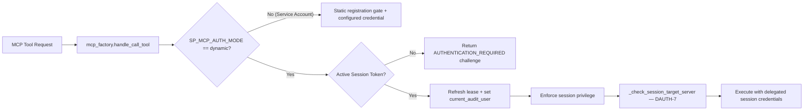

# Implementation: Dynamic & Delegated User Authentication

* **Domain**: Identity, Credentials & Delegated Authentication
* **Revision**: 2026-09 (Post-Audit Remediation — AUD-07, AUD-08, DAUTH-7 Closed)
* **Status**: Fully implemented and regression-tested — challenge, bounded leases, authorization, delegated execution, subprocess assertions, credential-lifecycle zeroing, explicit logout, and target-server binding all present
* **Analysis reference**: [`docs/analysis/security-dynamic-authn-analysis.md`](../analysis/security-dynamic-authn-analysis.md)
* **Design reference**: [`docs/design/security-dynamic-authn.md`](../design/security-dynamic-authn.md)
* **Cross-reference**: [`docs/implement/impl-security-identity-credentials.md`](impl-security-identity-credentials.md) · [`docs/implement/impl-security-integrations.md`](impl-security-integrations.md) · [`docs/implement/impl-security-non-repudiation.md`](impl-security-non-repudiation.md) · [`docs/implement/impl-security-access.md`](impl-security-access.md) · [`docs/implement/impl-security-policy.md`](impl-security-policy.md)
* **Files targeted**: `src/sp_mcp_server/session.py`, `src/sp_mcp_server/commands/system/auth.py`, `src/sp_mcp_server/mcp_factory.py`, `src/sp_mcp_server/cli_wrapper.py`

---

## 1. Overview

This document details the implementation architecture, data structures, and code-level specifications for **Dynamic & Delegated User Authentication (Challenge-Response)**. It bridges the gap between interactive LLM chat clients (which cannot hold static credentials) and IBM Storage Protect server instances.

---

## 2. Component Architecture

The dynamic authentication subsystem currently consists of three components:

1. **`SessionManager` (`src/sp_mcp_server/session.py`)**:
   Stores synchronized in-memory ephemeral session leases with bounded sliding inactivity expiration. Cleanup is performed during session creation and explicit cleanup calls.
2. **`authenticate_session` Tool (`src/sp_mcp_server/commands/system/auth.py`)**:
   Verifies supplied credentials via zero-trace `execute_silent()` and provisions a bounded lease containing the username, password, and parsed privilege classes for delegated execution.
3. **`logout_session` Tool (`src/sp_mcp_server/commands/system/auth.py`)**:
   Explicitly revokes an active session lease, zeros `SessionLease.password`, and clears `current_session_id` / `current_audit_user` context variables. Available at `required_privilege: any` (AUD-08).
4. **Session Interceptor Hook (`src/sp_mcp_server/mcp_factory.py`)**:
   Checks whether dynamic auth is enabled, validates the active session privilege, invokes `_check_session_target_server()` to enforce cross-server isolation (DAUTH-7), and applies the session execution context before executing commands.



---

## 3. Data Structures & Schemas

### 3.1 Ephemeral Session Lease Record

The actual `SessionLease` dataclass (as implemented in [`session.py`](../../src/sp_mcp_server/session.py)) includes `password` for delegated command execution and `target_server` for future server-binding enforcement:

```python
from dataclasses import dataclass, field
from datetime import datetime, timezone
from typing import Optional, Set

@dataclass
class SessionLease:
    session_id: str
    username: str
    privilege_classes: Set[str]
    password: Optional[str] = None          # Retained for delegated execution; see AUD-02 / AUD-08
    created_at: datetime = field(default_factory=lambda: datetime.now(timezone.utc))
    last_accessed_at: datetime = field(default_factory=lambda: datetime.now(timezone.utc))
    ttl_seconds: int = DEFAULT_SESSION_TTL_SECONDS
    target_server: Optional[str] = None     # Enforced in mcp_factory._check_session_target_server() — DAUTH-7

    def is_expired(self) -> bool:
        """Check inactivity TTL and absolute MAX_SESSION_TTL_SECONDS."""
        now = datetime.now(timezone.utc)
        inactive_seconds = (now - self.last_accessed_at).total_seconds()
        total_seconds = (now - self.created_at).total_seconds()
        return inactive_seconds > self.ttl_seconds or total_seconds > MAX_SESSION_TTL_SECONDS

    def touch(self) -> None:
        self.last_accessed_at = datetime.now(timezone.utc)
```

> **AUD-08 (closed):** `password` is zeroed (`None`) on every removal path — `revoke_session()`, expiry in `get_session()`, `cleanup_expired()`, and `clear()`. The `logout_session` tool triggers `revoke_session()` for user-initiated revocation.

### 3.2 Standard Challenge Response Payload

When no session exists, the interceptor produces an error payload formatted in JSON:

```python
AUTHENTICATION_REQUIRED_PAYLOAD = {
    "is_error": True,
    "error_type": "AUTHENTICATION_REQUIRED",
    "message": "Authentication required. Please provide your IBM Storage Protect administrator credentials.",
    "challenge": {
        "required_fields": ["username", "password"],
        "supported_schemes": ["basic_delegated", "oidc_bearer"],
        "auth_tool": "authenticate_session"
    }
}
```

---

## 4. Code Specifications

### 4.1 Zero-Trace Authentication in `authenticate_session`

The authentication tool performs zero-trace validation against `dsmadmc`. `execute_silent()` returns `(stdout, stderr, return_code)`:

```python
# execute_silent return order: (stdout, stderr, return_code)
stdout, stderr, ret_code = self.cli.execute_silent(
    command="QUERY STATUS",
    admin_id=username,
    password=password,
)

if ret_code != 0:
    return json.dumps({
        "success": False,
        "error": "Authentication failed: invalid administrator credentials.",
        "returncode": ret_code,
        "details": (stderr or stdout or "Access denied").strip(),
    }, indent=2)

# Query admin authority level to establish privilege bounds
priv_out, _, _ = self.cli.execute_silent(
    command=f"QUERY ADMIN {username} FORMAT=DETAILED",
    admin_id=username,
    password=password,
)

privileges = _parse_privileges(priv_out)

# Mint session lease (stores password for delegated execution)
lease = global_session_manager.create_session(
    username=username,
    privileges=privileges,
    target_server=target_server,
    password=password,
)

# Set identity context for audit & forensics
current_audit_user.set(username)
current_session_id.set(lease.session_id)
```

> **AUD-09 (corrected):** The return order is `(stdout, stderr, return_code)` — corrected from the earlier `(return_code, stdout, stderr)` example in the original document.

---

## 5. Security & Operational Hardening

1. **Sliding Window Inactivity Timeout**:
   * Default timeout: **15 minutes** (`SP_MCP_SESSION_TTL=900`); absolute max **60 minutes** (`SP_MCP_SESSION_MAX_TTL=3600`).
   * Cleanup is opportunistic — triggered during `create_session()` and explicit `cleanup_expired()` calls; operators of long-lived processes should schedule periodic cleanup or rely on `SP_MCP_SESSION_MAX_TTL` to bound lease lifetimes.

2. **Credential Lifecycle (AUD-08)**:
   * `SessionLease.password` is set to `None` on every removal path: `revoke_session()`, expiry in `get_session()`, `cleanup_expired()`, and `clear()` at shutdown.
   * The `logout_session` tool calls `revoke_session()`, clears `current_session_id` / `current_audit_user`, and returns a JSON confirmation.

3. **Target-Server Binding (DAUTH-7)**:
   * `_check_session_target_server(session, config)` in `mcp_factory.py` returns an error string if `session.target_server` is set and does not match `config.server_address`.
   * Single-server deployments (no `target_server` on the lease) skip the check — fully backward-compatible.

4. **Identity Context Propagation (NR-1)**:
   * When `authenticate_session` succeeds, `current_audit_user` is set to the validated username.
   * Subsequent write executions propagate that username to the IBM Storage Protect Activity Log and execute through the active session credential context.

5. **Memory Safety & Zero-Trace**:
   * Plaintext passwords received in `authenticate_session` exist only within local stack frames and are zeroed from the session store on the first removal operation.
   * Credential verification commands are strictly routed through `execute_silent()`.

---

## 6. Testing & Validation Plan

| Test Case | Objective | Status |
|:---|:---|:---|
| `TestDynamicAuthentication::test_dynamic_auth_challenge_when_unauthenticated` | Tool calls without active session yield `AUTHENTICATION_REQUIRED` | ✅ |
| `TestDynamicAuthentication::test_authenticate_session_tool_valid_credentials` | Valid credentials create lease and set privilege context | ✅ |
| `TestDynamicAuthentication::test_authenticate_session_tool_invalid_credentials` | Invalid password returns structured failure response | ✅ |
| `TestDynamicAuthentication::test_session_ttl_is_bounded` | TTL capped at `MAX_SESSION_TTL_SECONDS` on create | ✅ |
| `TestDynamicAuthentication::test_dynamic_auth_denies_insufficient_privilege` | `{"any"}`-privilege session denied from `system`-privilege tool | ✅ |
| `TestDynamicAuthentication::test_dynamic_auth_executes_when_session_authenticated` | Tool executes; `current_audit_user` set from session username | ✅ |
| `TestDelegatedSubprocess::test_delegated_credentials_passed_to_subprocess` | `-ID=` and `-PA=` appear in `subprocess.run` call when `current_execution_credentials` set | ✅ |
| `TestDelegatedSubprocess::test_execution_credentials_cleared_after_tool_call` | `current_execution_credentials` is `None` after success and exception paths | ✅ |
| `TestOIDCAuthorization::test_oidc_scope_system_allows_system_tool` | `mcp:system` token allows `system`-privilege tool | ✅ |
| `TestOIDCAuthorization::test_oidc_scope_read_denies_write_tool` | `mcp:read` token denies `system`-privilege tool with `AUTHORIZATION_DENIED` | ✅ |
| `TestOIDCAuthorization::test_oidc_unknown_scope_treated_as_any` | Unknown scope resolves to `any` privilege | ✅ |
| `TestEntryPointStartup::test_all_main_entry_points_use_secure_startup` | All `main*.py` entry points call `secure_startup()` | ✅ |
| `TestSessionCredentialLifecycle::test_password_zeroed_on_revoke` | `SessionLease.password` is `None` after `revoke_session()` (AUD-08) | ✅ |
| `TestSessionCredentialLifecycle::test_password_zeroed_on_expiry_in_get_session` | `password` zeroed when expiry detected in `get_session()` (AUD-08) | ✅ |
| `TestSessionCredentialLifecycle::test_password_zeroed_on_cleanup_expired` | `password` zeroed in bulk `cleanup_expired()` sweep (AUD-08) | ✅ |
| `TestSessionCredentialLifecycle::test_password_zeroed_on_clear` | `password` zeroed on `clear()` / shutdown (AUD-08) | ✅ |
| `TestSessionCredentialLifecycle::test_logout_session_revokes_and_clears_credential` | `logout_session` revokes lease and confirms credential cleared (AUD-08) | ✅ |
| `TestSessionCredentialLifecycle::test_logout_session_no_active_session` | `logout_session` with no session returns graceful failure | ✅ |
| `TestSessionCredentialLifecycle::test_logout_session_explicit_session_id` | `logout_session` with explicit `session_id` parameter revokes correct lease | ✅ |
| `TestTargetServerBinding::test_cross_server_session_is_denied` | Mismatched `target_server` → `AUTHORIZATION_DENIED` with both server names (DAUTH-7) | ✅ |
| `TestTargetServerBinding::test_matching_target_server_is_allowed` | Matching `target_server` → command executes (DAUTH-7) | ✅ |
| `TestTargetServerBinding::test_no_target_server_on_session_is_allowed` | `target_server=None` → check skipped, command executes (DAUTH-7) | ✅ |
| `TestTargetServerBinding::test_check_session_target_server_helper_*` | Unit tests for `_check_session_target_server()` helper (3 paths) (DAUTH-7) | ✅ |

---

## 7. Cross-References

* Design Spec: [`docs/design/security-dynamic-authn.md`](../design/security-dynamic-authn.md)
* Analysis: [`docs/analysis/security-dynamic-authn-analysis.md`](../analysis/security-dynamic-authn-analysis.md)
* Identity & Credentials Implementation: [`docs/implement/impl-security-identity-credentials.md`](impl-security-identity-credentials.md)
* Integrations Implementation: [`docs/implement/impl-security-integrations.md`](impl-security-integrations.md)
* Non-Repudiation Implementation: [`docs/implement/impl-security-non-repudiation.md`](impl-security-non-repudiation.md)
* Access Management Implementation: [`docs/implement/impl-security-access.md`](impl-security-access.md)
* Policy Management Implementation: [`docs/implement/impl-security-policy.md`](impl-security-policy.md)
* Traceability Matrix: [`docs/traceability/traceability-matrix.md`](../traceability/traceability-matrix.md)
